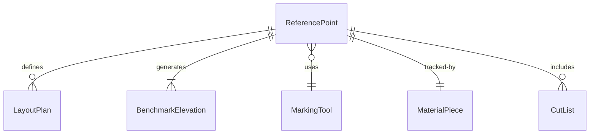
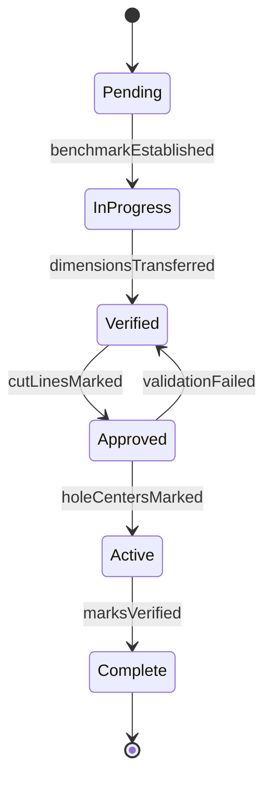
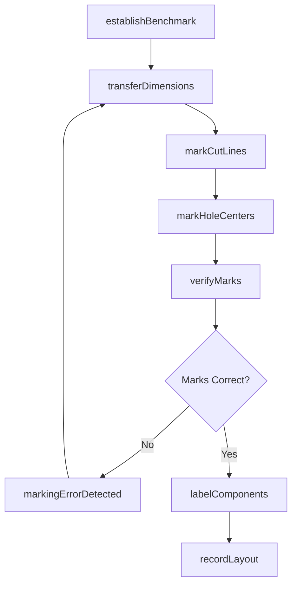
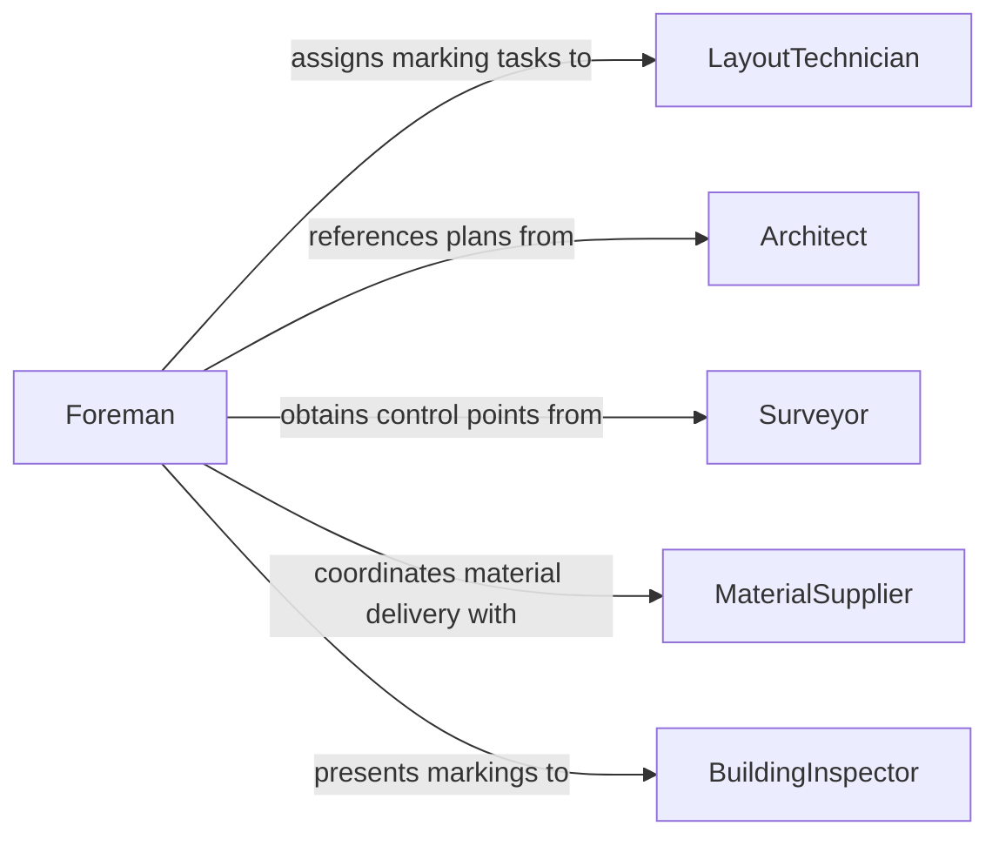

# Mark Reference Points Construction Materials

> Business-as-Code definition for marking reference points on construction materials. Models the process of transferring layout dimensions from plans onto physical materials to guide cutting, drilling, and placement operations.

## Overview

Marking reference points on construction materials involves transferring measurements and layout lines from engineering drawings and survey data onto lumber, steel, concrete forms, and other building materials. Workers use chalk lines, scribe marks, punches, and layout tools to indicate cut lines, hole centers, elevation marks, and alignment references. Accurate marking is the foundation of precise construction, ensuring that components fit together correctly and meet specified dimensions.

## Actors

| Actor | Description |
|-------|-------------|
| Architect | Produces construction drawings with dimensions and reference elevations |
| Surveyor | Establishes benchmark points and control lines on the jobsite |
| MaterialSupplier | Delivers raw construction materials to be marked and fabricated |
| GeneralContractor | Manages the project schedule and coordinates marking activities |
| BuildingInspector | Verifies that marked dimensions comply with approved plans |

## Roles

| Role | Description |
|------|-------------|
| LayoutTechnician | Transfers dimensions from plans to physical materials |
| Carpenter | Marks and cuts wood framing members according to layout |
| Ironworker | Marks steel members for cutting, drilling, and connection points |
| Foreman | Verifies marking accuracy and coordinates with engineering |

## Entities

| Entity | Description |
|--------|-------------|
| ReferencePoint | A marked location on material indicating a dimension, cut, or connection |
| LayoutPlan | A drawing or data set containing dimensions to be transferred |
| BenchmarkElevation | A surveyed control point used as the basis for vertical measurements |
| MarkingTool | An instrument used to create reference marks (chalk line, punch, scribe) |
| MaterialPiece | An individual lumber, steel, or concrete member being marked |
| CutList | A schedule of dimensions and marks required for a set of materials |

## Actions

| Action | Description |
|--------|-------------|
| establishBenchmark | Set control points and baseline references on the jobsite |
| transferDimensions | Translate plan measurements onto physical materials |
| markCutLines | Scribe or chalk lines indicating where material will be cut |
| markHoleCenters | Punch or mark locations for drilling or boring operations |
| verifyMarks | Cross-check marked dimensions against the layout plan |
| labelComponents | Write part numbers or identifiers on marked materials |
| recordLayout | Document the marked dimensions and any field adjustments |

## Events

| Event | Description |
|-------|-------------|
| benchmarkEstablished | Control points have been set and verified on the jobsite |
| dimensionsTransferred | Plan measurements have been applied to physical materials |
| cutLinesMarked | Cut lines have been scribed or chalked on material |
| holeCentersMarked | Drill locations have been punched or marked |
| marksVerified | Marked dimensions have been confirmed against the layout plan |
| componentsLabeled | Part identifiers have been written on marked materials |
| markingErrorDetected | A marked dimension does not match the plan specification |

## Searches

| Search | Description |
|--------|-------------|
| findMarkedComponents | Retrieve marked materials by project, member type, or status |
| getCutLists | Get cut schedules by project phase or material type |
| getMarkingErrors | List components where marking discrepancies were recorded |
| findBenchmarks | Locate control points and elevation references for a jobsite |


## Entity Relationships



## State Diagram


## Workflow



## Actor Relationships



## Usage

### Calling Actions

```typescript
import { markReferencePointsConstructionMaterials } from '@headlessly/mark-reference-points-construction-materials'

const marking = markReferencePointsConstructionMaterials()

// Establish a benchmark elevation for the floor
const benchmark = await marking.establishBenchmark({
  projectId: 'proj-riverside-towers',
  controlPointId: 'BM-001',
  elevation: 142.500,
  location: { gridLine: 'A', station: '0+00' }
})

// Transfer dimensions to steel beam
await marking.transferDimensions({
  materialPieceId: 'W12x26-beam-014',
  layoutPlanId: 'S-201-rev2',
  marks: [
    { type: 'cutLine', offset: 0, dimension: 18.75 },
    { type: 'holeCenter', offset: 2.5, dimension: 0.875 },
    { type: 'holeCenter', offset: 16.25, dimension: 0.875 }
  ]
})

// Verify marked dimensions
const verification = await marking.verifyMarks({
  materialPieceId: 'W12x26-beam-014',
  tolerance: 0.0625
})
```

### Event-Driven Automation

```typescript
// Alert when a marking error is detected
marking.markingErrorDetected(async ({ materialPieceId, error }) => {
  await notify({
    to: 'layout-foreman',
    message: `Marking error on ${materialPieceId}: ${error.description} (deviation: ${error.deviation}")`
  })
})

// Queue fabrication when marks are verified
marking.marksVerified(async ({ materialPieceId }) => {
  await queueForFabrication({
    materialPieceId,
    operation: 'cut-and-drill',
    priority: 'standard'
  })
})
```
