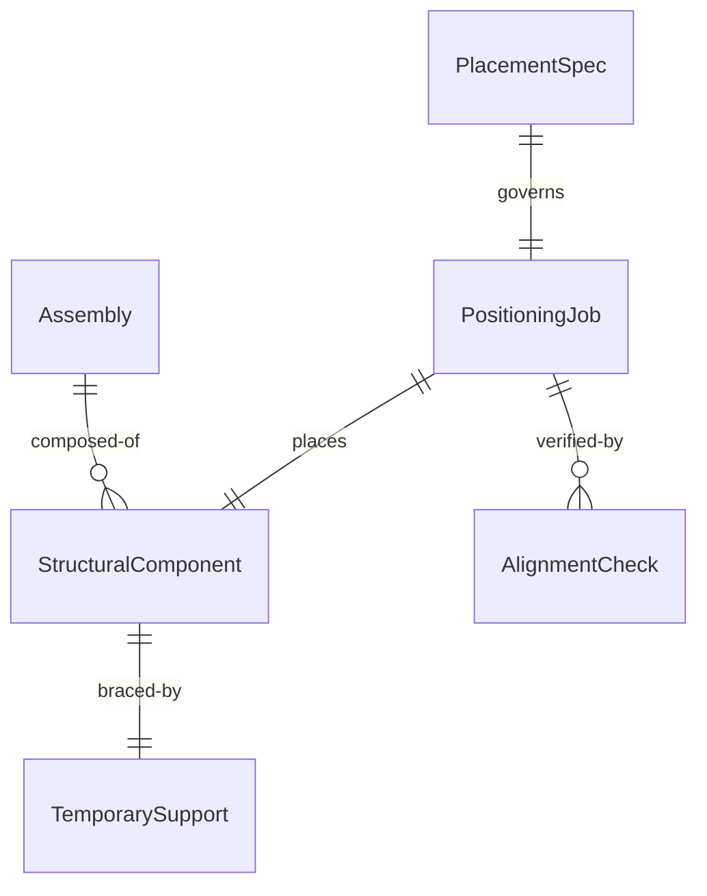
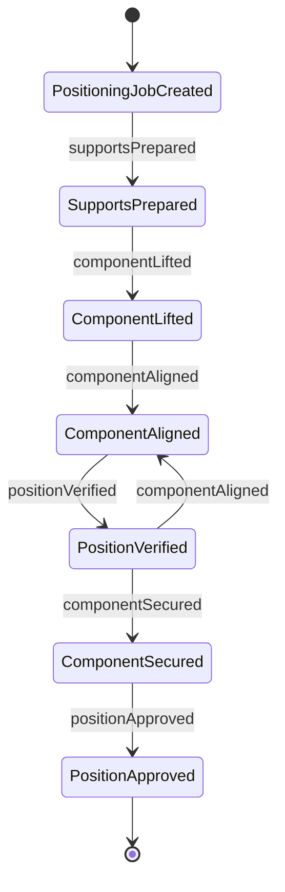
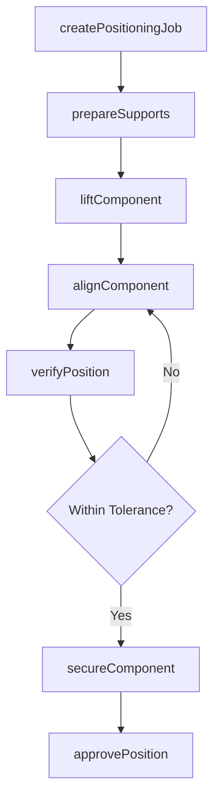
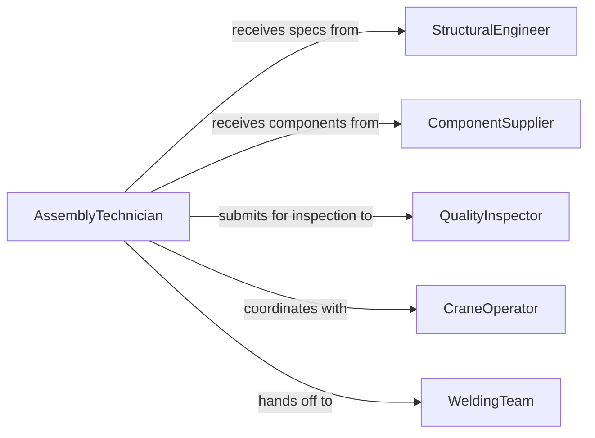

# Position Structural Components

> Business-as-Code definition for positioning structural components during assembly and construction. Models component placement, alignment verification, and securing procedures.

## Overview

Positioning structural components involves placing load-bearing members, frames, and assemblies according to engineering plans and ensuring proper alignment before permanent attachment. This definition exposes actions for positioning procedures, events for workflow automation, and searches for tracking component placement and assembly progress.

## Actors

| Actor | Description |
|-------|-------------|
| StructuralEngineer | Provides placement specifications and load requirements |
| ComponentSupplier | Delivers structural members and assemblies |
| QualityInspector | Verifies component positioning and alignment |
| SafetyOfficer | Ensures positioning follows safety protocols |
| CraneOperator | Operates lifting equipment for heavy components |
| WeldingTeam | Performs permanent attachment after positioning |

## Roles

| Role | Description |
|------|-------------|
| AssemblyTechnician | Positions and aligns structural components |
| RiggingSpecialist | Plans and executes safe lifting operations |
| AlignmentTechnician | Verifies component placement accuracy |
| AssemblyCoordinator | Manages positioning schedules and resources |

## Entities

| Entity | Description |
|--------|-------------|
| StructuralComponent | Load-bearing member or assembly requiring positioning |
| PositioningJob | A scheduled task to place structural components |
| PlacementSpec | Technical requirements for component location |
| TemporarySupport | Fixture or support holding component during positioning |
| AlignmentCheck | Measurement verifying component placement accuracy |
| Assembly | Collection of positioned components forming a structure |

## Actions

| Action | Description |
|--------|-------------|
| createPositioningJob | Schedule structural component placement |
| prepareSupports | Set up temporary fixtures and supports |
| liftComponent | Raise component to approximate position |
| alignComponent | Adjust component to precise location and orientation |
| verifyPosition | Confirm component meets placement specifications |
| secureComponent | Apply temporary fasteners to hold position |
| approvePosition | Formally accept component placement for attachment |

## Events

| Event | Description |
|-------|-------------|
| positioningJobCreated | New component placement work order scheduled |
| supportsPrepared | Temporary fixtures ready for component |
| componentLifted | Component raised to approximate position |
| componentAligned | Component adjusted to precise location |
| positionVerified | Component placement confirmed accurate |
| componentSecured | Temporary fasteners applied to hold position |
| positionApproved | Component placement formally accepted |

## Searches

| Search | Description |
|--------|-------------|
| findPositioningJobs | List placement work orders by status or component |
| getComponents | Retrieve structural components by assembly or location |
| getAlignmentChecks | Find measurement records for component placement |
| getAssemblies | Retrieve collection of positioned components |


## Entity Relationships



## State Diagram


## Workflow



## Actor Relationships



## Usage

### Calling Actions

```typescript
import { positionStructuralComponents } from '@headlessly/position-structural-components'

const positioning = positionStructuralComponents()

// Create positioning job for bridge girder
const job = await positioning.createPositioningJob({
  componentId: 'GIRDER-B-04',
  assemblyId: 'BRIDGE-SPAN-2',
  scheduledDate: '2026-02-18',
  weight: 18500,
  liftPlan: 'LIFT-PLAN-B-02'
})

// Prepare temporary supports
await positioning.prepareSupports({
  jobId: job.id,
  supports: [
    { id: 'TEMP-PIER-01', location: { x: 0, y: 25000 }, capacity: 10000 },
    { id: 'TEMP-PIER-02', location: { x: 0, y: 75000 }, capacity: 10000 }
  ]
})

// Lift component to approximate position
await positioning.liftComponent({
  jobId: job.id,
  craneId: 'CRANE-MOBILE-02',
  riggingConfig: '4-Point Sling',
  targetElevation: 12500
})

// Align component to precise location
await positioning.alignComponent({
  jobId: job.id,
  adjustments: [
    { axis: 'X', amount: -15 },
    { axis: 'Y', amount: 8 },
    { axis: 'Z', amount: -3 },
    { axis: 'Rotation', amount: 0.2 }
  ]
})

// Verify final position
const verification = await positioning.verifyPosition({
  jobId: job.id,
  measurements: [
    { point: 'North End', x: 125.2, y: 25003.5, z: 12498.8 },
    { point: 'South End', x: 125.1, y: 74996.8, z: 12499.2 }
  ],
  tolerances: { horizontal: 10, vertical: 5, angular: 0.5 }
})
```

### Event-Driven Automation

```typescript
// Alert on alignment issue
positioning.positionVerified(async ({ componentId, deviations, tolerances }) => {
  const exceedsTolerance = deviations.some((d, i) => Math.abs(d) > tolerances[i] * 0.9)
  if (exceedsTolerance) {
    await notify({
      to: 'structural-engineer',
      priority: 'high',
      message: `Component ${componentId} alignment approaching tolerance limits`
    })
  }
})

// Track assembly progress
positioning.positionApproved(async ({ assemblyId, componentId }) => {
  const assembly = await positioning.getAssemblies({ id: assemblyId })
  const progress = assembly.completedComponents / assembly.totalComponents * 100

  await analytics.track({
    event: 'Assembly Progress',
    assemblyId,
    progress,
    timestamp: new Date()
  })
})
```
