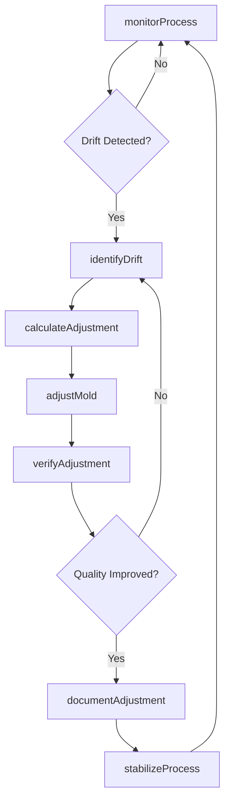
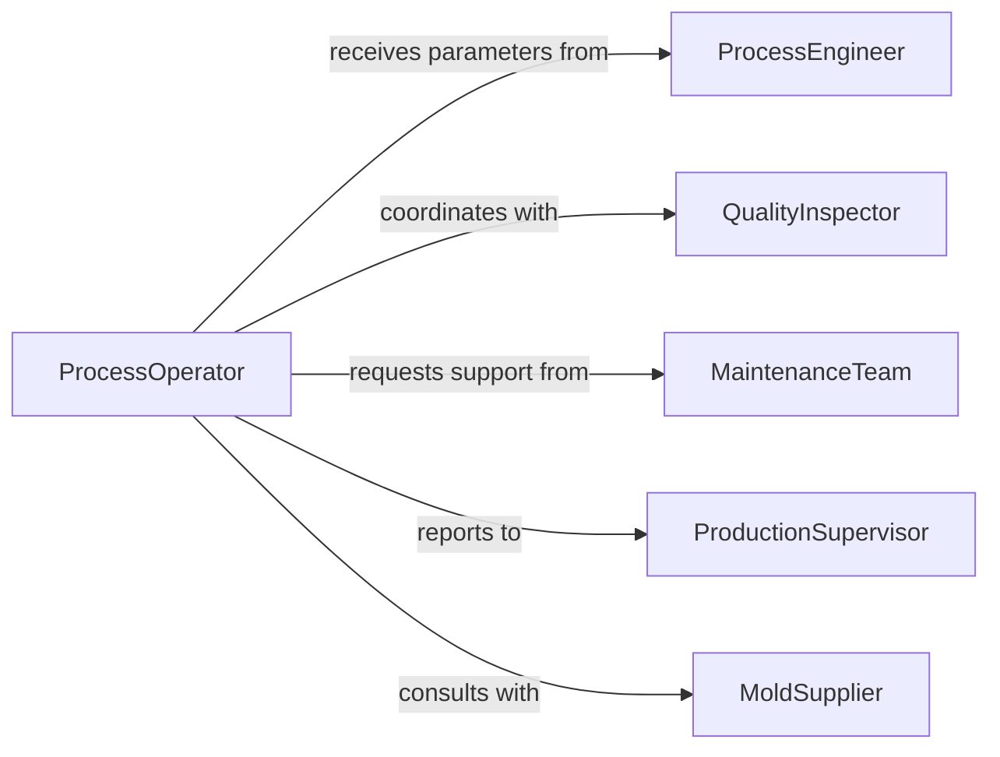

# Adjust Position Molds During Processing

> Business-as-Code definition for real-time mold positioning adjustments during production. Models dynamic positioning, process monitoring, and adjustment tracking.

## Overview

Adjusting mold position during processing ensures optimal product formation and quality by compensating for material behavior, temperature effects, and process variations. This definition exposes actions for position adjustments, events for workflow automation, and searches for tracking adjustment history and process stability.

## Actors

| Actor | Description |
|-------|-------------|
| ProcessEngineer | Provides adjustment parameters and process limits |
| QualityInspector | Monitors product quality and identifies issues |
| MaintenanceTeam | Performs mechanical adjustments and calibration |
| ProductionSupervisor | Authorizes process changes and adjustments |
| MoldSupplier | Provides technical support for mold systems |
| MaterialSupplier | Advises on material behavior affecting mold position |

## Roles

| Role | Description |
|------|-------------|
| ProcessOperator | Executes mold position adjustments during production |
| ProcessTechnician | Monitors process parameters and identifies adjustment needs |
| AdjustmentCoordinator | Manages adjustment schedules and documentation |
| QualityTechnician | Verifies product quality after adjustments |

## Entities

| Entity | Description |
|--------|-------------|
| Mold | Production tooling requiring position adjustment |
| ProcessRun | Active production cycle with mold positioning |
| Adjustment | A change to mold position during processing |
| ProcessParameter | Monitored variable affecting mold position |
| AdjustmentRecord | Documentation of position changes and outcomes |
| QualityMeasurement | Product quality data related to mold position |

## Actions

| Action | Description |
|--------|-------------|
| monitorProcess | Track process parameters requiring adjustment |
| identifyDrift | Detect position deviation from optimal state |
| calculateAdjustment | Determine required position change |
| adjustMold | Execute physical mold position change |
| verifyAdjustment | Confirm adjustment improved product quality |
| documentAdjustment | Record adjustment details and justification |
| stabilizeProcess | Return process to steady-state operation |

## Events

| Event | Description |
|-------|-------------|
| driftDetected | Mold position deviating from optimal range |
| adjustmentCalculated | Required position change determined |
| moldAdjusted | Physical mold position changed during processing |
| adjustmentVerified | Product quality improvement confirmed |
| adjustmentDocumented | Adjustment details recorded in system |
| processStabilized | Process returned to steady-state operation |
| adjustmentLimitReached | Maximum adjustment frequency or range exceeded |

## Searches

| Search | Description |
|--------|-------------|
| findProcessRuns | List production cycles by mold or time period |
| getAdjustments | Retrieve adjustment history by mold or parameter |
| getQualityTrends | Find product quality data correlated with adjustments |
| getFrequentAdjustments | Identify molds requiring excessive adjustment |

## Workflow



## Actor Relationships



## Usage

### Calling Actions

```typescript
import { adjustPositionMoldsDuringProcessing } from '@headlessly/adjust-position-molds-during-processing'

const moldAdjustment = adjustPositionMoldsDuringProcessing()

// Monitor active injection molding process
const monitoring = await moldAdjustment.monitorProcess({
  moldId: 'MOLD-INJ-402',
  processRunId: 'RUN-20260218-003',
  parameters: ['ClampPressure', 'InjectionPressure', 'Temperature', 'CycleTime']
})

// Detect position drift from quality measurement
const drift = await moldAdjustment.identifyDrift({
  moldId: 'MOLD-INJ-402',
  qualityIssue: 'FlashExcessive',
  currentPosition: { clamp: 2450, injection: 18500 },
  optimalPosition: { clamp: 2500, injection: 18500 }
})

// Calculate required adjustment
const adjustment = await moldAdjustment.calculateAdjustment({
  moldId: 'MOLD-INJ-402',
  driftAmount: { clamp: -50 },
  processConditions: {
    materialTemp: 245,
    moldTemp: 65,
    cycleNumber: 1847
  }
})

// Execute mold position adjustment
await moldAdjustment.adjustMold({
  moldId: 'MOLD-INJ-402',
  processRunId: 'RUN-20260218-003',
  adjustments: [
    { parameter: 'ClampPressure', delta: 50, newValue: 2500 }
  ],
  operator: 'OPERATOR-42',
  reason: 'Excessive flash on parting line'
})

// Verify adjustment effectiveness
const verification = await moldAdjustment.verifyAdjustment({
  moldId: 'MOLD-INJ-402',
  adjustmentId: adjustment.id,
  samplesAfter: 5,
  qualityMetrics: {
    flashThickness: 0.05,
    dimensionalAccuracy: 0.02,
    surfaceFinish: 'Acceptable'
  }
})
```

### Event-Driven Automation

```typescript
// Alert on frequent adjustments indicating mold issue
moldAdjustment.adjustmentLimitReached(async ({ moldId, adjustmentCount, timeWindow }) => {
  await notify({
    to: 'maintenance-team',
    priority: 'high',
    message: `Mold ${moldId} required ${adjustmentCount} adjustments in ${timeWindow} hours - investigate for wear or damage`
  })
})

// Track process stability metrics
moldAdjustment.processStabilized(async ({ moldId, processRunId, adjustmentHistory }) => {
  const cyclesSinceAdjustment = adjustmentHistory.length > 0 ?
    Date.now() - adjustmentHistory[adjustmentHistory.length - 1].timestamp : null

  await analytics.track({
    event: 'Process Stability',
    moldId,
    processRunId,
    adjustmentFrequency: adjustmentHistory.length,
    cyclesSinceAdjustment,
    timestamp: new Date()
  })
})
```
