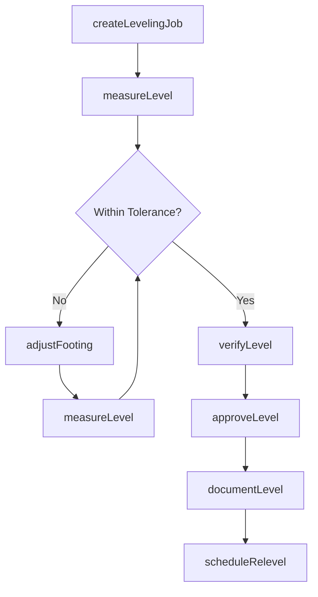
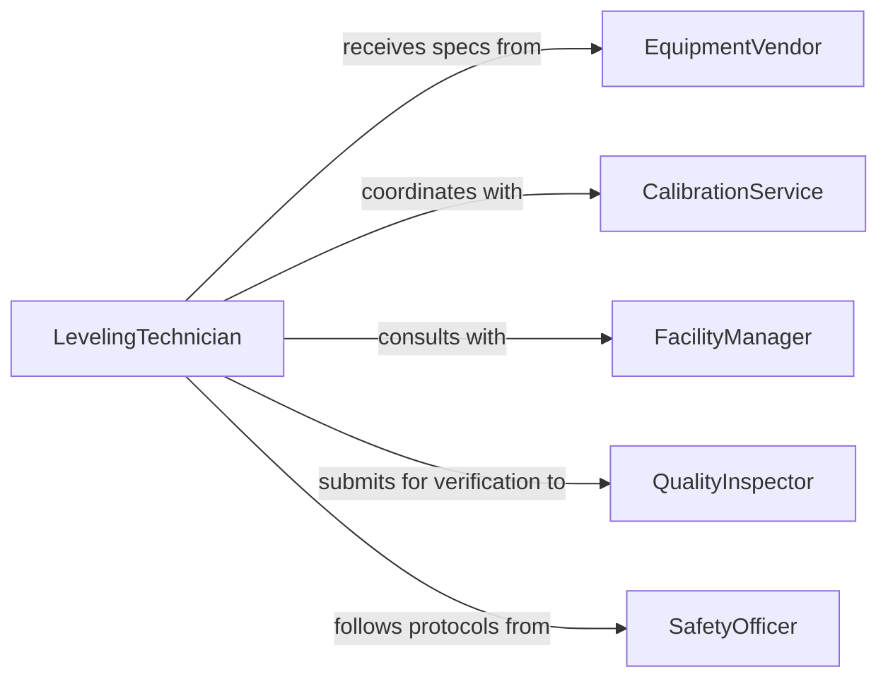

# Level Machines Equipment

> Business-as-Code definition for leveling machinery and equipment to ensure operational accuracy. Models leveling procedures, precision measurement, and verification tracking.

## Overview

Leveling machines and equipment establishes proper orientation for accurate operation, load distribution, and component longevity. This definition exposes actions for leveling procedures, events for workflow automation, and searches for tracking level status and adjustment history.

## Actors

| Actor | Description |
|-------|-------------|
| EquipmentVendor | Provides leveling specifications and requirements |
| CalibrationService | Performs precision level measurement and certification |
| FacilityManager | Ensures floor conditions support equipment leveling |
| QualityInspector | Verifies leveling meets operational requirements |
| MaintenanceTechnician | Executes physical leveling procedures |
| SafetyOfficer | Ensures leveling work follows safety protocols |

## Roles

| Role | Description |
|------|-------------|
| LevelingTechnician | Performs equipment leveling and adjustment |
| LevelingEngineer | Designs leveling procedures and tolerance specifications |
| MeasurementSpecialist | Conducts precision level measurements |
| LevelingCoordinator | Schedules and tracks leveling activities |

## Entities

| Entity | Description |
|--------|-------------|
| Equipment | Machinery or production asset requiring leveling |
| LevelingSpec | Technical requirements for equipment orientation |
| LevelingJob | A scheduled task to level specific equipment |
| Measurement | Recorded level data from measurement instruments |
| LevelingReport | Documentation of leveling procedure and results |
| LevelCertificate | Formal verification of equipment level accuracy |

## Actions

| Action | Description |
|--------|-------------|
| createLevelingJob | Schedule equipment for leveling procedure |
| measureLevel | Capture current level measurements |
| adjustFooting | Modify equipment support points to achieve level |
| verifyLevel | Confirm equipment meets leveling specifications |
| approveLevel | Formally accept leveling results |
| documentLevel | Generate leveling report and certificate |
| scheduleRelevel | Plan future leveling based on drift or schedule |

## Events

| Event | Description |
|-------|-------------|
| levelingJobCreated | New leveling work order has been scheduled |
| levelMeasured | Current level data captured from equipment |
| footingAdjusted | Physical adjustments made to equipment supports |
| levelVerified | Equipment confirmed within level tolerances |
| levelApproved | Leveling results formally accepted |
| levelExceeded | Equipment found outside acceptable level limits |
| relevelScheduled | Future leveling work planned |

## Searches

| Search | Description |
|--------|-------------|
| findLevelingJobs | List leveling work orders by status or equipment |
| getMeasurements | Retrieve level measurement history for equipment |
| getLevelingReports | Find leveling documentation by date or equipment |
| getOutOfLevel | Identify equipment exceeding level tolerance limits |

## Workflow



## Actor Relationships



## Usage

### Calling Actions

```typescript
import { levelMachinesEquipment } from '@headlessly/level-machines-equipment'

const leveling = levelMachinesEquipment()

// Create leveling job for precision grinding machine
const job = await leveling.createLevelingJob({
  equipmentId: 'GRINDER-SURF-05',
  type: 'Initial Installation',
  tolerances: {
    longitudinal: 0.0002,
    transverse: 0.0002,
    twist: 0.0001
  },
  scheduledDate: '2026-02-19'
})

// Measure current level state
await leveling.measureLevel({
  jobId: job.id,
  phase: 'initial',
  measurements: {
    frontLeft: 0.0008,
    frontRight: -0.0003,
    rearLeft: 0.0012,
    rearRight: 0.0005
  },
  instrument: 'Electronic Level EL-2000'
})

// Adjust equipment footing
await leveling.adjustFooting({
  jobId: job.id,
  adjustments: [
    { location: 'Front Left', shims: [0.020, 0.010], material: 'Stainless Steel' },
    { location: 'Rear Left', shims: [0.030, 0.005], material: 'Stainless Steel' },
    { location: 'Front Right', action: 'Remove 0.010 shim' }
  ]
})

// Verify final level
const verification = await leveling.verifyLevel({
  jobId: job.id,
  finalMeasurements: {
    frontLeft: 0.00015,
    frontRight: -0.00008,
    rearLeft: 0.00012,
    rearRight: 0.00010
  }
})
```

### Event-Driven Automation

```typescript
// Alert when equipment exceeds level tolerance
leveling.levelExceeded(async ({ equipmentId, measurements, tolerance }) => {
  const maxDeviation = Math.max(...Object.values(measurements).map(Math.abs))
  await notify({
    to: 'maintenance-team',
    priority: 'high',
    message: `Equipment ${equipmentId} out of level: ${maxDeviation.toFixed(4)} in, tolerance ${tolerance.toFixed(4)} in`
  })
})

// Auto-schedule preventive releveling
leveling.levelApproved(async ({ equipmentId, levelingDate, equipmentType }) => {
  const intervalMonths = equipmentType === 'Precision' ? 6 : 12
  const nextLevelingDate = addMonths(levelingDate, intervalMonths)

  await leveling.scheduleRelevel({
    equipmentId,
    scheduledDate: nextLevelingDate,
    type: 'Preventive Maintenance'
  })
})
```
