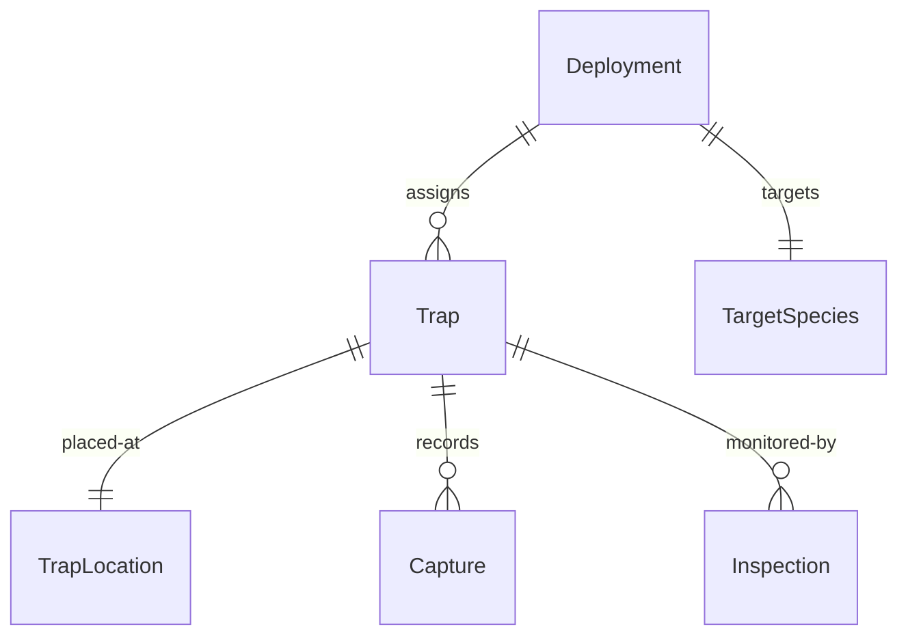
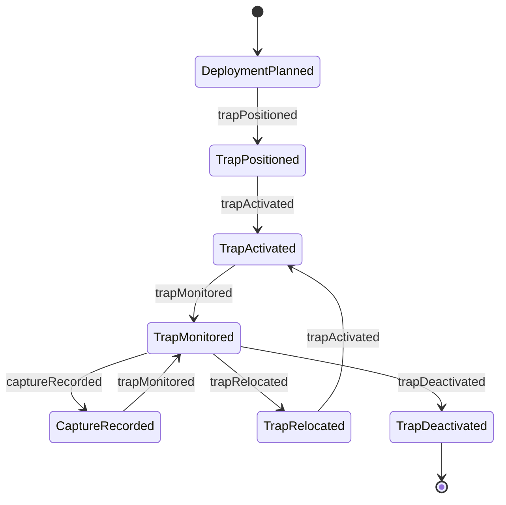
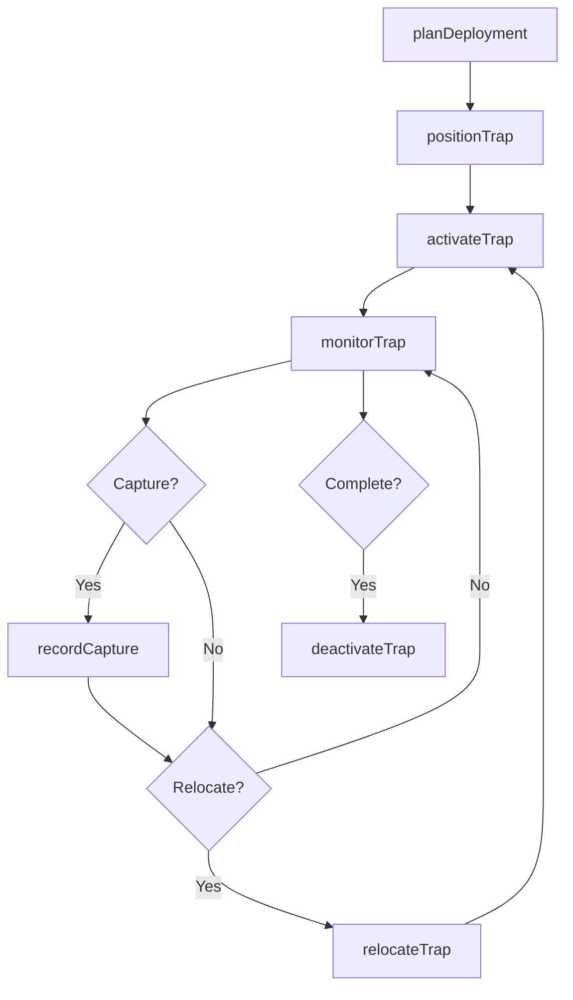
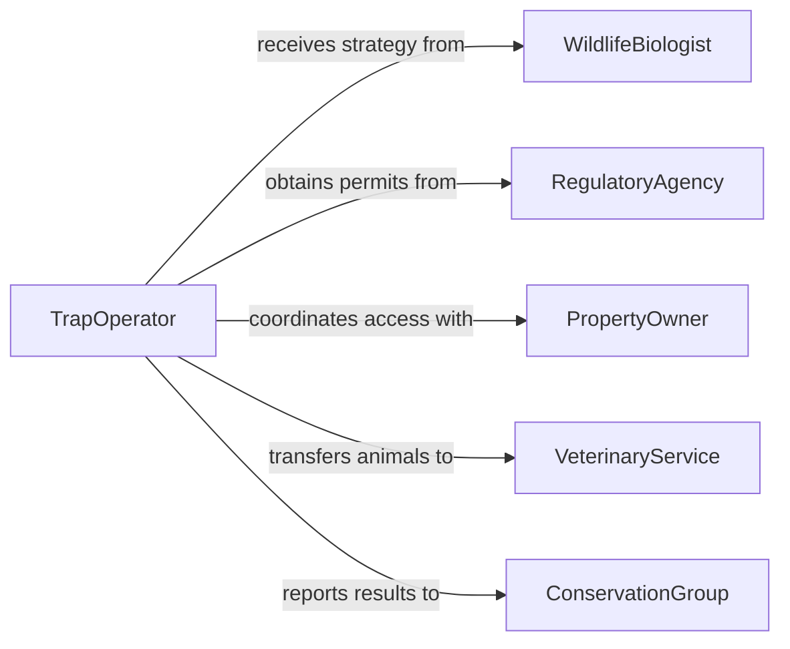

# Position Animal Trapping Capture Equipment

> Business-as-Code definition for positioning animal trapping and capture equipment for wildlife management. Models trap placement, monitoring, and capture tracking.

## Overview

Positioning animal trapping and capture equipment involves strategic placement based on target species behavior, habitat patterns, and regulatory requirements. This definition exposes actions for trap placement, events for workflow automation, and searches for tracking trap locations and capture results.

## Actors

| Actor | Description |
|-------|-------------|
| WildlifeBiologist | Provides species behavior data and trap placement strategy |
| RegulatoryAgency | Enforces trapping permits and compliance requirements |
| PropertyOwner | Authorizes trap placement on private land |
| VeterinaryService | Provides animal care for captured wildlife |
| ConservationGroup | Coordinates wildlife protection and relocation |
| LocalAuthority | Issues permits and responds to public safety concerns |

## Roles

| Role | Description |
|------|-------------|
| TrapOperator | Positions and maintains trapping equipment |
| WildlifeSpecialist | Designs trap placement strategy for target species |
| MonitoringTechnician | Checks traps and documents results |
| TrapCoordinator | Manages trap schedules and locations |

## Entities

| Entity | Description |
|--------|-------------|
| Trap | Physical device for capturing or containing animals |
| TrapLocation | Geographic position and environmental context of trap |
| Deployment | A scheduled trap placement operation |
| TargetSpecies | Animal species intended for capture |
| Capture | Record of animal captured in trap |
| Inspection | Scheduled check of trap status and condition |

## Actions

| Action | Description |
|--------|-------------|
| planDeployment | Design trap placement strategy for target species |
| positionTrap | Place trap at designated location |
| activateTrap | Set trap to capture mode |
| monitorTrap | Check trap status and captured animals |
| recordCapture | Document animal captured in trap |
| relocateTrap | Move trap to different location |
| deactivateTrap | Disable and remove trap from field |

## Events

| Event | Description |
|-------|-------------|
| deploymentPlanned | Trap placement strategy designed |
| trapPositioned | Trap placed at designated location |
| trapActivated | Trap set to capture mode |
| trapMonitored | Trap checked for status and captures |
| captureRecorded | Animal captured and documented |
| trapRelocated | Trap moved to different location |
| trapDeactivated | Trap disabled and removed from field |

## Searches

| Search | Description |
|--------|-------------|
| findDeployments | List trap placements by location or species |
| getTraps | Retrieve trap inventory by type or status |
| getCaptures | Find capture records by species or date |
| getInspections | Retrieve trap check history and results |


## Entity Relationships



## State Diagram


## Workflow



## Actor Relationships



## Usage

### Calling Actions

```typescript
import { positionAnimalTrappingCaptureEquipment } from '@headlessly/position-animal-trapping-capture-equipment'

const trapping = positionAnimalTrappingCaptureEquipment()

// Plan trap deployment for invasive species control
const deployment = await trapping.planDeployment({
  targetSpecies: 'Feral Hog',
  objectivve: 'Population Control',
  area: 'Property-Section-14',
  trapCount: 6,
  duration: 30,
  permitId: 'PERMIT-2026-WL-0452'
})

// Position trap at strategic location
await trapping.positionTrap({
  deploymentId: deployment.id,
  trapId: 'TRAP-CORRAL-08',
  location: {
    latitude: 30.2672,
    longitude: -97.7431,
    habitat: 'Oak woodland edge near water source',
    access: 'Via Ranch Road 2222, gate 14'
  },
  setupNotes: 'Positioned 15m from creek crossing, bait station 5m upstream'
})

// Activate trap for capture
await trapping.activateTrap({
  trapId: 'TRAP-CORRAL-08',
  trapType: 'Corral Trap',
  bait: 'Fermented Corn',
  sensitivity: 'Standard',
  operator: 'OPERATOR-WL-27'
})

// Monitor trap during inspection
const inspection = await trapping.monitorTrap({
  trapId: 'TRAP-CORRAL-08',
  inspectionDate: '2026-02-20T07:30:00Z',
  status: 'Active',
  baitStatus: 'Consumed',
  captureCount: 3,
  condition: 'Good'
})

// Record captured animals
await trapping.recordCapture({
  trapId: 'TRAP-CORRAL-08',
  inspectionId: inspection.id,
  captures: [
    { species: 'Feral Hog', sex: 'Female', weight: 145, age: 'Adult', condition: 'Healthy' },
    { species: 'Feral Hog', sex: 'Male', weight: 185, age: 'Adult', condition: 'Healthy' },
    { species: 'Feral Hog', sex: 'Female', weight: 65, age: 'Juvenile', condition: 'Healthy' }
  ],
  disposition: 'Euthanized per permit PERMIT-2026-WL-0452'
})
```

### Event-Driven Automation

```typescript
// Alert on capture requiring immediate attention
trapping.captureRecorded(async ({ captures, trapId, location }) => {
  const nonTargetSpecies = captures.filter(c => c.species !== deployment.targetSpecies)

  if (nonTargetSpecies.length > 0) {
    await notify({
      to: 'wildlife-specialist',
      priority: 'high',
      message: `Non-target species captured in ${trapId}: ${nonTargetSpecies.map(c => c.species).join(', ')}`
    })
  }
})

// Track trap effectiveness metrics
trapping.trapMonitored(async ({ trapId, captureCount, daysSinceDeployment }) => {
  const capturesPerDay = captureCount / daysSinceDeployment

  await analytics.track({
    event: 'Trap Effectiveness',
    trapId,
    captureCount,
    daysSinceDeployment,
    capturesPerDay,
    timestamp: new Date()
  })
})
```
