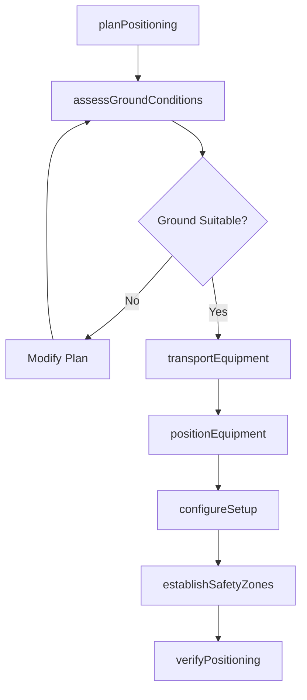
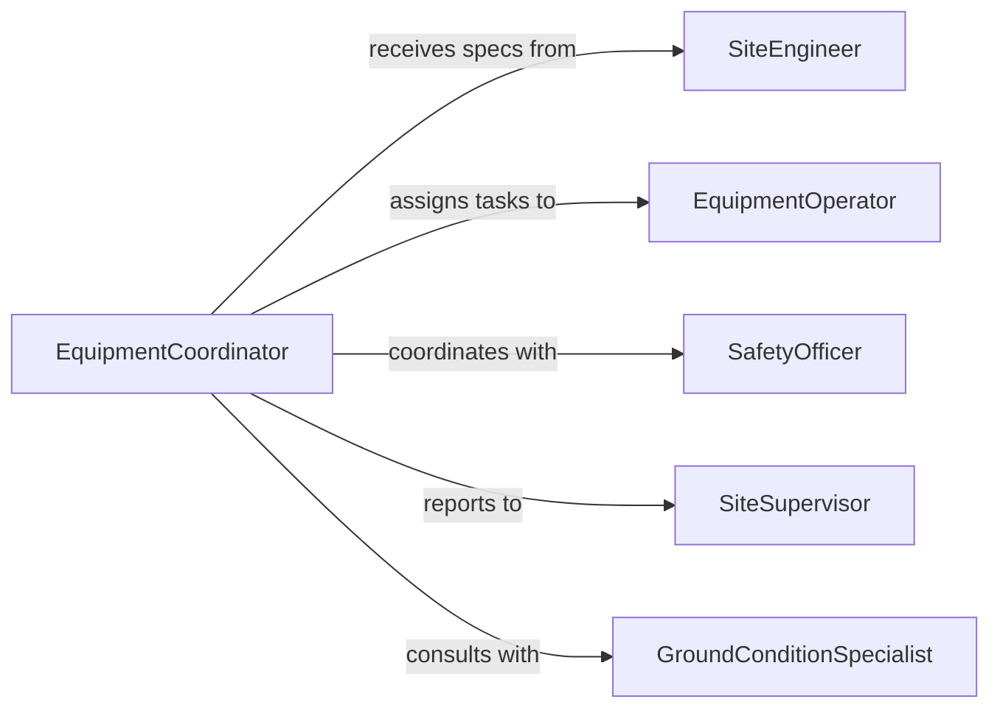

# Position Construction Extraction Equipment

> Business-as-Code definition for positioning heavy construction and extraction equipment for operations. Models equipment placement, site safety, and operational setup.

## Overview

Positioning construction and extraction equipment involves strategic placement of heavy machinery for excavation, material handling, and site development while ensuring operational efficiency and safety. This definition exposes actions for equipment positioning, events for workflow automation, and searches for tracking equipment locations and utilization.

## Actors

| Actor | Description |
|-------|-------------|
| SiteEngineer | Provides positioning specifications and operational requirements |
| EquipmentOperator | Operates heavy machinery for positioning |
| SafetyOfficer | Ensures equipment placement follows safety protocols |
| SiteSupervisor | Coordinates equipment positioning with project schedule |
| GroundConditionSpecialist | Assesses soil stability for equipment support |
| UtilityCompany | Provides underground utility location data |

## Roles

| Role | Description |
|------|-------------|
| EquipmentCoordinator | Plans and manages equipment positioning operations |
| RiggingSpecialist | Oversees equipment transport and placement safety |
| PositioningTechnician | Executes equipment placement procedures |
| SiteInspector | Verifies equipment positioning meets requirements |

## Entities

| Entity | Description |
|--------|-------------|
| Equipment | Heavy machinery for construction or extraction |
| PositioningPlan | Documented strategy for equipment placement |
| SiteLocation | Geographic position and ground conditions for equipment |
| SetupConfiguration | Operational setup requirements for positioned equipment |
| SafetyZone | Restricted area around positioned equipment |
| UtilizationRecord | Tracking data for equipment operational time |

## Actions

| Action | Description |
|--------|-------------|
| planPositioning | Design equipment placement strategy for site work |
| assessGroundConditions | Evaluate soil stability and support requirements |
| transportEquipment | Move equipment to designated site location |
| positionEquipment | Place equipment at operational location |
| configureSetup | Establish equipment for operational mode |
| establishSafetyZones | Define restricted areas around equipment |
| verifyPositioning | Confirm equipment placement meets requirements |

## Events

| Event | Description |
|-------|-------------|
| positioningPlanned | Equipment placement strategy designed |
| groundConditionsAssessed | Soil stability evaluation completed |
| equipmentTransported | Equipment moved to site location |
| equipmentPositioned | Equipment placed at operational location |
| setupConfigured | Equipment established in operational mode |
| safetyZonesEstablished | Restricted areas defined and marked |
| positioningVerified | Equipment placement confirmed acceptable |

## Searches

| Search | Description |
|--------|-------------|
| findPositioningPlans | List equipment placement strategies by site or date |
| getEquipment | Retrieve equipment inventory by type or location |
| getSafetyZones | Find restricted areas by equipment or site |
| getUtilization | Retrieve equipment operational time and productivity |

## Workflow



## Actor Relationships



## Usage

### Calling Actions

```typescript
import { positionConstructionExtractionEquipment } from '@headlessly/position-construction-extraction-equipment'

const positioning = positionConstructionExtractionEquipment()

// Plan excavator positioning for foundation work
const plan = await positioning.planPositioning({
  equipmentId: 'EXCAVATOR-CAT-336',
  siteId: 'PROJECT-2026-BLDG-A',
  workType: 'Foundation Excavation',
  operationalArea: {
    excavationDepth: 12,
    workRadius: 35,
    soilType: 'Clay with gravel'
  },
  duration: 5
})

// Assess ground conditions at equipment location
await positioning.assessGroundConditions({
  planId: plan.id,
  location: {
    latitude: 30.2672,
    longitude: -97.7431,
    elevation: 625
  },
  soilTests: {
    bearingCapacity: 4500,
    compaction: 95,
    moisture: 12
  },
  recommendation: 'Adequate bearing capacity, proceed with positioning'
})

// Transport equipment to site
await positioning.transportEquipment({
  equipmentId: 'EXCAVATOR-CAT-336',
  origin: 'Equipment Yard - South',
  destination: plan.siteId,
  transport: 'Lowboy Trailer',
  route: 'Via Highway 71 to site access road',
  estimatedArrival: '2026-02-21T08:00:00Z'
})

// Position equipment at operational location
await positioning.positionEquipment({
  planId: plan.id,
  equipmentId: 'EXCAVATOR-CAT-336',
  finalLocation: {
    latitude: 30.2672,
    longitude: -97.7431,
    orientation: 145,
    levelingStatus: 'Tracks level, verified with digital level'
  },
  operator: 'OPERATOR-CE-18'
})

// Configure equipment for operation
await positioning.configureSetup({
  equipmentId: 'EXCAVATOR-CAT-336',
  setup: {
    bucket: '36-inch digging bucket',
    counterweight: 'Standard configuration',
    outriggers: 'Not applicable',
    fuelLevel: 95,
    hydraulicPressure: 3500
  }
})

// Establish safety zones
await positioning.establishSafetyZones({
  equipmentId: 'EXCAVATOR-CAT-336',
  zones: [
    { type: 'Swing Radius', distance: 40, marking: 'Orange cones and caution tape' },
    { type: 'Load Drop', distance: 25, marking: 'No-entry signage' }
  ]
})
```

### Event-Driven Automation

```typescript
// Alert on unsuitable ground conditions
positioning.groundConditionsAssessed(async ({ bearingCapacity, required, location }) => {
  if (bearingCapacity < required) {
    await notify({
      to: 'site-engineer',
      priority: 'high',
      message: `Ground bearing capacity ${bearingCapacity} psf below required ${required} psf at ${location.latitude}, ${location.longitude}`
    })
  }
})

// Track equipment utilization
positioning.setupConfigured(async ({ equipmentId, siteId, startTime }) => {
  await analytics.track({
    event: 'Equipment Operational',
    equipmentId,
    siteId,
    startTime,
    timestamp: new Date()
  })
})
```
