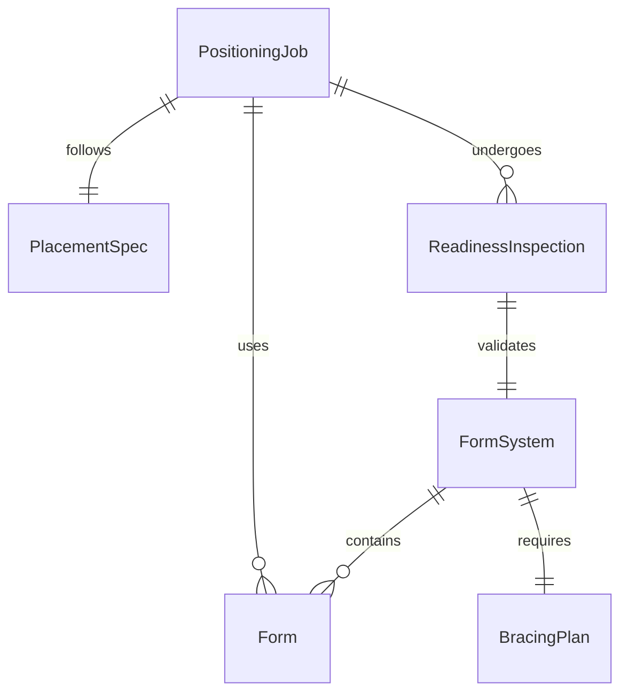
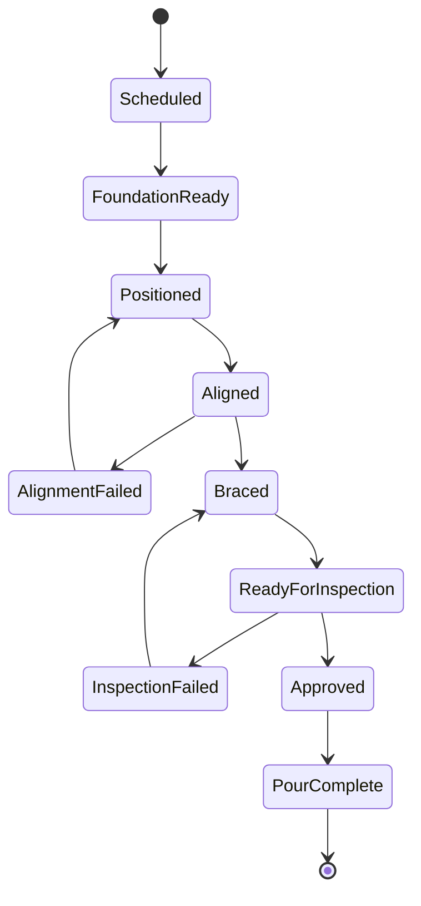
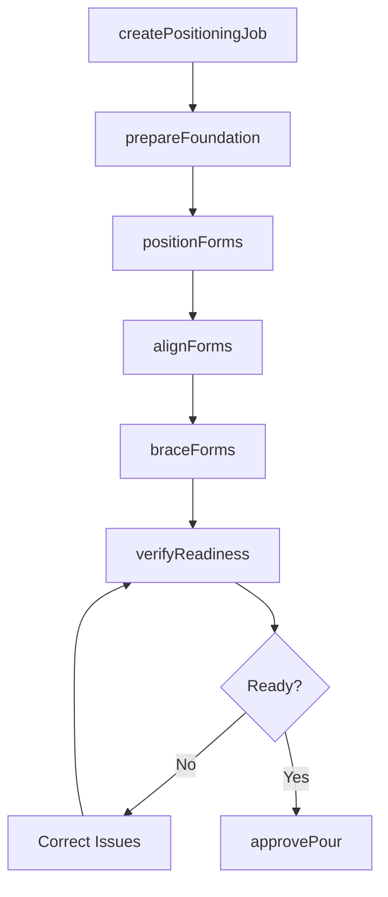
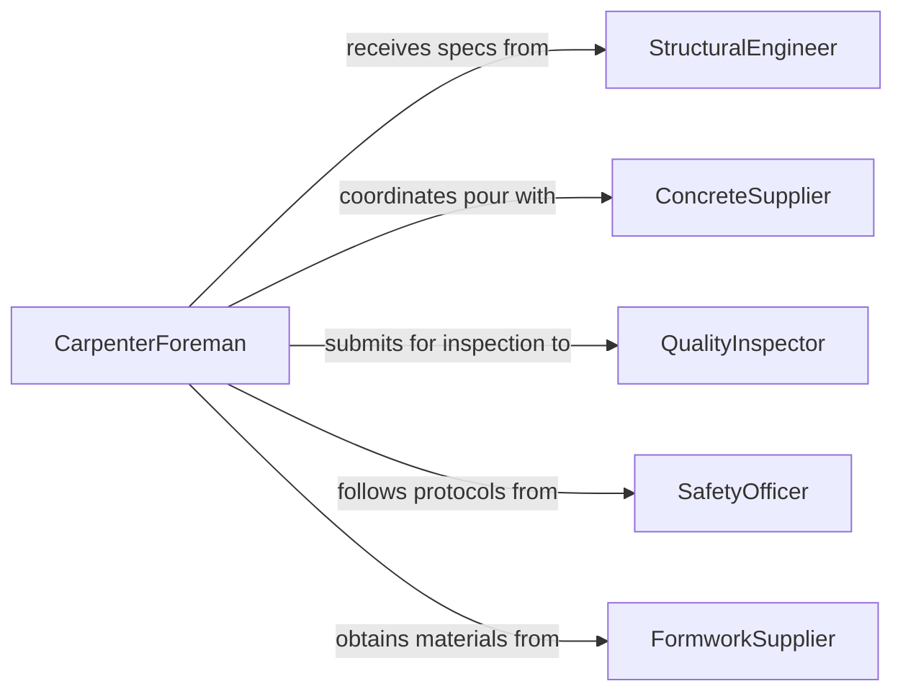

# Position Construction Forms Molds

> Business-as-Code definition for positioning concrete forms and molds for construction. Models form placement, alignment verification, and readiness tracking.

## Overview

Positioning construction forms and molds establishes the formwork system that shapes concrete pours for foundations, walls, columns, and specialized concrete elements. This definition exposes actions for form positioning, events for workflow automation, and searches for tracking form locations and readiness status.

## Actors

| Actor | Description |
|-------|-------------|
| StructuralEngineer | Provides formwork design and placement specifications |
| ConcreteSupplier | Schedules concrete delivery based on form readiness |
| QualityInspector | Verifies form positioning and structural integrity |
| SafetyOfficer | Ensures formwork placement follows safety protocols |
| FormworkSupplier | Provides forms, hardware, and technical support |
| ProjectManager | Coordinates form positioning with construction schedule |

## Roles

| Role | Description |
|------|-------------|
| CarpenterForeman | Oversees formwork positioning operations |
| FormworkTechnician | Executes form placement and bracing |
| AlignmentSpecialist | Verifies form position and level accuracy |
| FormworkCoordinator | Manages form inventory and schedules |

## Entities

| Entity | Description |
|--------|-------------|
| Form | Reusable formwork panel or mold component |
| FormSystem | Complete formwork assembly for concrete element |
| PositioningJob | A scheduled task to place formwork |
| PlacementSpec | Technical requirements for form location and alignment |
| BracingPlan | Structural support design for formwork stability |
| ReadinessInspection | Verification that forms are ready for concrete pour |

## Actions

| Action | Description |
|--------|-------------|
| createPositioningJob | Schedule formwork placement operation |
| prepareFoundation | Establish base surface for form placement |
| positionForms | Place forms at designated locations |
| alignForms | Adjust forms to precise position and level |
| braceForms | Install structural supports for formwork stability |
| verifyReadiness | Confirm forms are ready for concrete placement |
| approvePour | Formally authorize concrete placement |

## Events

| Event | Description |
|-------|-------------|
| positioningJobCreated | New formwork placement work order scheduled |
| foundationPrepared | Base surface ready for form placement |
| formsPositioned | Forms placed at designated locations |
| formsAligned | Forms adjusted to precise position and level |
| formsBraced | Structural supports installed for formwork |
| readinessVerified | Forms confirmed ready for concrete placement |
| pourApproved | Concrete placement formally authorized |

## Searches

| Search | Description |
|--------|-------------|
| findPositioningJobs | List formwork placement work orders by status or project |
| getForms | Retrieve form inventory by type or location |
| getReadinessInspections | Find inspection records for form readiness |
| getPourSchedule | Retrieve concrete placement schedule by form system |

## Entity Relationships



## State Diagram



## Workflow



## Actor Relationships



## Usage

### Calling Actions

```typescript
import { positionConstructionFormsMolds } from '@headlessly/position-construction-forms-molds'

const formwork = positionConstructionFormsMolds()

// Create positioning job for foundation wall
const job = await formwork.createPositioningJob({
  projectId: 'PROJECT-2026-BLDG-B',
  formSystemId: 'WALL-FORM-SECTION-4',
  elementType: 'Foundation Wall',
  dimensions: {
    length: 40,
    height: 10,
    thickness: 12
  },
  scheduledDate: '2026-02-22',
  pourDate: '2026-02-24'
})

// Prepare foundation surface
await formwork.prepareFoundation({
  jobId: job.id,
  preparation: {
    cleaning: 'Debris removed, surface swept',
    levelCheck: 'Within 1/4 inch over 10 feet',
    stringlines: 'Set at 12-inch offset from wall face',
    releaseAgent: 'Applied to existing concrete'
  }
})

// Position forms at location
await formwork.positionForms({
  jobId: job.id,
  forms: [
    { id: 'PANEL-4X8-01', position: { x: 0, y: 0, face: 'Interior' } },
    { id: 'PANEL-4X8-02', position: { x: 0, y: 4, face: 'Interior' } },
    { id: 'PANEL-4X8-03', position: { x: 0, y: 8, face: 'Interior' } },
    { id: 'PANEL-4X8-04', position: { x: 0, y: 0, face: 'Exterior' } }
  ]
})

// Align forms to specification
await formwork.alignForms({
  jobId: job.id,
  alignmentChecks: [
    { parameter: 'Plumb', measurement: 'Within 1/4 inch over height', status: 'Pass' },
    { parameter: 'Level', measurement: 'Within 1/8 inch over length', status: 'Pass' },
    { parameter: 'Spacing', measurement: '12 inches ± 1/16 inch', status: 'Pass' }
  ],
  adjustments: [
    { panel: 'PANEL-4X8-02', action: 'Shimmed 1/8 inch at bottom' }
  ]
})

// Install bracing for stability
await formwork.braceForms({
  jobId: job.id,
  bracing: [
    { type: 'Diagonal Brace', location: 'Panel 01 - Top', angle: 45, fastener: '16d Nail' },
    { type: 'Strongback', location: 'Horizontal at 5 feet', spacing: 4, fastener: 'Clamp' },
    { type: 'Stake', location: 'Base of Panel 02', depth: 24, fastener: 'Wire Tie' }
  ]
})

// Verify readiness for concrete pour
const readiness = await formwork.verifyReadiness({
  jobId: job.id,
  inspection: {
    formAlignment: 'Within tolerance',
    bracingIntegrity: 'All braces secure',
    joints: 'Tight, no gaps >1/8 inch',
    hardware: 'All ties and fasteners installed',
    cleanliness: 'Forms cleaned, release agent applied',
    embedments: 'All sleeves and inserts positioned'
  }
})
```

### Event-Driven Automation

```typescript
// Alert on readiness inspection failure
formwork.readinessVerified(async ({ jobId, inspection, issues }) => {
  if (issues && issues.length > 0) {
    await notify({
      to: 'carpenter-foreman',
      priority: 'high',
      message: `Formwork readiness issues on job ${jobId}: ${issues.join(', ')}`
    })
  }
})

// Notify concrete supplier when forms approved
formwork.pourApproved(async ({ jobId, pourDate, volume }) => {
  await notify({
    to: 'concrete-supplier',
    message: `Formwork approved for job ${jobId}, ready for ${volume} cubic yards on ${pourDate}`
  })
})
```
