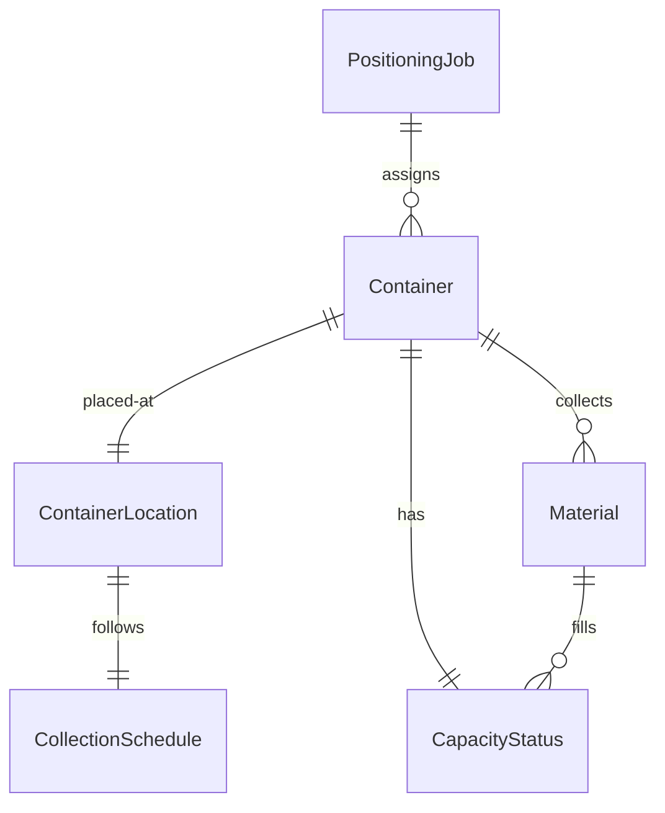
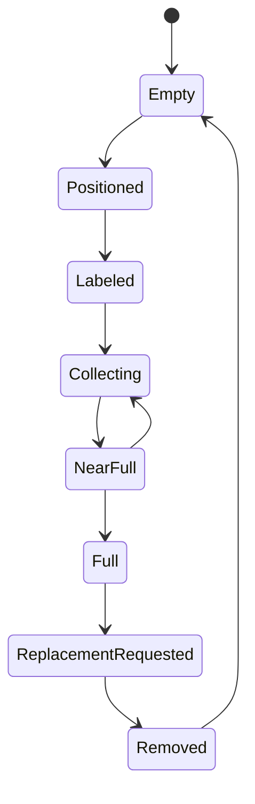
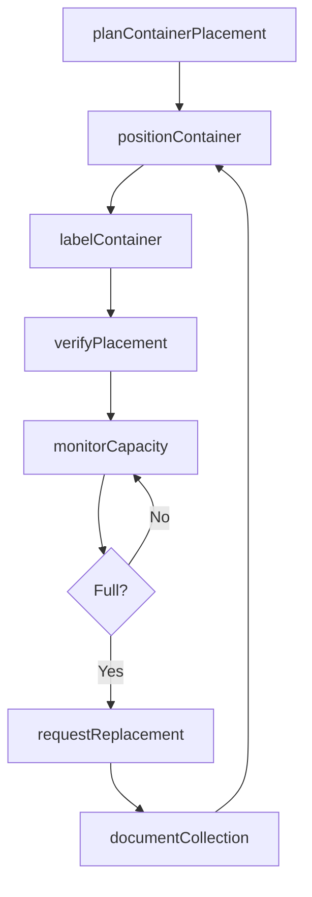
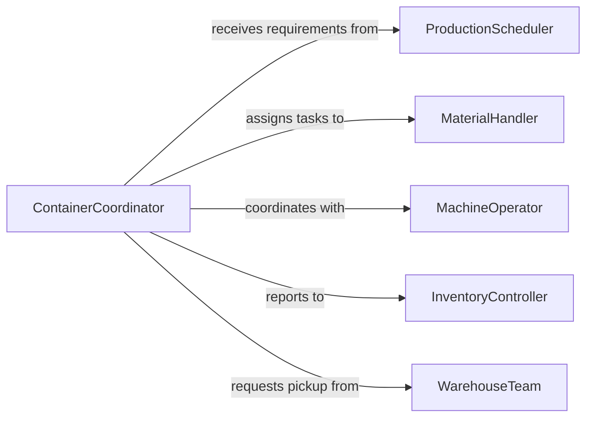

# Position Containers Receive Materials Workpieces

> Business-as-Code definition for positioning containers to receive materials and workpieces during production. Models container placement, capacity tracking, and material handling coordination.

## Overview

Positioning containers to receive materials and workpieces ensures efficient material flow, proper organization, and prevents production bottlenecks by having collection points ready when needed. This definition exposes actions for container positioning, events for workflow automation, and searches for tracking container locations and capacity.

## Actors

| Actor | Description |
|-------|-------------|
| ProductionScheduler | Plans material flow and container requirements |
| MaterialHandler | Positions and manages containers in production area |
| MachineOperator | Uses containers to collect output from machines |
| QualityInspector | Verifies proper material segregation and identification |
| WarehouseTeam | Collects full containers and delivers empty ones |
| SafetyOfficer | Ensures container placement follows safety protocols |

## Roles

| Role | Description |
|------|-------------|
| ContainerCoordinator | Manages container positioning and availability |
| ProductionTechnician | Operates equipment producing materials for containers |
| MaterialFlowSpecialist | Designs efficient container positioning strategy |
| InventoryController | Tracks container contents and movements |

## Entities

| Entity | Description |
|--------|-------------|
| Container | Physical receptacle for collecting materials or workpieces |
| ContainerLocation | Designated position for container placement |
| PositioningJob | A scheduled task to place containers for material collection |
| Material | Items or workpieces being collected in containers |
| CapacityStatus | Current fill level and available space in container |
| CollectionSchedule | Planned timing for full container removal and replacement |

## Actions

| Action | Description |
|--------|-------------|
| planContainerPlacement | Design container positioning strategy for production flow |
| positionContainer | Place container at designated collection point |
| labelContainer | Apply identification and material classification tags |
| monitorCapacity | Track container fill level during production |
| requestReplacement | Trigger full container removal and empty delivery |
| verifyPlacement | Confirm container position meets requirements |
| documentCollection | Record materials collected in container |

## Events

| Event | Description |
|-------|-------------|
| placementPlanned | Container positioning strategy designed |
| containerPositioned | Container placed at collection point |
| containerLabeled | Identification and classification tags applied |
| capacityMonitored | Fill level checked and recorded |
| replacementRequested | Full container removal triggered |
| placementVerified | Container position confirmed acceptable |
| collectionDocumented | Materials collected recorded in system |

## Searches

| Search | Description |
|--------|-------------|
| findContainerLocations | List container positions by production area or machine |
| getContainers | Retrieve container inventory by type or material |
| getCapacityStatus | Find containers by fill level or availability |
| getCollectionSchedule | Retrieve planned container replacement timing |

## Entity Relationships



## State Diagram



## Workflow



## Actor Relationships



## Usage

### Calling Actions

```typescript
import { positionContainersReceiveMaterialsWorkpieces } from '@headlessly/position-containers-receive-materials-workpieces'

const containers = positionContainersReceiveMaterialsWorkpieces()

// Plan container placement for CNC machining line
const plan = await containers.planContainerPlacement({
  productionLine: 'CNC-LINE-A',
  workOrder: 'WO-45023',
  materialType: 'Aluminum Chips',
  estimatedVolume: 45,
  productionDuration: 8,
  containerType: 'Gaylord Box'
})

// Position container at machine output
await containers.positionContainer({
  planId: plan.id,
  containerId: 'GAYLORD-0847',
  location: {
    machine: 'CNC-MILL-04',
    position: 'Right side, adjacent to chip conveyor',
    clearance: 'Verified forklift access from 3 sides'
  },
  capacity: 48,
  material: 'Aluminum 6061 Chips'
})

// Label container for tracking
await containers.labelContainer({
  containerId: 'GAYLORD-0847',
  labels: {
    materialCode: 'ALUM-CHIP-6061',
    workOrder: 'WO-45023',
    startDate: '2026-02-23T06:00:00Z',
    hazards: 'Sharp edges, cutting fluid residue',
    destination: 'Recycling - Aluminum Processor'
  }
})

// Monitor container capacity during production
const status = await containers.monitorCapacity({
  containerId: 'GAYLORD-0847',
  currentFillLevel: 38,
  capacity: 48,
  fillRate: 5.5,
  estimatedFullTime: '2026-02-23T13:15:00Z'
})

// Request replacement when full
await containers.requestReplacement({
  containerId: 'GAYLORD-0847',
  finalFillLevel: 47,
  weight: 385,
  replacementUrgency: 'Standard',
  emptyContainerNeeded: true
})

// Document collected materials
await containers.documentCollection({
  containerId: 'GAYLORD-0847',
  materials: {
    type: 'Aluminum 6061 Chips',
    weight: 385,
    estimatedValue: 542,
    workOrders: ['WO-45023'],
    startTime: '2026-02-23T06:00:00Z',
    endTime: '2026-02-23T13:30:00Z'
  }
})
```

### Event-Driven Automation

```typescript
// Alert when container approaching capacity
containers.capacityMonitored(async ({ containerId, fillLevel, capacity }) => {
  const percentFull = (fillLevel / capacity) * 100

  if (percentFull > 85) {
    await notify({
      to: 'material-handler',
      priority: 'medium',
      message: `Container ${containerId} at ${percentFull.toFixed(0)}% capacity, plan replacement soon`
    })
  }
})

// Auto-trigger warehouse pickup
containers.replacementRequested(async ({ containerId, weight, destination }) => {
  await warehouse.schedulePickup({
    containerId,
    location: 'CNC-LINE-A',
    weight,
    destination,
    priority: weight > 400 ? 'High' : 'Standard'
  })
})

// Track material collection metrics
containers.collectionDocumented(async ({ materials, duration, workOrders }) => {
  const collectionRate = materials.weight / (duration / 3600)

  await analytics.track({
    event: 'Material Collection',
    materialType: materials.type,
    weight: materials.weight,
    duration,
    collectionRate,
    workOrders: workOrders.length,
    timestamp: new Date()
  })
})
```
