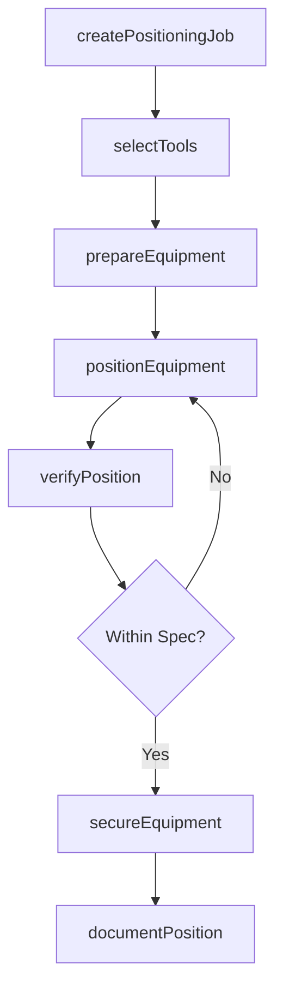
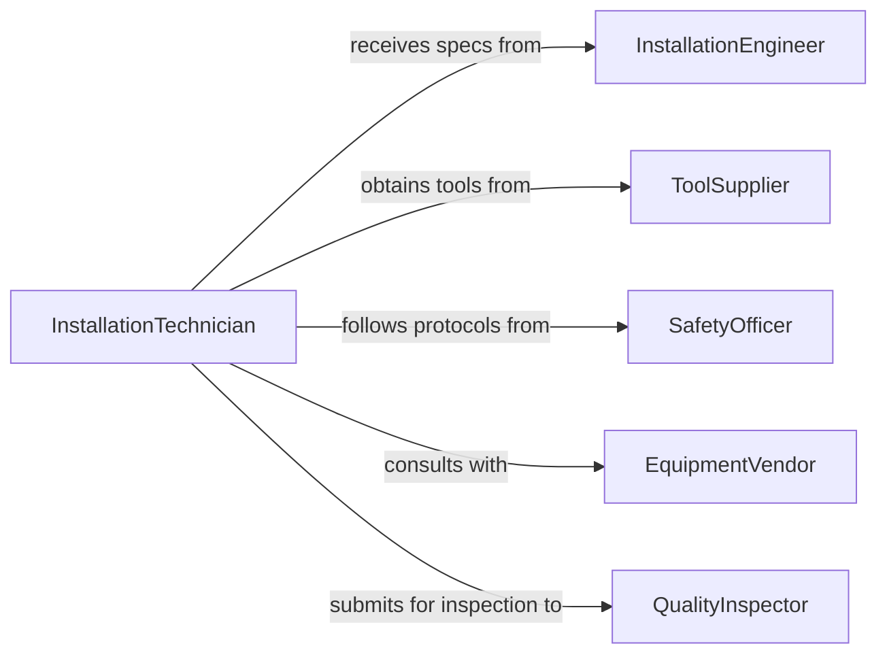

# Position Equipment Using Hand Tools

> Business-as-Code definition for positioning equipment using hand tools, power tools, and heavy equipment. Models equipment placement, tool selection, and installation verification.

## Overview

Positioning equipment using appropriate tools involves selecting the right equipment for moving and placing assets, executing safe positioning procedures, and verifying correct placement. This definition exposes actions for equipment positioning, events for workflow automation, and searches for tracking positioning operations and tool usage.

## Actors

| Actor | Description |
|-------|-------------|
| InstallationEngineer | Provides positioning specifications and requirements |
| ToolSupplier | Provides hand tools, power tools, and lifting equipment |
| SafetyOfficer | Ensures positioning work follows safety protocols |
| EquipmentVendor | Provides installation guidance and technical support |
| FacilityManager | Coordinates access and site preparation |
| QualityInspector | Verifies equipment positioning meets requirements |

## Roles

| Role | Description |
|------|-------------|
| InstallationTechnician | Executes equipment positioning using tools |
| RiggingSpecialist | Plans and oversees equipment lifting operations |
| ToolCoordinator | Manages tool inventory and availability |
| PositioningCoordinator | Schedules and tracks positioning operations |

## Entities

| Entity | Description |
|--------|-------------|
| Equipment | Machinery or asset requiring positioning |
| Tool | Hand tool, power tool, or heavy equipment used for positioning |
| PositioningJob | A scheduled task to position equipment |
| PlacementSpec | Technical requirements for equipment location |
| ToolSelection | Chosen tools and equipment for positioning task |
| Verification | Inspection record confirming proper equipment placement |

## Actions

| Action | Description |
|--------|-------------|
| createPositioningJob | Schedule equipment positioning operation |
| selectTools | Choose appropriate tools for positioning task |
| prepareEquipment | Ready tools and rigging for positioning |
| positionEquipment | Execute equipment placement using selected tools |
| verifyPosition | Confirm equipment meets placement requirements |
| secureEquipment | Apply fasteners and anchoring to hold position |
| documentPosition | Record positioning details and tool usage |

## Events

| Event | Description |
|-------|-------------|
| positioningJobCreated | New equipment positioning work order scheduled |
| toolsSelected | Appropriate tools chosen for positioning task |
| equipmentPrepared | Tools and rigging ready for positioning |
| equipmentPositioned | Equipment placed using selected tools |
| positionVerified | Equipment placement confirmed accurate |
| equipmentSecured | Fasteners and anchoring applied |
| positionDocumented | Positioning details recorded in system |

## Searches

| Search | Description |
|--------|-------------|
| findPositioningJobs | List positioning work orders by status or equipment |
| getTools | Retrieve tool inventory by type or availability |
| getVerifications | Find inspection records for equipment positioning |
| getToolUsage | Retrieve tool utilization and maintenance history |

## Workflow



## Actor Relationships



## Usage

### Calling Actions

```typescript
import { positionEquipmentUsingHandTools } from '@headlessly/position-equipment-using-hand-tools'

const positioning = positionEquipmentUsingHandTools()

// Create positioning job for industrial compressor
const job = await positioning.createPositioningJob({
  equipmentId: 'COMPRESSOR-ROTARY-08',
  location: 'Building C - Mechanical Room 2',
  weight: 3850,
  dimensions: { length: 96, width: 48, height: 72 },
  placementSpec: 'INSTALL-SPEC-CR-08-REV-B',
  scheduledDate: '2026-02-24'
})

// Select tools for positioning operation
await positioning.selectTools({
  jobId: job.id,
  tools: [
    { type: 'Hydraulic Jack', capacity: 5000, quantity: 2, reason: 'Lift and position' },
    { type: 'Pry Bar', length: 60, quantity: 2, reason: 'Fine positioning' },
    { type: 'Spirit Level', length: 48, quantity: 1, reason: 'Level verification' },
    { type: 'Impact Wrench', drive: '3/4 inch', quantity: 1, reason: 'Anchor bolt installation' },
    { type: 'Forklift', capacity: 6000, quantity: 1, reason: 'Initial placement' }
  ]
})

// Prepare equipment for positioning
await positioning.prepareEquipment({
  jobId: job.id,
  preparation: {
    rigging: '4-point lift sling, 2-inch nylon webbing',
    clearance: 'Verified overhead and side clearance',
    foundation: 'Concrete pad level and cured',
    anchorBolts: 'Installed and positioned per drawing'
  }
})

// Position equipment using selected tools
await positioning.positionEquipment({
  jobId: job.id,
  procedure: [
    { step: 1, tool: 'Forklift', action: 'Lift and transport to mechanical room' },
    { step: 2, tool: 'Forklift', action: 'Lower onto concrete pad, approximately positioned' },
    { step: 3, tool: 'Hydraulic Jack', action: 'Lift south end 2 inches for bolt alignment' },
    { step: 4, tool: 'Pry Bar', action: 'Shift 1/4 inch east to align mounting holes' },
    { step: 5, tool: 'Spirit Level', action: 'Check level in both directions' },
    { step: 6, tool: 'Hydraulic Jack', action: 'Fine adjust height for level' }
  ],
  technician: 'TECH-INST-24'
})

// Verify final position
const verification = await positioning.verifyPosition({
  jobId: job.id,
  checks: [
    { parameter: 'Level Longitudinal', measurement: '0.010 inch in 8 feet', tolerance: '0.015 inch', status: 'Pass' },
    { parameter: 'Level Transverse', measurement: '0.008 inch in 4 feet', tolerance: '0.015 inch', status: 'Pass' },
    { parameter: 'Anchor Alignment', measurement: 'All 8 bolts aligned', tolerance: 'All bolts', status: 'Pass' },
    { parameter: 'Clearance', measurement: '18 inches all sides', tolerance: '12 inches minimum', status: 'Pass' }
  ]
})

// Secure equipment in position
await positioning.secureEquipment({
  jobId: job.id,
  fastening: [
    { type: 'Anchor Bolt', size: '3/4-10 x 12', quantity: 8, torque: 150, tool: 'Impact Wrench' },
    { type: 'Leveling Pad', location: 'All four corners', material: 'Neoprene', thickness: 0.25 }
  ]
})
```

### Event-Driven Automation

```typescript
// Alert on positioning difficulty
positioning.equipmentPositioned(async ({ jobId, procedure, attempts }) => {
  if (attempts > 2) {
    await notify({
      to: 'installation-engineer',
      priority: 'medium',
      message: `Equipment positioning job ${jobId} required ${attempts} attempts, review procedure`
    })
  }
})

// Track tool utilization
positioning.toolsSelected(async ({ tools, jobId }) => {
  for (const tool of tools) {
    await analytics.track({
      event: 'Tool Usage',
      toolType: tool.type,
      jobId,
      capacity: tool.capacity,
      timestamp: new Date()
    })
  }
})
```
