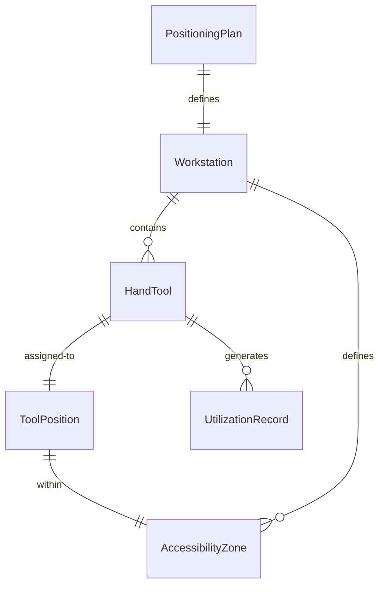
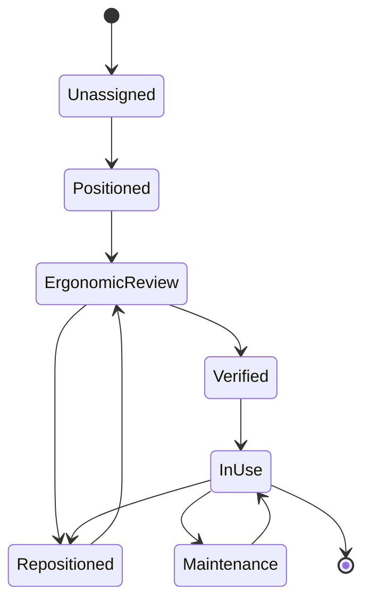
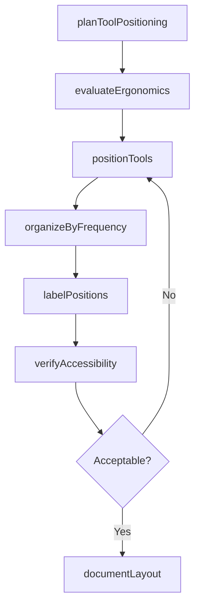
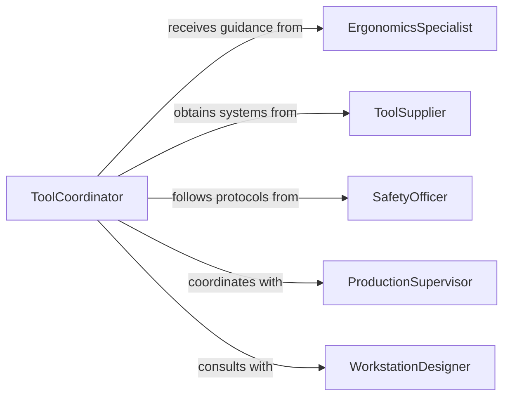

# Position Hand Tools

> Business-as-Code definition for positioning hand tools for work operations. Models tool placement, ergonomic optimization, and accessibility tracking.

## Overview

Positioning hand tools involves arranging tools within reach for efficient work operations, ensuring ergonomic access, and maintaining organization for safety and productivity. This definition exposes actions for tool positioning, events for workflow automation, and searches for tracking tool locations and utilization.

## Actors

| Actor | Description |
|-------|-------------|
| ErgonomicsSpecialist | Provides guidance on optimal tool placement for worker safety |
| ToolSupplier | Provides tool storage and organization systems |
| SafetyOfficer | Ensures tool positioning follows safety protocols |
| ProductionSupervisor | Coordinates tool positioning with work operations |
| MaintenanceTeam | Manages tool inventory and condition |
| WorkstationDesigner | Plans workstation layout and tool accessibility |

## Roles

| Role | Description |
|------|-------------|
| Technician | Positions and uses tools during work operations |
| ToolCoordinator | Manages tool positioning and availability |
| WorkstationOrganizer | Designs and implements tool placement strategy |
| EfficiencyAnalyst | Evaluates tool positioning for productivity improvement |

## Entities

| Entity | Description |
|--------|-------------|
| HandTool | Manual implement used for work operations |
| ToolPosition | Designated location for tool placement |
| Workstation | Work area where tools are positioned |
| PositioningPlan | Documented strategy for tool arrangement |
| AccessibilityZone | Area within ergonomic reach for tool access |
| UtilizationRecord | Tracking data for tool usage and movement |

## Actions

| Action | Description |
|--------|-------------|
| planToolPositioning | Design tool arrangement strategy for workstation |
| evaluateErgonomics | Assess tool placement for worker safety and efficiency |
| positionTools | Arrange tools at designated locations |
| organizeByFrequency | Place frequently used tools in optimal reach zones |
| labelPositions | Mark tool locations for organization and accountability |
| verifyAccessibility | Confirm tools are accessible without strain |
| documentLayout | Record tool positioning for standardization |

## Events

| Event | Description |
|-------|-------------|
| positioningPlanned | Tool arrangement strategy designed |
| ergonomicsEvaluated | Tool placement assessed for worker safety |
| toolsPositioned | Tools arranged at designated locations |
| organizedByFrequency | Frequently used tools placed in optimal zones |
| positionsLabeled | Tool locations marked and documented |
| accessibilityVerified | Tool placement confirmed ergonomically acceptable |
| layoutDocumented | Tool positioning recorded in system |

## Searches

| Search | Description |
|--------|-------------|
| findPositioningPlans | List tool arrangement strategies by workstation |
| getToolPositions | Retrieve tool locations by workstation or zone |
| getUtilization | Find tool usage frequency and movement patterns |
| getErgonomicIssues | Identify tool positions causing worker strain |

## Entity Relationships



## State Diagram



## Workflow



## Actor Relationships



## Usage

### Calling Actions

```typescript
import { positionHandTools } from '@headlessly/position-hand-tools'

const toolPositioning = positionHandTools()

// Plan tool positioning for assembly workstation
const plan = await toolPositioning.planToolPositioning({
  workstationId: 'ASSY-BENCH-12',
  operation: 'Electronics Assembly',
  toolList: [
    'Phillips Screwdriver #2',
    'Wire Stripper',
    'Needle Nose Pliers',
    'Diagonal Cutters',
    'Multimeter',
    'Soldering Iron',
    'Tweezers',
    'ESD Wrist Strap'
  ],
  workerHeight: 68,
  handedness: 'Right'
})

// Evaluate ergonomics of tool placement
await toolPositioning.evaluateErgonomics({
  planId: plan.id,
  evaluation: {
    primaryZone: { radius: 16, height: 40, tools: ['Phillips Screwdriver', 'Wire Stripper', 'Pliers'] },
    secondaryZone: { radius: 24, height: 48, tools: ['Diagonal Cutters', 'Tweezers'] },
    occasionalZone: { radius: 32, height: 52, tools: ['Multimeter', 'Soldering Iron'] },
    reachAnalysis: 'All tools within comfortable reach without trunk rotation',
    recommendation: 'Approved with suggested height adjustment for Soldering Iron'
  }
})

// Position tools at workstation
await toolPositioning.positionTools({
  workstationId: 'ASSY-BENCH-12',
  placements: [
    { tool: 'Phillips Screwdriver #2', location: 'Tool Board Slot 1', zone: 'Primary', x: 8, y: 40 },
    { tool: 'Wire Stripper', location: 'Tool Board Slot 2', zone: 'Primary', x: 14, y: 40 },
    { tool: 'Needle Nose Pliers', location: 'Tool Board Slot 3', zone: 'Primary', x: 20, y: 40 },
    { tool: 'Diagonal Cutters', location: 'Tool Board Slot 4', zone: 'Secondary', x: 26, y: 44 },
    { tool: 'Tweezers', location: 'Tool Board Slot 5', zone: 'Secondary', x: 8, y: 46 },
    { tool: 'Multimeter', location: 'Shelf', zone: 'Occasional', x: 30, y: 50 },
    { tool: 'Soldering Iron', location: 'Stand Right Side', zone: 'Occasional', x: -8, y: 42 },
    { tool: 'ESD Wrist Strap', location: 'Hook Left Side', zone: 'Primary', x: -4, y: 38 }
  ]
})

// Organize by frequency of use
await toolPositioning.organizeByFrequency({
  workstationId: 'ASSY-BENCH-12',
  usageData: {
    high: ['Phillips Screwdriver', 'Wire Stripper', 'Needle Nose Pliers'],
    medium: ['Diagonal Cutters', 'Tweezers'],
    low: ['Multimeter', 'Soldering Iron']
  },
  adjustment: 'Moved Multimeter to upper shelf, brought Tweezers closer'
})

// Label tool positions
await toolPositioning.labelPositions({
  workstationId: 'ASSY-BENCH-12',
  labelingMethod: 'Shadow Board with Tool Outlines',
  labels: [
    { tool: 'Phillips Screwdriver #2', label: 'PH2', color: 'Blue' },
    { tool: 'Wire Stripper', label: 'WS', color: 'Green' },
    { tool: 'Needle Nose Pliers', label: 'NNP', color: 'Red' }
  ]
})

// Verify accessibility
const verification = await toolPositioning.verifyAccessibility({
  workstationId: 'ASSY-BENCH-12',
  checks: [
    { tool: 'Phillips Screwdriver', reachDistance: 14, reachEffort: 'Minimal', status: 'Pass' },
    { tool: 'Wire Stripper', reachDistance: 15, reachEffort: 'Minimal', status: 'Pass' },
    { tool: 'Multimeter', reachDistance: 28, reachEffort: 'Moderate', status: 'Pass' },
    { tool: 'Soldering Iron', reachDistance: 12, reachEffort: 'Minimal', status: 'Pass' }
  ]
})
```

### Event-Driven Automation

```typescript
// Alert on ergonomic issues
toolPositioning.accessibilityVerified(async ({ workstationId, checks, issues }) => {
  const failedChecks = checks.filter(c => c.status === 'Fail')

  if (failedChecks.length > 0) {
    await notify({
      to: 'ergonomics-specialist',
      priority: 'high',
      message: `Workstation ${workstationId} has ${failedChecks.length} tool accessibility issues requiring correction`
    })
  }
})

// Track tool utilization patterns
toolPositioning.toolsPositioned(async ({ workstationId, placements }) => {
  await analytics.track({
    event: 'Workstation Tool Layout',
    workstationId,
    toolCount: placements.length,
    primaryZoneTools: placements.filter(p => p.zone === 'Primary').length,
    timestamp: new Date()
  })
})
```
