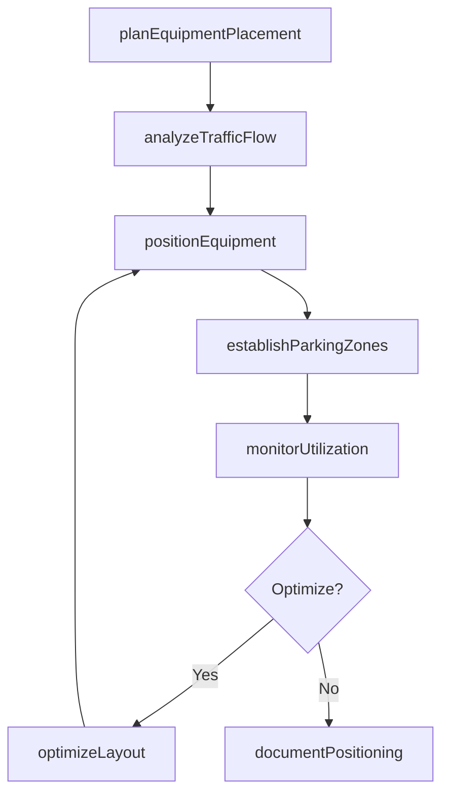
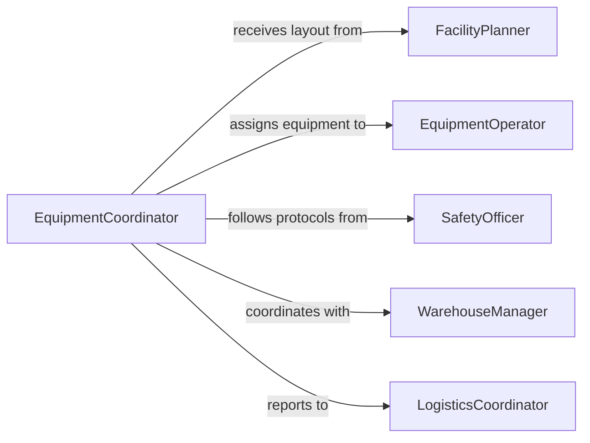

# Position Material Handling Equipment

> Business-as-Code definition for positioning material handling equipment in production and warehouse environments. Models equipment placement, traffic flow optimization, and utilization tracking.

## Overview

Positioning material handling equipment involves strategic placement of forklifts, conveyors, carts, and lifting devices to optimize material flow, minimize congestion, and ensure safe operations. This definition exposes actions for equipment positioning, events for workflow automation, and searches for tracking equipment locations and utilization.

## Actors

| Actor | Description |
|-------|-------------|
| FacilityPlanner | Provides layout specifications and traffic flow design |
| EquipmentOperator | Operates material handling equipment |
| SafetyOfficer | Ensures equipment positioning follows safety protocols |
| WarehouseManager | Coordinates equipment positioning with operations |
| MaintenanceTeam | Manages equipment condition and availability |
| LogisticsCoordinator | Plans material flow and equipment requirements |

## Roles

| Role | Description |
|------|-------------|
| EquipmentCoordinator | Manages equipment positioning and allocation |
| FlowAnalyst | Evaluates traffic patterns and optimization opportunities |
| PositioningSpecialist | Executes equipment placement procedures |
| UtilizationTracker | Monitors equipment usage and efficiency |

## Entities

| Entity | Description |
|--------|-------------|
| MaterialHandlingEquipment | Machinery for moving materials in facility |
| EquipmentPosition | Designated location for equipment placement or parking |
| PositioningPlan | Documented strategy for equipment arrangement |
| TrafficZone | Area with specific flow patterns and safety requirements |
| UtilizationRecord | Tracking data for equipment usage and movement |
| ChargingStation | Location for electric equipment battery charging |

## Actions

| Action | Description |
|--------|-------------|
| planEquipmentPlacement | Design equipment positioning strategy for facility |
| analyzeTrafficFlow | Evaluate material movement patterns and congestion |
| positionEquipment | Place equipment at designated operational location |
| establishParkingZones | Define areas for equipment storage when not in use |
| optimizeLayout | Adjust equipment positions to improve flow efficiency |
| monitorUtilization | Track equipment usage and location data |
| documentPositioning | Record equipment placement for operational planning |

## Events

| Event | Description |
|-------|-------------|
| placementPlanned | Equipment positioning strategy designed |
| trafficFlowAnalyzed | Material movement patterns evaluated |
| equipmentPositioned | Equipment placed at operational location |
| parkingZonesEstablished | Storage areas defined and marked |
| layoutOptimized | Equipment positions adjusted for efficiency |
| utilizationMonitored | Equipment usage data captured |
| positioningDocumented | Equipment placement recorded in system |

## Searches

| Search | Description |
|--------|-------------|
| findPositioningPlans | List equipment placement strategies by facility area |
| getEquipmentLocations | Retrieve current positions of material handling equipment |
| getTrafficZones | Find areas by flow volume or congestion level |
| getUtilization | Retrieve equipment usage and idle time data |

## Workflow



## Actor Relationships



## Usage

### Calling Actions

```typescript
import { positionMaterialHandlingEquipment } from '@headlessly/position-material-handling-equipment'

const equipmentPositioning = positionMaterialHandlingEquipment()

// Plan equipment placement for warehouse expansion
const plan = await equipmentPositioning.planEquipmentPlacement({
  facilityArea: 'Warehouse Zone C',
  equipment: [
    { type: 'Forklift', quantity: 4, capacity: 5000 },
    { type: 'Order Picker', quantity: 2, liftHeight: 30 },
    { type: 'Pallet Jack', quantity: 8, capacity: 5500 },
    { type: 'Reach Truck', quantity: 2, liftHeight: 40 }
  ],
  operatingHours: '24/7',
  shiftOverlap: 1
})

// Analyze traffic flow patterns
await equipmentPositioning.analyzeTrafficFlow({
  planId: plan.id,
  analysis: {
    primaryAisles: ['Main North-South', 'Cross Aisle A', 'Cross Aisle B'],
    congestionPoints: ['Shipping Dock 3', 'Receiving Area'],
    peakHours: ['08:00-10:00', '14:00-16:00'],
    averageTrips: 145,
    bottlenecks: ['Narrow access to Row 12-15'],
    recommendation: 'Position Order Pickers near high-volume pick zones, Forklifts near docks'
  }
})

// Position equipment at operational location
await equipmentPositioning.positionEquipment({
  planId: plan.id,
  placements: [
    { equipmentId: 'FORKLIFT-42', location: 'Shipping Dock 3 - West Side', assignment: 'Loading Operations' },
    { equipmentId: 'FORKLIFT-43', location: 'Receiving Area - North End', assignment: 'Unloading Operations' },
    { equipmentId: 'ORDERPICK-18', location: 'Row 8 - Pick Zone A', assignment: 'High-Volume Picks' },
    { equipmentId: 'REACH-TRUCK-09', location: 'Row 15 - High Bay', assignment: 'Upper Level Replenishment' }
  ]
})

// Establish parking zones for idle equipment
await equipmentPositioning.establishParkingZones({
  facilityArea: 'Warehouse Zone C',
  parkingZones: [
    { id: 'PARK-C1', location: 'South Wall', capacity: 6, equipmentType: 'Forklift', chargingStations: 4 },
    { id: 'PARK-C2', location: 'East Corner', capacity: 4, equipmentType: 'Order Picker', chargingStations: 2 },
    { id: 'PARK-C3', location: 'Break Room Adjacent', capacity: 10, equipmentType: 'Pallet Jack', chargingStations: 0 }
  ],
  rules: 'Equipment must be parked in designated zones during breaks and shift changes'
})

// Monitor equipment utilization
const utilization = await equipmentPositioning.monitorUtilization({
  facilityArea: 'Warehouse Zone C',
  period: '2026-02-24',
  metrics: [
    { equipmentId: 'FORKLIFT-42', operatingTime: 7.5, idleTime: 0.5, trips: 42, efficiency: 94 },
    { equipmentId: 'FORKLIFT-43', operatingTime: 6.8, idleTime: 1.2, trips: 38, efficiency: 85 },
    { equipmentId: 'ORDERPICK-18', operatingTime: 7.2, idleTime: 0.8, trips: 68, efficiency: 90 },
    { equipmentId: 'REACH-TRUCK-09', operatingTime: 5.5, idleTime: 2.5, trips: 24, efficiency: 69 }
  ]
})

// Optimize layout based on utilization data
await equipmentPositioning.optimizeLayout({
  facilityArea: 'Warehouse Zone C',
  optimizations: [
    { equipmentId: 'REACH-TRUCK-09', action: 'Relocate', newLocation: 'Row 12 - Closer to Replenishment Staging', reason: 'Reduce travel time' },
    { equipmentType: 'Pallet Jack', action: 'Redistribute', plan: 'Move 2 units from Zone C to Zone B for better balance' }
  ]
})
```

### Event-Driven Automation

```typescript
// Alert on low equipment utilization
equipmentPositioning.utilizationMonitored(async ({ equipmentId, efficiency, idleTime }) => {
  if (efficiency < 70 || idleTime > 2.0) {
    await notify({
      to: 'equipment-coordinator',
      priority: 'medium',
      message: `Equipment ${equipmentId} showing low utilization: ${efficiency}% efficiency, ${idleTime} hours idle`
    })
  }
})

// Track congestion patterns for planning
equipmentPositioning.trafficFlowAnalyzed(async ({ congestionPoints, peakHours, bottlenecks }) => {
  if (bottlenecks && bottlenecks.length > 0) {
    await analytics.track({
      event: 'Traffic Congestion Analysis',
      congestionPoints: congestionPoints.length,
      peakHours: peakHours.join(', '),
      bottlenecks: bottlenecks.join(', '),
      timestamp: new Date()
    })
  }
})

// Auto-optimize during off-hours
equipmentPositioning.layoutOptimized(async ({ facilityArea, optimizations }) => {
  await notify({
    to: 'warehouse-manager',
    message: `Equipment layout optimized in ${facilityArea}: ${optimizations.length} changes implemented`
  })
})
```
