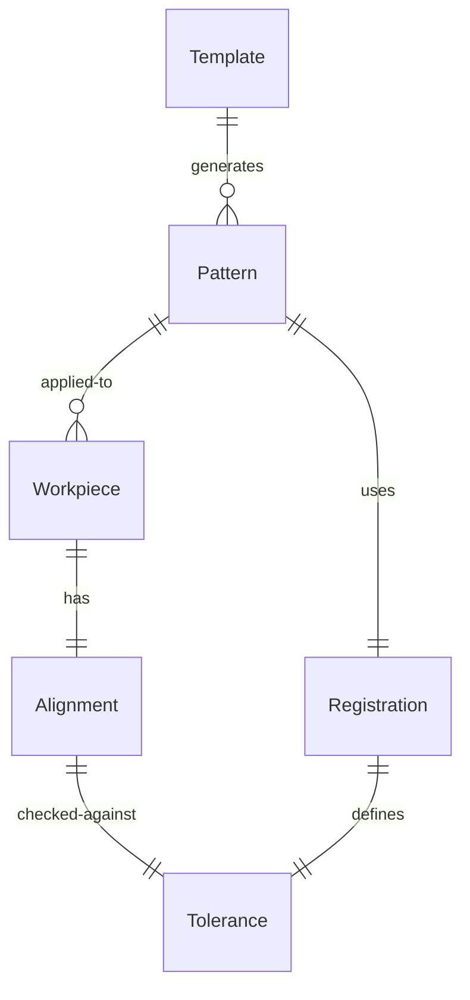
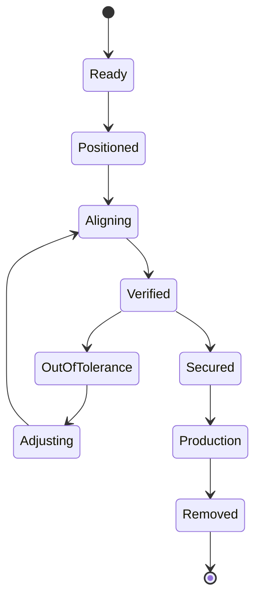
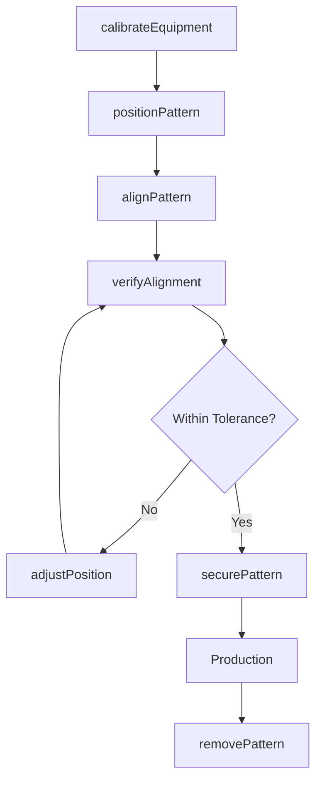
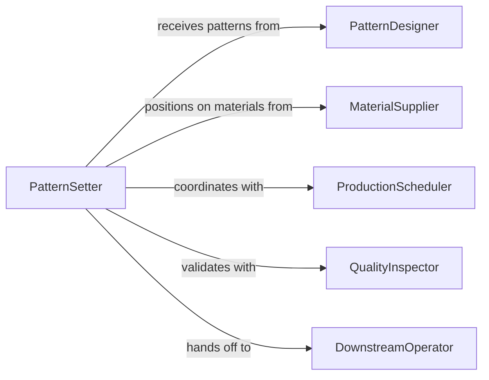

# Position Patterns Equipment Materials Workpieces

> Business-as-Code definition for positioning patterns on equipment, materials, or workpieces during manufacturing and fabrication processes.

## Overview

Pattern positioning involves aligning templates, stencils, and cutting guides onto materials and workpieces to ensure accurate production. This definition exposes actions for pattern setup, alignment verification, and adjustment operations across manufacturing workflows.

## Actors

| Actor | Description |
|-------|-------------|
| PatternDesigner | Creates and supplies pattern templates and specifications |
| MaterialSupplier | Provides raw materials for patterned production |
| QualityInspector | Verifies pattern alignment meets tolerances |
| ProductionScheduler | Coordinates pattern positioning with production flow |
| MaintenanceTech | Maintains pattern positioning equipment |
| DownstreamOperator | Receives workpieces with positioned patterns |

## Roles

| Role | Description |
|------|-------------|
| PatternSetter | Positions patterns on materials and equipment |
| AlignmentTechnician | Ensures precise pattern registration |
| ProductionOperator | Executes work using positioned patterns |
| QualityChecker | Validates pattern positioning accuracy |

## Entities

| Entity | Description |
|--------|-------------|
| Pattern | A template or guide for cutting, marking, or forming |
| Workpiece | Material being processed with positioned pattern |
| Alignment | Registration data between pattern and material |
| Tolerance | Acceptable deviation from ideal pattern position |
| Template | Reusable pattern positioning fixture |
| Registration | Reference marks for pattern alignment |

## Actions

| Action | Description |
|--------|-------------|
| positionPattern | Place pattern onto workpiece or equipment |
| alignPattern | Adjust pattern to registration marks |
| verifyAlignment | Check pattern position against tolerances |
| securePattern | Fix pattern in place for production |
| adjustPosition | Correct pattern location after verification |
| removePattern | Detach pattern after operation complete |
| calibrateEquipment | Set up equipment for pattern positioning |

## Events

| Event | Description |
|-------|-------------|
| patternPositioned | Pattern has been placed on workpiece |
| alignmentVerified | Pattern alignment checked and confirmed |
| toleranceExceeded | Pattern position outside acceptable limits |
| patternSecured | Pattern fixed in position for production |
| positionAdjusted | Pattern location corrected |
| patternRemoved | Pattern detached from workpiece |
| equipmentCalibrated | Positioning equipment set up and ready |

## Searches

| Search | Description |
|--------|-------------|
| findPatterns | List patterns by type, material, or operation |
| getAlignments | Retrieve alignment data for workpieces |
| getTolerances | Find tolerance specifications by operation |
| getRegistrations | Retrieve registration mark positions |

## Entity Relationships



## State Diagram



## Workflow



## Actor Relationships



## Usage

### Calling Actions

```typescript
import { positionPatternsEquipmentMaterialsWorkpieces } from '@headlessly/position-patterns-equipment-materials-workpieces'

const patterns = positionPatternsEquipmentMaterialsWorkpieces()

// Set up equipment for pattern positioning
await patterns.calibrateEquipment({
  equipmentId: 'cutting-table-3',
  patternType: 'fabric-cutting',
  referencePoints: ['corner-A', 'corner-B']
})

// Position pattern on workpiece
const positioned = await patterns.positionPattern({
  patternId: 'dress-pattern-42',
  workpieceId: 'fabric-roll-889',
  initialPosition: { x: 0, y: 0, rotation: 0 }
})

// Align and verify
await patterns.alignPattern({
  positionId: positioned.id,
  registrationMarks: ['mark-1', 'mark-2', 'mark-3']
})

const verification = await patterns.verifyAlignment({
  positionId: positioned.id,
  toleranceSpec: { linear: 1.0, angular: 0.5 }
})

if (verification.withinTolerance) {
  await patterns.securePattern({ positionId: positioned.id })
}
```

### Event-Driven Automation

```typescript
// Auto-adjust when tolerance exceeded
patterns.toleranceExceeded(async ({ positionId, deviation }) => {
  await patterns.adjustPosition({
    positionId,
    correction: calculateCorrection(deviation)
  })
})

// Alert on repeated alignment failures
patterns.positionAdjusted(async ({ positionId, attemptCount }) => {
  if (attemptCount > 3) {
    await notify({
      to: 'quality-team',
      message: `Pattern ${positionId} requires ${attemptCount} adjustments`
    })
  }
})
```
