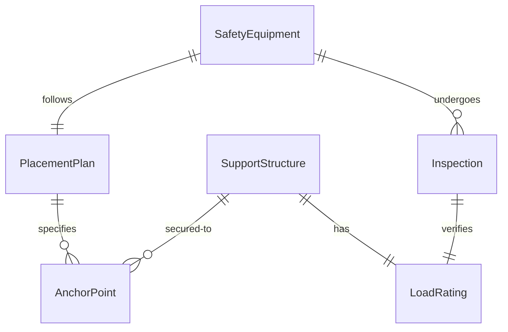
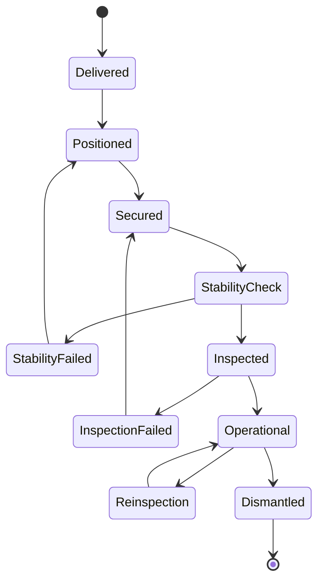
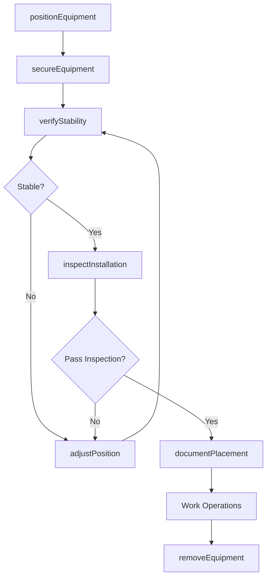
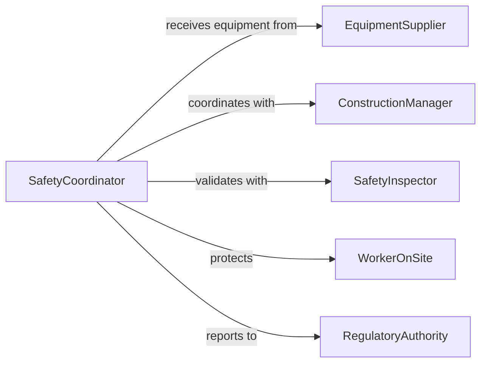

# Position Safety Support Equipment

> Business-as-Code definition for positioning safety and support equipment in construction, manufacturing, and maintenance operations.

## Overview

Safety and support equipment positioning involves placing scaffolding, guardrails, shoring, and protective barriers to create safe work environments. This definition exposes actions for equipment placement, stability verification, and operational readiness checks across high-risk work environments.

## Actors

| Actor | Description |
|-------|-------------|
| EquipmentSupplier | Provides safety and support equipment |
| SafetyInspector | Verifies equipment meets safety standards |
| ConstructionManager | Coordinates equipment placement with project schedule |
| WorkerOnSite | Uses positioned safety equipment during operations |
| RegulatoryAuthority | Enforces safety equipment requirements |
| InsuranceCarrier | Assesses risk and compliance with safety protocols |

## Roles

| Role | Description |
|------|-------------|
| SafetyCoordinator | Plans and oversees safety equipment placement |
| Rigger | Positions and secures support equipment |
| Inspector | Validates equipment installation and stability |
| SiteOperator | Maintains equipment during use |

## Entities

| Entity | Description |
|--------|-------------|
| SafetyEquipment | Protective barriers, guardrails, and containment systems |
| SupportStructure | Scaffolding, shoring, and temporary support systems |
| PlacementPlan | Specification for equipment location and configuration |
| Inspection | Record of equipment safety verification |
| LoadRating | Maximum safe load capacity for support equipment |
| AnchorPoint | Secure attachment location for safety systems |

## Actions

| Action | Description |
|--------|-------------|
| positionEquipment | Place safety or support equipment at work location |
| secureEquipment | Anchor equipment to stable points |
| verifyStability | Check equipment stability and load capacity |
| inspectInstallation | Validate equipment meets safety standards |
| adjustPosition | Modify equipment location or configuration |
| removeEquipment | Dismantle and relocate safety equipment |
| documentPlacement | Record equipment positioning for compliance |

## Events

| Event | Description |
|-------|-------------|
| equipmentPositioned | Safety equipment placed at work location |
| equipmentSecured | Equipment anchored and stabilized |
| stabilityVerified | Stability check completed successfully |
| installationInspected | Equipment validated against safety standards |
| positionAdjusted | Equipment location or configuration modified |
| equipmentRemoved | Safety equipment dismantled |
| complianceDocumented | Placement records completed for audit |

## Searches

| Search | Description |
|--------|-------------|
| findEquipment | List safety equipment by type, location, or status |
| getInspections | Retrieve inspection records for equipment |
| getLoadRatings | Find load capacity data for support structures |
| getAnchorPoints | Retrieve approved anchor locations |

## Entity Relationships



## State Diagram



## Workflow



## Actor Relationships



## Usage

### Calling Actions

```typescript
import { positionSafetySupportEquipment } from '@headlessly/position-safety-support-equipment'

const safety = positionSafetySupportEquipment()

// Position scaffolding for elevated work
const scaffold = await safety.positionEquipment({
  equipmentType: 'scaffolding',
  location: { floor: 3, bay: 'A-12' },
  height: 20,
  workArea: { length: 30, width: 6 }
})

// Secure to anchor points
await safety.secureEquipment({
  equipmentId: scaffold.id,
  anchorPoints: ['wall-A1', 'wall-A2', 'floor-anchor-3'],
  anchorType: 'structural-bolt'
})

// Verify stability and load capacity
const verification = await safety.verifyStability({
  equipmentId: scaffold.id,
  expectedLoad: 5000,
  testMethod: 'incremental-loading'
})

// Complete inspection and documentation
await safety.inspectInstallation({
  equipmentId: scaffold.id,
  inspectorId: 'cert-inspector-42',
  standards: ['OSHA-1926.451', 'ANSI-A10.8']
})

await safety.documentPlacement({
  equipmentId: scaffold.id,
  photos: ['install-photo-1.jpg', 'install-photo-2.jpg']
})
```

### Event-Driven Automation

```typescript
// Alert on failed stability check
safety.stabilityVerified(async ({ equipmentId, passed, loadRating }) => {
  if (!passed) {
    await notify({
      to: 'safety-team',
      priority: 'high',
      message: `Equipment ${equipmentId} failed stability check`
    })
  }
})

// Auto-schedule re-inspection
safety.installationInspected(async ({ equipmentId, nextInspectionDate }) => {
  await scheduler.schedule({
    task: 'safety-reinspection',
    equipmentId,
    date: nextInspectionDate
  })
})
```
