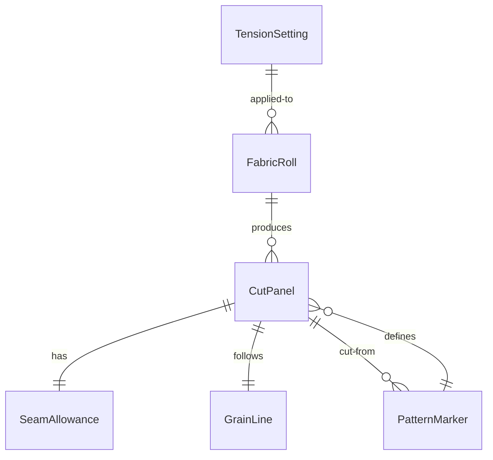
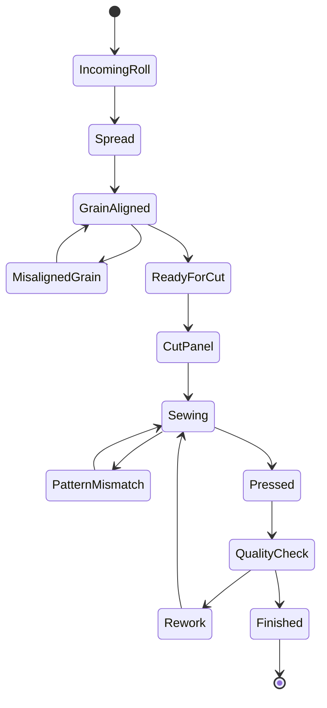
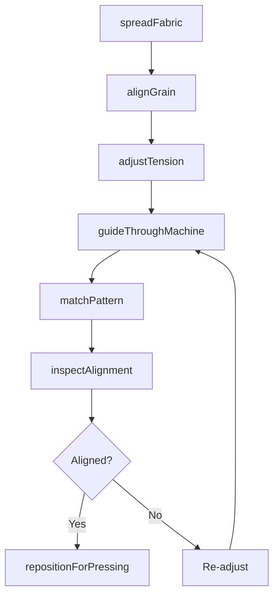
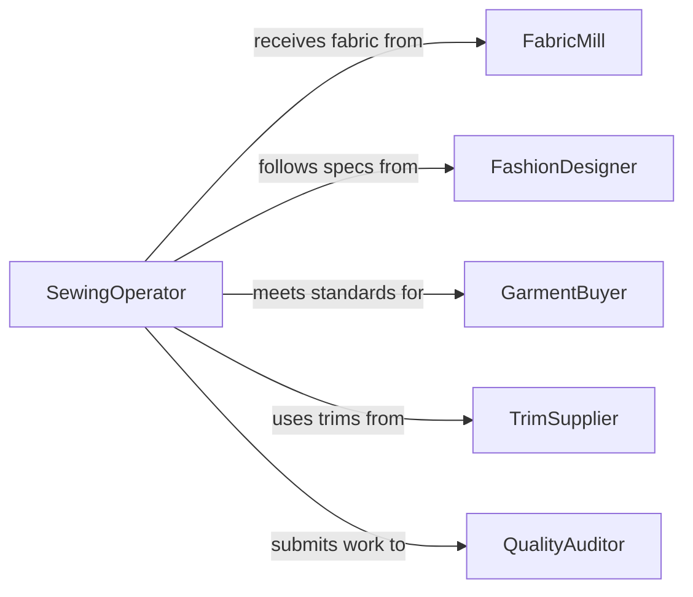

# Adjust Fabrics Materials During Garment

> Business-as-Code definition for adjusting fabrics or other materials during garment production. Models the process of aligning, tensioning, smoothing, and repositioning textiles on cutting tables, sewing machines, and finishing equipment throughout the garment manufacturing workflow.

## Overview

Adjusting fabrics and materials during garment production involves handling textiles at multiple stages of the manufacturing process. Workers spread and align fabric layers on cutting tables, guide material through sewing machines while maintaining seam alignment, reposition pieces during pressing and finishing, and adjust tension to prevent puckering or distortion. Precision in fabric adjustment directly affects garment fit, pattern alignment, seam quality, and overall production yield. This activity requires knowledge of fabric behavior, grain direction, and the specific handling needs of different textile types.

## Actors

| Actor | Description |
|-------|-------------|
| FabricMill | Supplies woven, knit, and specialty textiles in rolls or bolts |
| FashionDesigner | Specifies pattern placement, grain direction, and alignment requirements |
| GarmentBuyer | Sets quality standards and tolerances for finished garment appearance |
| TrimSupplier | Provides linings, interfacings, zippers, and other accessory materials |
| QualityAuditor | Inspects garments for fabric alignment, pattern matching, and construction defects |

## Roles

| Role | Description |
|------|-------------|
| Spreader | Lays out fabric on cutting tables in smooth, properly tensioned layers |
| SewingOperator | Guides fabric through the sewing machine while maintaining alignment |
| Presser | Positions garment components on pressing equipment for shaping and finishing |
| ProductionSupervisor | Manages workflow, quality, and throughput across the sewing floor |

## Entities

| Entity | Description |
|--------|-------------|
| FabricRoll | A bolt of textile material with known width, length, and grain direction |
| CutPanel | A fabric piece cut to pattern shape awaiting sewing or finishing |
| SeamAllowance | The margin of fabric between the stitch line and the cut edge |
| PatternMarker | The layout of pattern pieces on fabric optimizing material usage |
| TensionSetting | The pressure applied to fabric by machine feed mechanisms |
| GrainLine | The direction of the warp threads that determines how fabric drapes and stretches |

## Actions

| Action | Description |
|--------|-------------|
| spreadFabric | Lay fabric onto the cutting table in smooth, wrinkle-free layers |
| alignGrain | Position the fabric so the grain line matches the pattern marker direction |
| adjustTension | Set or modify the tension on sewing or spreading equipment for the fabric type |
| guideThroughMachine | Feed and steer fabric panels through the sewing machine during stitching |
| matchPattern | Align stripes, plaids, or prints across seam lines for visual continuity |
| repositionForPressing | Place sewn components on the pressing surface for shaping operations |
| inspectAlignment | Check that fabric positioning meets pattern and quality specifications |

## Events

| Event | Description |
|-------|-------------|
| fabricSpread | Fabric has been laid out in properly tensioned layers on the cutting table |
| grainAligned | The fabric grain direction has been matched to the pattern marker |
| tensionAdjusted | Machine tension settings have been modified for the current fabric type |
| fabricGuidedThrough | A panel has been successfully fed through the sewing machine |
| patternMatched | Stripes or prints have been aligned across the seam join |
| repositionedForPressing | The garment component has been placed on the pressing surface |
| alignmentInspected | Fabric positioning has been checked and confirmed or flagged for correction |

## Searches

| Search | Description |
|--------|-------------|
| findFabricRolls | List available fabric rolls by type, color, width, and remaining yardage |
| getCutPanelStatus | Check the status of cut panels awaiting sewing or pressing |
| getTensionSettings | Retrieve recommended tension settings by fabric type and machine |
| getAlignmentDefects | Find garments or panels flagged for alignment issues |

## Entity Relationships



## State Diagram



## Workflow



## Actor Relationships



## Usage

### Calling Actions

```typescript
import { adjustFabricsMaterialsDuringGarment } from '@headlessly/adjust-fabrics-materials-during-garment'

const fabricAdjust = adjustFabricsMaterialsDuringGarment()

// Spread fabric for a cutting run
await fabricAdjust.spreadFabric({
  fabricRollId: 'SILK-CHARMEUSE-IVORY-R44',
  tableId: 'CUT-TABLE-02',
  layers: 12,
  direction: 'face-up-nap-down'
})

// Align grain to pattern marker
await fabricAdjust.alignGrain({
  tableId: 'CUT-TABLE-02',
  markerRef: 'DRESS-STYLE-2240-MKR-A',
  grainTolerance: 2 // degrees
})

// Guide a panel through the sewing machine with pattern matching
await fabricAdjust.guideThroughMachine({
  panelId: 'PANEL-2240-FRONT-LEFT',
  machineId: 'JUKI-5500-STATION-08',
  operation: 'side-seam',
  matchPattern: true
})
```

### Event-Driven Automation

```typescript
// Flag panels with alignment defects for rework
fabricAdjust.alignmentInspected(async ({ panelId, passed, defectType }) => {
  if (!passed) {
    await createReworkTicket({
      panelId,
      defect: defectType,
      station: 'sewing-rework',
      priority: 'same-day'
    })
  }
})

// Auto-adjust tension when fabric type changes
fabricAdjust.fabricSpread(async ({ fabricType, tableId }) => {
  const settings = await fabricAdjust.getTensionSettings({ fabricType })
  await fabricAdjust.adjustTension({
    tableId,
    tension: settings.recommended
  })
})
```
