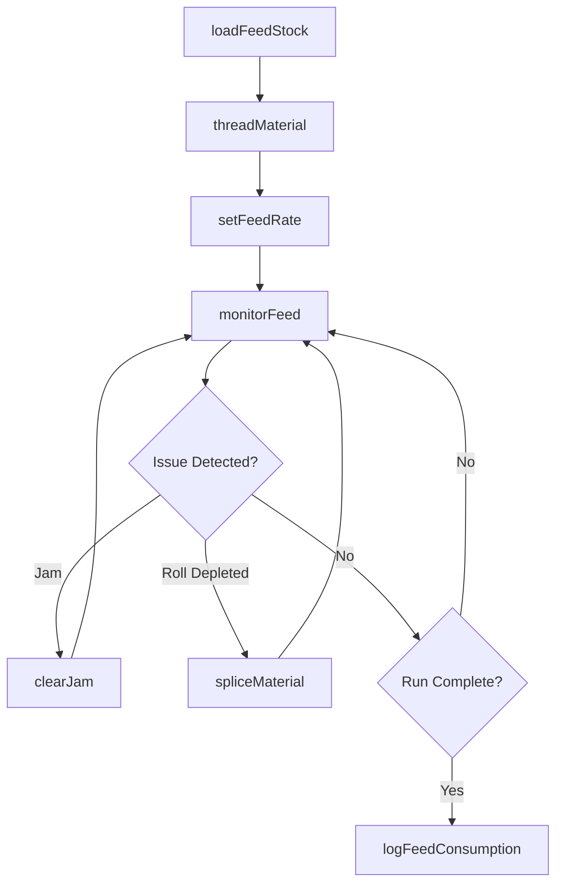
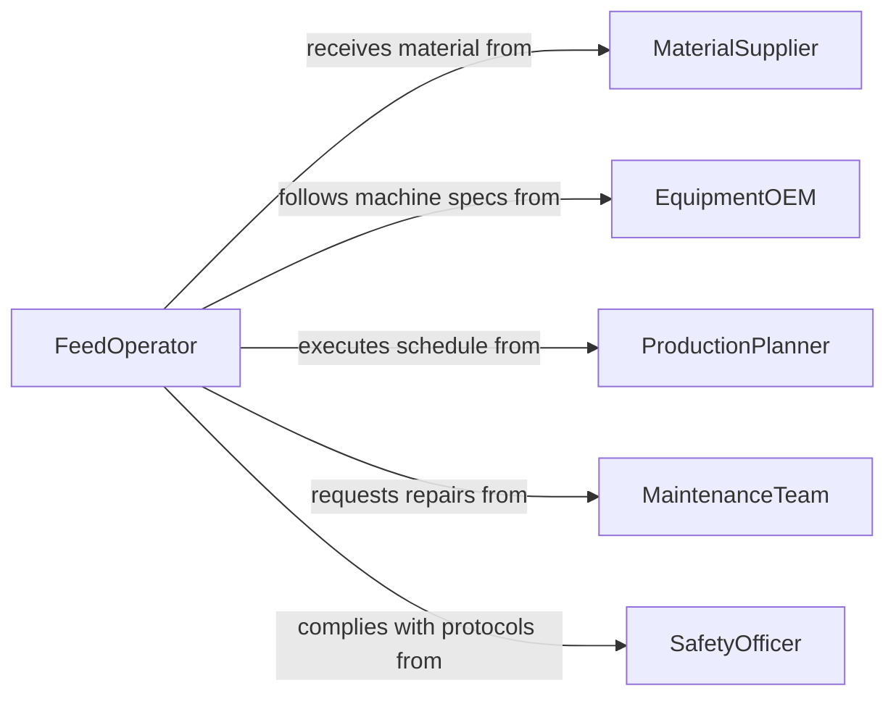

# Feed Materials Products Into Through

> Business-as-Code definition for feeding materials or products into or through equipment. Models the process of loading, guiding, and continuously supplying raw materials or work-in-progress items into processing, manufacturing, or packaging machines.

## Overview

Feeding materials or products into or through equipment involves loading stock into hoppers, guiding sheet or web materials through rollers, threading wire or filament into draw machines, and supplying parts to automated assembly lines. This activity ensures continuous machine operation by maintaining a steady flow of input material at the correct orientation, speed, and tension. It spans industries from printing and plastics extrusion to food processing and textile manufacturing, wherever machines require a consistent supply of material to produce output.

## Actors

| Actor | Description |
|-------|-------------|
| MaterialSupplier | Provides raw materials in rolls, coils, bags, or bulk containers |
| EquipmentOEM | Manufactures the processing machines and specifies feed requirements |
| ProductionPlanner | Schedules production runs and determines material feed quantities |
| MaintenanceTeam | Services feed mechanisms, rollers, and conveyor components |
| SafetyOfficer | Enforces lockout/tagout and guarding requirements on feed equipment |

## Roles

| Role | Description |
|------|-------------|
| FeedOperator | Loads and guides materials into equipment during production runs |
| MachineOperator | Operates the processing equipment and monitors feed consistency |
| MaterialHandler | Stages bulk materials and replenishes hoppers or roll stands |
| LineLeader | Coordinates material flow across multiple machines in a production line |

## Entities

| Entity | Description |
|--------|-------------|
| FeedStock | The material being supplied to the machine such as rolls, pellets, or blanks |
| Hopper | A container that holds bulk material and dispenses it into the machine |
| FeedMechanism | The mechanical system that draws material into the machine at controlled speed |
| FeedRate | The speed or volume at which material enters the equipment per unit of time |
| SplicePoint | The junction where one roll or coil of material is joined to the next |
| RunSheet | A production document specifying material type, feed settings, and run quantity |

## Actions

| Action | Description |
|--------|-------------|
| loadFeedStock | Place material into the hopper, roll stand, or entry point of the machine |
| setFeedRate | Configure the speed and volume of material flow into the equipment |
| threadMaterial | Guide the leading edge of web, wire, or filament through the machine path |
| monitorFeed | Observe the material flow for jams, misalignment, or inconsistency |
| spliceMaterial | Join the end of a depleted roll to a new one without stopping production |
| clearJam | Remove material blockages from the feed mechanism or machine path |
| logFeedConsumption | Record the quantity of material consumed during the production run |

## Events

| Event | Description |
|-------|-------------|
| feedStockLoaded | Material has been placed into the machine's input system |
| feedRateSet | The material flow speed has been configured for the production run |
| materialThreaded | The leading edge of the material has been guided through the machine path |
| feedMonitored | A feed consistency check has been completed without issues |
| materialSpliced | A new roll or coil has been joined to the running material without stoppage |
| jamCleared | A material blockage has been successfully removed from the feed path |
| feedConsumptionLogged | Material usage for the run has been recorded in the production system |

## Searches

| Search | Description |
|--------|-------------|
| findFeedStockInventory | List available feed materials by type, quantity, and storage location |
| getFeedRateHistory | Retrieve feed rate settings used for previous runs of the same product |
| getJamFrequency | View jam occurrence rates by machine, material type, or shift |
| findActiveRuns | List currently running production jobs with feed status and remaining material |

## Workflow



## Actor Relationships



## Usage

### Calling Actions

```typescript
import { feedMaterialsProductsIntoThrough } from '@headlessly/feed-materials-products-into-through'

const feeding = feedMaterialsProductsIntoThrough()

// Load a new roll of packaging film onto the wrapper
await feeding.loadFeedStock({
  machineId: 'WRAPPER-LINE-03',
  materialId: 'LDPE-FILM-CLEAR-500MM',
  rollWeight: 45, // kg
  rollStand: 'primary'
})

// Thread the film through the machine path
await feeding.threadMaterial({
  machineId: 'WRAPPER-LINE-03',
  path: ['unwind-roller', 'tension-bar', 'forming-collar', 'seal-jaw'],
  materialType: 'film-web'
})

// Set feed rate and begin monitoring
await feeding.setFeedRate({
  machineId: 'WRAPPER-LINE-03',
  rate: 120, // meters per minute
  tension: 18 // newtons
})
```

### Event-Driven Automation

```typescript
// Auto-splice when roll is nearly depleted
feeding.feedMonitored(async ({ machineId, remainingMaterial }) => {
  if (remainingMaterial.percentage < 10) {
    await notify({
      to: 'material-handler',
      message: `Roll on ${machineId} at ${remainingMaterial.percentage}% - prepare splice roll`
    })
  }
})

// Track jam frequency for maintenance scheduling
feeding.jamCleared(async ({ machineId, jamLocation, materialType }) => {
  const frequency = await feeding.getJamFrequency({ machineId, period: 'last-7-days' })
  if (frequency.count > 5) {
    await createMaintenanceRequest({
      machineId,
      issue: `Frequent jams at ${jamLocation}`,
      priority: 'high'
    })
  }
})
```
