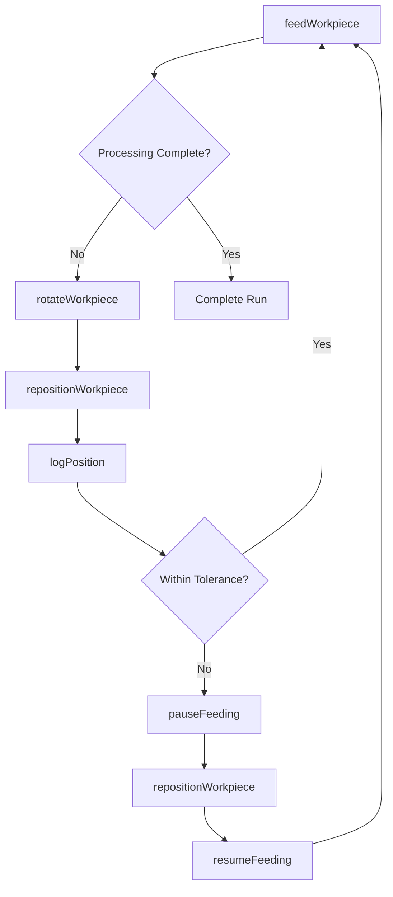
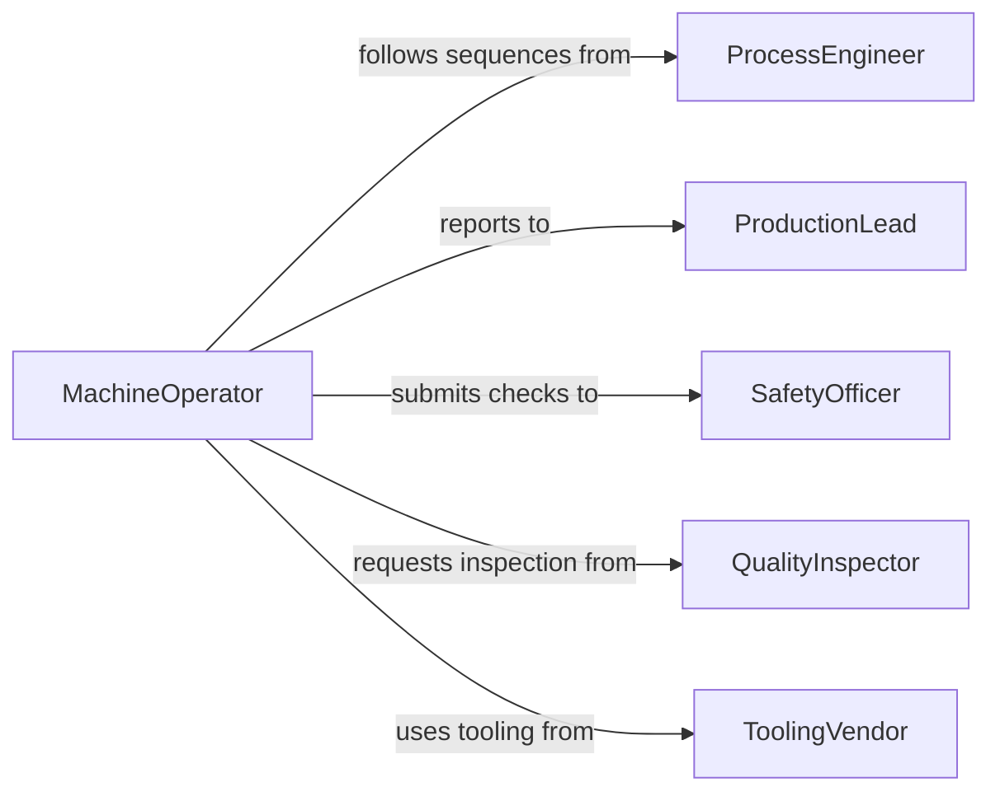

# Maneuver Workpieces Equipment During Production

> Business-as-Code definition for maneuvering workpieces in equipment during production. Models the process of guiding, repositioning, and feeding materials through machinery while operations are underway.

## Overview

Maneuvering workpieces in equipment during production involves physically guiding, rotating, feeding, and repositioning materials as they are processed by machine tools, presses, rollers, or forming equipment. This definition exposes actions for real-time workpiece manipulation, events for process monitoring, and searches for tracking production throughput and positioning accuracy.

## Actors

| Actor | Description |
|-------|-------------|
| EquipmentManufacturer | Provides machines and control systems for production |
| MaterialSupplier | Supplies raw stock and semi-finished components |
| SafetyRegulator | Enforces workplace safety standards for machine operation |
| QualityInspector | Monitors workpiece positioning accuracy during processing |
| ToolingVendor | Supplies guides, rollers, and feeding mechanisms |

## Roles

| Role | Description |
|------|-------------|
| MachineOperator | Guides and repositions workpieces during active production |
| ProductionLead | Coordinates work flow and assigns maneuvering tasks |
| SafetyOfficer | Ensures proper guarding and safe handling procedures |
| ProcessEngineer | Designs maneuvering sequences and feed rates for production |

## Entities

| Entity | Description |
|--------|-------------|
| Workpiece | The material being guided through production equipment |
| FeedSequence | A defined series of positioning moves during processing |
| PositionLog | Record of workpiece positions at each production stage |
| ProductionRun | A batch of workpieces processed through a machine |
| GuideConfiguration | Settings for rollers, guides, and feed mechanisms |
| SafetyCheck | Verification that guarding and clearances are maintained |

## Actions

| Action | Description |
|--------|-------------|
| feedWorkpiece | Advance the workpiece into or through the equipment |
| rotateWorkpiece | Turn the workpiece to expose a new surface for processing |
| repositionWorkpiece | Shift the workpiece to a new location within the machine |
| adjustFeedRate | Change the speed at which the workpiece moves through equipment |
| pauseFeeding | Temporarily halt workpiece advancement for inspection |
| resumeFeeding | Continue workpiece advancement after a pause |
| logPosition | Record the current workpiece position and orientation |

## Events

| Event | Description |
|-------|-------------|
| workpieceFed | Workpiece has been advanced to the next processing position |
| workpieceRotated | Workpiece has been turned to a new orientation |
| workpieceRepositioned | Workpiece has been shifted to a new location in the machine |
| feedRateAdjusted | Feed speed has been changed during production |
| feedingPaused | Workpiece advancement has been temporarily stopped |
| feedingResumed | Workpiece advancement has restarted after a pause |
| positionDeviation | Workpiece has drifted outside acceptable positioning tolerance |

## Searches

| Search | Description |
|--------|-------------|
| findPositionLogs | Retrieve position records by machine, run, or time range |
| getActiveFeeds | List workpieces currently being fed through equipment |
| getFeedSequences | Look up defined feed sequences for a product type |
| getDeviations | Find position deviation events for a production run |

## Workflow



## Actor Relationships



## Usage

### Calling Actions

```typescript
import { maneuverWorkpiecesEquipmentDuringProduction } from '@headlessly/maneuver-workpieces-equipment-during-production'

const maneuvering = maneuverWorkpiecesEquipmentDuringProduction()

// Feed a sheet metal blank through a roll forming machine
const position = await maneuvering.feedWorkpiece({
  workpieceId: 'SM-3392',
  machineId: 'ROLLFORM-07',
  feedRateMmPerSec: 25,
  targetPosition: { x: 0, y: 1200 }
})

// Rotate for the next forming pass
await maneuvering.rotateWorkpiece({
  workpieceId: 'SM-3392',
  angleDegrees: 90
})

// Log current position for traceability
await maneuvering.logPosition({
  workpieceId: 'SM-3392',
  machineId: 'ROLLFORM-07',
  position: position.current
})
```

### Event-Driven Automation

```typescript
// Alert operator when workpiece drifts out of tolerance
maneuvering.positionDeviation(async ({ workpieceId, machineId, deviation }) => {
  await maneuvering.pauseFeeding({ machineId })
  await notify({
    to: 'machine-operator',
    message: `Position deviation of ${deviation.mm}mm on ${workpieceId}`
  })
})

// Auto-log each feed advancement
maneuvering.workpieceFed(async ({ workpieceId, machineId, position }) => {
  await maneuvering.logPosition({ workpieceId, machineId, position })
})
```
