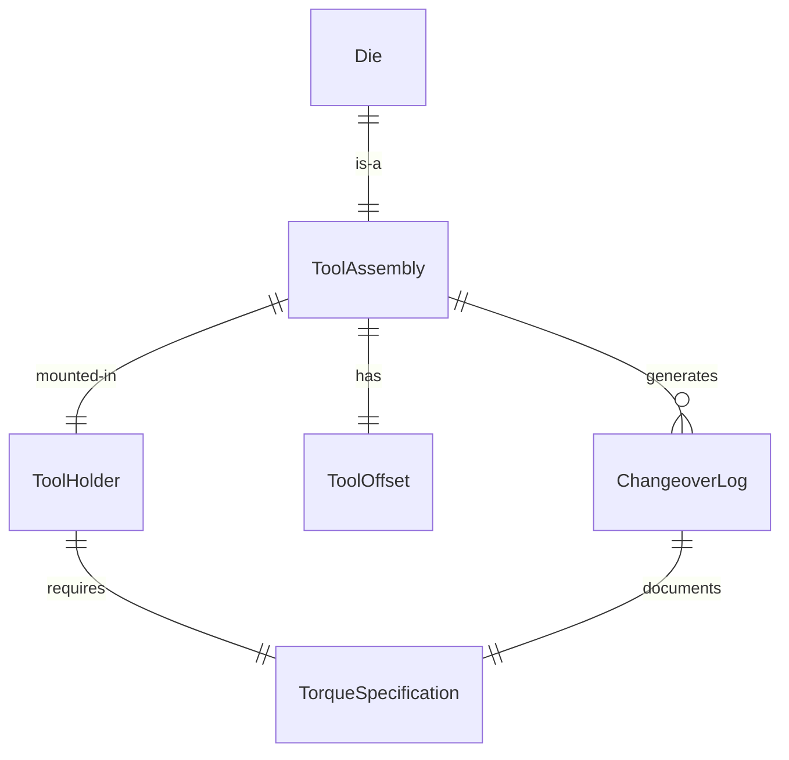
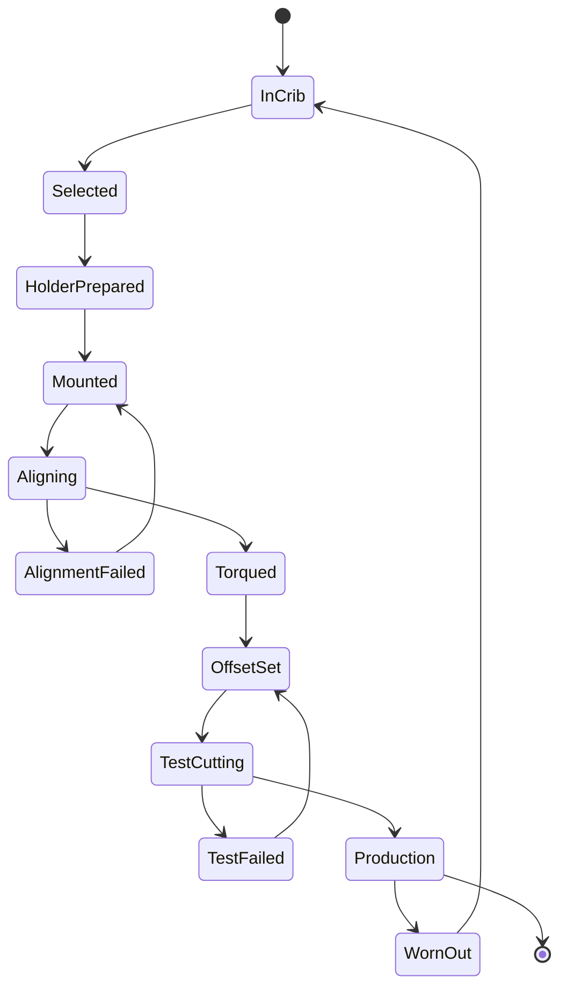
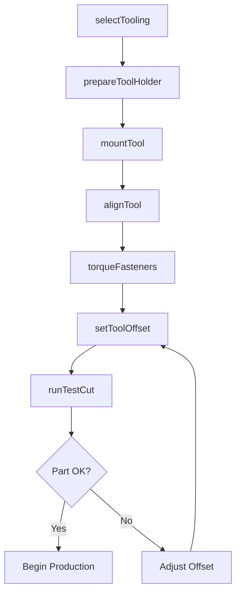
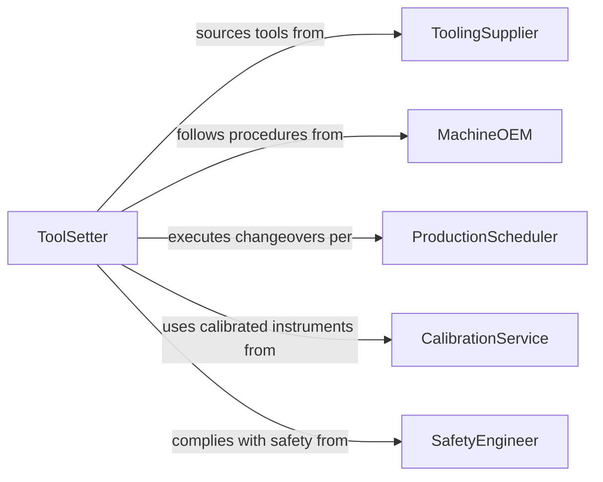

# Mount Attachments Tools Onto Production

> Business-as-Code definition for mounting attachments or tools onto production equipment. Models the process of selecting, installing, aligning, and securing tooling, dies, blades, fixtures, and accessories on manufacturing machines for production operations.

## Overview

Mounting attachments or tools onto production equipment involves selecting the correct tooling for the upcoming production run, physically installing it on the machine, aligning it to specifications, and securing it to withstand operating forces. This includes mounting cutting tools in CNC spindles, setting dies in stamping presses, installing molds in injection machines, and attaching specialized heads or fixtures to robotic arms. Proper tool mounting is essential for part quality, machine safety, and minimizing changeover downtime between production runs.

## Actors

| Actor | Description |
|-------|-------------|
| ToolingSupplier | Provides cutting tools, dies, molds, and replacement inserts |
| MachineOEM | Specifies tooling interfaces, torque values, and mounting procedures |
| ProductionScheduler | Determines the sequence of jobs requiring tool changes |
| CalibrationService | Certifies alignment instruments and measurement devices used during setup |
| SafetyEngineer | Establishes lockout/tagout and guarding requirements for tool mounting |

## Roles

| Role | Description |
|------|-------------|
| ToolSetter | Selects, installs, and aligns tools on production equipment |
| CNCProgrammer | Defines tool offsets and verifies tool data in the machine controller |
| MaintenanceTechnician | Repairs and conditions tool holders, spindles, and mounting hardware |
| ShiftSupervisor | Coordinates tool changes with production schedules and staffing |

## Entities

| Entity | Description |
|--------|-------------|
| ToolAssembly | A complete unit consisting of the cutting tool, holder, and any adapters |
| ToolHolder | The device that grips the tool and interfaces with the machine spindle or turret |
| Die | A precision-formed tool used in stamping or forming operations |
| ToolOffset | The dimensional data entered into the machine controller for tool position compensation |
| TorqueSpecification | The required tightening force for bolts, clamps, or drawbars securing the tool |
| ChangeoverLog | A record of tool mounting activities including time, operator, and settings |

## Actions

| Action | Description |
|--------|-------------|
| selectTooling | Choose the correct tool assembly or die for the upcoming production job |
| prepareToolHolder | Clean, inspect, and condition the holder before inserting the tool |
| mountTool | Install the tool assembly into the machine spindle, turret, or press ram |
| alignTool | Adjust the tool position using dial indicators or probes to meet alignment specs |
| torqueFasteners | Tighten mounting bolts and clamps to the specified torque values |
| setToolOffset | Enter dimensional offset data into the machine controller |
| runTestCut | Execute a trial operation to verify tool performance before full production |

## Events

| Event | Description |
|-------|-------------|
| toolingSelected | The correct tool or die has been identified and pulled from the tool crib |
| toolHolderPrepared | The holder has been cleaned, inspected, and confirmed ready for use |
| toolMounted | The tool assembly has been physically installed on the machine |
| toolAligned | The tool position has been verified within alignment tolerances |
| fastenersTorqued | All mounting hardware has been tightened to specification |
| toolOffsetSet | Dimensional offsets have been entered into the machine controller |
| testCutCompleted | A trial operation has been run and the result evaluated |

## Searches

| Search | Description |
|--------|-------------|
| findAvailableTooling | List tools in the crib by type, size, and condition for a specific job |
| getToolLifeStatus | Check remaining useful life of a tool based on cycle count or wear measurement |
| getChangeoverHistory | Retrieve past changeover logs by machine, operator, or job number |
| findToolOffsets | Look up offset data for previously used tool-machine combinations |

## Entity Relationships



## State Diagram



## Workflow



## Actor Relationships



## Usage

### Calling Actions

```typescript
import { mountAttachmentsToolsOntoProduction } from '@headlessly/mount-attachments-tools-onto-production'

const toolMount = mountAttachmentsToolsOntoProduction()

// Select tooling for a CNC turning job
const tool = await toolMount.selectTooling({
  jobId: 'JOB-2026-0488',
  machineId: 'LATHE-HAAS-ST20',
  toolType: 'carbide-insert-turning',
  insertGrade: 'CNMG-120408-PM'
})

// Mount and align the tool
await toolMount.prepareToolHolder({
  holderId: 'MCLNR-2525M12',
  cleanTaper: true,
  inspectInsertSeat: true
})

await toolMount.mountTool({
  machineId: 'LATHE-HAAS-ST20',
  turretPosition: 4,
  toolAssemblyId: tool.assemblyId
})

await toolMount.alignTool({
  machineId: 'LATHE-HAAS-ST20',
  turretPosition: 4,
  method: 'tool-probe',
  toleranceMm: 0.01
})

// Set offset and run test cut
await toolMount.setToolOffset({
  machineId: 'LATHE-HAAS-ST20',
  turretPosition: 4,
  xOffset: -142.350,
  zOffset: -65.220
})

const testResult = await toolMount.runTestCut({
  machineId: 'LATHE-HAAS-ST20',
  partProgram: 'O0488-SHAFT',
  measuredDiameter: 25.02 // mm
})
```

### Event-Driven Automation

```typescript
// Replace tools approaching end of life
toolMount.testCutCompleted(async ({ toolAssemblyId, cycleCount }) => {
  const life = await toolMount.getToolLifeStatus({ toolAssemblyId })
  if (life.remainingPercentage < 15) {
    await notify({
      to: 'tool-crib',
      message: `Tool ${toolAssemblyId} at ${life.remainingPercentage}% life - prepare replacement`
    })
  }
})

// Log changeover time for lean metrics
toolMount.toolMounted(async ({ machineId, operator, startTime }) => {
  const changeover = await toolMount.getChangeoverHistory({
    machineId,
    limit: 1
  })
  if (changeover[0]) {
    await updateMetrics({
      machineId,
      metric: 'changeover-time-minutes',
      value: (Date.now() - startTime) / 60000
    })
  }
})
```
