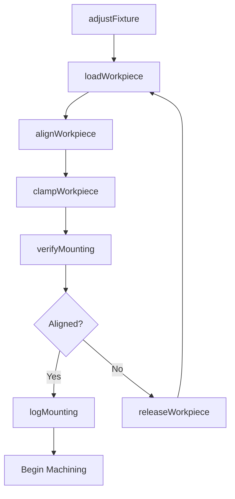
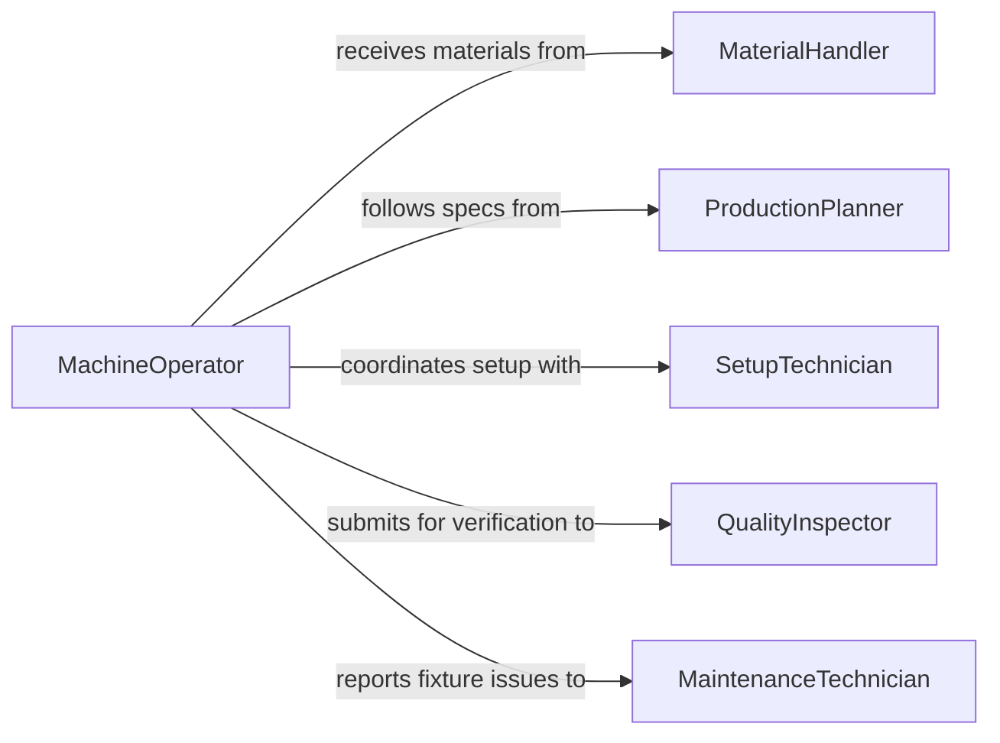

# Mount Materials Workpieces Onto Production

> Business-as-Code definition for mounting materials and workpieces onto production equipment. Models the process of securing raw materials, blanks, and components onto machines for manufacturing operations.

## Overview

Mounting materials or workpieces onto production equipment encompasses the tasks of loading, aligning, clamping, and securing raw stock or partially finished components onto machine tools, presses, jigs, and fixtures. This definition exposes actions for each phase of the mounting cycle, events for production automation, and searches for tracking material positioning across the shop floor.

## Actors

| Actor | Description |
|-------|-------------|
| MaterialSupplier | Provides raw stock, blanks, and semi-finished materials |
| EquipmentManufacturer | Supplies machine tools, fixtures, and mounting hardware |
| QualityInspector | Verifies proper mounting alignment and tolerances |
| MaintenanceTechnician | Services and calibrates mounting fixtures and clamps |
| ProductionPlanner | Schedules jobs and assigns workpieces to machines |

## Roles

| Role | Description |
|------|-------------|
| MachineOperator | Physically loads and secures workpieces onto equipment |
| SetupTechnician | Configures fixtures, jigs, and tooling for each production run |
| ShopFloorSupervisor | Oversees mounting operations and ensures safety compliance |
| MaterialHandler | Transports workpieces to staging areas near equipment |

## Entities

| Entity | Description |
|--------|-------------|
| Workpiece | A material blank or component to be mounted for processing |
| Fixture | A holding device that positions and secures the workpiece |
| MachineSetup | Configuration of a machine tool for a specific production job |
| MountingRecord | Documentation of how a workpiece was secured and aligned |
| WorkOrder | Production order specifying the workpiece and machine assignment |
| AlignmentSpec | Required positional tolerances for mounting the workpiece |

## Actions

| Action | Description |
|--------|-------------|
| loadWorkpiece | Place a workpiece onto the machine fixture or chuck |
| alignWorkpiece | Adjust workpiece position to meet alignment specifications |
| clampWorkpiece | Secure the workpiece using clamps, vises, or vacuum systems |
| verifyMounting | Check that the workpiece is properly seated and within tolerance |
| releaseWorkpiece | Unclamp and remove the workpiece after processing |
| logMounting | Record mounting parameters and setup details |
| adjustFixture | Modify fixture settings for a new workpiece configuration |

## Events

| Event | Description |
|-------|-------------|
| workpieceLoaded | A workpiece has been placed onto the machine fixture |
| workpieceAligned | Workpiece alignment has been verified within tolerance |
| workpieceClamped | Workpiece has been secured and is ready for processing |
| mountingVerified | Quality check confirms proper mounting before machining |
| workpieceReleased | Workpiece has been unclamped and removed from the fixture |
| mountingFailed | Workpiece could not be properly secured or aligned |
| fixtureAdjusted | Fixture has been reconfigured for a new workpiece type |

## Searches

| Search | Description |
|--------|-------------|
| findMountingRecords | List mounting records by machine, date, or work order |
| getMachineSetups | Retrieve active setups for a specific machine or fixture |
| getAlignmentSpecs | Look up alignment tolerances for a workpiece type |
| findPendingWorkpieces | List workpieces awaiting mounting at a station |

## Workflow



## Actor Relationships



## Usage

### Calling Actions

```typescript
import { mountMaterialsWorkpiecesOntoProduction } from '@headlessly/mount-materials-workpieces-onto-production'

const mounting = mountMaterialsWorkpiecesOntoProduction()

// Load a steel blank onto the CNC lathe
const record = await mounting.loadWorkpiece({
  workpieceId: 'WP-4821',
  machineId: 'CNC-LATHE-03',
  fixtureId: 'THREE-JAW-CHUCK-A',
  workOrderId: 'WO-2026-1147'
})

// Verify alignment before machining
await mounting.verifyMounting({
  mountingRecordId: record.id,
  toleranceMm: 0.05
})

// Release after processing
await mounting.releaseWorkpiece({
  mountingRecordId: record.id,
  reason: 'machining-complete'
})
```

### Event-Driven Automation

```typescript
// Alert supervisor when mounting fails
mounting.mountingFailed(async ({ workpieceId, machineId, reason }) => {
  await notify({
    to: 'shop-floor-supervisor',
    message: `Mounting failed for ${workpieceId} on ${machineId}: ${reason}`
  })
})

// Trigger machining cycle when mounting is verified
mounting.mountingVerified(async ({ mountingRecordId, machineId }) => {
  await startMachiningCycle({ machineId, mountingRecordId })
})
```
