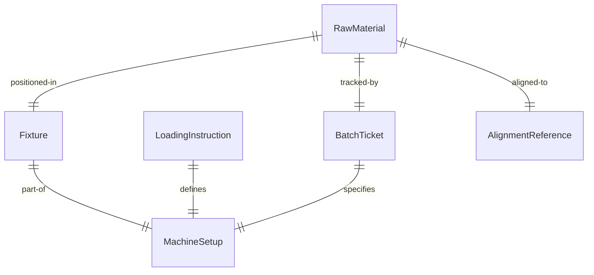
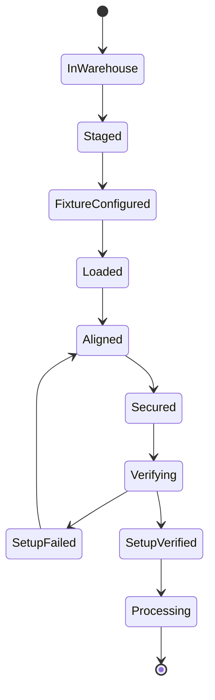
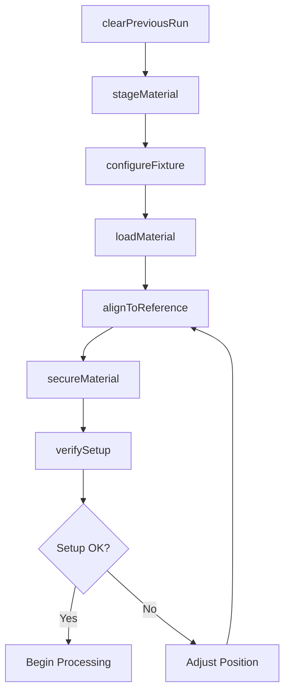
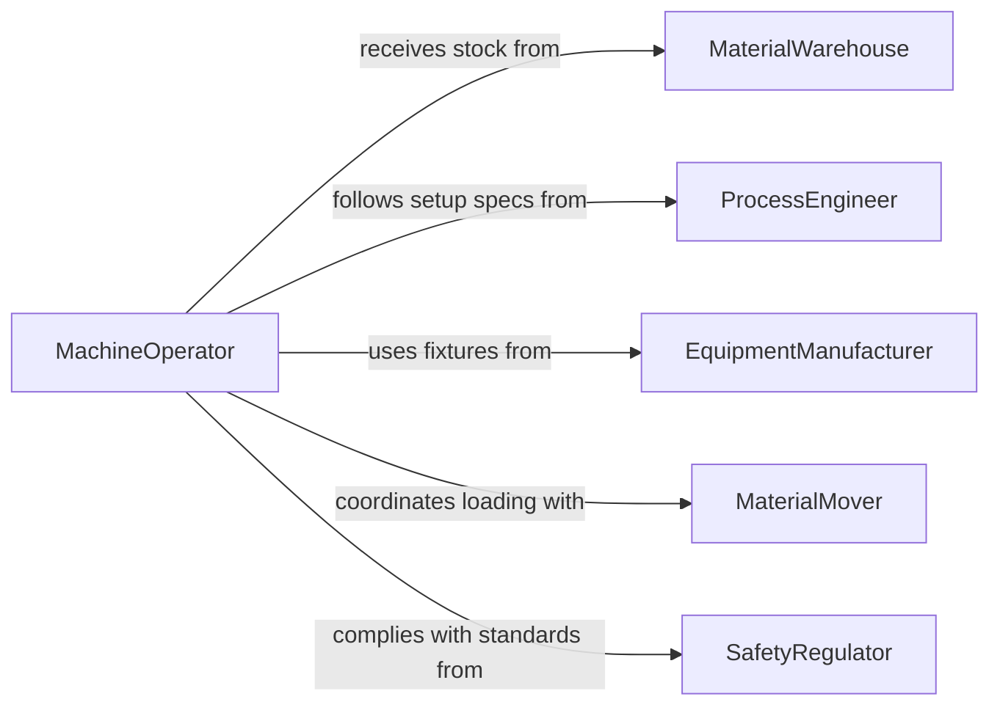

# Position Raw Materials Processing Production

> Business-as-Code definition for positioning raw materials on processing or production equipment. Models the process of loading, aligning, and securing raw stock onto machines and fixtures for manufacturing operations.

## Overview

Positioning raw materials on processing or production equipment involves transporting stock from staging areas, loading it onto machines such as lathes, presses, mills, or conveyors, aligning it to reference points or fixtures, and securing it so that processing operations can proceed safely and accurately. This activity is a precursor to nearly every manufacturing step and directly affects part quality, machine cycle time, and operator safety. It applies across metal fabrication, plastics processing, food production, and assembly line operations.

## Actors

| Actor | Description |
|-------|-------------|
| MaterialWarehouse | Stores and stages raw stock for production floor delivery |
| EquipmentManufacturer | Provides machines, fixtures, and setup instructions for material positioning |
| RawMaterialSupplier | Delivers incoming raw materials in standard packaging and quantities |
| ProcessEngineer | Defines setup procedures, fixture requirements, and alignment specifications |
| SafetyRegulator | Sets standards for safe loading practices and maximum lift weights |

## Roles

| Role | Description |
|------|-------------|
| MachineOperator | Loads and positions materials on production equipment |
| SetupTechnician | Configures fixtures, jigs, and clamps for specific material and part runs |
| MaterialMover | Transports raw stock from the warehouse to the machine staging area |
| ProductionLeader | Coordinates material flow and machine loading sequences across the line |

## Entities

| Entity | Description |
|--------|-------------|
| RawMaterial | The unprocessed stock to be loaded onto equipment such as bar, sheet, or coil |
| Fixture | A device that holds and locates material in a repeatable position on the machine |
| MachineSetup | The configuration of a machine including fixture, tooling, and alignment settings |
| LoadingInstruction | A documented procedure for safely positioning material on specific equipment |
| AlignmentReference | A datum point or edge used to position the material accurately |
| BatchTicket | A production document linking a batch of raw material to its processing job |

## Actions

| Action | Description |
|--------|-------------|
| stageMaterial | Move raw stock from storage to the machine staging area |
| configureFixture | Install and adjust the holding fixture for the material type and part run |
| loadMaterial | Place the raw stock onto the machine or into the fixture |
| alignToReference | Position the material against datum points for accurate processing |
| secureMaterial | Clamp, bolt, or otherwise fix the material so it cannot shift during operation |
| verifySetup | Confirm that material position, fixture, and machine settings are correct |
| clearPreviousRun | Remove remnants of the previous material batch before loading new stock |

## Events

| Event | Description |
|-------|-------------|
| materialStaged | Raw stock has been delivered to the machine staging area |
| fixtureConfigured | The holding fixture has been installed and adjusted for the current run |
| materialLoaded | Raw material has been placed on the machine or in the fixture |
| materialAligned | The stock has been positioned against the alignment reference points |
| materialSecured | The material is clamped and stable for the processing operation |
| setupVerified | The complete setup has been confirmed correct before machine start |
| previousRunCleared | Remnants from the prior batch have been removed from the work area |

## Searches

| Search | Description |
|--------|-------------|
| findMaterialsAwaitingLoad | List raw materials staged and waiting for machine loading |
| getFixtureAssignments | Retrieve fixture-to-machine assignments for current production jobs |
| getSetupHistory | View past setup configurations by machine, part, or operator |
| findBatchTickets | Locate batch tickets by material type, job number, or production date |

## Entity Relationships



## State Diagram



## Workflow



## Actor Relationships



## Usage

### Calling Actions

```typescript
import { positionRawMaterialsProcessingProduction } from '@headlessly/position-raw-materials-processing-production'

const positioning = positionRawMaterialsProcessingProduction()

// Stage material for a CNC milling job
await positioning.stageMaterial({
  materialId: 'AL-6061-BAR-LOT-55',
  machineId: 'CNC-MILL-07',
  batchTicket: 'BT-2026-0412'
})

// Configure the fixture and load the material
await positioning.configureFixture({
  machineId: 'CNC-MILL-07',
  fixtureId: 'VISE-6IN-KURT',
  jawPressure: 2500, // psi
  stopPosition: 38.1 // mm from jaw face
})

await positioning.loadMaterial({
  materialId: 'AL-6061-BAR-LOT-55',
  machineId: 'CNC-MILL-07',
  orientation: 'long-axis-X'
})

// Verify the complete setup before starting the machine
const verification = await positioning.verifySetup({
  machineId: 'CNC-MILL-07',
  checkAlignment: true,
  checkClampForce: true
})
```

### Event-Driven Automation

```typescript
// Trigger machine start when setup is verified
positioning.setupVerified(async ({ machineId, batchTicket, verified }) => {
  if (verified) {
    await startMachineProgram({
      machineId,
      programId: batchTicket.programRef
    })
  }
})

// Alert when material is not staged on time
positioning.materialStaged(async ({ machineId, scheduledTime, actualTime }) => {
  const delayMinutes = (actualTime - scheduledTime) / 60000
  if (delayMinutes > 15) {
    await notify({
      to: 'production-leader',
      message: `Material staging for ${machineId} delayed by ${Math.round(delayMinutes)} minutes`
    })
  }
})
```
