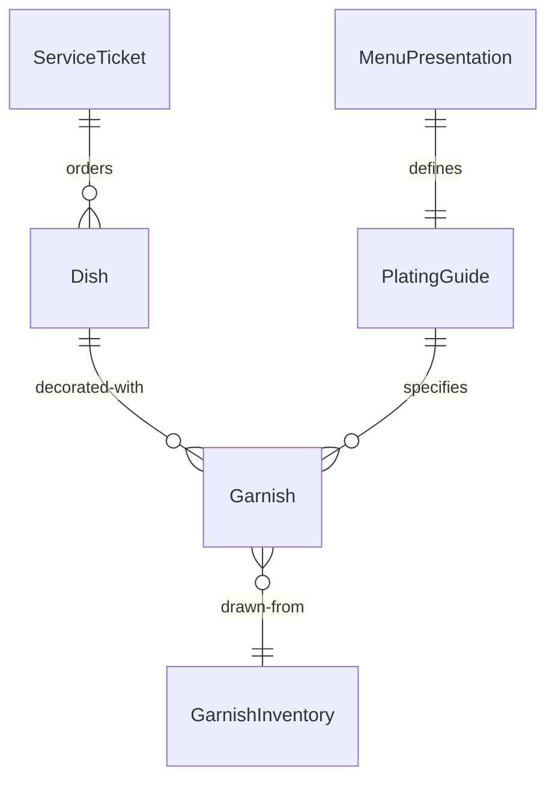
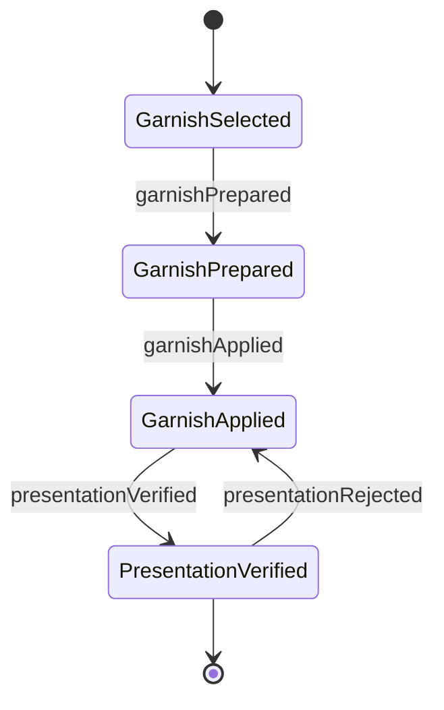
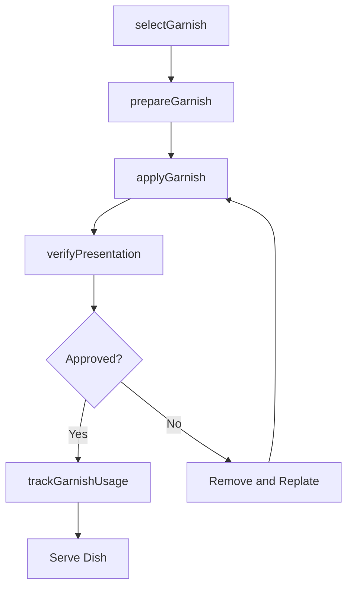
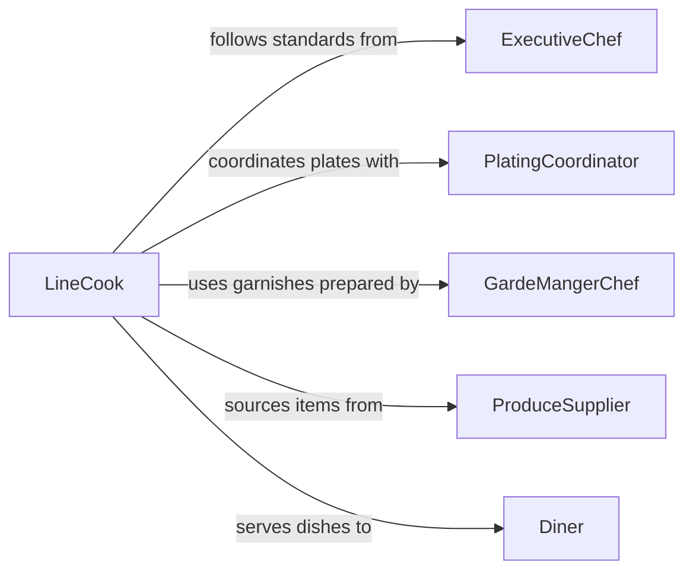

# Add Garnishes Food

> Business-as-Code definition for adding garnishes to food. Models the process of selecting, preparing, and applying decorative and flavor-enhancing elements to plated dishes.

## Overview

Adding garnishes to food involves selecting appropriate herbs, sauces, edible flowers, microgreens, and other decorative or flavor-enhancing elements, then placing them on plated dishes according to presentation standards. This definition exposes actions for garnish selection, preparation, and application, events for plating workflow automation, and searches for garnish inventory and menu requirements.

## Actors

| Actor | Description |
|-------|-------------|
| ProduceSupplier | Provides fresh herbs, microgreens, and edible flowers |
| SpecialtyVendor | Supplies specialty garnish items such as truffle shavings and gold leaf |
| Diner | Receives the finished plated dish with garnishes |
| FoodPhotographer | Documents plated presentations for menus and marketing |
| HealthInspector | Ensures garnish handling meets food safety regulations |

## Roles

| Role | Description |
|------|-------------|
| GardeMangerChef | Prepares cold garnishes, decorative elements, and composed plates |
| ExecutiveChef | Sets plating standards and approves garnish selections for the menu |
| LineCook | Applies garnishes to dishes during service |
| PlatingCoordinator | Ensures consistency of garnish placement across all plates in an order |

## Entities

| Entity | Description |
|--------|-------------|
| Garnish | A decorative or flavor element applied to a finished dish |
| PlatingGuide | Visual and written standards for how a dish should be garnished |
| Dish | A prepared food item ready for garnishing |
| GarnishInventory | Stock levels of available garnish ingredients |
| MenuPresentation | The defined garnish requirements for a specific menu item |
| ServiceTicket | An order ticket specifying dishes and their garnish requirements |

## Actions

| Action | Description |
|--------|-------------|
| selectGarnish | Choose the appropriate garnish for a specific dish |
| prepareGarnish | Wash, trim, or shape garnish elements for application |
| applyGarnish | Place the garnish on a plated dish according to the plating guide |
| verifyPresentation | Check that the finished plate meets visual and quality standards |
| updatePlatingGuide | Modify garnish specifications for a menu item |
| trackGarnishUsage | Record garnish consumption for inventory management |

## Events

| Event | Description |
|-------|-------------|
| garnishSelected | A garnish type has been chosen for a dish |
| garnishPrepared | Garnish elements have been trimmed and readied for service |
| garnishApplied | Garnish has been placed on a plated dish |
| presentationVerified | Plate presentation has been approved for service |
| presentationRejected | Plate presentation did not meet plating standards |
| garnishStockLow | Inventory of a garnish item has fallen below threshold |

## Searches

| Search | Description |
|--------|-------------|
| findPlatingGuides | List plating guides by menu item, cuisine, or season |
| getGarnishInventory | Check stock levels for garnish ingredients |
| getMenuPresentations | Retrieve garnish requirements for active menu items |
| findServiceTickets | List tickets with pending garnish application |


## Entity Relationships



## State Diagram



## Workflow



## Actor Relationships



## Usage

### Calling Actions

```typescript
import { addGarnishesFood } from '@headlessly/add-garnishes-food'

const garnishing = addGarnishesFood()

// Select garnish for a pan-seared salmon plate
const garnish = await garnishing.selectGarnish({
  dishId: 'pan-seared-salmon',
  menuItemId: 'dinner-salmon-entree',
  serviceTicketId: 'TKT-8842'
})

// Apply the garnish to the plated dish
await garnishing.applyGarnish({
  dishId: 'pan-seared-salmon',
  garnishId: garnish.id,
  placement: 'top-center',
  elements: ['dill-sprig', 'lemon-zest', 'microgreen-cluster']
})

// Verify the presentation
await garnishing.verifyPresentation({
  dishId: 'pan-seared-salmon',
  serviceTicketId: 'TKT-8842'
})
```

### Event-Driven Automation

```typescript
// Reorder garnish when stock runs low
garnishing.garnishStockLow(async ({ garnishItem, currentLevel, threshold }) => {
  await createPurchaseOrder({
    item: garnishItem,
    quantity: threshold * 3,
    vendor: 'produce-supplier'
  })
})

// Notify chef when a plate is rejected
garnishing.presentationRejected(async ({ dishId, serviceTicketId, reason }) => {
  await notify({
    to: 'executive-chef',
    message: `Plate ${dishId} on ticket ${serviceTicketId} rejected: ${reason}`
  })
})
```
