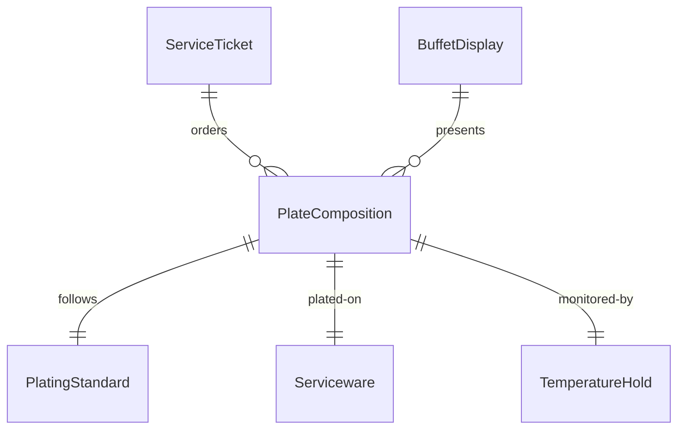
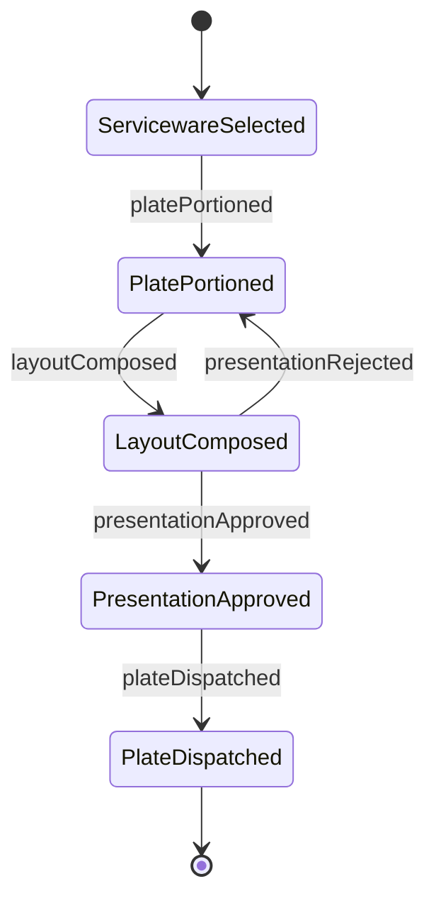
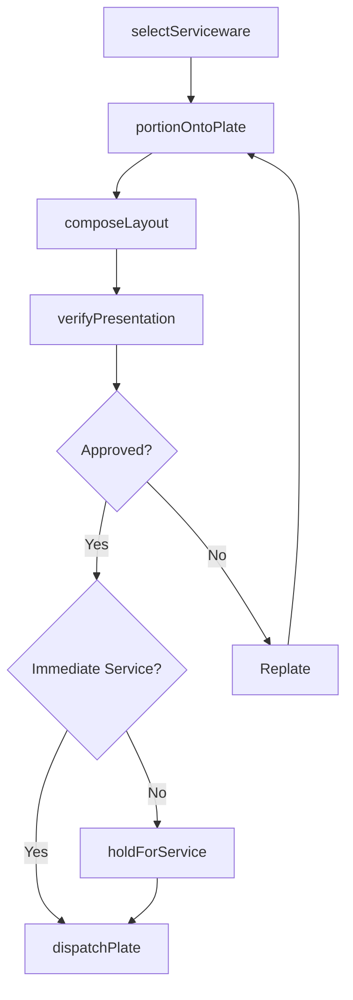
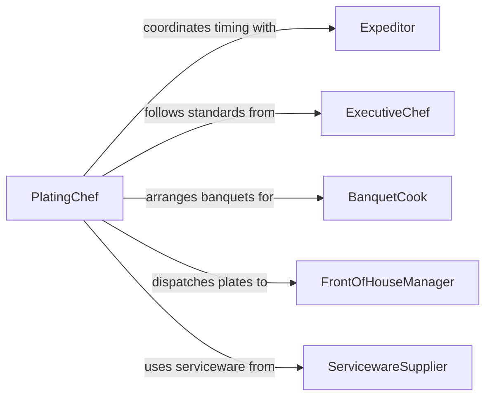

# Arrange Food Serving

> Business-as-Code definition for arranging food for serving. Models the plating, portioning, and visual presentation of prepared dishes onto serviceware for dine-in, buffet, catering, or takeout service.

## Overview

Arranging food for serving encompasses the final presentation tasks of placing cooked and prepared components onto plates, platters, trays, or containers in an organized, visually appealing manner. This includes portioning onto serviceware, composing plate layouts, managing buffet and banquet displays, and ensuring temperature-appropriate staging. This definition exposes actions for plating and arrangement, events for service coordination, and searches for presentation standards and order tracking.

## Actors

| Actor | Description |
|-------|-------------|
| ServicewareSupplier | Provides plates, platters, bowls, and serving vessels |
| CateringClient | Commissions food arrangement for events and functions |
| Diner | Receives the arranged plate or serving at the table |
| FoodPhotographer | Documents plated presentations for marketing and menus |
| EventCoordinator | Specifies layout and timing for buffet and banquet arrangements |

## Roles

| Role | Description |
|------|-------------|
| PlatingChef | Arranges food components on plates according to presentation standards |
| Expeditor | Coordinates timing and quality of plates leaving the kitchen |
| BanquetCook | Arranges large-volume platters and buffet displays |
| FrontOfHouseManager | Ensures plated food reaches diners promptly and at proper temperature |

## Entities

| Entity | Description |
|--------|-------------|
| PlateComposition | A defined layout of food components on a specific plate type |
| ServiceTicket | An order specifying dishes to plate and any modifications |
| PlatingStandard | Visual and portioning guidelines for a menu item |
| BuffetDisplay | An arrangement of dishes on a buffet or station |
| Serviceware | Plates, platters, bowls, and containers used for presentation |
| TemperatureHold | A record of how long plated food has been held before service |

## Actions

| Action | Description |
|--------|-------------|
| selectServiceware | Choose the appropriate plate or vessel for a dish |
| portionOntoPlate | Place measured quantities of each component onto the serviceware |
| composeLayout | Arrange components on the plate according to the plating standard |
| arrangBuffet | Set up dishes, labels, and serving utensils on a buffet station |
| verifyPresentation | Check that the arranged plate meets visual and quality standards |
| holdForService | Stage a plated dish at temperature until the table is ready |
| dispatchPlate | Release the plate to the server for delivery to the diner |

## Events

| Event | Description |
|-------|-------------|
| servicewareSelected | The appropriate plate or vessel has been chosen for a dish |
| platePortioned | Food components have been placed on the serviceware |
| layoutComposed | The plate arrangement has been completed per standard |
| buffetArranged | A buffet station has been fully set up and is ready for guests |
| presentationApproved | An expeditor has verified the plate meets quality standards |
| presentationRejected | A plate did not meet standards and must be replated |
| plateDispatched | A plate has been released to the server for delivery |

## Searches

| Search | Description |
|--------|-------------|
| findPlatingStandards | Look up presentation guidelines by menu item or cuisine |
| getServiceTickets | Retrieve pending tickets awaiting plating |
| getBuffetDisplays | List active buffet setups by event or station |
| findDispatchedPlates | Track plates that have been sent to the dining room |


## Entity Relationships



## State Diagram



## Workflow



## Actor Relationships



## Usage

### Calling Actions

```typescript
import { arrangeFoodServing } from '@headlessly/arrange-food-serving'

const arranging = arrangeFoodServing()

// Compose a dinner plate for pan-seared halibut
await arranging.composeLayout({
  serviceTicketId: 'TKT-5502',
  menuItem: 'pan-seared-halibut',
  servicewareType: 'wide-rim-white-10in',
  components: [
    { item: 'halibut-fillet', position: 'center', portionG: 180 },
    { item: 'saffron-risotto', position: 'six-oclock', portionG: 150 },
    { item: 'broccolini', position: 'ten-oclock', portionG: 80 },
    { item: 'beurre-blanc', position: 'drizzle-around', portionMl: 30 }
  ]
})

// Set up a wedding buffet station
await arranging.arrangBuffet({
  eventId: 'EVT-2026-0215',
  stationName: 'carving-station',
  dishes: ['prime-rib-au-jus', 'herb-crusted-turkey', 'horseradish-cream'],
  servingUtensils: ['carving-knife', 'fork', 'ladle'],
  temperatureHold: 'chafing-dish'
})

// Verify and dispatch
await arranging.verifyPresentation({
  serviceTicketId: 'TKT-5502'
})
```

### Event-Driven Automation

```typescript
// Notify server when plate is ready for pickup
arranging.plateDispatched(async ({ serviceTicketId, tableNumber }) => {
  await notify({
    to: `server-table-${tableNumber}`,
    message: `Plate for ticket ${serviceTicketId} is in the window`
  })
})

// Alert expeditor when plates are held too long
arranging.presentationApproved(async ({ serviceTicketId, timestamp }) => {
  setTimeout(async () => {
    const status = await arranging.findDispatchedPlates({ serviceTicketId })
    if (!status.dispatched) {
      await notify({
        to: 'expeditor',
        message: `Ticket ${serviceTicketId} plated but not yet dispatched`
      })
    }
  }, 120000)
})
```
