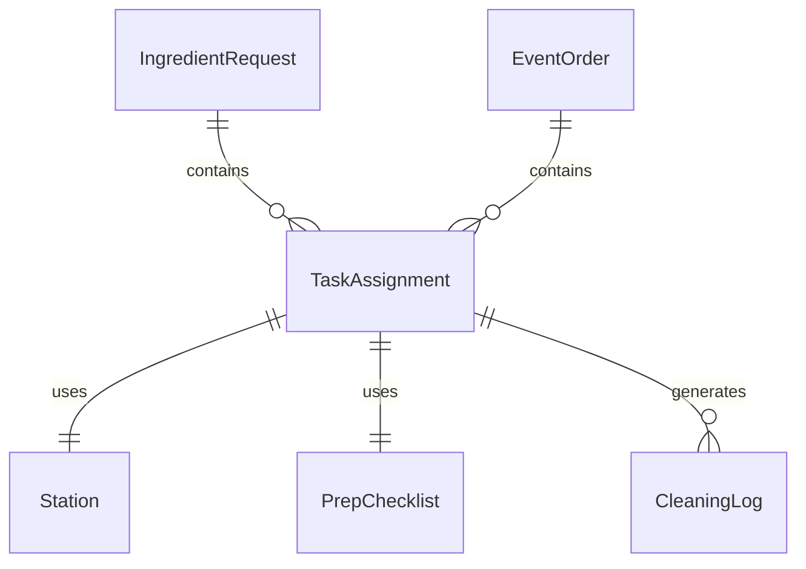
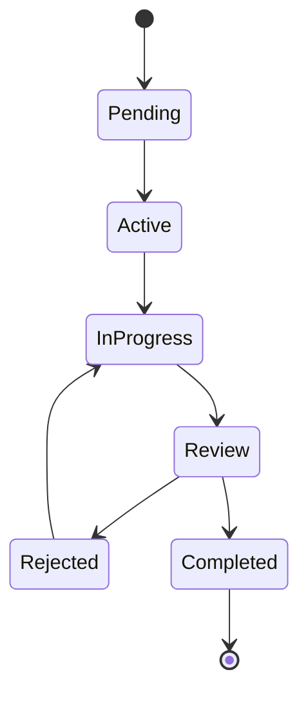
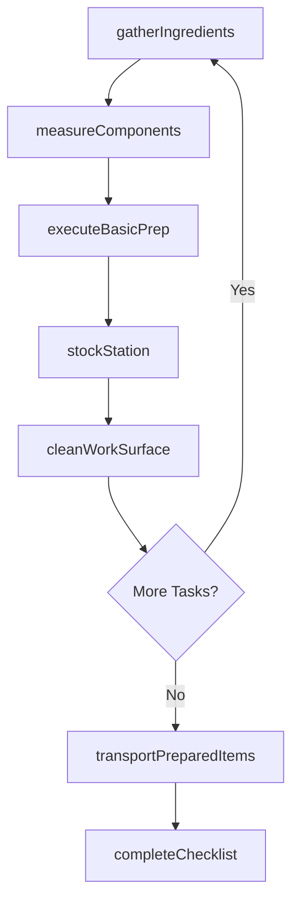
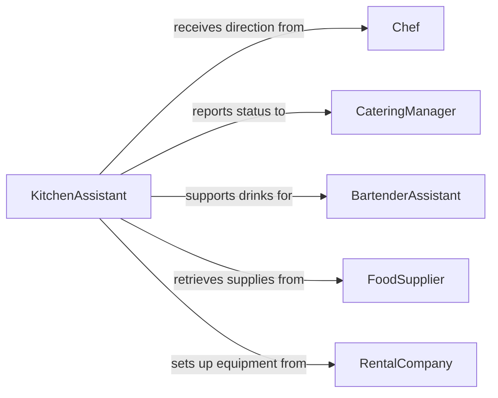

# Assist Chefs Caterers Food Drink

> Business-as-Code definition for assisting chefs or caterers with food and drink preparation. Models the support tasks that kitchen assistants and catering helpers perform to keep food production running smoothly.

## Overview

Assisting chefs and caterers with food and drink preparation involves performing support tasks such as gathering ingredients, measuring components, maintaining clean work surfaces, stocking stations, and executing basic preparation steps under direction. This definition exposes actions for each support task, events for coordination between assistants and lead cooks, and searches for tracking task assignments and station readiness.

## Actors

| Actor | Description |
|-------|-------------|
| FoodSupplier | Delivers ingredients and supplies to the kitchen or event venue |
| CateringClient | Commissions food and beverage services for events |
| EventCoordinator | Manages venue logistics and timing for catered functions |
| HealthInspector | Enforces sanitation and food safety requirements |
| RentalCompany | Provides serving equipment, chafing dishes, and tableware |

## Roles

| Role | Description |
|------|-------------|
| KitchenAssistant | Performs support tasks under the direction of chefs |
| Chef | Directs food preparation and delegates tasks to assistants |
| CateringManager | Plans and oversees catering operations and staffing |
| BartenderAssistant | Supports drink preparation by stocking and prepping garnishes |

## Entities

| Entity | Description |
|--------|-------------|
| TaskAssignment | A specific support task assigned to an assistant |
| Station | A designated work area within the kitchen or event setup |
| IngredientRequest | A request from a chef for specific ingredients or quantities |
| PrepChecklist | A list of support tasks to complete before service |
| EventOrder | A catering order specifying menu items and quantities |
| CleaningLog | A record of sanitization and cleaning activities |

## Actions

| Action | Description |
|--------|-------------|
| gatherIngredients | Collect and deliver requested ingredients to the chef station |
| measureComponents | Weigh and measure ingredients per recipe specifications |
| stockStation | Replenish supplies, utensils, and ingredients at a work station |
| cleanWorkSurface | Sanitize counters, cutting boards, and equipment between tasks |
| executeBasicPrep | Perform simple preparation steps such as washing or peeling |
| transportPreparedItems | Move prepared food or drink components to service areas |
| completeChecklist | Mark all assigned support tasks as finished |

## Events

| Event | Description |
|-------|-------------|
| ingredientsGathered | Requested ingredients have been delivered to the station |
| componentsMeasured | Ingredients have been weighed and portioned as directed |
| stationStocked | A work station has been fully replenished and ready |
| workSurfaceCleaned | A work area has been sanitized and is cleared for use |
| basicPrepCompleted | A simple preparation task has been finished |
| itemsTransported | Prepared items have been moved to the service or staging area |
| checklistCompleted | All assigned support tasks for a service period are done |

## Searches

| Search | Description |
|--------|-------------|
| findTaskAssignments | List tasks assigned to an assistant by station or time |
| getStationStatus | Check readiness and supply levels for a specific station |
| getPrepChecklists | Retrieve checklists by event, date, or completion status |
| findIngredientRequests | List pending ingredient requests from chefs |


## Entity Relationships



## State Diagram



## Workflow



## Actor Relationships



## Usage

### Calling Actions

```typescript
import { assistChefsCaterersFoodDrink } from '@headlessly/assist-chefs-caterers-food-drink'

const assist = assistChefsCaterersFoodDrink()

// Gather ingredients for the chef
await assist.gatherIngredients({
  requestId: 'REQ-1147',
  stationId: 'saute-station',
  items: [
    { ingredient: 'shallots', quantityKg: 1.0 },
    { ingredient: 'white-wine', quantityMl: 750 },
    { ingredient: 'heavy-cream', quantityMl: 500 }
  ]
})

// Stock the catering buffet station
await assist.stockStation({
  stationId: 'buffet-hot-line',
  eventOrderId: 'EO-2026-0305',
  items: ['chafing-fuel', 'serving-spoons', 'plate-stack']
})

// Complete the pre-service checklist
await assist.completeChecklist({
  checklistId: 'PRE-SERVICE-0305',
  assistantId: 'KA-042'
})
```

### Event-Driven Automation

```typescript
// Notify chef when ingredients are ready at station
assist.ingredientsGathered(async ({ stationId, requestId }) => {
  await notify({
    to: 'chef-station',
    message: `Ingredients for request ${requestId} ready at ${stationId}`
  })
})

// Alert catering manager when all prep is done
assist.checklistCompleted(async ({ checklistId, eventOrderId }) => {
  await notify({
    to: 'catering-manager',
    message: `Pre-service checklist complete for event ${eventOrderId}`
  })
})
```
