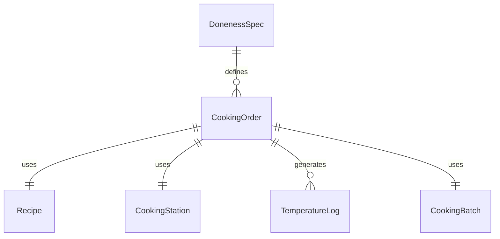
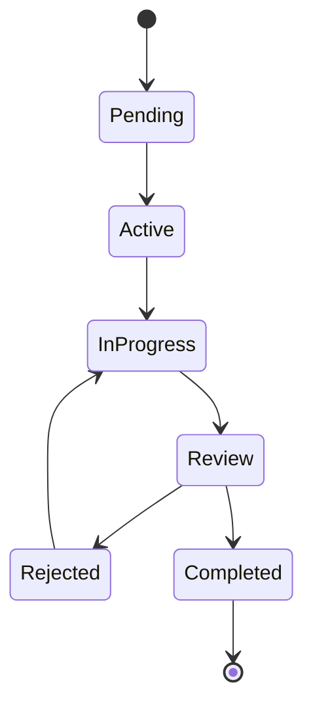
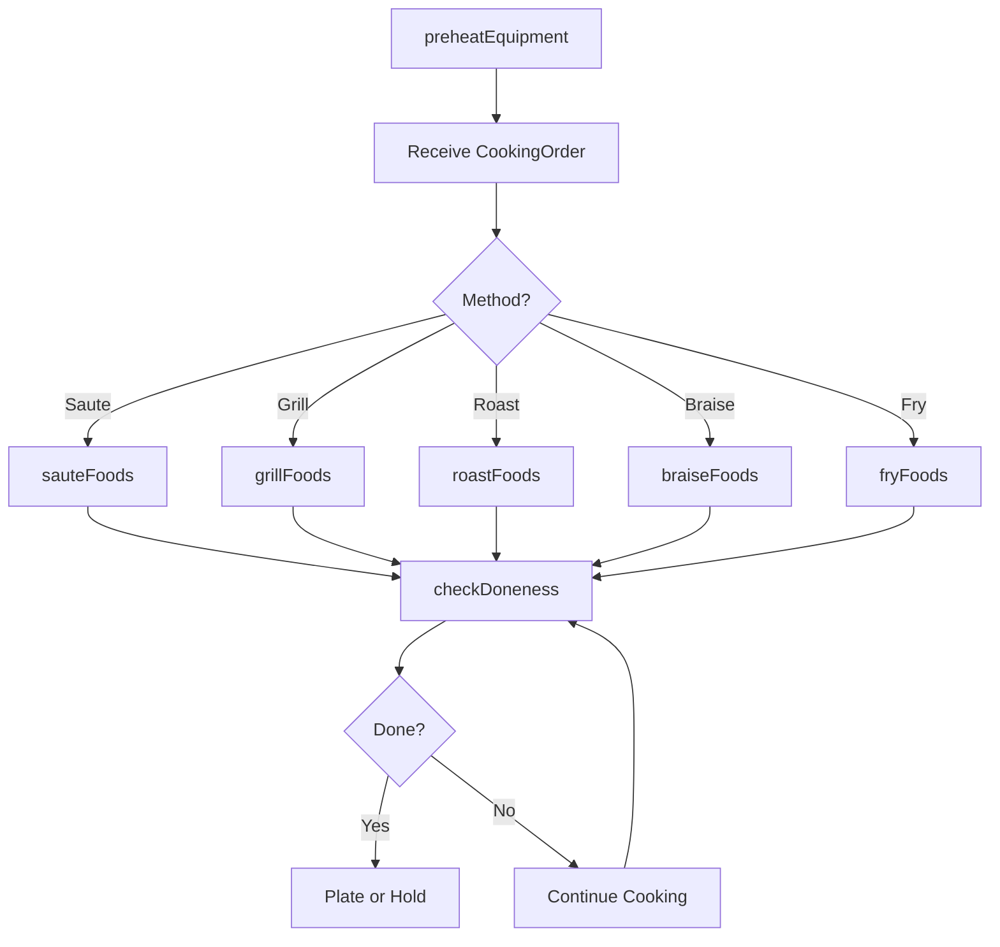
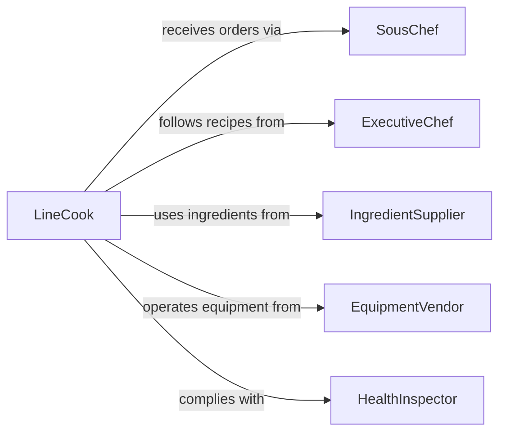

# Cook Foods

> Business-as-Code definition for cooking foods. Models the application of heat to transform raw or prepared ingredients into finished dishes using techniques such as grilling, sauteing, roasting, frying, and braising.

## Overview

Cooking foods involves applying heat through various methods to transform prepared ingredients into ready-to-serve dishes. This includes dry-heat methods such as grilling, roasting, and sauteing, moist-heat methods such as boiling, steaming, and braising, and combination methods such as frying and stewing. This definition exposes actions for each cooking technique, events for monitoring doneness and quality, and searches for recipe parameters and cooking records.

## Actors

| Actor | Description |
|-------|-------------|
| IngredientSupplier | Provides raw ingredients, oils, stocks, and cooking fats |
| EquipmentVendor | Supplies ovens, ranges, grills, fryers, and cooking vessels |
| Diner | Consumes the cooked dishes |
| HealthInspector | Monitors cooking temperatures and food safety practices |
| UtilityProvider | Supplies gas, electricity, or other energy for cooking equipment |

## Roles

| Role | Description |
|------|-------------|
| LineCook | Executes cooking tasks at an assigned station during service |
| SousChef | Coordinates cooking across stations and ensures timing |
| ExecutiveChef | Defines cooking methods, temperatures, and quality standards |
| GrillCook | Specializes in grilling, broiling, and open-flame cooking |

## Entities

| Entity | Description |
|--------|-------------|
| CookingOrder | A ticket specifying items to cook, methods, and doneness levels |
| Recipe | Cooking instructions including method, temperature, and timing |
| CookingStation | A designated area with specific equipment for a cooking method |
| TemperatureLog | A record of internal temperatures taken during cooking |
| CookingBatch | A group of items cooked together in a single vessel or cycle |
| DonenessSpec | Target internal temperature or visual cue for a cooked item |

## Actions

| Action | Description |
|--------|-------------|
| preheatEquipment | Bring ovens, grills, or fryers to the required temperature |
| sauteFoods | Cook ingredients quickly in a pan with fat over high heat |
| grillFoods | Cook items on a grill or griddle using direct radiant heat |
| roastFoods | Cook items in an oven using dry, circulating heat |
| braiseFoods | Brown items then cook slowly in liquid at low temperature |
| fryFoods | Cook items by submerging in hot oil or fat |
| checkDoneness | Verify internal temperature or visual indicators of completion |

## Events

| Event | Description |
|-------|-------------|
| equipmentPreheated | Cooking equipment has reached the target temperature |
| foodSauteed | An item has been sauteed to completion |
| foodGrilled | An item has been grilled to the specified doneness |
| foodRoasted | An item has finished roasting in the oven |
| foodBraised | An item has completed the braising process |
| foodFried | An item has been fried and removed from the oil |
| donenessConfirmed | Internal temperature or doneness has been verified |

## Searches

| Search | Description |
|--------|-------------|
| findRecipes | List recipes by cooking method, cuisine, or protein type |
| getCookingOrders | Retrieve active cooking orders by station or ticket |
| getTemperatureLogs | Look up temperature records by item, batch, or station |
| findCookingBatches | List batches by method, time, or completion status |


## Entity Relationships



## State Diagram



## Workflow



## Actor Relationships



## Usage

### Calling Actions

```typescript
import { cookFoods } from '@headlessly/cook-foods'

const cooking = cookFoods()

// Preheat the grill station
await cooking.preheatEquipment({
  stationId: 'grill-station-1',
  targetTemperatureC: 260,
  method: 'grill'
})

// Grill a ribeye steak to medium-rare
await cooking.grillFoods({
  cookingOrderId: 'TKT-7723',
  item: 'ribeye-steak',
  weightG: 340,
  doneness: 'medium-rare',
  targetInternalTempC: 57
})

// Verify doneness
const check = await cooking.checkDoneness({
  cookingOrderId: 'TKT-7723',
  item: 'ribeye-steak',
  method: 'probe-thermometer'
})
```

### Event-Driven Automation

```typescript
// Notify expeditor when item is done
cooking.donenessConfirmed(async ({ cookingOrderId, item, doneness }) => {
  await notify({
    to: 'expeditor',
    message: `${item} on ticket ${cookingOrderId} cooked to ${doneness}, ready to plate`
  })
})

// Alert when equipment fails to preheat
cooking.equipmentPreheated(async ({ stationId, actualTemperatureC, targetTemperatureC }) => {
  if (Math.abs(actualTemperatureC - targetTemperatureC) > 10) {
    await notify({
      to: 'sous-chef',
      message: `Station ${stationId} at ${actualTemperatureC}C, target was ${targetTemperatureC}C`
    })
  }
})
```
