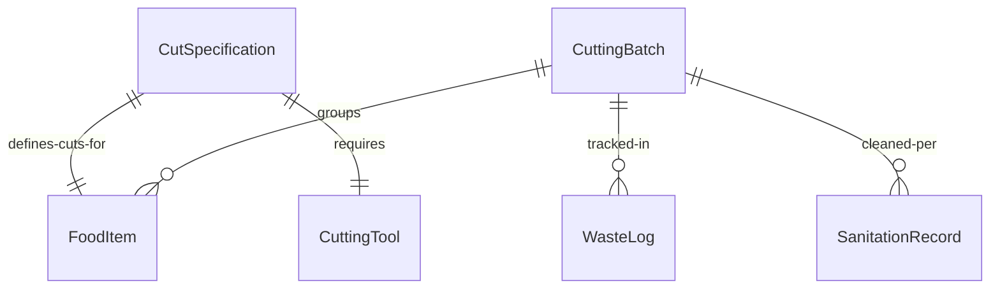
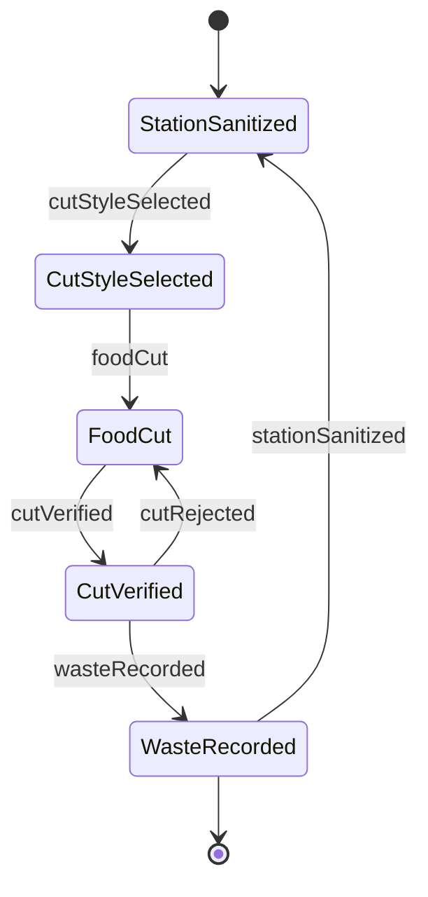
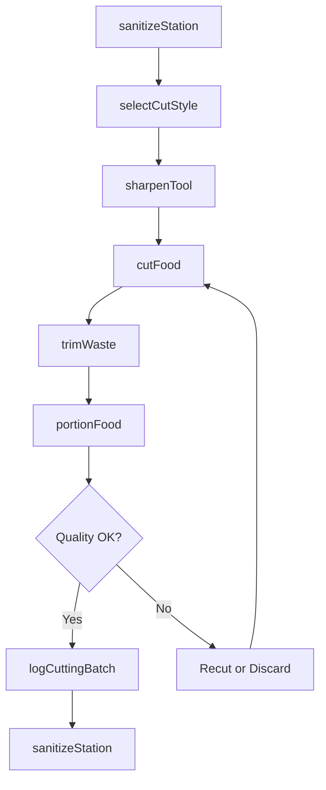
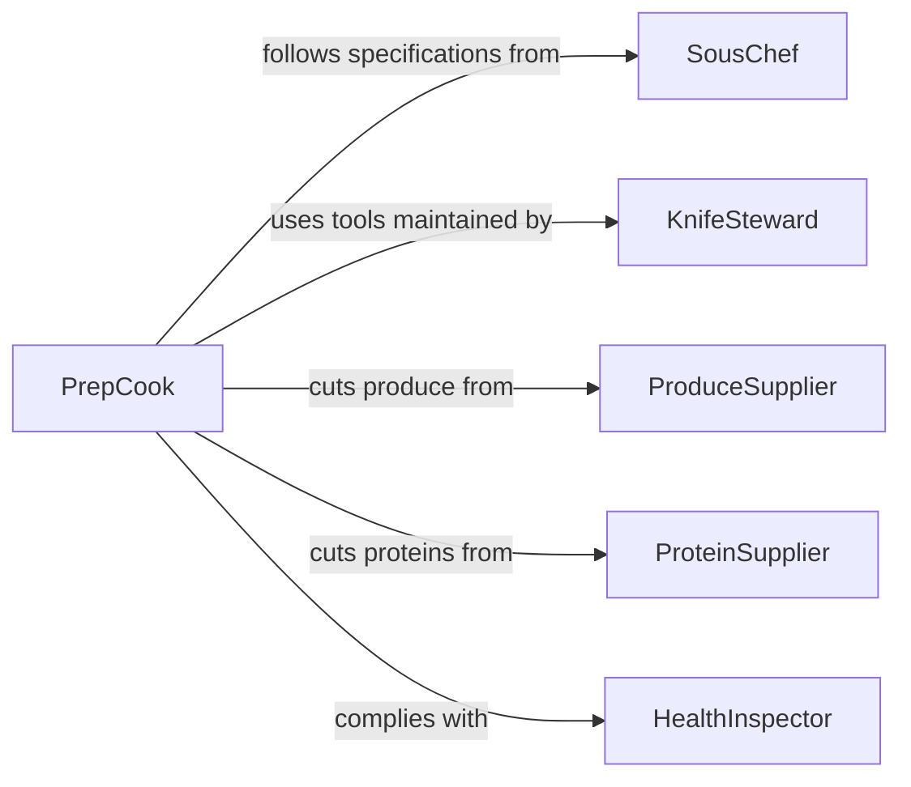

# Cut Cooked Raw Foods

> Business-as-Code definition for cutting cooked or raw foods. Models the knife work and food cutting operations used to portion, dice, slice, and segment ingredients and finished dishes.

## Overview

Cutting cooked or raw foods encompasses all knife skills and cutting operations performed in a commercial kitchen, including dicing, julienning, chiffonading, slicing, carving, and portioning. This definition exposes actions for various cutting techniques, events for tracking cutting output and quality, and searches for cut specifications and production records.

## Actors

| Actor | Description |
|-------|-------------|
| ProduceSupplier | Delivers fresh produce requiring cutting and portioning |
| ProteinSupplier | Provides meats, poultry, and seafood for cutting |
| KnifeSupplier | Supplies knives, mandolines, and cutting equipment |
| HealthInspector | Verifies cutting board sanitation and cross-contamination prevention |
| Customer | Consumes dishes made from precisely cut ingredients |

## Roles

| Role | Description |
|------|-------------|
| PrepCook | Executes cutting tasks for raw ingredients during prep |
| LineCook | Cuts and portions cooked items during service |
| SousChef | Sets cut specifications and oversees cutting quality |
| KnifeSteward | Maintains, sharpens, and distributes cutting tools |

## Entities

| Entity | Description |
|--------|-------------|
| CutSpecification | The required cut style, dimensions, and tolerance for an ingredient |
| FoodItem | A raw or cooked item to be cut |
| CuttingBatch | A group of items cut in a single session |
| CuttingTool | A knife, slicer, or mandoline used for cutting |
| WasteLog | Record of trim waste generated during cutting operations |
| SanitationRecord | Documentation of cutting board and tool cleaning |

## Actions

| Action | Description |
|--------|-------------|
| selectCutStyle | Determine the appropriate cut for an ingredient and recipe |
| cutFood | Execute the specified cut on a raw or cooked food item |
| portionFood | Divide a food item into equal service-sized portions |
| trimWaste | Remove and log inedible trim and waste material |
| sharpenTool | Hone or sharpen a cutting tool to maintain performance |
| sanitizeStation | Clean and sanitize cutting boards, tools, and surfaces |
| logCuttingBatch | Record the items cut, quantities, and waste for a session |

## Events

| Event | Description |
|-------|-------------|
| cutStyleSelected | A cutting specification has been determined for an item |
| foodCut | A food item has been cut to the specified dimensions |
| foodPortioned | A food item has been divided into service portions |
| wasteLogged | Trim waste from a cutting session has been recorded |
| toolSharpened | A cutting tool has been honed and is ready for use |
| stationSanitized | The cutting station has been cleaned between tasks |
| cutQualityFailed | Cut dimensions or consistency did not meet specification |

## Searches

| Search | Description |
|--------|-------------|
| findCutSpecifications | Look up cut styles and dimensions for an ingredient |
| getCuttingBatches | Retrieve cutting session records by date, cook, or item |
| getWasteLogs | Find trim waste records by item type or date range |
| findToolInventory | List available cutting tools by type and condition |


## Entity Relationships



## State Diagram



## Workflow



## Actor Relationships



## Usage

### Calling Actions

```typescript
import { cutCookedRawFoods } from '@headlessly/cut-cooked-raw-foods'

const cutting = cutCookedRawFoods()

// Cut carrots to brunoise for a mirepoix
await cutting.cutFood({
  foodItemId: 'carrot-raw',
  cutStyle: 'brunoise',
  dimensionMm: { length: 3, width: 3, height: 3 },
  quantityKg: 2.5,
  station: 'cold-prep'
})

// Portion a roasted prime rib for service
await cutting.portionFood({
  foodItemId: 'prime-rib-roasted',
  portionSizeG: 340,
  portionCount: 24,
  cutStyle: 'carve-slice'
})

// Log the session waste
await cutting.trimWaste({
  batchId: 'CB-2026-0205-AM',
  wasteKg: 1.8,
  wasteType: 'vegetable-trim'
})
```

### Event-Driven Automation

```typescript
// Alert sous chef on quality failures
cutting.cutQualityFailed(async ({ foodItemId, cutStyle, reason }) => {
  await notify({
    to: 'sous-chef',
    message: `Cut quality issue on ${foodItemId} (${cutStyle}): ${reason}`
  })
})

// Track waste percentages for cost control
cutting.wasteLogged(async ({ batchId, wasteKg, foodItemId }) => {
  await updateWasteMetrics({
    batchId,
    wasteKg,
    item: foodItemId
  })
})
```
