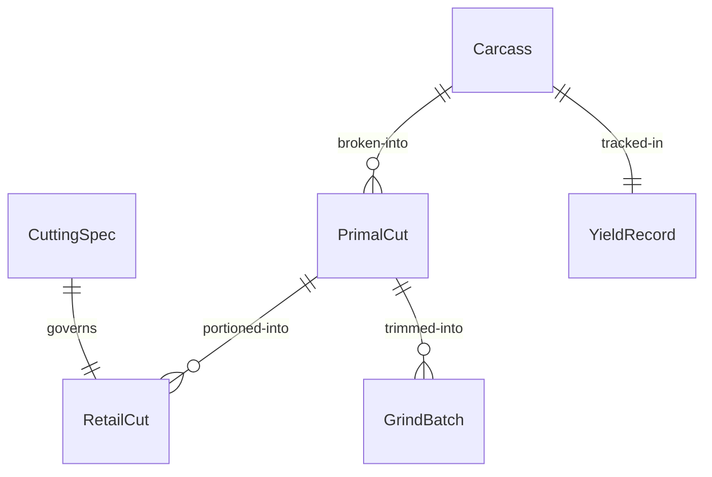
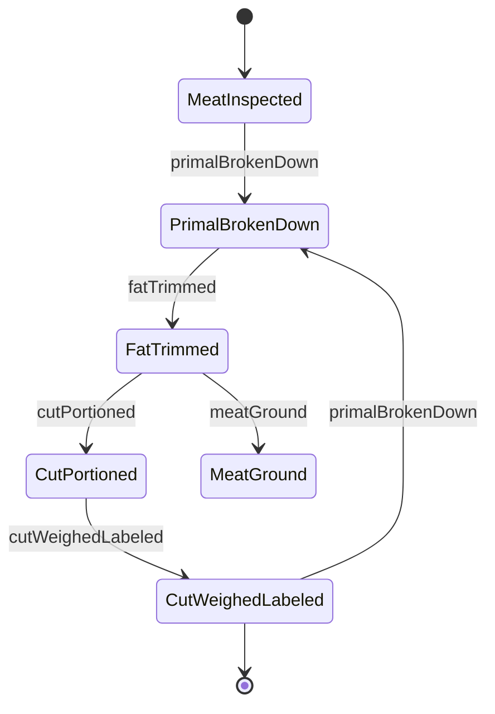
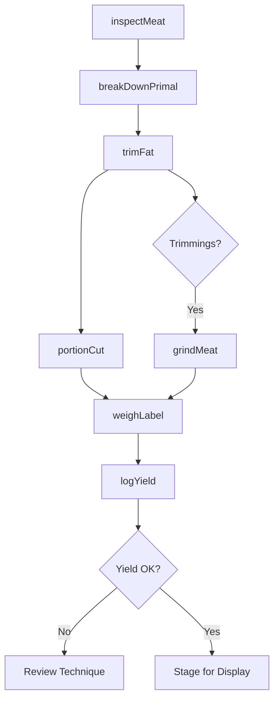
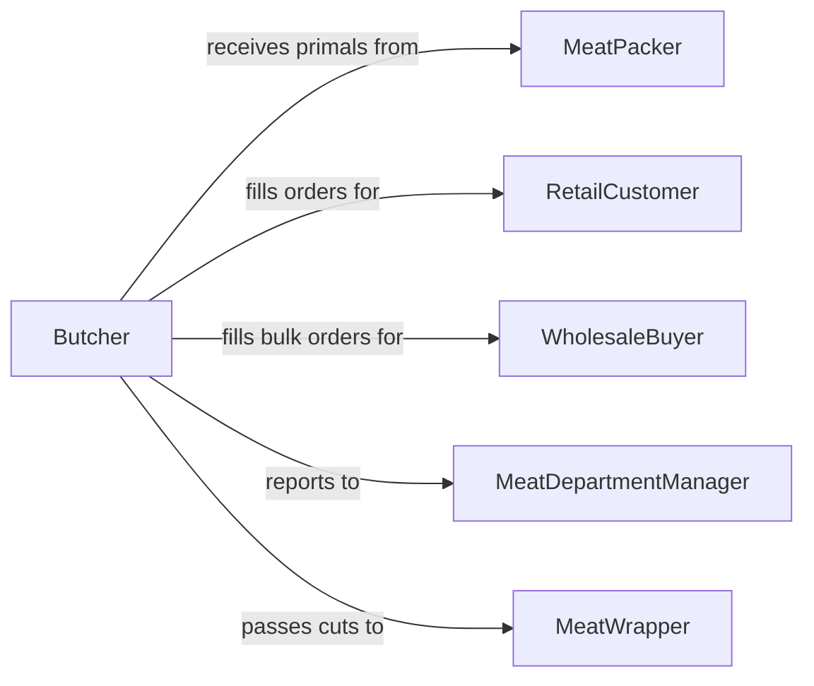

# Cut Meat Products

> Business-as-Code definition for cutting meat products. Models the butchery and portioning operations used to break down carcasses, primals, and subprimals into retail cuts, portions, and specialty items.

## Overview

Cutting meat products encompasses the skilled operations of breaking down carcasses into primal and subprimal cuts, further fabricating into retail-ready portions, and trimming to meet customer specifications. This definition exposes actions for each stage of meat cutting, events for production tracking and food safety, and searches for cut specifications, yield data, and inventory.

## Actors

| Actor | Description |
|-------|-------------|
| MeatPacker | Supplies whole carcasses, primals, and boxed subprimals |
| RetailCustomer | Purchases individual cuts and custom portions at the counter |
| WholesaleBuyer | Orders bulk quantities of specific cuts for restaurants or institutions |
| UsdaInspector | Inspects meat handling, storage, and cutting for regulatory compliance |
| EquipmentVendor | Provides band saws, grinders, slicers, and cutting tools |

## Roles

| Role | Description |
|------|-------------|
| Butcher | Breaks down primals and fabricates retail and custom cuts |
| MeatCutter | Portions subprimals into steaks, roasts, and ground products |
| MeatDepartmentManager | Oversees cutting schedules, yields, and department profitability |
| MeatWrapper | Packages, labels, and weighs finished cuts for display or shipment |

## Entities

| Entity | Description |
|--------|-------------|
| Carcass | A whole animal body received for breakdown |
| PrimalCut | A major section of the carcass such as loin, rib, or chuck |
| RetailCut | A consumer-ready portion such as a steak, chop, or roast |
| CuttingSpec | Thickness, weight, and trim standards for a specific cut |
| YieldRecord | Weight data tracking input versus output and waste for a session |
| GrindBatch | A batch of ground meat produced from trimmings and designated cuts |

## Actions

| Action | Description |
|--------|-------------|
| breakDownPrimal | Separate a primal cut into subprimals and individual muscles |
| portionCut | Slice subprimals into steaks, chops, or roasts to specification |
| trimFat | Remove excess fat and connective tissue to meet trim level |
| grindMeat | Process trimmings and designated cuts through a grinder |
| weighLabel | Weigh finished cuts and generate price and identification labels |
| inspectMeat | Verify temperature, color, and quality before cutting |
| logYield | Record input weight, output weight, and waste for a cutting session |

## Events

| Event | Description |
|-------|-------------|
| primalBrokenDown | A primal cut has been separated into subprimals |
| cutPortioned | A subprimal has been sliced into individual retail cuts |
| fatTrimmed | Excess fat and trim have been removed from a cut |
| meatGround | A batch of ground meat has been produced |
| cutWeighedLabeled | A finished cut has been weighed, labeled, and staged |
| meatInspected | A meat item has passed pre-cutting quality inspection |
| yieldBelowTarget | Cutting yield fell below the expected percentage |

## Searches

| Search | Description |
|--------|-------------|
| findCuttingSpecs | Look up cut specifications by species, primal, or retail cut name |
| getYieldRecords | Retrieve yield data by date, cutter, or primal type |
| getGrindBatches | List ground meat batches by date, lean percentage, or lot |
| findInventory | Check current stock of primals, subprimals, and retail cuts |


## Entity Relationships



## State Diagram



## Workflow



## Actor Relationships



## Usage

### Calling Actions

```typescript
import { cutMeatProducts } from '@headlessly/cut-meat-products'

const meatCutting = cutMeatProducts()

// Break down a beef rib primal
const subprimals = await meatCutting.breakDownPrimal({
  primalId: 'BEEF-RIB-103',
  species: 'beef',
  primalType: 'rib',
  inputWeightKg: 14.5
})

// Portion ribeye steaks to spec
await meatCutting.portionCut({
  subprimalId: subprimals[0].id,
  retailCutType: 'ribeye-steak',
  thicknessCm: 2.5,
  targetWeightG: 340,
  trimLevel: 'lip-on'
})

// Grind trimmings into 80/20 ground beef
await meatCutting.grindMeat({
  trimmingIds: subprimals.flatMap(s => s.trimmingIds),
  leanPercentage: 80,
  grindSize: 'medium'
})
```

### Event-Driven Automation

```typescript
// Alert manager when yield drops below target
meatCutting.yieldBelowTarget(async ({ primalId, expectedYield, actualYield }) => {
  await notify({
    to: 'meat-department-manager',
    message: `Yield on ${primalId}: ${actualYield}% vs target ${expectedYield}%`
  })
})

// Auto-update inventory when cuts are labeled
meatCutting.cutWeighedLabeled(async ({ retailCutType, weightKg, labelId }) => {
  await updateInventory({
    item: retailCutType,
    addWeightKg: weightKg,
    labelId
  })
})
```
