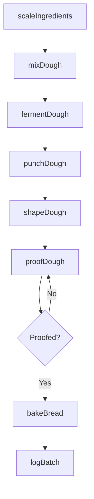
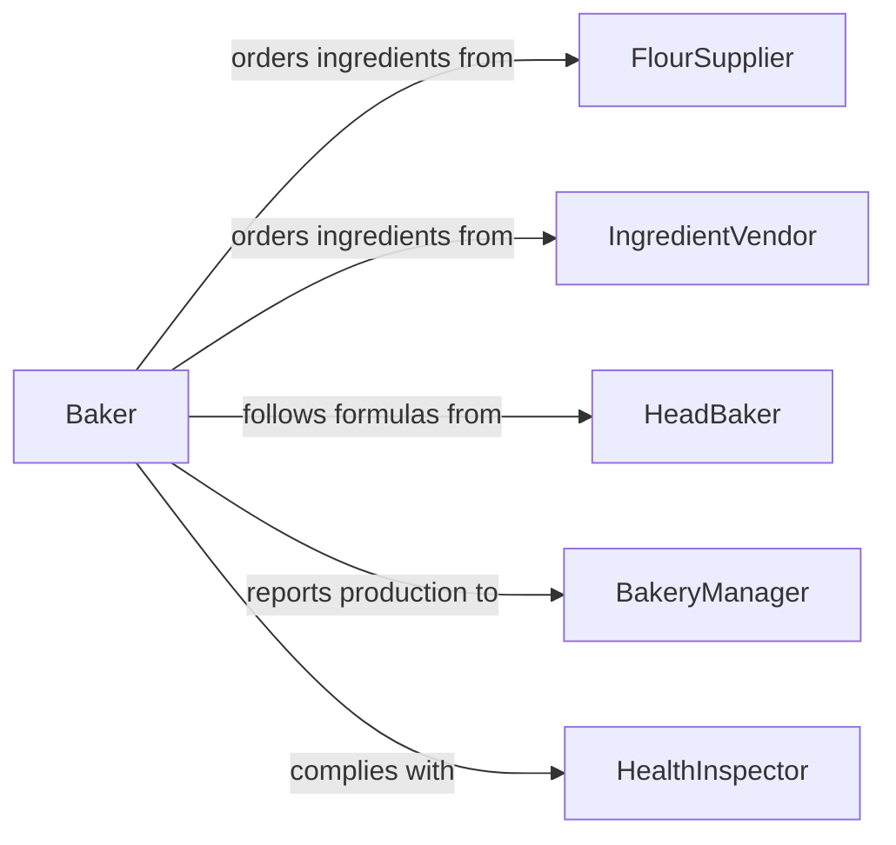

# Prepare Breads Doughs

> Business-as-Code definition for preparing breads and doughs. Models the complete dough-making lifecycle from ingredient scaling through mixing, proofing, shaping, and baking.

## Overview

Preparing breads and doughs encompasses the processes of scaling ingredients, mixing and kneading dough, managing fermentation and proofing, shaping loaves and rolls, and baking to specification. This definition exposes actions for each production stage, events for bakery automation, and searches for recipe management and batch tracking.

## Actors

| Actor | Description |
|-------|-------------|
| FlourSupplier | Provides flour, grains, and specialty milling products |
| IngredientVendor | Supplies yeast, fats, sugars, and other dough components |
| EquipmentSupplier | Provides mixers, proofers, ovens, and sheeters |
| HealthInspector | Audits bakery operations for food safety compliance |
| Customer | Orders bread products for retail, wholesale, or foodservice |

## Roles

| Role | Description |
|------|-------------|
| Baker | Mixes, shapes, and bakes doughs into finished bread products |
| HeadBaker | Develops formulas and oversees the baking production schedule |
| DoughMixer | Operates mixing equipment and monitors dough development |
| BakeryManager | Manages production schedules, inventory, and staffing |

## Entities

| Entity | Description |
|--------|-------------|
| Recipe | A formula specifying ingredients, ratios, and process steps |
| DoughBatch | A quantity of dough produced from a single mixing session |
| Ingredient | A raw material used in dough production |
| ProofingRecord | Temperature, humidity, and duration data for fermentation |
| BakeLog | Time, temperature, and outcome data for an oven cycle |
| ProductionOrder | A request for a specific quantity of bread products |

## Actions

| Action | Description |
|--------|-------------|
| scaleIngredients | Weigh and measure ingredients according to the recipe formula |
| mixDough | Combine ingredients and develop gluten structure |
| fermentDough | Allow dough to undergo bulk fermentation at controlled conditions |
| punchDough | Degas the dough to redistribute yeast and equalize temperature |
| shapeDough | Form dough into loaves, rolls, baguettes, or other shapes |
| proofDough | Allow shaped dough pieces to rise before baking |
| bakeBread | Bake proofed dough at specified temperature and duration |
| logBatch | Record production parameters for a dough batch |

## Events

| Event | Description |
|-------|-------------|
| ingredientsScaled | All ingredients have been weighed for a batch |
| doughMixed | Dough has been mixed to the target development stage |
| doughFermented | Bulk fermentation is complete and dough is ready for shaping |
| doughShaped | Dough pieces have been formed into their final shapes |
| doughProofed | Shaped dough has completed proofing and is ready to bake |
| breadBaked | Bread has been removed from the oven and is cooling |
| batchFailed | A dough batch did not meet quality standards |

## Searches

| Search | Description |
|--------|-------------|
| findRecipes | List bread recipes by type, ingredients, or hydration level |
| getBatches | Retrieve dough batches by date, recipe, or status |
| getProofingRecords | Look up fermentation data for a specific batch |
| findProductionOrders | List pending or completed bread production orders |

## Workflow



## Actor Relationships



## Usage

### Calling Actions

```typescript
import { prepareBreadsDoughs } from '@headlessly/prepare-breads-doughs'

const bakery = prepareBreadsDoughs()

// Scale ingredients for a sourdough batch
const batch = await bakery.scaleIngredients({
  recipeId: 'sourdough-country-loaf',
  batchSize: 20,
  productionOrderId: 'PO-2026-0412'
})

// Mix the dough
await bakery.mixDough({
  batchId: batch.id,
  mixerSpeed: 'second-speed',
  durationMinutes: 12,
  targetTemperatureC: 24
})

// Start bulk fermentation
await bakery.fermentDough({
  batchId: batch.id,
  temperatureC: 26,
  humidityPercent: 75,
  durationMinutes: 180
})
```

### Event-Driven Automation

```typescript
// Alert baker when proofing is complete
bakery.doughProofed(async ({ batchId, recipeId }) => {
  await notify({
    to: 'baker-station',
    message: `Batch ${batchId} proofed and ready for oven`
  })
})

// Log failed batches for quality review
bakery.batchFailed(async ({ batchId, reason }) => {
  await createQualityReport({
    batchId,
    issue: reason,
    assignedTo: 'head-baker'
  })
})
```
