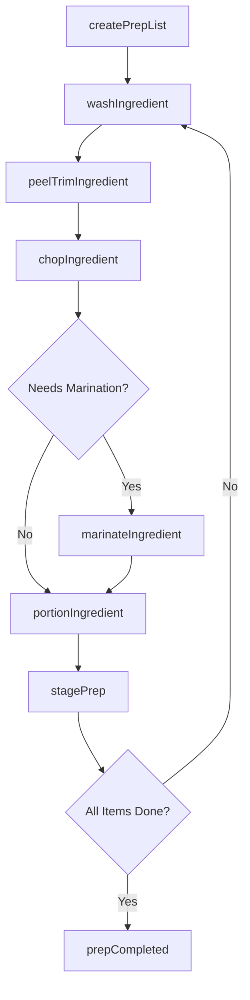
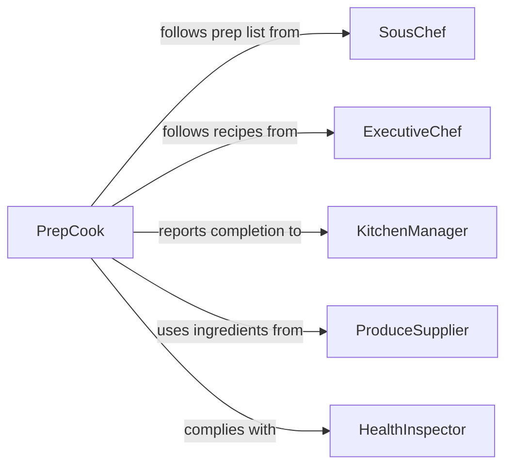

# Prepare Foods Cooking Serving

> Business-as-Code definition for preparing foods for cooking or serving. Models the mise en place process of washing, peeling, chopping, marinating, and portioning ingredients before they are cooked or plated.

## Overview

Preparing foods for cooking or serving encompasses all pre-production tasks that transform raw ingredients into ready-to-cook or ready-to-serve components. This includes washing, peeling, trimming, chopping, blanching, marinating, portioning, and staging. This definition exposes actions for each preparation step, events for kitchen workflow coordination, and searches for tracking prep lists and ingredient readiness.

## Actors

| Actor | Description |
|-------|-------------|
| ProduceSupplier | Delivers fresh fruits, vegetables, and herbs |
| ProteinSupplier | Provides meats, poultry, seafood, and plant proteins |
| DryGoodsVendor | Supplies grains, spices, oils, and shelf-stable ingredients |
| HealthInspector | Audits food handling, storage, and preparation practices |
| Customer | Orders meals that drive the preparation requirements |

## Roles

| Role | Description |
|------|-------------|
| PrepCook | Washes, peels, chops, and portions ingredients for service |
| SousChef | Supervises prep operations and manages the prep schedule |
| ExecutiveChef | Defines recipes and prep standards for the menu |
| KitchenManager | Coordinates ingredient procurement and prep staffing |

## Entities

| Entity | Description |
|--------|-------------|
| PrepList | A daily list of ingredients and quantities to prepare |
| Ingredient | A raw food item to be prepared for cooking or serving |
| PrepTask | A specific preparation action for an ingredient |
| Recipe | A formula defining how ingredients should be prepared |
| PrepBatch | A quantity of an ingredient prepared in one session |
| StorageContainer | A labeled, dated container holding prepared ingredients |

## Actions

| Action | Description |
|--------|-------------|
| createPrepList | Generate the daily preparation list from menu and forecast |
| washIngredient | Clean produce or proteins under running water or sanitizer |
| peelTrimIngredient | Remove skins, stems, seeds, or inedible portions |
| chopIngredient | Cut ingredients to the specified size and shape |
| marinateIngredient | Apply seasoning or marinade for a specified duration |
| portionIngredient | Divide prepared ingredients into service-ready quantities |
| stagePrep | Place prepared items in labeled containers in the walk-in or line |

## Events

| Event | Description |
|-------|-------------|
| prepListCreated | The daily preparation list has been generated |
| ingredientWashed | An ingredient has been cleaned and is ready for further prep |
| ingredientChopped | An ingredient has been cut to specification |
| ingredientMarinated | An ingredient has completed its marination period |
| ingredientPortioned | An ingredient has been divided into service portions |
| prepCompleted | All items on the prep list have been prepared and staged |
| prepDelayed | A prep task is behind schedule due to missing ingredients or staffing |

## Searches

| Search | Description |
|--------|-------------|
| findPrepLists | List prep lists by date, station, or completion status |
| getPrepTasks | Retrieve prep tasks for a specific ingredient or recipe |
| getReadyIngredients | Find ingredients that are prepped and staged for service |
| findPrepBatches | Look up prep batches by date, ingredient, or preparer |

## Workflow



## Actor Relationships



## Usage

### Calling Actions

```typescript
import { prepareFoodsCookingServing } from '@headlessly/prepare-foods-cooking-serving'

const prep = prepareFoodsCookingServing()

// Generate the daily prep list
const prepList = await prep.createPrepList({
  date: '2026-02-05',
  station: 'cold-prep',
  menuForecastCovers: 180
})

// Chop onions to brunoise
await prep.chopIngredient({
  ingredientId: 'yellow-onion',
  prepListId: prepList.id,
  cutStyle: 'brunoise',
  quantityKg: 5.0
})

// Portion marinated chicken for the grill station
await prep.portionIngredient({
  ingredientId: 'chicken-thigh-marinated',
  portionSizeG: 200,
  portionCount: 60,
  destinationStation: 'grill'
})
```

### Event-Driven Automation

```typescript
// Notify sous chef when all prep is complete
prep.prepCompleted(async ({ prepListId, station, date }) => {
  await notify({
    to: 'sous-chef',
    message: `Prep complete for ${station} on ${date}`
  })
})

// Alert kitchen manager when prep falls behind
prep.prepDelayed(async ({ prepListId, taskId, reason }) => {
  await notify({
    to: 'kitchen-manager',
    message: `Prep delayed on task ${taskId}: ${reason}`
  })
})
```
