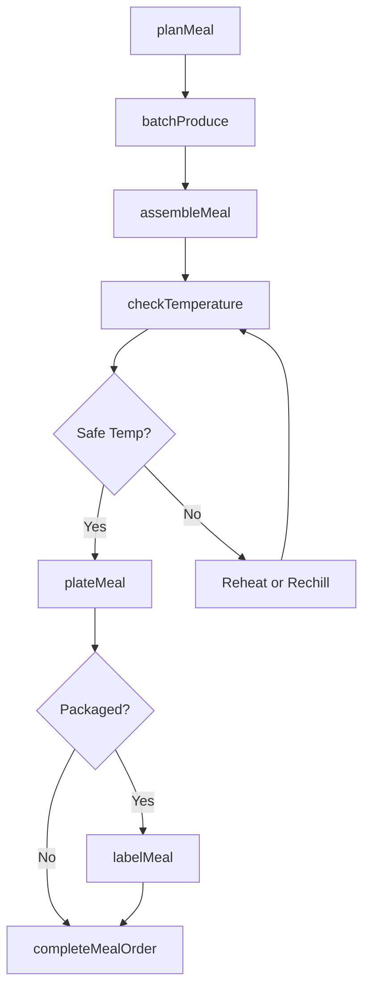
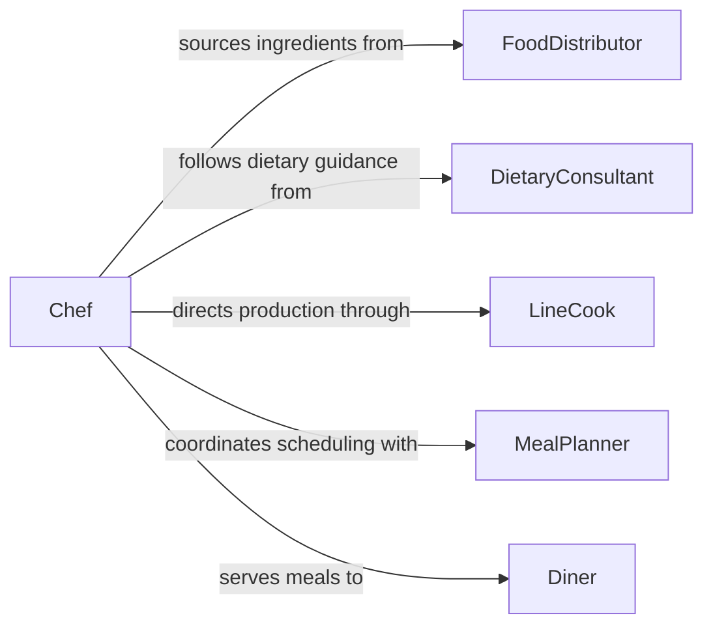

# Prepare Foods Meals

> Business-as-Code definition for preparing foods and meals. Models the end-to-end meal preparation process from recipe selection through assembling complete dishes for service.

## Overview

Preparing foods and meals covers the full workflow of producing finished dishes, from selecting recipes and gathering prepped ingredients through cooking, assembly, quality verification, and plating. This definition is broader than individual prep or cooking tasks, focusing on the coordination of multiple components into complete meals. It exposes actions for meal assembly and batch production, events for service coordination, and searches for menu planning and production tracking.

## Actors

| Actor | Description |
|-------|-------------|
| FoodDistributor | Supplies bulk ingredients and pre-processed food items |
| DietaryConsultant | Provides nutritional requirements and dietary restriction guidance |
| Diner | Consumes the prepared meals in a restaurant, cafeteria, or care setting |
| HealthDepartment | Regulates food safety, labeling, and preparation standards |
| FacilityOperator | Manages the institutional or commercial kitchen facility |

## Roles

| Role | Description |
|------|-------------|
| Chef | Plans menus, creates recipes, and oversees meal preparation |
| LineCook | Executes cooking and assembly tasks for individual dishes |
| MealPlanner | Schedules production runs and coordinates ingredient availability |
| QualityAssuranceLead | Inspects finished meals for safety, temperature, and presentation |

## Entities

| Entity | Description |
|--------|-------------|
| Meal | A complete dish or set of dishes ready for service |
| Recipe | Detailed instructions for producing a specific dish |
| MealPlan | A schedule of meals to be produced over a defined period |
| ProductionBatch | A group of identical meals prepared in a single run |
| NutritionalProfile | Calorie, macronutrient, and allergen data for a meal |
| ServiceTicket | An order specifying meals and any modifications |

## Actions

| Action | Description |
|--------|-------------|
| planMeal | Select recipes and quantities for a service period or event |
| assembleMeal | Combine cooked and prepped components into a finished dish |
| batchProduce | Prepare a large quantity of a single meal item for service |
| checkTemperature | Verify that hot and cold items meet safe serving temperatures |
| labelMeal | Apply nutritional, allergen, and date labels to packaged meals |
| plateMeal | Arrange meal components on serviceware according to standards |
| completeMealOrder | Mark a meal as ready for service, delivery, or pickup |

## Events

| Event | Description |
|-------|-------------|
| mealPlanned | A meal plan has been finalized for a service period |
| mealAssembled | All components of a meal have been combined into a finished dish |
| batchProduced | A production batch of meals has been completed |
| temperatureChecked | Meal temperature has been verified as safe for service |
| mealLabeled | Nutritional and allergen labels have been applied |
| mealPlated | A meal has been arranged on serviceware and is ready |
| mealOrderCompleted | A meal order has been fulfilled and dispatched for service |

## Searches

| Search | Description |
|--------|-------------|
| findMealPlans | List meal plans by date, facility, or dietary category |
| getProductionBatches | Retrieve production batches by meal type, date, or status |
| getNutritionalProfiles | Look up nutritional data for specific meals or recipes |
| findServiceTickets | List pending meal orders by time, customer, or modification |

## Workflow



## Actor Relationships



## Usage

### Calling Actions

```typescript
import { prepareFoodsMeals } from '@headlessly/prepare-foods-meals'

const meals = prepareFoodsMeals()

// Plan meals for a hospital cafeteria lunch service
const plan = await meals.planMeal({
  facilityId: 'hospital-cafeteria-main',
  serviceDate: '2026-02-05',
  servicePeriod: 'lunch',
  coverCount: 350,
  dietaryCategories: ['regular', 'low-sodium', 'diabetic', 'renal']
})

// Batch produce the regular entree
await meals.batchProduce({
  mealPlanId: plan.id,
  recipeId: 'grilled-chicken-breast-herb',
  quantity: 200,
  productionStation: 'hot-line'
})

// Plate and complete an individual order
await meals.plateMeal({
  serviceTicketId: 'TKT-9920',
  components: ['grilled-chicken-breast', 'steamed-broccoli', 'brown-rice'],
  presentation: 'standard-tray'
})
```

### Event-Driven Automation

```typescript
// Notify service when batch is ready
meals.batchProduced(async ({ mealPlanId, recipeId, quantity }) => {
  await notify({
    to: 'service-line',
    message: `${quantity} portions of ${recipeId} ready for assembly`
  })
})

// Alert quality lead on temperature issues
meals.temperatureChecked(async ({ mealId, temperature, safe }) => {
  if (!safe) {
    await notify({
      to: 'qa-lead',
      message: `Temperature issue on meal ${mealId}: ${temperature}F`
    })
  }
})
```
