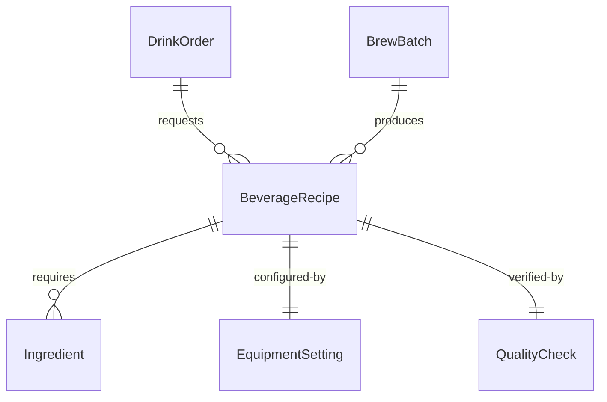
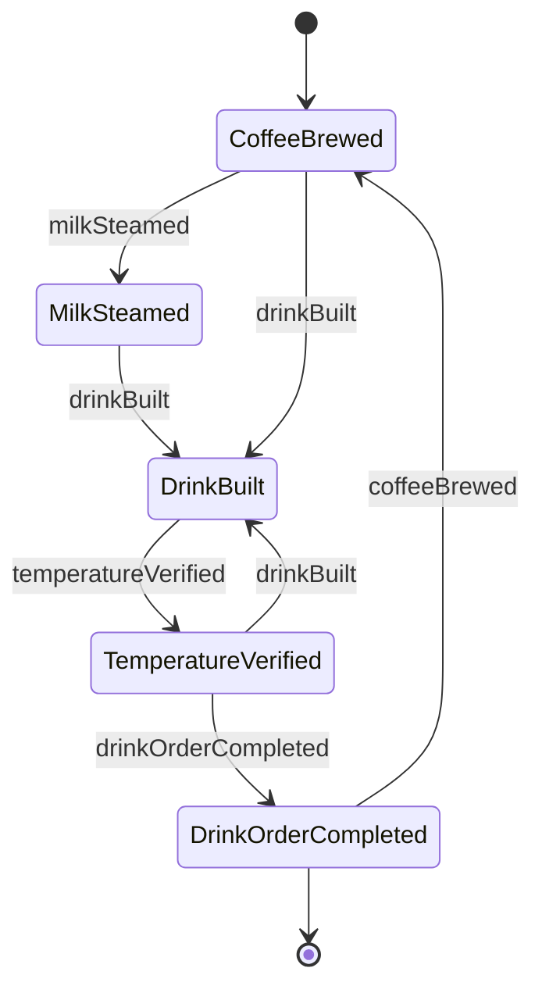
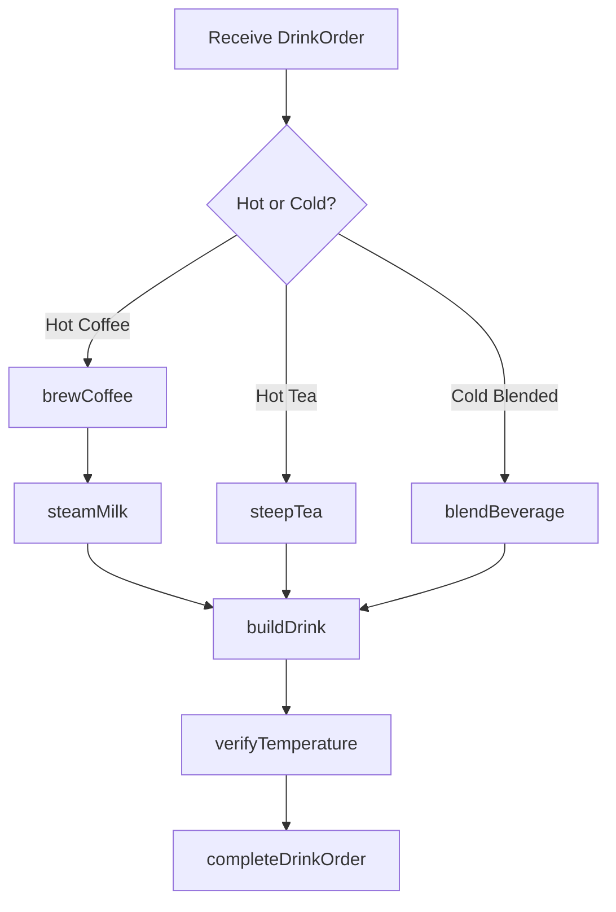
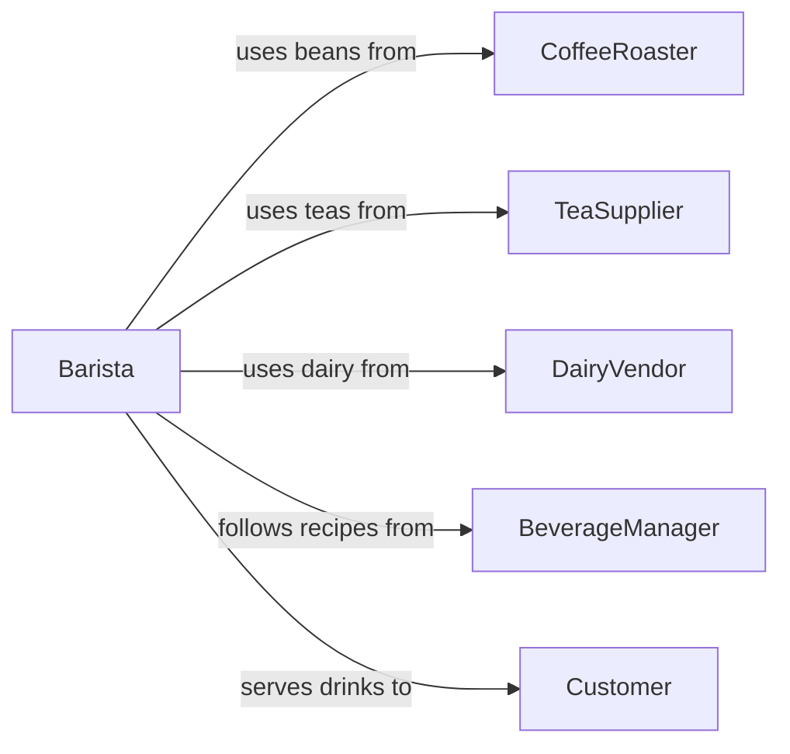

# Prepare Hot Cold Beverages

> Business-as-Code definition for preparing hot and cold beverages. Models the process of brewing, mixing, and assembling drinks including coffee, tea, smoothies, juices, and specialty beverages.

## Overview

Preparing hot and cold beverages encompasses brewing coffee and tea, mixing smoothies and juices, building specialty drinks with syrups and milk alternatives, and assembling cocktail or mocktail ingredients. This definition exposes actions for each beverage preparation step, events for order fulfillment and quality tracking, and searches for recipes, inventory, and production metrics.

## Actors

| Actor | Description |
|-------|-------------|
| CoffeeRoaster | Supplies roasted coffee beans and espresso blends |
| TeaSupplier | Provides loose leaf teas, tea bags, and specialty blends |
| DairyVendor | Delivers milk, cream, and plant-based milk alternatives |
| SyrupSupplier | Provides flavoring syrups, sauces, and sweeteners |
| Customer | Orders and receives prepared beverages |

## Roles

| Role | Description |
|------|-------------|
| Barista | Prepares espresso drinks, brewed coffee, and tea beverages |
| BeverageManager | Oversees beverage program, recipes, and quality standards |
| JuiceBarOperator | Prepares fresh juices, smoothies, and blended drinks |
| ShiftLead | Manages beverage station staffing and workflow during service |

## Entities

| Entity | Description |
|--------|-------------|
| BeverageRecipe | A formula specifying ingredients, ratios, and preparation method |
| DrinkOrder | A customer request for one or more beverages |
| BrewBatch | A batch of brewed coffee or tea prepared at one time |
| Ingredient | A component used in beverage preparation such as milk or syrup |
| EquipmentSetting | Configuration for espresso machines, grinders, or blenders |
| QualityCheck | A taste or temperature verification on a prepared beverage |

## Actions

| Action | Description |
|--------|-------------|
| brewCoffee | Extract coffee using espresso, drip, pour-over, or cold brew methods |
| steepTea | Infuse tea leaves in water at the specified temperature and duration |
| steamMilk | Heat and froth milk or milk alternative to the desired texture |
| blendBeverage | Combine ingredients in a blender for smoothies or frozen drinks |
| buildDrink | Assemble a multi-component drink in the correct sequence |
| verifyTemperature | Check that the beverage meets the target serving temperature |
| completeDrinkOrder | Mark a beverage order as prepared and ready for pickup |

## Events

| Event | Description |
|-------|-------------|
| coffeeBrewed | A coffee batch or shot has been extracted and is ready |
| teaSteeped | Tea has finished infusing and is ready to serve |
| milkSteamed | Milk has been heated and frothed to specification |
| beverageBlended | A blended drink has been prepared |
| drinkBuilt | A multi-component drink has been assembled |
| temperatureVerified | Beverage temperature has been confirmed within range |
| drinkOrderCompleted | A customer beverage order is ready for pickup or delivery |

## Searches

| Search | Description |
|--------|-------------|
| findBeverageRecipes | List recipes by type, ingredients, or temperature category |
| getDrinkOrders | Retrieve pending or completed drink orders by time or customer |
| getBrewBatches | Look up brew batch records by date, method, or coffee origin |
| getIngredientStock | Check current inventory levels for beverage ingredients |


## Entity Relationships



## State Diagram



## Workflow



## Actor Relationships



## Usage

### Calling Actions

```typescript
import { prepareHotColdBeverages } from '@headlessly/prepare-hot-cold-beverages'

const beverages = prepareHotColdBeverages()

// Brew an espresso double shot
const shot = await beverages.brewCoffee({
  method: 'espresso',
  grindSize: 'fine',
  doseG: 18,
  yieldMl: 36,
  extractionTimeSec: 28
})

// Steam oat milk for a latte
const milk = await beverages.steamMilk({
  milkType: 'oat',
  volumeMl: 240,
  targetTemperatureC: 65,
  textureType: 'microfoam'
})

// Build the finished latte
await beverages.buildDrink({
  orderId: 'ORD-4421',
  components: [shot, milk],
  drinkType: 'oat-milk-latte',
  size: 'large'
})
```

### Event-Driven Automation

```typescript
// Notify customer when drink is ready
beverages.drinkOrderCompleted(async ({ orderId, customerName }) => {
  await notify({
    to: customerName,
    message: `Your drink order ${orderId} is ready for pickup`
  })
})

// Alert manager when brew quality drops
beverages.coffeeBrewed(async ({ batchId, extractionTimeSec }) => {
  if (extractionTimeSec < 22 || extractionTimeSec > 32) {
    await notify({
      to: 'beverage-manager',
      message: `Extraction time out of range on batch ${batchId}: ${extractionTimeSec}s`
    })
  }
})
```
