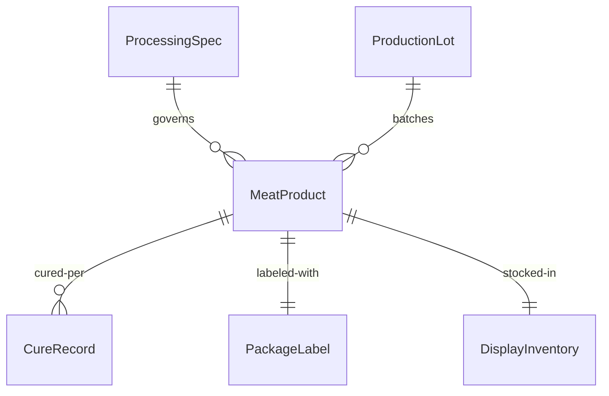
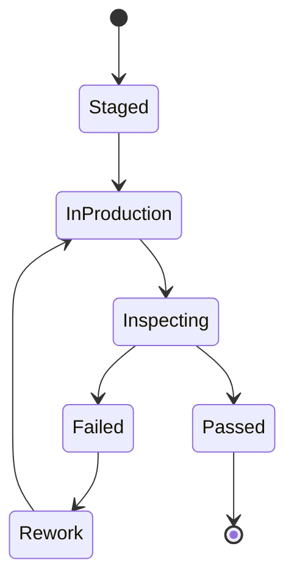
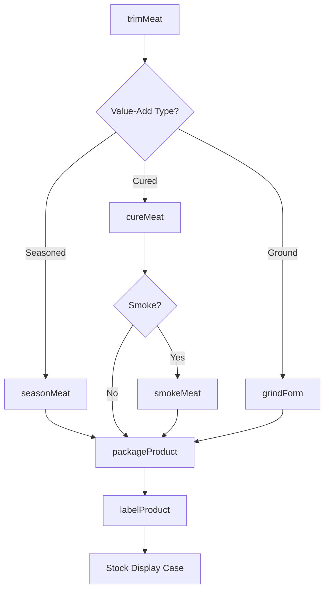
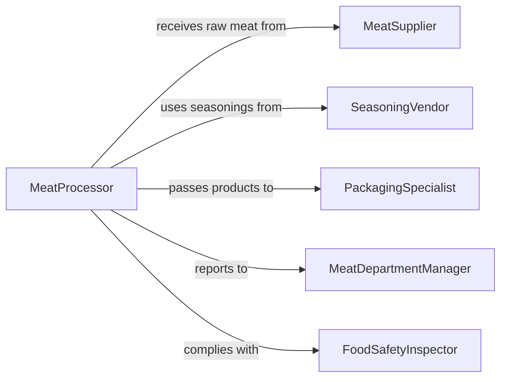

# Prepare Meat Products Sale Consumption

> Business-as-Code definition for preparing meat products for sale or consumption. Models the processing of raw meats through trimming, seasoning, curing, marinating, grinding, and packaging for retail display or direct consumption.

## Overview

Preparing meat products for sale or consumption covers the value-added processing that transforms raw primals and subprimals into consumer-ready items. This includes trimming to retail specifications, seasoning and marinating, curing and smoking, grinding and forming into patties or sausages, and packaging with proper labeling. This definition exposes actions for each processing step, events for traceability and food safety, and searches for product specifications and inventory.

## Actors

| Actor | Description |
|-------|-------------|
| MeatSupplier | Delivers raw primals, subprimals, and offal for processing |
| SeasoningVendor | Provides spice blends, marinades, cures, and casings |
| RetailCustomer | Purchases prepared meat products from the display case |
| FoodSafetyInspector | Inspects processing, storage, and labeling for regulatory compliance |
| PackagingSupplier | Provides trays, wraps, vacuum bags, and labeling materials |

## Roles

| Role | Description |
|------|-------------|
| MeatProcessor | Trims, seasons, grinds, and forms meat into retail products |
| Butcher | Performs skilled cutting and fabrication of specialty items |
| MeatDepartmentManager | Oversees product mix, pricing, and department operations |
| PackagingSpecialist | Wraps, vacuum-seals, and labels finished meat products |

## Entities

| Entity | Description |
|--------|-------------|
| MeatProduct | A value-added item such as marinated steak, sausage, or cured ham |
| ProcessingSpec | Standards for seasoning ratios, cure times, and grind sizes |
| ProductionLot | A traceable batch of meat products prepared together |
| CureRecord | Time, temperature, and ingredient data for cured products |
| PackageLabel | Nutritional, weight, price, and allergen information for a package |
| DisplayInventory | Current stock of prepared meat products in the retail case |

## Actions

| Action | Description |
|--------|-------------|
| trimMeat | Remove excess fat, sinew, and bone to meet product specifications |
| seasonMeat | Apply dry rubs, marinades, or injection brines to meat |
| cureMeat | Apply curing salts and hold meat under controlled conditions |
| grindForm | Process meat through a grinder and form into patties or links |
| smokeMeat | Expose cured or seasoned meat to smoke at controlled temperatures |
| packageProduct | Wrap, vacuum-seal, or tray-pack finished meat products |
| labelProduct | Generate and apply labels with weight, price, and nutritional data |

## Events

| Event | Description |
|-------|-------------|
| meatTrimmed | Raw meat has been trimmed to the target product specification |
| meatSeasoned | Seasoning or marinade has been applied to the meat |
| meatCured | Curing process has been completed for a product lot |
| meatGround | Meat has been ground and formed into the final product shape |
| meatSmoked | Smoking process has been completed |
| productPackaged | A finished meat product has been wrapped and sealed |
| productLabeled | Labels have been applied and the product is display-ready |

## Searches

| Search | Description |
|--------|-------------|
| findProcessingSpecs | Look up preparation standards by product type or species |
| getProductionLots | Retrieve production lot records by date, product, or processor |
| getCureRecords | Find curing data by product, lot number, or cure method |
| getDisplayInventory | Check current stock levels in the retail display case |


## Entity Relationships



## State Diagram



## Workflow



## Actor Relationships



## Usage

### Calling Actions

```typescript
import { prepareMeatProductsSaleConsumption } from '@headlessly/prepare-meat-products-sale-consumption'

const meatPrep = prepareMeatProductsSaleConsumption()

// Season chicken thighs with a teriyaki marinade
await meatPrep.seasonMeat({
  productType: 'chicken-thigh-boneless',
  seasoningId: 'teriyaki-marinade',
  quantityKg: 10,
  marinateHours: 4,
  lotId: 'LOT-2026-0205-01'
})

// Grind beef and form into half-pound patties
await meatPrep.grindForm({
  inputMeat: 'beef-chuck-trim',
  leanPercentage: 80,
  grindSize: 'coarse',
  formType: 'patty',
  portionWeightG: 227,
  lotId: 'LOT-2026-0205-02'
})

// Package and label for the display case
await meatPrep.packageProduct({
  lotId: 'LOT-2026-0205-02',
  packagingType: 'modified-atmosphere-tray',
  portionsPerPackage: 4
})
```

### Event-Driven Automation

```typescript
// Update display inventory when products are labeled
meatPrep.productLabeled(async ({ lotId, productType, quantity }) => {
  await updateDisplayInventory({
    productType,
    addQuantity: quantity,
    lotId
  })
})

// Alert manager when curing times complete
meatPrep.meatCured(async ({ lotId, productType, cureHours }) => {
  await notify({
    to: 'meat-department-manager',
    message: `Cure complete for ${productType} lot ${lotId} after ${cureHours}h`
  })
})
```
