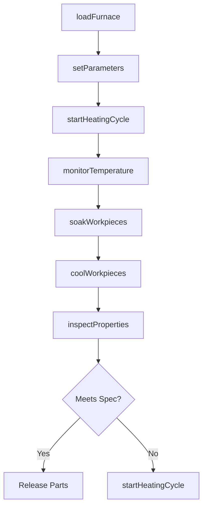
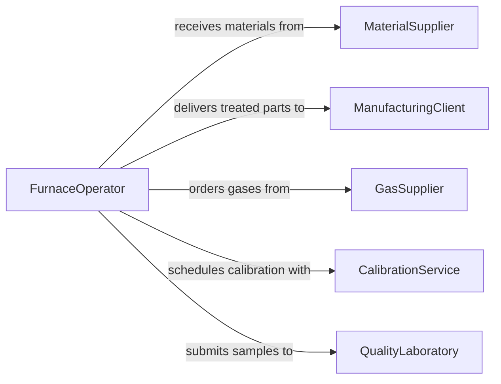

# Heat Material or Workpieces to Prepare for or Complete Production

> Business-as-Code definition for thermal processing of materials and workpieces. Models the heating, annealing, tempering, and curing operations used to prepare or finish production components.

## Overview

Heating materials or workpieces encompasses a range of thermal processes including preheating for forming, annealing for stress relief, tempering for hardness, and curing for adhesives or coatings. This definition covers furnace operations, induction heating, heat treatment cycles, and temperature monitoring across metalworking, ceramics, plastics, and composite manufacturing.

## Actors

| Actor | Description |
|-------|-------------|
| MaterialSupplier | Provides raw metals, polymers, or composite materials requiring heat treatment |
| ManufacturingClient | Orders heat-treated parts or components for assembly |
| GasSupplier | Delivers fuel gases and atmosphere gases for furnace operations |
| CalibrationService | Certifies furnace temperature accuracy and uniformity |
| QualityLaboratory | Performs hardness, tensile, and metallurgical testing on treated parts |

## Roles

| Role | Description |
|------|-------------|
| FurnaceOperator | Loads, monitors, and unloads furnaces during heat treatment cycles |
| MetallurgicalEngineer | Specifies heat treatment parameters and alloy requirements |
| QualityInspector | Verifies mechanical properties of heat-treated components |
| MaintenanceTechnician | Services furnaces, thermocouples, and control systems |

## Entities

| Entity | Description |
|--------|-------------|
| Furnace | A heated enclosure used for thermal processing |
| HeatTreatmentCycle | A defined time-temperature profile for processing parts |
| Workpiece | A part or material being heated for production purposes |
| Thermocouple | A temperature sensor placed in the furnace or on the workpiece |
| AtmosphereGas | A controlled gas environment within the furnace |
| TreatmentRecord | A log of actual temperatures, times, and batch details |
| HardnessSpec | Target mechanical hardness for a treated component |

## Actions

| Action | Description |
|--------|-------------|
| loadFurnace | Place workpieces into the furnace chamber |
| setParameters | Configure temperature, time, ramp rate, and atmosphere settings |
| startHeatingCycle | Initiate the programmed heat treatment sequence |
| monitorTemperature | Track thermocouple readings against the target profile |
| soakWorkpieces | Maintain workpieces at target temperature for the specified duration |
| coolWorkpieces | Execute controlled cooling per the treatment specification |
| inspectProperties | Test hardness, microstructure, or other mechanical properties |

## Events

| Event | Description |
|-------|-------------|
| furnaceLoaded | Workpieces have been placed in the furnace |
| parametersSet | Temperature and atmosphere settings have been configured |
| heatingCycleStarted | The heat treatment sequence has begun |
| targetTemperatureReached | Furnace has reached the specified setpoint |
| soakCompleted | Required hold time at temperature has elapsed |
| coolingCompleted | Workpieces have reached the target post-treatment temperature |
| propertiesInspected | Mechanical property testing is complete |

## Searches

| Search | Description |
|--------|-------------|
| findTreatmentRecords | Locate heat treatment logs by part number, batch, or date |
| getFurnaceStatus | Retrieve current temperature and cycle progress for a furnace |
| getInspectionResults | Look up mechanical property test results for treated batches |
| findCalibrationRecords | List furnace calibration certificates by equipment and date |

## Workflow



## Actor Relationships



## Usage

### Calling Actions

```typescript
import { heatMaterialWorkpiecesPrepareComplete } from '@headlessly/heat-material-workpieces-prepare-complete'

const heating = heatMaterialWorkpiecesPrepareComplete()

// Load workpieces and set treatment parameters
await heating.loadFurnace({
  furnaceId: 'FURN-02',
  batchId: 'BATCH-2024-0331',
  partCount: 48,
  material: '4140-steel'
})

await heating.setParameters({
  furnaceId: 'FURN-02',
  targetTempCelsius: 850,
  rampRateCPerMin: 10,
  soakTimeMinutes: 60,
  atmosphere: 'nitrogen'
})

// Start the cycle and monitor
await heating.startHeatingCycle({ furnaceId: 'FURN-02' })
```

### Event-Driven Automation

```typescript
// Alert on temperature deviation
heating.targetTemperatureReached(async ({ furnaceId, actualTemp, targetTemp }) => {
  const deviation = Math.abs(actualTemp - targetTemp)
  if (deviation > 5) {
    await notify({
      to: 'metallurgical-engineer',
      message: `Furnace ${furnaceId} deviation: ${deviation}C from target`
    })
  }
})

// Auto-log treatment completion
heating.coolingCompleted(async ({ batchId, furnaceId }) => {
  await qualitySystem.createInspectionOrder({
    batchId,
    tests: ['rockwell-hardness', 'microstructure'],
    priority: 'standard'
  })
})
```
