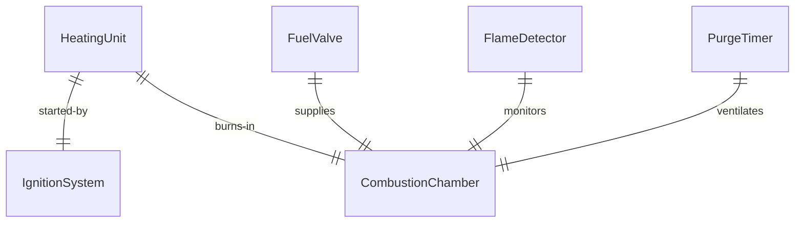
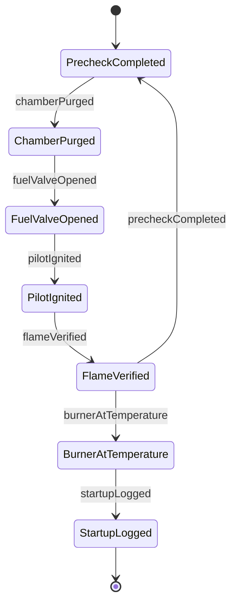
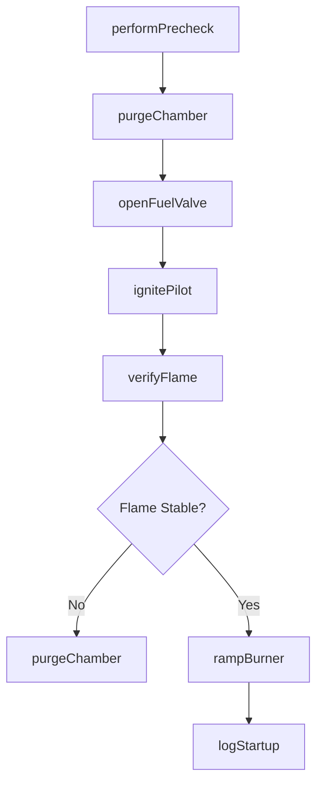
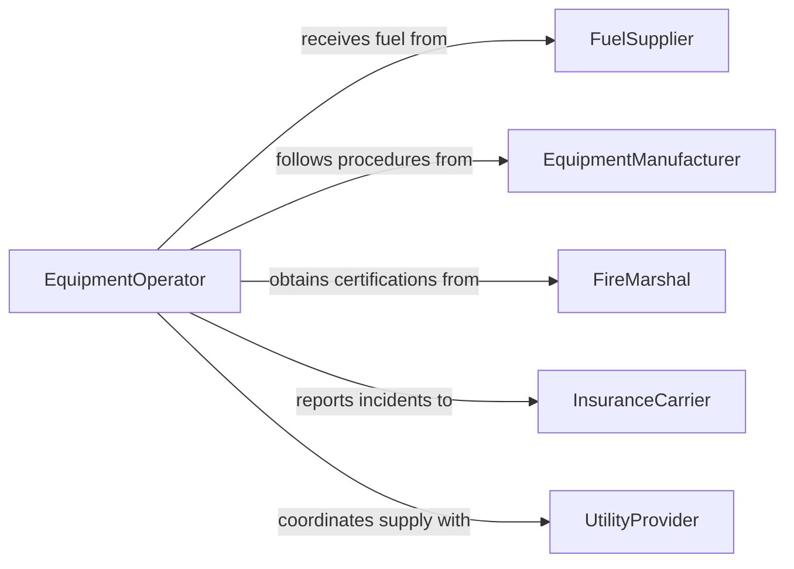

# Ignite Fuel to Activate Heating Equipment

> Business-as-Code definition for fuel ignition and heating equipment startup. Models the pre-ignition safety checks, pilot lighting, burner activation, and flame verification for industrial furnaces, boilers, and kilns.

## Overview

Igniting fuel to activate heating equipment involves conducting pre-start safety inspections, purging combustion chambers, lighting pilot flames, and bringing burners to operating temperature in a controlled sequence. This definition covers startup procedures for natural gas furnaces, oil-fired boilers, propane kilns, and industrial heating systems where proper ignition sequencing is critical for safety and efficiency.

## Actors

| Actor | Description |
|-------|-------------|
| FuelSupplier | Delivers natural gas, propane, fuel oil, or other combustible fuels |
| EquipmentManufacturer | Provides heating equipment and ignition system documentation |
| FireMarshal | Inspects and certifies combustion equipment safety compliance |
| InsuranceCarrier | Underwrites fire and explosion liability for heating operations |
| UtilityProvider | Supplies gas pressure and electrical power for ignition systems |

## Roles

| Role | Description |
|------|-------------|
| EquipmentOperator | Executes startup procedures and ignites heating equipment |
| MaintenanceTechnician | Services ignition systems, burners, and safety interlocks |
| SafetyOfficer | Verifies compliance with ignition safety protocols |
| ShiftSupervisor | Authorizes equipment startup and monitors initial operation |

## Entities

| Entity | Description |
|--------|-------------|
| HeatingUnit | A furnace, boiler, kiln, or other fuel-fired heating device |
| IgnitionSystem | The pilot, spark, or electronic igniter that starts combustion |
| CombustionChamber | The enclosed space where fuel is burned |
| FuelValve | A control valve regulating fuel flow to the burner |
| FlameDetector | A sensor verifying the presence and stability of a flame |
| PurgeTimer | A timed ventilation cycle clearing combustible gases before ignition |
| StartupChecklist | A documented pre-ignition safety verification procedure |

## Actions

| Action | Description |
|--------|-------------|
| performPrecheck | Complete the startup safety checklist before ignition |
| purgeChamber | Ventilate the combustion chamber to clear residual gases |
| openFuelValve | Enable fuel flow to the burner assembly |
| ignitePilot | Light the pilot flame or activate the electronic igniter |
| verifyFlame | Confirm stable flame detection through sensors |
| rampBurner | Gradually increase fuel flow to reach operating temperature |
| logStartup | Record ignition time, readings, and checklist completion |

## Events

| Event | Description |
|-------|-------------|
| precheckCompleted | All pre-ignition safety items have been verified |
| chamberPurged | Combustion chamber ventilation cycle is complete |
| fuelValveOpened | Fuel supply has been enabled to the burner |
| pilotIgnited | Pilot flame or igniter has been successfully activated |
| flameVerified | Flame detector confirms stable combustion |
| burnerAtTemperature | Heating equipment has reached operating setpoint |
| startupLogged | Ignition procedure has been documented |

## Searches

| Search | Description |
|--------|-------------|
| findStartupLogs | Locate ignition records by equipment, date, or operator |
| getEquipmentStatus | Retrieve current operating status of heating units |
| getFlameHistory | Look up flame detection events for a specific unit |
| findMaintenanceRecords | List service records for ignition systems and burners |


## Entity Relationships



## State Diagram



## Workflow



## Actor Relationships



## Usage

### Calling Actions

```typescript
import { igniteFuelActivateHeatingEquipment } from '@headlessly/ignite-fuel-activate-heating-equipment'

const ignition = igniteFuelActivateHeatingEquipment()

// Perform pre-ignition safety check
await ignition.performPrecheck({
  unitId: 'BOILER-03',
  checklist: ['gas-leak-test', 'ventilation', 'interlock-verify', 'flame-detector-test']
})

// Purge and ignite
await ignition.purgeChamber({
  unitId: 'BOILER-03',
  purgeTimeSec: 120,
  airFlowCfm: 500
})

await ignition.ignitePilot({
  unitId: 'BOILER-03',
  ignitionType: 'electronic-spark',
  fuelType: 'natural-gas'
})
```

### Event-Driven Automation

```typescript
// Emergency shutdown on flame failure
ignition.flameVerified(async ({ unitId, stable }) => {
  if (!stable) {
    await ignition.openFuelValve({ unitId, position: 'closed' })
    await notify({
      to: 'safety-officer',
      message: `Flame failure on ${unitId} - fuel valve closed`
    })
  }
})

// Auto-log startup for compliance
ignition.burnerAtTemperature(async ({ unitId, temperature, timestamp }) => {
  await compliance.recordStartup({
    unitId,
    temperature,
    timestamp,
    operator: getCurrentOperator()
  })
})
```
