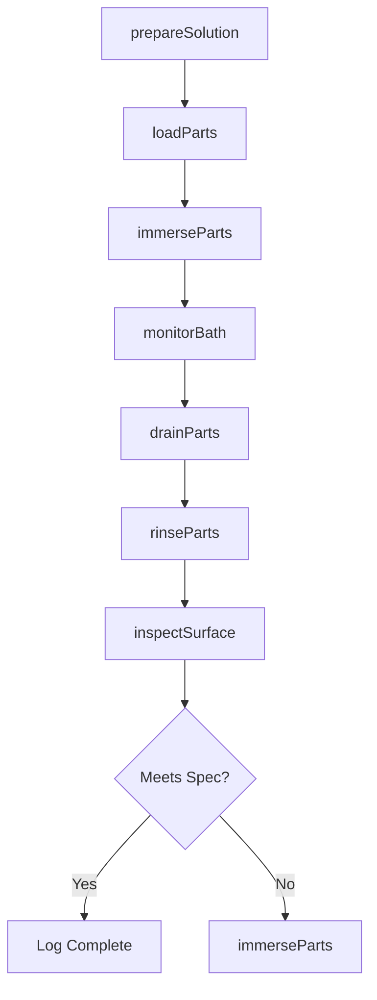
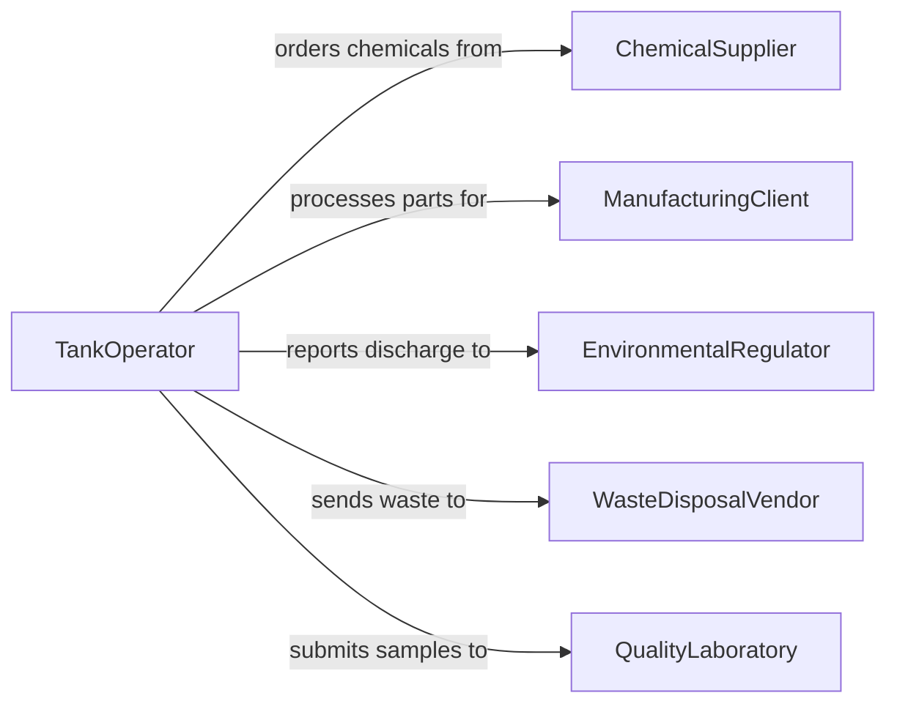

# Immerse Objects or Workpieces in Cleaning or Coating Solutions

> Business-as-Code definition for immersion-based cleaning and coating operations. Models the dipping, soaking, and draining of parts and workpieces through chemical baths for surface preparation, plating, or finishing.

## Overview

Immersion processing involves submerging objects or workpieces into tanks containing cleaning agents, pickling solutions, plating baths, or protective coatings. This definition covers the sequencing of dip tanks, monitoring of solution chemistry, tracking of soak times, and quality verification of treated surfaces across electroplating, anodizing, phosphating, and industrial parts washing operations.

## Actors

| Actor | Description |
|-------|-------------|
| ChemicalSupplier | Provides cleaning agents, plating solutions, and coating chemicals |
| ManufacturingClient | Sends parts for surface treatment or coating services |
| EnvironmentalRegulator | Enforces discharge and hazardous waste handling standards |
| WasteDisposalVendor | Handles spent chemical solutions and rinse water disposal |
| QualityLaboratory | Tests coating thickness, adhesion, and surface cleanliness |

## Roles

| Role | Description |
|------|-------------|
| TankOperator | Manages immersion cycles and monitors bath conditions |
| ProcessEngineer | Specifies solution chemistry, temperatures, and dwell times |
| QualityInspector | Verifies treated surfaces meet coating or cleanliness standards |
| SafetyCoordinator | Ensures proper PPE use and chemical handling procedures |

## Entities

| Entity | Description |
|--------|-------------|
| DipTank | A vessel containing a cleaning or coating solution |
| Workpiece | An object or part being immersed for treatment |
| SolutionBatch | A prepared chemical bath with tracked concentration and pH |
| ImmersionCycle | A timed sequence of dip, soak, and drain for a load of parts |
| RinseStation | A water bath used between chemical immersion stages |
| CoatingSpec | Target thickness, adhesion, and appearance parameters |
| ProcessLog | A record of immersion parameters for a batch of parts |

## Actions

| Action | Description |
|--------|-------------|
| prepareSolution | Mix and verify chemistry of a dip tank solution |
| loadParts | Place workpieces into baskets or racks for immersion |
| immerseParts | Lower parts into the specified tank for treatment |
| monitorBath | Check solution temperature, concentration, and pH |
| rinseParts | Transfer parts through rinse stations between treatments |
| drainParts | Remove parts from solution and allow excess to drip off |
| inspectSurface | Verify coating thickness, adhesion, or cleanliness of treated parts |

## Events

| Event | Description |
|-------|-------------|
| solutionPrepared | Dip tank chemistry has been mixed and verified |
| partsLoaded | Workpieces have been racked and staged for immersion |
| partsImmersed | Parts have been submerged in the treatment solution |
| bathMonitored | Solution parameters have been checked and recorded |
| partsRinsed | Parts have passed through the rinse cycle |
| partsDrained | Treated parts have been removed and drained |
| surfaceInspected | Coating or cleanliness verification is complete |

## Searches

| Search | Description |
|--------|-------------|
| findImmersionCycles | Locate immersion records by part number, date, or tank |
| getSolutionStatus | Retrieve current chemistry and usage data for a dip tank |
| getCoatingResults | Look up inspection results for treated part batches |
| findExpiringSolutions | List tanks approaching solution replacement thresholds |

## Workflow



## Actor Relationships



## Usage

### Calling Actions

```typescript
import { immerseObjectsWorkpiecesCleaningCoating } from '@headlessly/immerse-objects-workpieces-cleaning-coating'

const immersion = immerseObjectsWorkpiecesCleaningCoating()

// Prepare a zinc plating bath
await immersion.prepareSolution({
  tankId: 'TANK-03',
  solutionType: 'acid-zinc',
  targetPh: 4.5,
  temperatureCelsius: 28
})

// Immerse a batch of parts
await immersion.immerseParts({
  tankId: 'TANK-03',
  rackId: 'RACK-2024-0115',
  dwellTimeMinutes: 12,
  agitation: true
})

// Inspect the plated surface
const result = await immersion.inspectSurface({
  rackId: 'RACK-2024-0115',
  coatingSpec: { minThicknessMicrons: 8, maxThicknessMicrons: 15 }
})
```

### Event-Driven Automation

```typescript
// Alert when bath chemistry drifts out of range
immersion.bathMonitored(async ({ tankId, ph, temperature }) => {
  if (ph < 4.0 || ph > 5.0) {
    await notify({
      to: 'process-engineer',
      message: `Tank ${tankId} pH out of range: ${ph}`
    })
  }
})

// Schedule solution replacement
immersion.partsImmersed(async ({ tankId, totalPartsProcessed }) => {
  if (totalPartsProcessed > 5000) {
    await maintenance.scheduleReplacement({ tankId, priority: 'standard' })
  }
})
```
