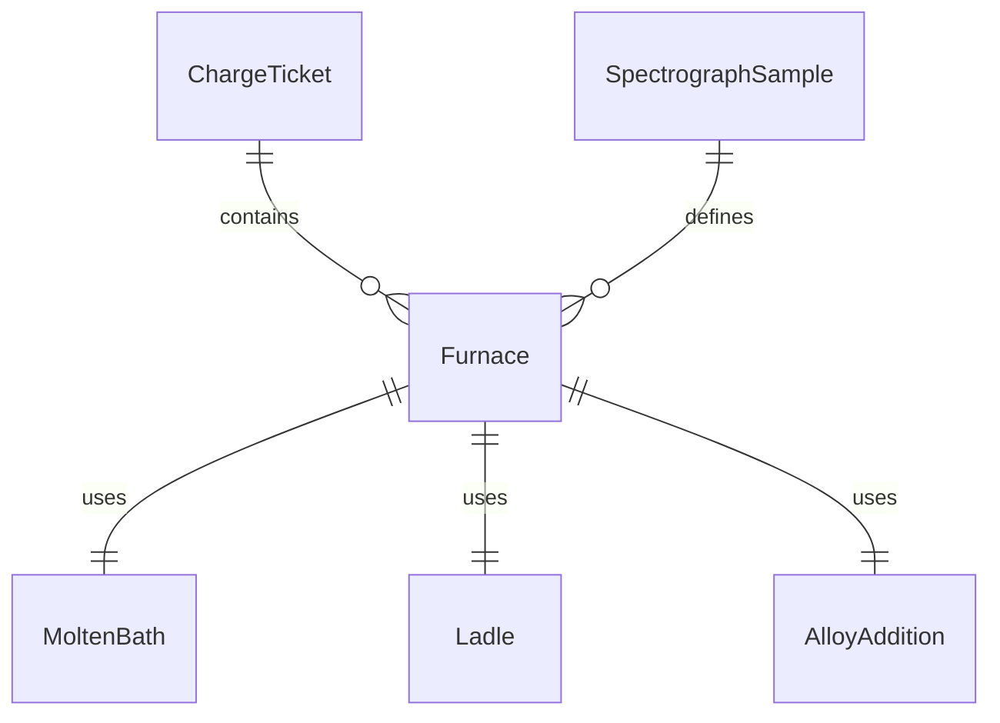
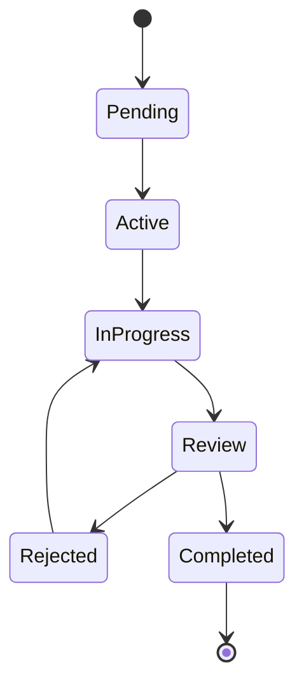
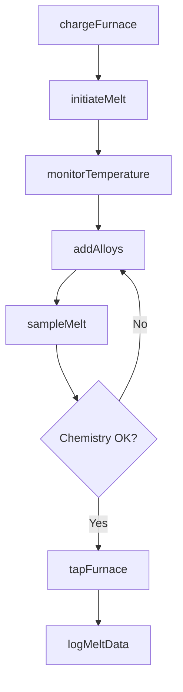
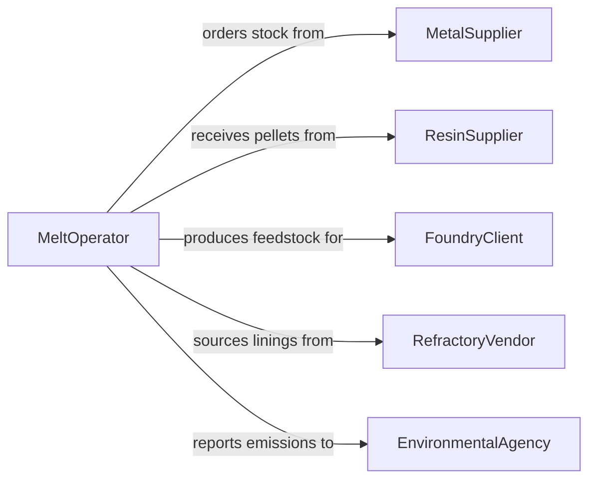

# Melt Metal, Plastic, or Other Materials to Prepare for Production

> Business-as-Code definition for melting operations in manufacturing. Models the charging, melting, alloying, and tapping of metals, plastics, and other materials for casting, molding, or extrusion processes.

## Overview

Melting materials for production involves loading furnaces or crucibles with raw stock, scrap, or pellets, raising them to liquidus temperature, adjusting composition through alloying or additives, and transferring molten material to casting or molding equipment. This definition covers foundry operations, injection molding preparation, glass melting, and plastics extrusion feedstock processing.

## Actors

| Actor | Description |
|-------|-------------|
| MetalSupplier | Provides ingots, scrap, and alloying elements |
| ResinSupplier | Delivers plastic pellets, granules, and masterbatch colorants |
| FoundryClient | Orders castings or molded parts requiring melted feedstock |
| RefractoryVendor | Supplies furnace linings, crucibles, and refractory materials |
| EnvironmentalAgency | Monitors emissions from melting operations |

## Roles

| Role | Description |
|------|-------------|
| MeltOperator | Charges furnaces and manages the melting process |
| Metallurgist | Specifies alloy composition and melting parameters |
| QualityTechnician | Samples and tests molten material for composition and temperature |
| MaintenanceCrew | Services furnaces, ladles, and melt handling equipment |

## Entities

| Entity | Description |
|--------|-------------|
| Furnace | An induction, arc, or crucible furnace used to melt materials |
| ChargeTicket | A recipe specifying raw materials, scrap ratios, and alloy additions |
| MoltenBath | The pool of liquefied material in the furnace |
| Ladle | A vessel used to transfer molten material to molds or machines |
| AlloyAddition | A measured quantity of alloying element added to the melt |
| SpectrographSample | A specimen taken from the melt for compositional analysis |
| MeltLog | A record of temperatures, charge weights, and chemistry results |

## Actions

| Action | Description |
|--------|-------------|
| chargeFurnace | Load raw materials and scrap into the melting vessel |
| initiateMelt | Start heating the charge to melting temperature |
| monitorTemperature | Track melt temperature against target setpoint |
| addAlloys | Introduce alloying elements to adjust composition |
| sampleMelt | Extract a specimen from the molten bath for analysis |
| tapFurnace | Transfer molten material from the furnace to ladles or molds |
| logMeltData | Record temperatures, weights, and chemistry for the heat |

## Events

| Event | Description |
|-------|-------------|
| furnaceCharged | Raw materials have been loaded into the furnace |
| meltInitiated | Heating has begun on the charged furnace |
| meltTemperatureReached | Molten bath has reached the target temperature |
| alloysAdded | Composition adjustments have been made to the melt |
| meltSampled | A spectrograph sample has been taken from the bath |
| furnaceTapped | Molten material has been transferred to receiving vessels |
| meltDataLogged | All heat data has been recorded in the melt log |

## Searches

| Search | Description |
|--------|-------------|
| findMeltLogs | Locate melt records by alloy type, date, or furnace |
| getChargeTickets | Retrieve charge recipes for a specific alloy or product |
| getMeltChemistry | Look up spectrograph results for a given heat |
| getFurnaceUtilization | Calculate furnace usage and throughput over a period |


## Entity Relationships



## State Diagram



## Workflow



## Actor Relationships



## Usage

### Calling Actions

```typescript
import { meltMetalPlasticMaterialsPrepare } from '@headlessly/melt-metal-plastic-materials-prepare'

const melting = meltMetalPlasticMaterialsPrepare()

// Charge the furnace with a specified recipe
await melting.chargeFurnace({
  furnaceId: 'IF-01',
  chargeTicket: {
    alloy: 'A356',
    components: [
      { material: 'aluminum-ingot', weightKg: 500 },
      { material: 'silicon', weightKg: 35 },
      { material: 'return-scrap', weightKg: 200 }
    ]
  }
})

// Sample the melt for composition check
const sample = await melting.sampleMelt({
  furnaceId: 'IF-01',
  sampleType: 'spectrograph'
})

// Tap once chemistry is confirmed
await melting.tapFurnace({
  furnaceId: 'IF-01',
  ladleId: 'LADLE-03',
  targetTempCelsius: 720
})
```

### Event-Driven Automation

```typescript
// Alert metallurgist on chemistry deviation
melting.meltSampled(async ({ furnaceId, results, targetSpec }) => {
  const outOfSpec = results.filter(r => r.value > r.max || r.value < r.min)
  if (outOfSpec.length > 0) {
    await notify({
      to: 'metallurgist',
      message: `Furnace ${furnaceId}: ${outOfSpec.length} elements out of spec`
    })
  }
})

// Track furnace throughput
melting.furnaceTapped(async ({ furnaceId, weightKg }) => {
  await production.recordOutput({ furnaceId, weightKg, unit: 'kg' })
})
```
