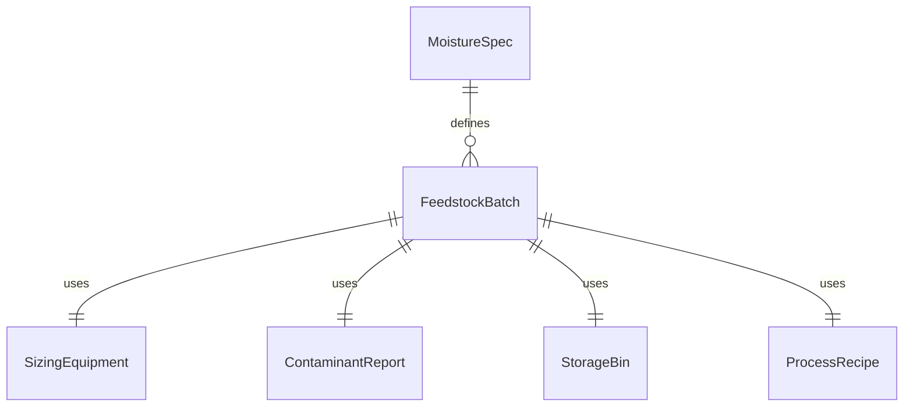
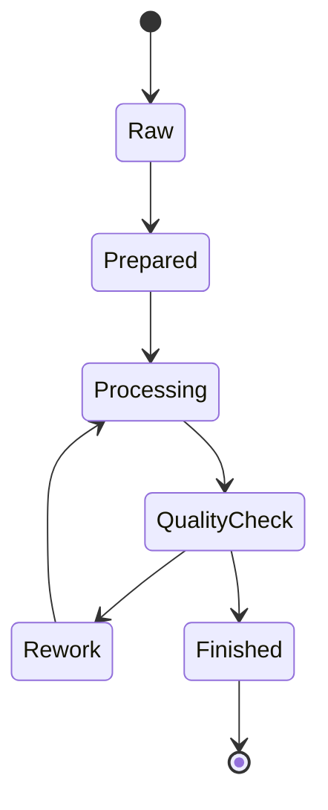
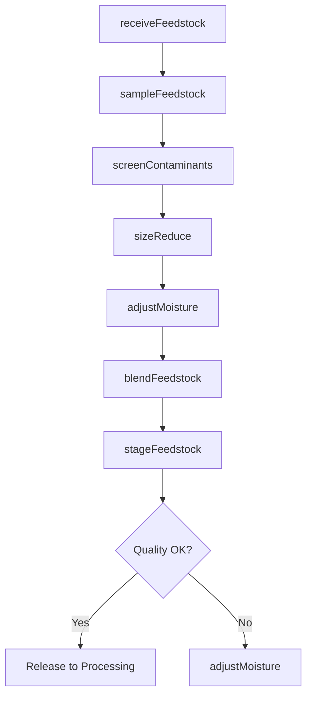
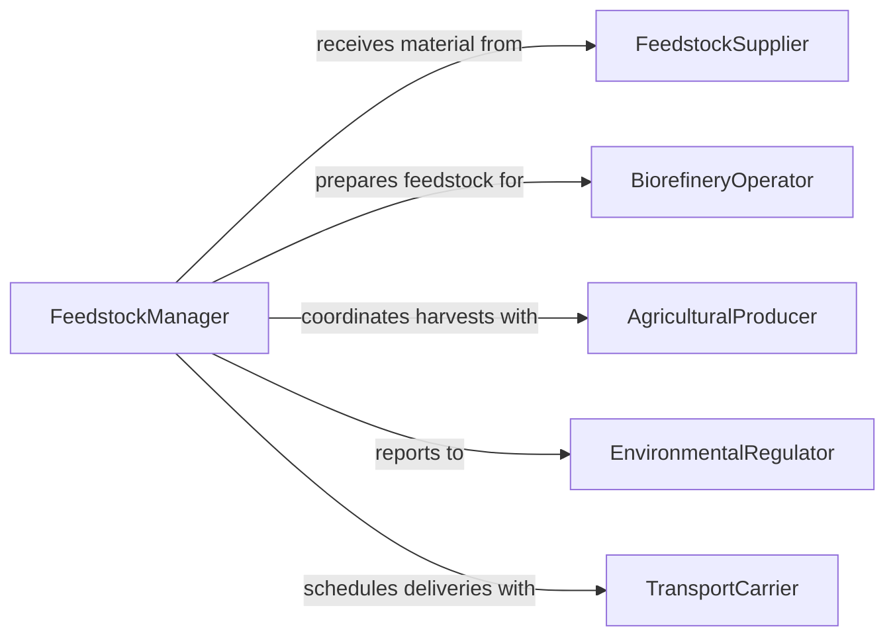

# Prepare Biological Feedstock for Physical, Chemical, or Biological Processing

> Business-as-Code definition for biological feedstock preparation. Models the receiving, sorting, sizing, and conditioning of biomass, agricultural residues, and organic materials for bioprocessing, biofuel production, or composting operations.

## Overview

Preparing biological feedstock involves receiving raw organic materials, removing contaminants, reducing particle size through chipping or grinding, adjusting moisture content, and staging material for downstream processing. This definition covers biomass preprocessing for ethanol and biodiesel production, anaerobic digestion feedstock preparation, pharmaceutical fermentation substrate handling, and composting facility intake operations.

## Actors

| Actor | Description |
|-------|-------------|
| FeedstockSupplier | Provides agricultural residues, wood chips, or organic waste |
| BiorefineryOperator | Processes prepared feedstock into biofuels or biochemicals |
| AgriculturalProducer | Grows and harvests crops or residues used as feedstock |
| EnvironmentalRegulator | Monitors emissions and waste streams from bioprocessing |
| TransportCarrier | Delivers bulk feedstock to the processing facility |

## Roles

| Role | Description |
|------|-------------|
| FeedstockManager | Oversees receiving, quality checks, and inventory of raw materials |
| ProcessTechnician | Operates sizing, drying, and conditioning equipment |
| QualityAnalyst | Tests moisture, composition, and contaminant levels in feedstock |
| LogisticsCoordinator | Schedules deliveries and manages feedstock storage areas |

## Entities

| Entity | Description |
|--------|-------------|
| FeedstockBatch | A received lot of biological material with tracked origin and quality |
| SizingEquipment | Chippers, grinders, or hammer mills used to reduce particle size |
| MoistureSpec | Target moisture content range for downstream processing |
| ContaminantReport | A record of foreign material or chemical contaminants found |
| StorageBin | A silo, bunker, or covered pile holding prepared feedstock |
| ProcessRecipe | Specifications for feedstock type, particle size, and moisture |
| ReceivingLog | Documentation of incoming deliveries with weight and quality data |

## Actions

| Action | Description |
|--------|-------------|
| receiveFeedstock | Accept and weigh incoming biological material deliveries |
| screenContaminants | Remove stones, metal, plastic, and other foreign materials |
| sizeReduce | Chip, grind, or mill feedstock to target particle dimensions |
| adjustMoisture | Dry or hydrate feedstock to meet processing moisture requirements |
| blendFeedstock | Mix different feedstock types to achieve target composition |
| stageFeedstock | Transfer prepared material to storage bins or conveyors |
| sampleFeedstock | Collect specimens for moisture, composition, and quality testing |

## Events

| Event | Description |
|-------|-------------|
| feedstockReceived | A delivery of biological material has been weighed and logged |
| contaminantsScreened | Foreign material has been removed from the feedstock |
| sizeReduced | Feedstock has been processed to target particle dimensions |
| moistureAdjusted | Feedstock moisture content has been brought within specification |
| feedstockBlended | Multiple feedstock types have been combined per the recipe |
| feedstockStaged | Prepared material is in storage and ready for processing |
| feedstockSampled | Quality specimens have been collected and submitted for analysis |

## Searches

| Search | Description |
|--------|-------------|
| findFeedstockBatches | Locate batches by supplier, material type, or receiving date |
| getMoistureResults | Retrieve moisture content test data for a batch |
| getContaminantReports | Look up contamination findings by batch or delivery |
| getStorageInventory | Check available prepared feedstock by type and bin location |


## Entity Relationships



## State Diagram



## Workflow



## Actor Relationships



## Usage

### Calling Actions

```typescript
import { prepareBiologicalFeedstockPhysicalChemical } from '@headlessly/prepare-biological-feedstock-physical-chemical'

const feedstock = prepareBiologicalFeedstockPhysicalChemical()

// Receive incoming biomass delivery
const batch = await feedstock.receiveFeedstock({
  supplierId: 'AG-COOP-042',
  materialType: 'corn-stover',
  weightTonnes: 25,
  deliveryDate: '2024-09-15'
})

// Size reduce to target particle dimensions
await feedstock.sizeReduce({
  batchId: batch.id,
  equipment: 'hammer-mill-01',
  targetSizeMm: 6,
  screenMesh: 8
})

// Adjust moisture for fermentation
await feedstock.adjustMoisture({
  batchId: batch.id,
  targetMoisturePercent: 20,
  method: 'rotary-dryer'
})
```

### Event-Driven Automation

```typescript
// Alert on high contamination levels
feedstock.contaminantsScreened(async ({ batchId, contaminantPercent }) => {
  if (contaminantPercent > 2.0) {
    await notify({
      to: 'feedstock-manager',
      message: `Batch ${batchId}: contamination at ${contaminantPercent}% exceeds threshold`
    })
  }
})

// Auto-schedule processing when storage reaches capacity
feedstock.feedstockStaged(async ({ binId, fillPercent }) => {
  if (fillPercent > 85) {
    await processing.scheduleRun({
      binId,
      priority: 'high',
      reason: 'storage-capacity'
    })
  }
})
```
