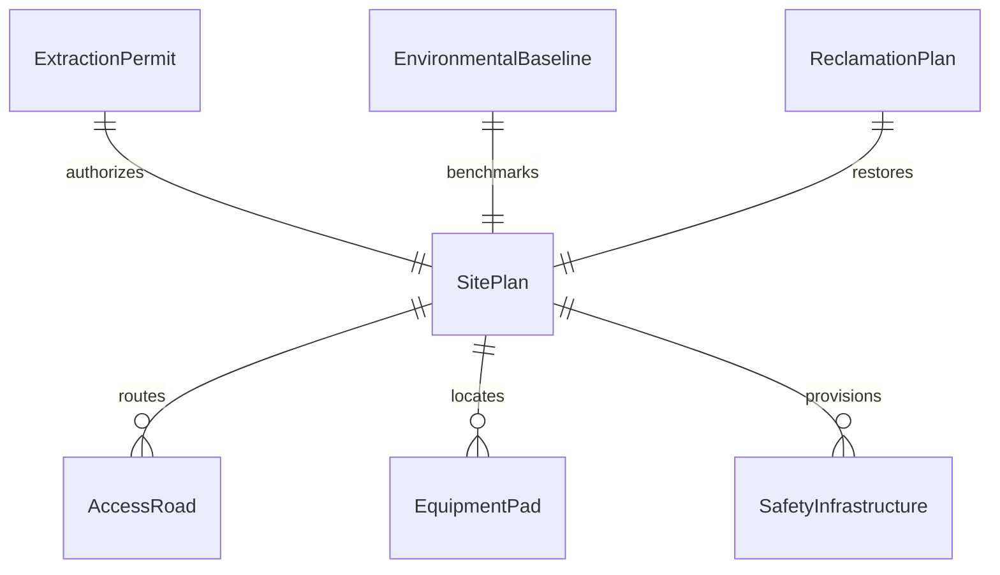
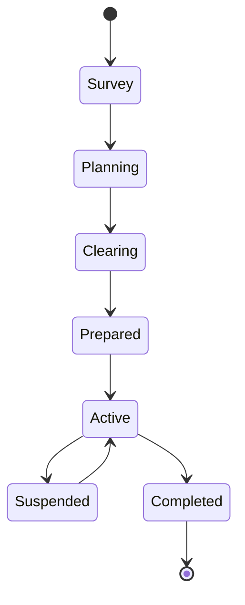
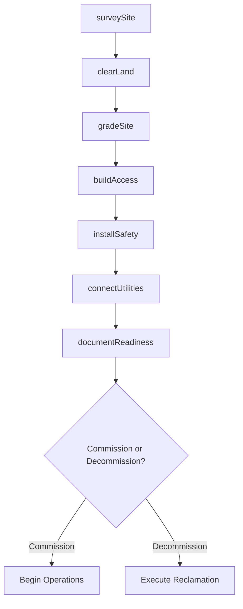
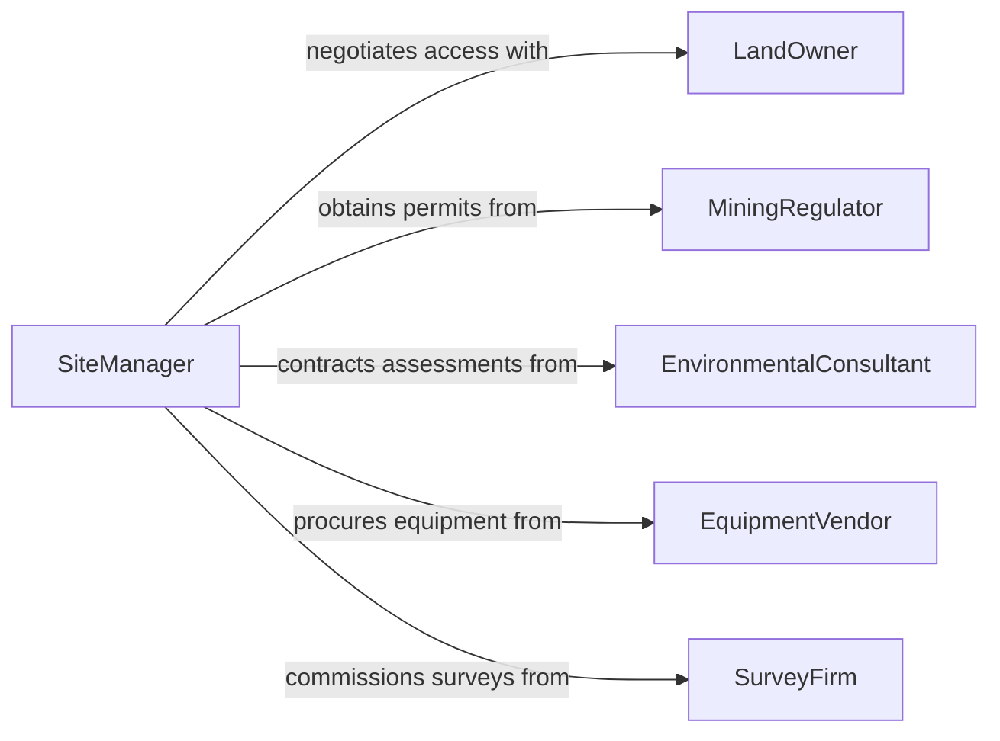

# Prepare Excavation or Extraction Sites for Commissioning or Decommissioning

> Business-as-Code definition for site preparation at excavation and extraction operations. Models the readiness activities for bringing mining, quarrying, or drilling sites online or safely shutting them down.

## Overview

Preparing excavation or extraction sites involves clearing land, establishing access roads, installing safety infrastructure, and configuring equipment pads for new operations, or reversing these steps during decommissioning. This definition covers site surveys, environmental baseline assessments, infrastructure staging, and regulatory closeout documentation for mining, oil and gas, quarrying, and earthwork operations.

## Actors

| Actor | Description |
|-------|-------------|
| LandOwner | Holds title or mineral rights to the extraction site |
| MiningRegulator | Issues extraction permits and enforces reclamation standards |
| EnvironmentalConsultant | Conducts baseline assessments and monitors remediation |
| EquipmentVendor | Supplies heavy machinery for site preparation and extraction |
| SurveyFirm | Performs land surveys, boundary marking, and topographic mapping |
| UtilityProvider | Connects power, water, and communications to the site |

## Roles

| Role | Description |
|------|-------------|
| SiteManager | Oversees all commissioning or decommissioning activities |
| CivilEngineer | Designs grading plans, access roads, and drainage systems |
| EnvironmentalOfficer | Manages environmental compliance and monitoring programs |
| SafetySupervisor | Enforces site safety protocols during preparation activities |

## Entities

| Entity | Description |
|--------|-------------|
| SitePlan | An engineering document detailing layout, grading, and infrastructure |
| ExtractionPermit | Regulatory authorization to begin extraction operations |
| AccessRoad | A constructed path providing equipment and personnel access |
| EquipmentPad | A prepared, level surface for heavy equipment placement |
| EnvironmentalBaseline | Pre-operation measurements of soil, water, and air quality |
| ReclamationPlan | A mandated plan for restoring the site after operations cease |
| SafetyInfrastructure | Fencing, signage, berms, and emergency stations at the site |

## Actions

| Action | Description |
|--------|-------------|
| surveySite | Conduct topographic and boundary surveys of the property |
| clearLand | Remove vegetation, debris, and obstructions from the site |
| gradeSite | Shape terrain to design elevations for operations or drainage |
| buildAccess | Construct roads and entry points for equipment and personnel |
| installSafety | Erect fencing, signage, berms, and emergency equipment |
| connectUtilities | Establish power, water, and communications connections |
| documentReadiness | Compile commissioning or decommissioning documentation |

## Events

| Event | Description |
|-------|-------------|
| siteSurveyed | Topographic and boundary data have been collected |
| landCleared | Vegetation and obstructions have been removed |
| siteGraded | Terrain has been shaped to design specifications |
| accessBuilt | Roads and entry points are operational |
| safetyInstalled | Safety infrastructure is in place and inspected |
| utilitiesConnected | Power, water, and communications are active |
| readinessDocumented | All commissioning or decommissioning records have been filed |

## Searches

| Search | Description |
|--------|-------------|
| findSitePlans | Locate site plans by project, permit number, or location |
| getPermitStatus | Check extraction permit status and expiration dates |
| getBaselineData | Retrieve environmental baseline measurements for a site |
| findReclamationPlans | List reclamation plans by site or regulatory requirement |
| getSiteReadiness | Get current commissioning milestone completion status |


## Entity Relationships



## State Diagram



## Workflow



## Actor Relationships



## Usage

### Calling Actions

```typescript
import { prepareExcavationExtractionSitesCommissioning } from '@headlessly/prepare-excavation-extraction-sites-commissioning'

const site = prepareExcavationExtractionSitesCommissioning()

// Survey the extraction site
const survey = await site.surveySite({
  projectId: 'MINE-2024-0012',
  location: { lat: 39.7392, lng: -104.9903 },
  surveyType: 'topographic'
})

// Grade the site to design specifications
await site.gradeSite({
  sitePlanId: 'SP-2024-0012',
  cutFillBalance: { cutCubicYards: 15000, fillCubicYards: 12000 }
})

// Document commissioning readiness
await site.documentReadiness({
  projectId: 'MINE-2024-0012',
  milestones: ['survey', 'clearing', 'grading', 'access', 'safety', 'utilities'],
  status: 'complete'
})
```

### Event-Driven Automation

```typescript
// Notify regulator when site preparation is complete
site.readinessDocumented(async ({ projectId, type }) => {
  if (type === 'commissioning') {
    await regulatory.submitNotice({
      projectId,
      noticeType: 'operations-commencement'
    })
  }
})

// Trigger environmental monitoring on land clearing
site.landCleared(async ({ projectId, acreage }) => {
  await environmental.initiateMonitoring({
    projectId,
    parameters: ['sediment', 'stormwater', 'dust'],
    frequency: 'weekly'
  })
})
```
