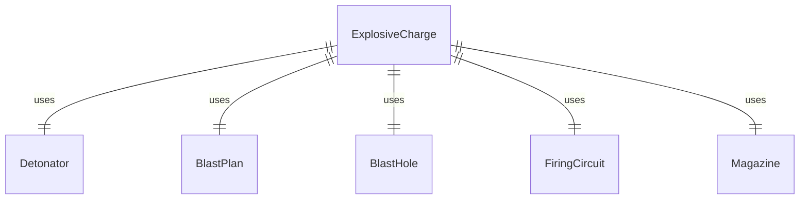
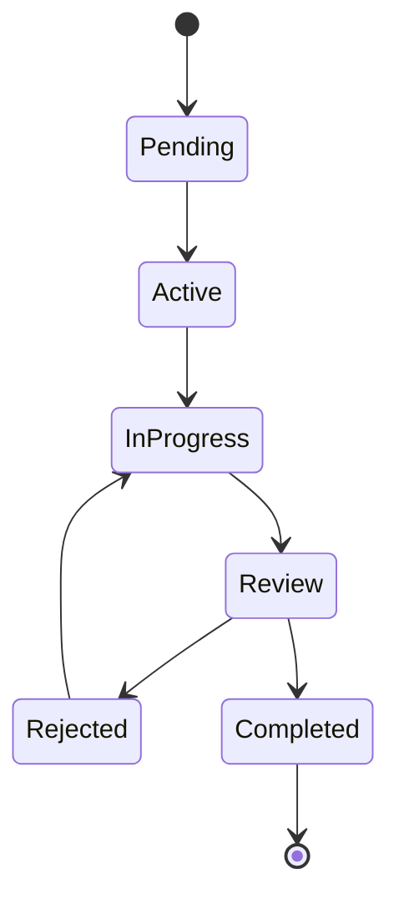
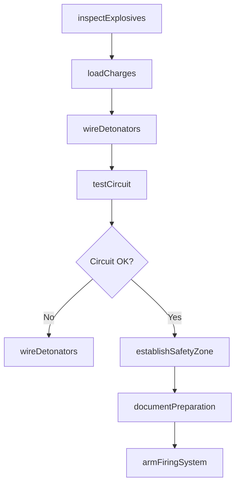
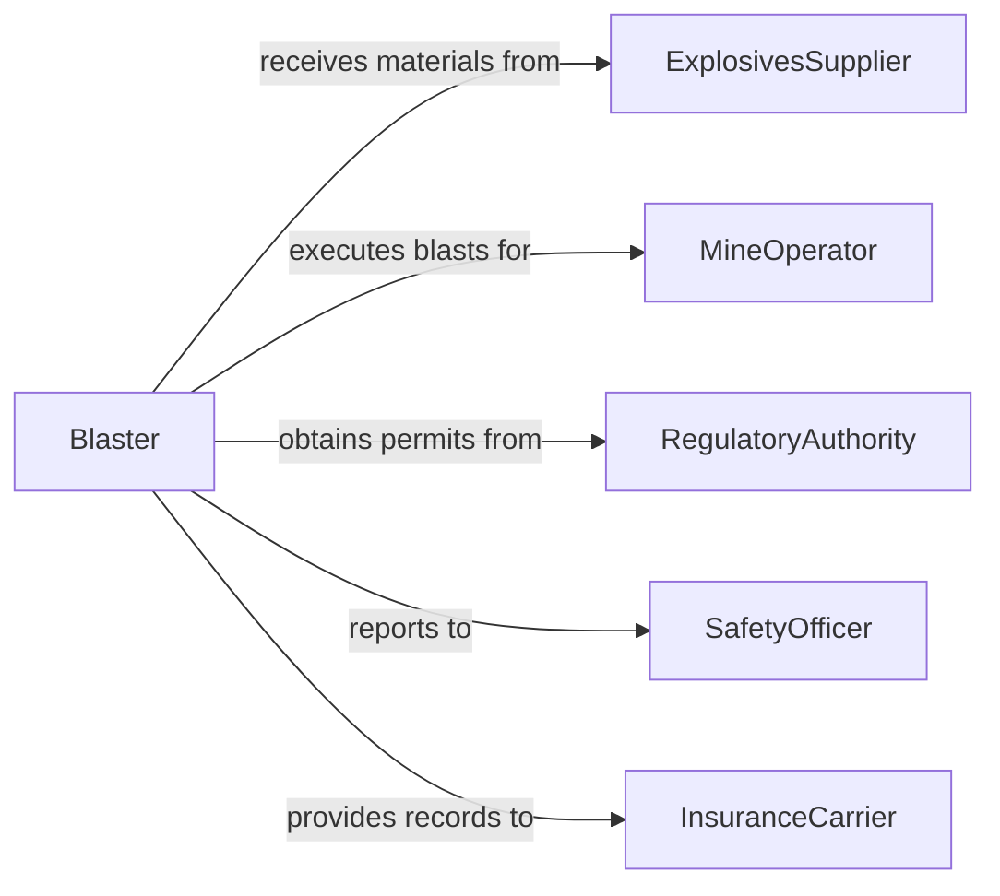

# Prepare Explosives for Detonation

> Business-as-Code definition for explosives preparation and detonation readiness. Models the safe handling, placement, wiring, and verification of explosive charges for mining, demolition, and construction blasting operations.

## Overview

Preparing explosives for detonation involves receiving, inspecting, and configuring explosive materials, detonators, and blasting circuits according to engineered blast plans. This definition covers the full preparation cycle from magazine storage through charge placement, circuit testing, and final readiness verification in compliance with ATF and MSHA regulations.

## Actors

| Actor | Description |
|-------|-------------|
| ExplosivesSupplier | Manufactures and delivers explosive materials and detonators |
| MineOperator | Commissions blasting operations for ore extraction |
| RegulatoryAuthority | Issues blasting permits and enforces safety regulations |
| DemolitionClient | Contracts blasting services for structure demolition |
| InsuranceCarrier | Underwrites liability coverage for blasting operations |
| EnvironmentalAgency | Monitors blast impacts on surrounding ecosystems |

## Roles

| Role | Description |
|------|-------------|
| Blaster | Licensed professional who prepares and fires explosive charges |
| BlastEngineer | Designs blast patterns and calculates charge specifications |
| SafetyOfficer | Enforces safety protocols during explosives handling |
| MagazineKeeper | Manages storage, inventory, and chain-of-custody for explosives |

## Entities

| Entity | Description |
|--------|-------------|
| ExplosiveCharge | A measured quantity of explosive material configured for detonation |
| Detonator | An initiating device used to trigger an explosive charge |
| BlastPlan | An engineered document specifying charge placement, timing, and safety zones |
| BlastHole | A drilled cavity into which explosive charges are loaded |
| FiringCircuit | The wired or wireless connection linking detonators to the firing system |
| Magazine | A secure storage facility for explosive materials |
| BlastPermit | Regulatory authorization to conduct blasting at a specific site |
| SafetyZone | A defined perimeter area cleared of personnel before detonation |

## Actions

| Action | Description |
|--------|-------------|
| inspectExplosives | Verify condition and shelf life of explosive materials |
| loadCharges | Place explosive material into blast holes per the blast plan |
| wireDetonators | Connect detonators to the firing circuit in specified sequence |
| testCircuit | Verify electrical continuity and resistance of the firing circuit |
| establishSafetyZone | Secure and clear the blast perimeter of all personnel |
| armFiringSystem | Enable the firing mechanism for detonation readiness |
| documentPreparation | Record charge weights, placements, and circuit test results |

## Events

| Event | Description |
|-------|-------------|
| explosivesInspected | Explosive materials have passed condition and compliance checks |
| chargesLoaded | All blast holes have been loaded per the blast plan |
| detonatorsWired | Firing circuit connections have been completed |
| circuitTested | Firing circuit continuity has been verified |
| safetyZoneEstablished | Blast perimeter has been cleared and secured |
| firingSystemArmed | Detonation system is in armed and ready state |
| preparationDocumented | All preparation records have been filed |

## Searches

| Search | Description |
|--------|-------------|
| findBlastPlans | Locate blast plans by site, date, or permit number |
| getExplosiveInventory | Retrieve magazine inventory by material type and lot number |
| getCircuitTestResults | Look up firing circuit test logs for a specific blast |
| findActivePermits | List current blasting permits by site or jurisdiction |
| getPreparationLog | Retrieve charge and wiring documentation for a blast event |


## Entity Relationships



## State Diagram



## Workflow



## Actor Relationships



## Usage

### Calling Actions

```typescript
import { prepareExplosivesDetonation } from '@headlessly/prepare-explosives-detonation'

const blasting = prepareExplosivesDetonation()

// Inspect explosives from magazine
const inspection = await blasting.inspectExplosives({
  magazineId: 'MAG-North-01',
  lotNumbers: ['LOT-2024-4421', 'LOT-2024-4422'],
  materialType: 'ANFO'
})

// Load charges per blast plan
await blasting.loadCharges({
  blastPlanId: 'BP-2024-0087',
  holes: [
    { holeId: 'H1', chargeWeight: 25, unit: 'kg' },
    { holeId: 'H2', chargeWeight: 30, unit: 'kg' }
  ]
})

// Test the firing circuit
const test = await blasting.testCircuit({
  circuitId: 'FC-2024-0087',
  expectedResistanceOhms: 12.5,
  tolerancePercent: 5
})
```

### Event-Driven Automation

```typescript
// Alert safety officer on circuit failure
blasting.circuitTested(async ({ circuitId, passed, resistance }) => {
  if (!passed) {
    await notify({
      to: 'safety-officer',
      message: `Circuit ${circuitId} failed: measured ${resistance} ohms`
    })
  }
})

// Log regulatory compliance on system arming
blasting.firingSystemArmed(async ({ blastPlanId, timestamp }) => {
  await compliance.recordEvent({
    type: 'blast-armed',
    blastPlanId,
    timestamp,
    status: 'ready'
  })
})
```
