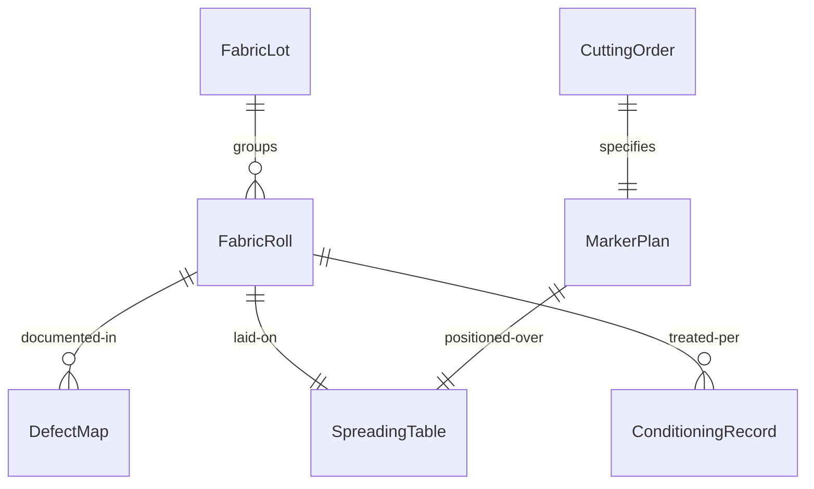
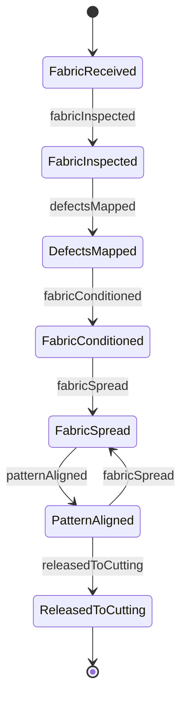
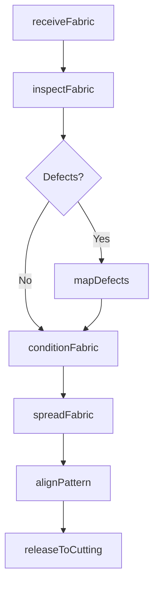
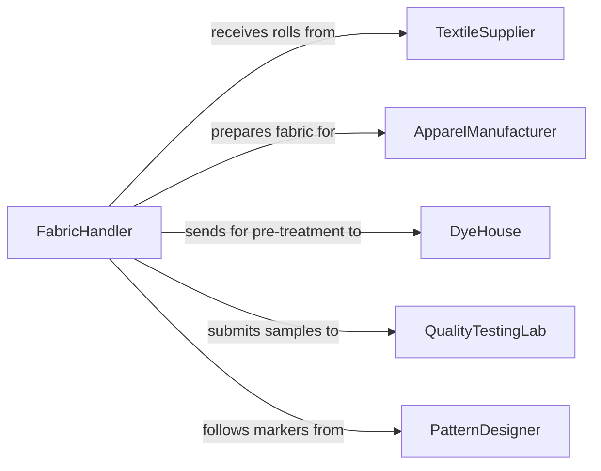

# Prepare Fabrics or Materials for Processing or Production

> Business-as-Code definition for fabric and textile preparation operations. Models the inspection, spreading, marking, and conditioning of fabrics and soft materials before cutting, sewing, or finishing processes.

## Overview

Preparing fabrics or materials for processing involves receiving bolts or rolls, inspecting for defects, spreading material on cutting tables, aligning patterns, and conditioning fibers through pre-washing or steaming. This definition covers textile manufacturing prep, upholstery fabrication staging, and industrial fabric handling for filtration, insulation, or composite lay-up operations.

## Actors

| Actor | Description |
|-------|-------------|
| TextileSupplier | Provides bolts, rolls, and specialty fabrics |
| ApparelManufacturer | Orders prepared fabrics for garment production lines |
| DyeHouse | Pre-treats and colors fabrics before cutting |
| QualityTestingLab | Tests fabric weight, shrinkage, and colorfastness |
| PatternDesigner | Creates cutting layouts and marker plans for fabric utilization |

## Roles

| Role | Description |
|------|-------------|
| FabricHandler | Receives, inspects, and stages fabric rolls for production |
| SpreadingOperator | Lays out fabric on cutting tables in precise layers |
| QualityChecker | Inspects fabric for weaving defects, stains, and shade variations |
| ProductionPlanner | Schedules fabric preparation based on cutting orders |

## Entities

| Entity | Description |
|--------|-------------|
| FabricRoll | A bolt or roll of textile material received from a supplier |
| SpreadingTable | A surface on which fabric is laid out in layers for cutting |
| DefectMap | A record of flaw locations on a fabric roll |
| MarkerPlan | A layout of pattern pieces optimized for material utilization |
| FabricLot | A group of rolls sharing the same dye lot and specifications |
| ConditioningRecord | A log of pre-wash, steam, or relaxation treatments applied |
| CuttingOrder | A production request specifying fabric type, quantity, and patterns |

## Actions

| Action | Description |
|--------|-------------|
| receiveFabric | Accept and log incoming fabric rolls against purchase orders |
| inspectFabric | Examine fabric for defects, shade, and dimensional accuracy |
| conditionFabric | Pre-wash, steam, or relax fabric to stabilize dimensions |
| spreadFabric | Lay fabric on cutting tables in specified layers and orientations |
| alignPattern | Position marker plans on the spread fabric for cutting |
| mapDefects | Record locations and types of flaws found during inspection |
| releaseToCutting | Approve prepared fabric for the cutting department |

## Events

| Event | Description |
|-------|-------------|
| fabricReceived | Fabric rolls have been logged into inventory |
| fabricInspected | Quality inspection of fabric is complete |
| fabricConditioned | Pre-treatment of fabric has been completed |
| fabricSpread | Fabric has been laid out on the cutting table |
| patternAligned | Marker plan has been positioned on the spread |
| defectsMapped | Flaw locations have been documented |
| releasedToCutting | Prepared fabric has been approved for cutting operations |

## Searches

| Search | Description |
|--------|-------------|
| findFabricRolls | Locate rolls by type, color, supplier, or dye lot |
| getDefectMaps | Retrieve defect documentation for a specific roll |
| getCuttingOrders | List pending cutting orders by priority or fabric type |
| getConditioningHistory | Look up treatment records for a fabric lot |


## Entity Relationships



## State Diagram



## Workflow



## Actor Relationships



## Usage

### Calling Actions

```typescript
import { prepareFabricsMaterialsProcessingProduction } from '@headlessly/prepare-fabrics-materials-processing-production'

const fabric = prepareFabricsMaterialsProcessingProduction()

// Receive and inspect incoming fabric
const roll = await fabric.receiveFabric({
  rollId: 'ROLL-2024-0887',
  supplier: 'Milliken Textiles',
  fabricType: 'cotton-twill',
  weightGsm: 280,
  widthCm: 150
})

const inspection = await fabric.inspectFabric({
  rollId: roll.id,
  checkpoints: ['shade', 'weave-defects', 'width-consistency']
})

// Spread for cutting
await fabric.spreadFabric({
  tableId: 'TABLE-A2',
  rollIds: ['ROLL-2024-0887', 'ROLL-2024-0888'],
  layers: 24,
  direction: 'face-up'
})
```

### Event-Driven Automation

```typescript
// Flag rolls with excessive defects
fabric.fabricInspected(async ({ rollId, defectCount, metersInspected }) => {
  const defectRate = defectCount / metersInspected
  if (defectRate > 0.05) {
    await purchasing.raiseClaimWithSupplier({
      rollId,
      reason: 'excessive-defects',
      defectRate
    })
  }
})

// Auto-schedule conditioning after receipt
fabric.fabricReceived(async ({ rollId, fabricType }) => {
  if (fabricType.includes('cotton')) {
    await fabric.conditionFabric({
      rollId,
      treatment: 'pre-wash',
      temperatureCelsius: 40
    })
  }
})
```
