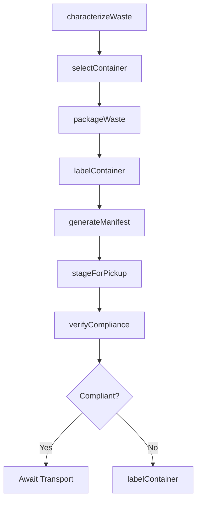
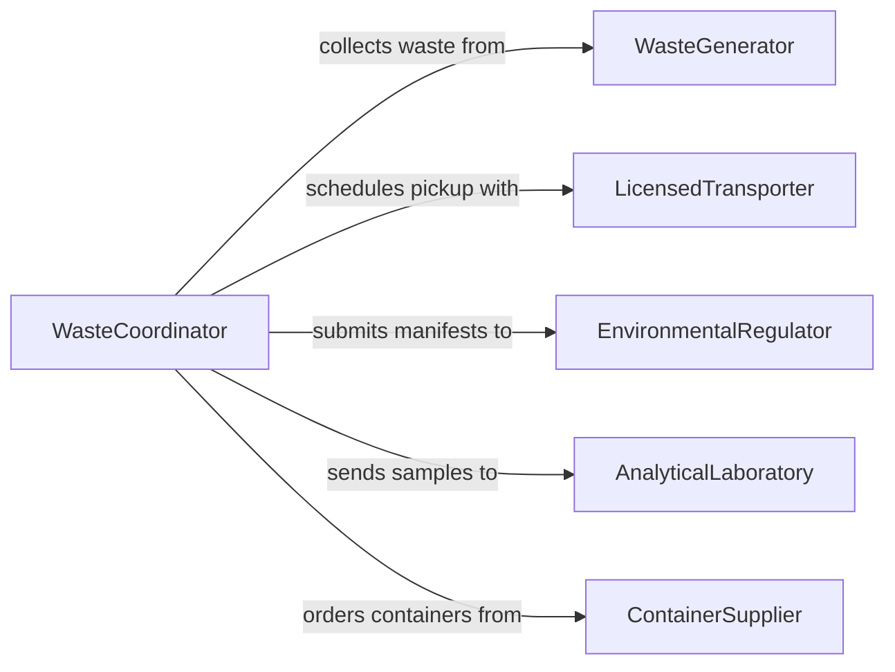

# Prepare Hazardous Waste for Processing or Disposal

> Business-as-Code definition for hazardous waste preparation operations. Models the characterization, containment, labeling, and staging of hazardous materials for compliant treatment, storage, or disposal.

## Overview

Preparing hazardous waste for processing or disposal involves identifying waste streams, characterizing chemical and physical properties, selecting appropriate containment, and packaging materials in accordance with EPA RCRA regulations and DOT shipping requirements. This definition covers waste profiling, container selection, labeling, manifest generation, and staging for pickup by licensed transporters.

## Actors

| Actor | Description |
|-------|-------------|
| WasteGenerator | The facility producing hazardous waste requiring disposal |
| LicensedTransporter | Hauls hazardous waste under DOT and EPA permits |
| TreatmentFacility | Processes or neutralizes hazardous waste streams |
| EnvironmentalRegulator | Enforces RCRA, CERCLA, and state hazardous waste rules |
| AnalyticalLaboratory | Performs waste characterization and testing |
| ContainerSupplier | Provides DOT-rated drums, tanks, and containment vessels |

## Roles

| Role | Description |
|------|-------------|
| WasteCoordinator | Manages waste profiling, packaging, and manifest workflows |
| EnvironmentalTechnician | Samples, characterizes, and packages hazardous waste |
| ComplianceOfficer | Ensures all preparation activities meet regulatory standards |
| StorageAreaManager | Oversees satellite and central accumulation areas |

## Entities

| Entity | Description |
|--------|-------------|
| WasteProfile | A characterization document identifying waste type and hazards |
| Container | A DOT-rated drum, tote, or tank holding hazardous waste |
| HazardLabel | A regulatory label indicating waste class, UN number, and hazards |
| Manifest | A uniform hazardous waste manifest tracking waste from cradle to grave |
| AccumulationArea | A designated storage location for waste awaiting transport |
| WasteSample | A collected specimen used for laboratory characterization |
| DisposalRecord | Documentation of final treatment or disposal of a waste batch |

## Actions

| Action | Description |
|--------|-------------|
| characterizeWaste | Sample and analyze waste to determine hazard classification |
| selectContainer | Choose appropriate DOT-rated containment for the waste type |
| packageWaste | Transfer waste into approved containers with proper absorbents |
| labelContainer | Apply hazard labels, waste codes, and accumulation start dates |
| generateManifest | Create a uniform hazardous waste manifest for transport |
| stageForPickup | Move packaged containers to the designated accumulation area |
| verifyCompliance | Audit packaging, labeling, and documentation for regulatory compliance |

## Events

| Event | Description |
|-------|-------------|
| wasteCharacterized | Waste stream hazard classification has been determined |
| containerSelected | Appropriate containment has been identified and procured |
| wastePackaged | Waste has been transferred into approved containers |
| containerLabeled | Hazard labels and regulatory markings have been applied |
| manifestGenerated | Transport manifest has been created and signed |
| wasteStaged | Packaged waste has been placed in the accumulation area |
| complianceVerified | Packaging and documentation have passed regulatory audit |

## Searches

| Search | Description |
|--------|-------------|
| findWasteProfiles | Locate waste characterization records by stream, code, or generator |
| getManifests | Retrieve manifests by date range, transporter, or destination |
| getAccumulationStatus | Check container counts and start dates in accumulation areas |
| findExpiringContainers | List containers approaching 90-day accumulation limits |
| getDisposalHistory | Look up disposal records by waste stream or treatment facility |

## Workflow



## Actor Relationships



## Usage

### Calling Actions

```typescript
import { prepareHazardousWasteProcessingDisposal } from '@headlessly/prepare-hazardous-waste-processing-disposal'

const hazwaste = prepareHazardousWasteProcessingDisposal()

// Characterize a waste stream
const profile = await hazwaste.characterizeWaste({
  streamId: 'WS-2024-0034',
  sampleIds: ['SAM-001', 'SAM-002'],
  wasteCodes: ['D001', 'D007']
})

// Package waste into approved containers
await hazwaste.packageWaste({
  profileId: profile.id,
  containerType: '55-gallon-steel-drum',
  quantity: 4,
  absorbent: 'vermiculite'
})

// Generate the transport manifest
const manifest = await hazwaste.generateManifest({
  generatorId: 'EPA-ID-TXD000123456',
  transporterId: 'EPA-ID-TXD000654321',
  destinationFacility: 'Clean Harbors Deer Park'
})
```

### Event-Driven Automation

```typescript
// Alert on approaching 90-day accumulation limit
hazwaste.wasteStaged(async ({ containerId, startDate }) => {
  const daysRemaining = 90 - daysSince(startDate)
  if (daysRemaining <= 14) {
    await notify({
      to: 'waste-coordinator',
      message: `Container ${containerId} expires in ${daysRemaining} days`
    })
  }
})

// Auto-file manifest with regulator on generation
hazwaste.manifestGenerated(async ({ manifestId, generatorId }) => {
  await regulatory.submitManifest({ manifestId, generatorId })
})
```
