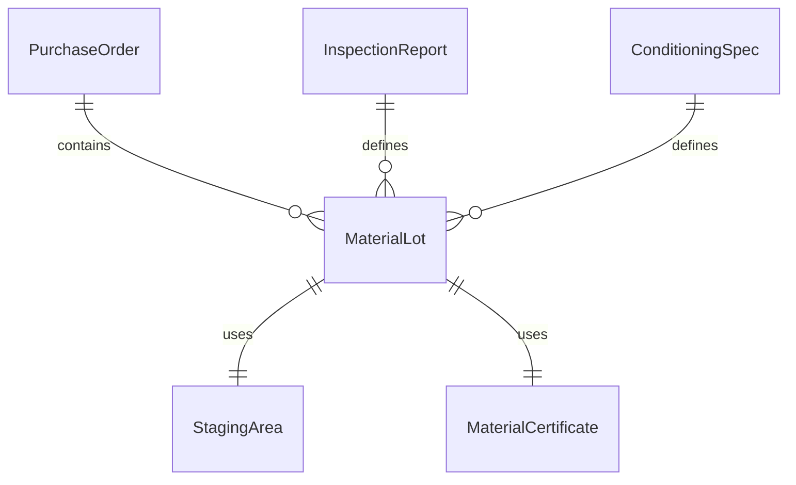
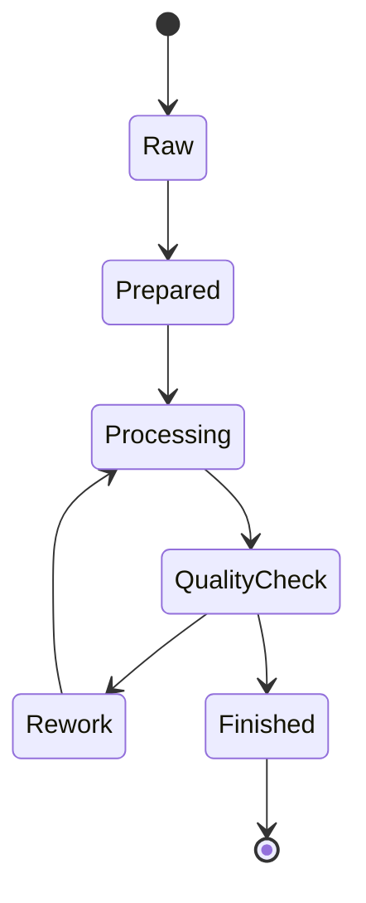
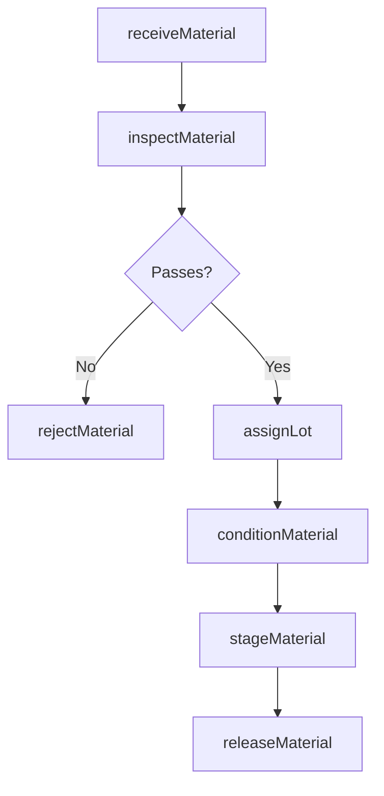
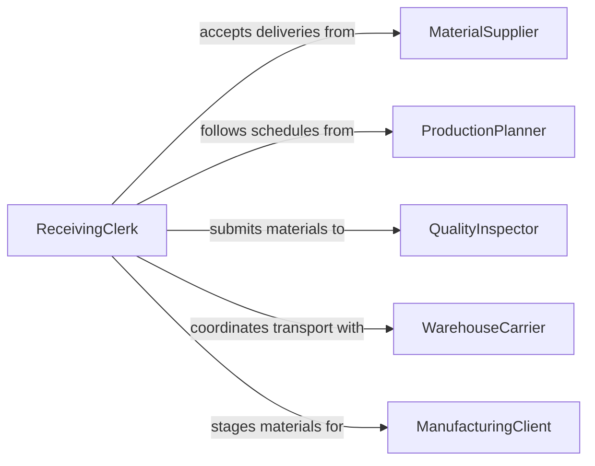

# Prepare Materials for Processing

> Business-as-Code definition for general material preparation operations. Models the receiving, inspecting, staging, and conditioning of raw materials and components before manufacturing or processing begins.

## Overview

Preparing materials for processing encompasses the intake, verification, and readying of raw stock, semi-finished goods, and components for downstream manufacturing operations. This definition covers material receiving, incoming quality inspection, lot tracking, staging at work centers, and pre-conditioning steps such as cleaning, degreasing, or temperature acclimation that apply across metalworking, woodworking, plastics, and general manufacturing.

## Actors

| Actor | Description |
|-------|-------------|
| MaterialSupplier | Delivers raw materials, stock, and semi-finished components |
| ProductionPlanner | Determines material requirements and schedules deliveries |
| QualityInspector | Performs incoming inspection on received materials |
| WarehouseCarrier | Transports materials from receiving dock to storage or work centers |
| ManufacturingClient | Orders finished products that require prepared materials |

## Roles

| Role | Description |
|------|-------------|
| ReceivingClerk | Logs incoming materials and verifies against purchase orders |
| MaterialPrepper | Cleans, conditions, and stages materials at production work centers |
| QualityTechnician | Inspects incoming materials for dimensional and quality compliance |
| InventoryController | Manages material lot tracking and storage location assignments |

## Entities

| Entity | Description |
|--------|-------------|
| MaterialLot | A tracked quantity of raw material with supplier and quality data |
| PurchaseOrder | A procurement document specifying material type, quantity, and delivery |
| InspectionReport | Results of incoming quality checks on received materials |
| StagingArea | A designated location near a work center for prepared materials |
| ConditioningSpec | Requirements for pre-processing treatment such as cleaning or drying |
| MaterialCertificate | A supplier-provided document certifying material properties |
| WorkOrder | A production request that triggers material preparation |

## Actions

| Action | Description |
|--------|-------------|
| receiveMaterial | Accept deliveries and verify against purchase order quantities |
| inspectMaterial | Check dimensional, visual, and certification compliance |
| assignLot | Create a tracked lot number and assign storage location |
| conditionMaterial | Clean, degrease, dry, or acclimate material as required |
| stageMaterial | Move prepared material to the designated work center area |
| releaseMaterial | Approve material for use in production operations |
| rejectMaterial | Flag non-conforming material for return or disposition |

## Events

| Event | Description |
|-------|-------------|
| materialReceived | Incoming material has been logged and counted |
| materialInspected | Quality inspection results have been recorded |
| lotAssigned | Material has been assigned a lot number and storage location |
| materialConditioned | Pre-processing treatment has been completed |
| materialStaged | Material is positioned at the work center and ready for use |
| materialReleased | Material has been approved for production consumption |
| materialRejected | Non-conforming material has been flagged for disposition |

## Searches

| Search | Description |
|--------|-------------|
| findMaterialLots | Locate lots by material type, supplier, or receiving date |
| getInspectionResults | Retrieve incoming inspection data for a lot or purchase order |
| getStagedMaterials | List materials currently staged at a work center |
| findPendingOrders | Check purchase orders awaiting delivery or inspection |
| getRejectionHistory | Look up material rejection records by supplier or reason |


## Entity Relationships



## State Diagram



## Workflow



## Actor Relationships



## Usage

### Calling Actions

```typescript
import { prepareMaterialsProcessing } from '@headlessly/prepare-materials-processing'

const materials = prepareMaterialsProcessing()

// Receive a material delivery
const lot = await materials.receiveMaterial({
  purchaseOrderId: 'PO-2024-1192',
  materialType: 'stainless-steel-316L',
  quantityKg: 500,
  supplierCert: 'CERT-2024-4401'
})

// Inspect and condition
const inspection = await materials.inspectMaterial({
  lotId: lot.id,
  checks: ['dimensions', 'surface-finish', 'certification']
})

await materials.conditionMaterial({
  lotId: lot.id,
  treatment: 'degrease',
  solvent: 'acetone'
})
```

### Event-Driven Automation

```typescript
// Notify production when material is staged
materials.materialStaged(async ({ lotId, workCenter }) => {
  await production.notifyReady({
    lotId,
    workCenter,
    status: 'material-available'
  })
})

// Track supplier quality performance
materials.materialRejected(async ({ lotId, supplierId, reason }) => {
  await supplierManagement.recordNonConformance({
    supplierId,
    lotId,
    reason,
    date: new Date().toISOString()
  })
})
```
