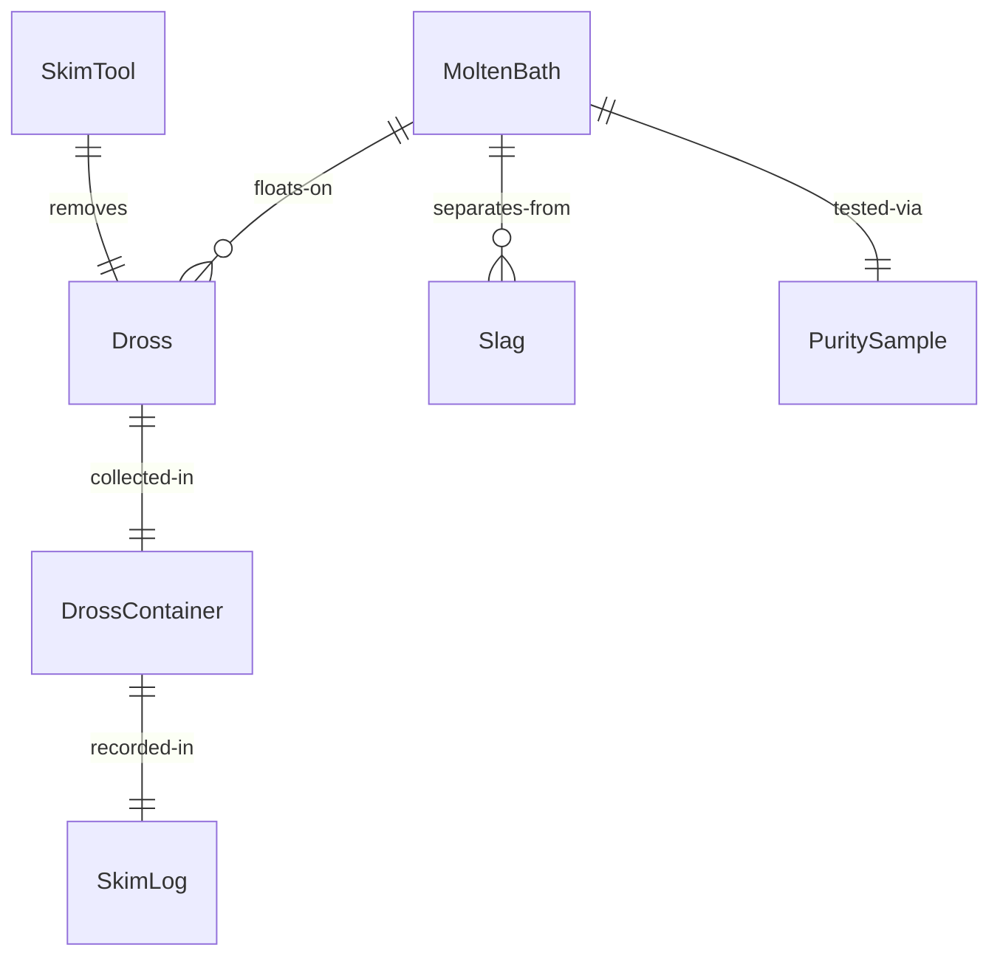
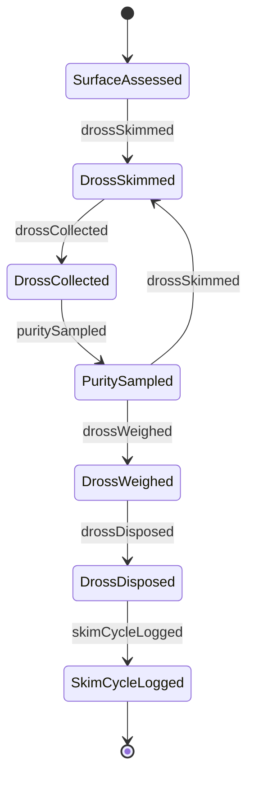
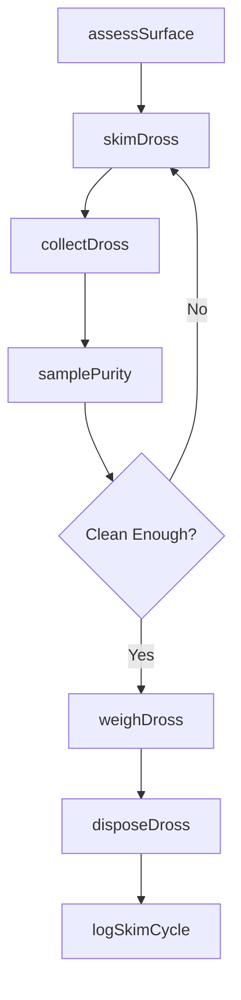
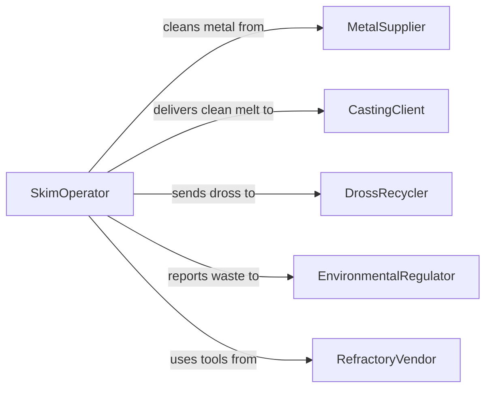

# Skim Impurities from Molten Metal

> Business-as-Code definition for dross and slag removal from molten metal. Models the skimming, testing, and disposal of surface impurities during foundry and smelting operations.

## Overview

Skimming impurities from molten metal involves removing dross, slag, and oxide layers that form on the surface of molten baths during melting and holding operations. This definition covers manual and mechanical skimming techniques, dross composition analysis, timing of skim cycles relative to pouring, and proper handling of hot waste materials in aluminum, iron, steel, and non-ferrous foundry environments.

## Actors

| Actor | Description |
|-------|-------------|
| MetalSupplier | Provides primary metals and alloys whose purity affects dross levels |
| CastingClient | Receives clean molten metal for casting operations |
| DrossRecycler | Recovers residual metal from collected dross and slag |
| EnvironmentalRegulator | Monitors waste handling and emissions from skimming operations |
| RefractoryVendor | Supplies skimming tools, ladles, and furnace linings |

## Roles

| Role | Description |
|------|-------------|
| SkimOperator | Performs dross and slag removal from the molten surface |
| Metallurgist | Determines skim frequency and evaluates metal cleanliness |
| QualityTechnician | Samples molten metal to verify purity after skimming |
| SafetyCoordinator | Enforces PPE and hot material handling protocols |

## Entities

| Entity | Description |
|--------|-------------|
| MoltenBath | A furnace or ladle containing liquid metal |
| Dross | Oxidized metal and impurities floating on the molten surface |
| Slag | Non-metallic byproducts separated from the melt |
| SkimTool | A specialized rake or spoon used to remove surface impurities |
| DrossContainer | A heat-resistant vessel for collecting removed impurities |
| PuritySample | A specimen taken from the melt to measure cleanliness |
| SkimLog | A record of skim times, dross weights, and purity results |

## Actions

| Action | Description |
|--------|-------------|
| assessSurface | Evaluate the molten bath surface for dross and slag accumulation |
| skimDross | Remove floating impurities from the molten metal surface |
| collectDross | Transfer removed dross into designated heat-resistant containers |
| samplePurity | Extract a specimen from the cleaned melt for analysis |
| weighDross | Record the weight of collected dross for yield tracking |
| disposeDross | Route dross containers to recycling or waste handling |
| logSkimCycle | Document skim timing, quantities, and purity results |

## Events

| Event | Description |
|-------|-------------|
| surfaceAssessed | Molten bath surface has been evaluated for impurity levels |
| drossSkimmed | Surface impurities have been removed from the melt |
| drossCollected | Removed dross has been placed in designated containers |
| puritySampled | A cleanliness specimen has been taken from the melt |
| drossWeighed | Collected dross weight has been recorded |
| drossDisposed | Dross containers have been routed for recycling or disposal |
| skimCycleLogged | All skim data has been documented |

## Searches

| Search | Description |
|--------|-------------|
| findSkimLogs | Locate skim records by furnace, alloy, or date |
| getDrossYield | Calculate metal recovery rates from dross by alloy type |
| getPurityResults | Retrieve melt cleanliness data after skimming |
| getDrossInventory | Check collected dross containers awaiting recycling |


## Entity Relationships



## State Diagram



## Workflow



## Actor Relationships



## Usage

### Calling Actions

```typescript
import { skimImpuritiesMoltenMetal } from '@headlessly/skim-impurities-molten-metal'

const skimming = skimImpuritiesMoltenMetal()

// Assess and skim the furnace surface
const assessment = await skimming.assessSurface({
  furnaceId: 'IF-02',
  alloy: 'A380',
  temperatureCelsius: 680
})

await skimming.skimDross({
  furnaceId: 'IF-02',
  tool: 'perforated-ladle',
  estimatedDrossKg: assessment.estimatedDrossKg
})

// Sample purity after skimming
const purity = await skimming.samplePurity({
  furnaceId: 'IF-02',
  testType: 'inclusion-count'
})
```

### Event-Driven Automation

```typescript
// Auto-schedule skim based on hold time
skimming.surfaceAssessed(async ({ furnaceId, drossThicknessMm }) => {
  if (drossThicknessMm > 15) {
    await skimming.skimDross({
      furnaceId,
      tool: 'mechanical-skimmer',
      priority: 'immediate'
    })
  }
})

// Track dross recycling value
skimming.drossWeighed(async ({ containerId, weightKg, alloy }) => {
  await recycling.estimateRecovery({
    containerId,
    weightKg,
    alloy,
    expectedRecoveryPercent: 45
  })
})
```
