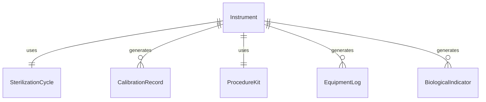
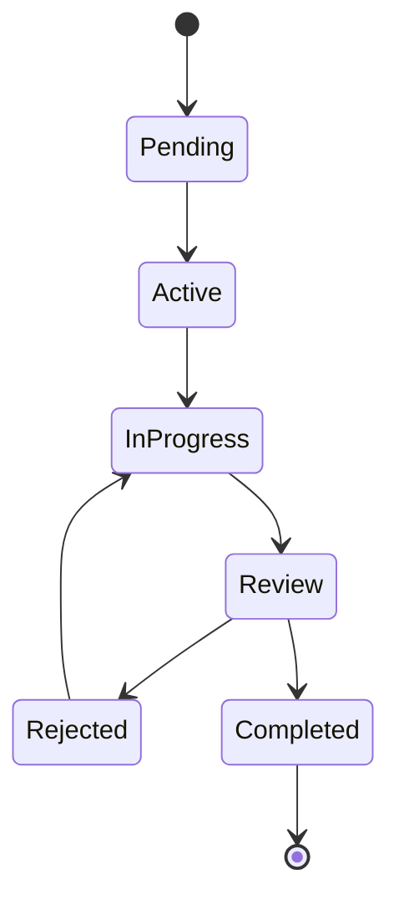
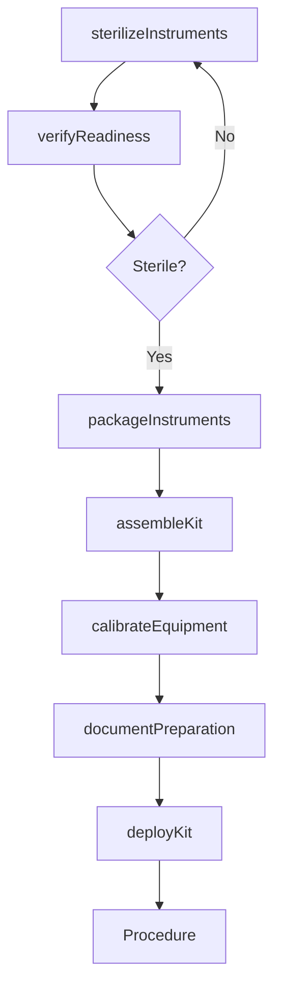
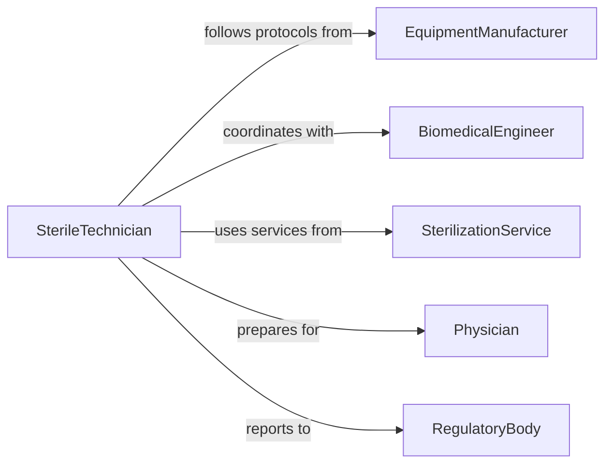

# Prepare Medical Instruments Equipment Use

> Business-as-Code definition for preparing medical instruments and equipment for clinical procedures and patient care operations.

## Overview

Medical instrument preparation involves sterilization, assembly, calibration, and readiness verification to ensure safe and effective use in patient care. This definition exposes actions for pre-procedure setup, equipment validation, and compliance documentation across healthcare environments.

## Actors

| Actor | Description |
|-------|-------------|
| EquipmentManufacturer | Supplies medical instruments and maintenance specifications |
| SterilizationService | Provides sterilization and decontamination services |
| BiomedicalEngineer | Maintains and calibrates medical equipment |
| Physician | Uses prepared instruments in procedures |
| RegulatoryBody | Enforces medical device safety standards |
| SupplyVendor | Provides consumables and disposables for procedures |

## Roles

| Role | Description |
|------|-------------|
| SterileTechician | Sterilizes and prepares surgical instruments |
| EquipmentSpecialist | Calibrates and validates medical devices |
| OperatingRoomNurse | Sets up instruments for procedures |
| QualityCoordinator | Ensures preparation meets safety standards |

## Entities

| Entity | Description |
|--------|-------------|
| Instrument | A medical tool or device used in patient care |
| SterilizationCycle | A completed sterilization process with validation data |
| CalibrationRecord | Equipment accuracy verification documentation |
| ProcedureKit | A complete set of instruments for a specific procedure |
| EquipmentLog | Usage and maintenance history for devices |
| BiologicalIndicator | Sterilization effectiveness test result |

## Actions

| Action | Description |
|--------|-------------|
| sterilizeInstruments | Process instruments through sterilization cycle |
| assembleKit | Gather instruments for specific procedure |
| calibrateEquipment | Verify and adjust equipment accuracy |
| verifyReadiness | Confirm instruments meet use requirements |
| documentPreparation | Record preparation steps for compliance |
| packageInstruments | Seal sterilized instruments for storage |
| deployKit | Deliver prepared instruments to procedure location |

## Events

| Event | Description |
|-------|-------------|
| instrumentsSterilized | Sterilization cycle completed successfully |
| kitAssembled | All required instruments gathered |
| equipmentCalibrated | Device accuracy verified and adjusted |
| readinessVerified | Instruments confirmed ready for use |
| preparationDocumented | Preparation records completed |
| instrumentsPackaged | Sterilized instruments sealed and labeled |
| kitDeployed | Instruments delivered to procedure area |

## Searches

| Search | Description |
|--------|-------------|
| findInstruments | List instruments by type, status, or location |
| getSterilizationCycles | Retrieve sterilization records by date or batch |
| getCalibrationRecords | Find equipment calibration history |
| getProcedureKits | Retrieve kit specifications for procedures |


## Entity Relationships



## State Diagram



## Workflow



## Actor Relationships



## Usage

### Calling Actions

```typescript
import { prepareMedicalInstrumentsEquipmentUse } from '@headlessly/prepare-medical-instruments-equipment-use'

const medicalPrep = prepareMedicalInstrumentsEquipmentUse()

// Sterilize surgical instruments
const sterilization = await medicalPrep.sterilizeInstruments({
  instrumentIds: ['scalpel-12', 'forceps-89', 'clamp-45'],
  method: 'autoclave',
  cycleType: 'gravity-displacement',
  temperature: 132,
  duration: 30
})

// Verify sterilization effectiveness
const verification = await medicalPrep.verifyReadiness({
  batchId: sterilization.batchId,
  biologicalIndicator: 'bi-test-334',
  chemicalIndicator: 'ci-strip-221'
})

// Assemble procedure-specific kit
const kit = await medicalPrep.assembleKit({
  procedureType: 'laparoscopic-cholecystectomy',
  instruments: sterilization.instrumentIds,
  additionalItems: ['trocar-set', 'electrocautery-pencil']
})

// Calibrate electronic equipment
await medicalPrep.calibrateEquipment({
  equipmentId: 'electrocautery-unit-7',
  parameters: { outputPower: 40, impedance: 100 },
  standard: 'ISO-60601'
})

// Document and deploy
await medicalPrep.documentPreparation({
  kitId: kit.id,
  technician: 'sterile-tech-22',
  verificationChecks: ['sterility', 'completeness', 'functionality']
})

await medicalPrep.deployKit({
  kitId: kit.id,
  destination: 'or-suite-3',
  scheduledProcedure: 'procedure-8844'
})
```

### Event-Driven Automation

```typescript
// Alert on sterilization failure
medicalPrep.instrumentsSterilized(async ({ batchId, passed, indicators }) => {
  if (!passed) {
    await notify({
      to: 'sterile-processing-supervisor',
      priority: 'critical',
      message: `Sterilization batch ${batchId} failed validation`
    })
  }
})

// Auto-schedule equipment maintenance
medicalPrep.equipmentCalibrated(async ({ equipmentId, nextCalibrationDate }) => {
  await scheduler.schedule({
    task: 'equipment-calibration',
    equipmentId,
    date: nextCalibrationDate
  })
})
```
