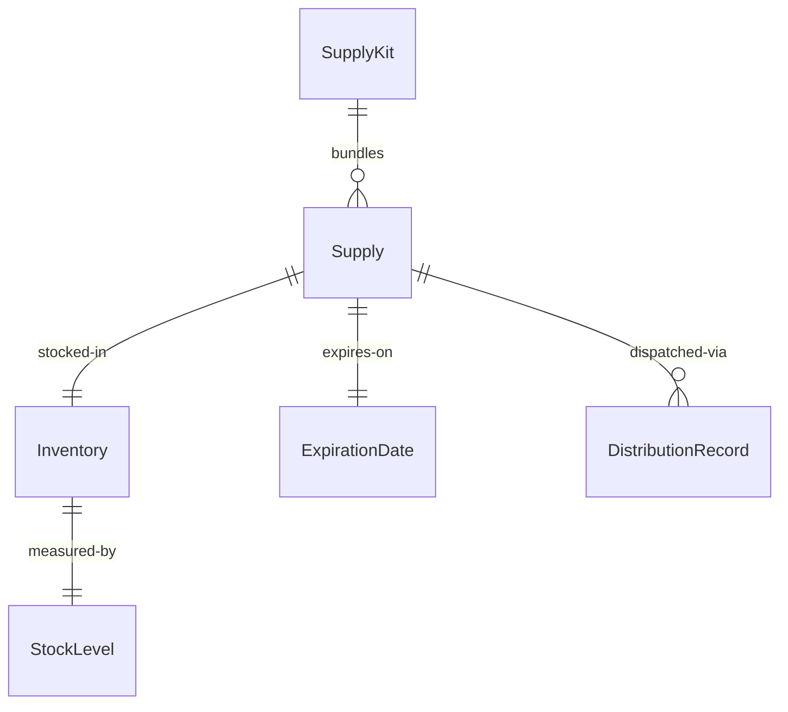
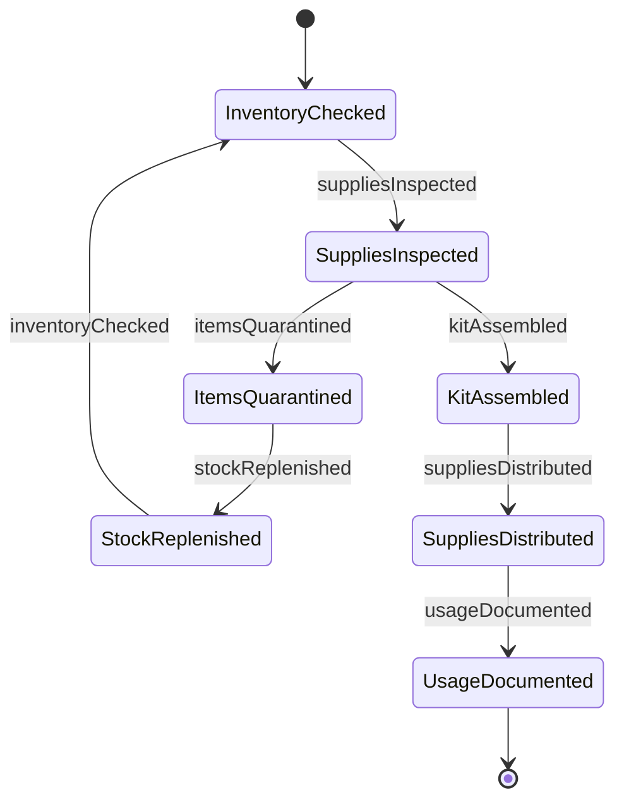
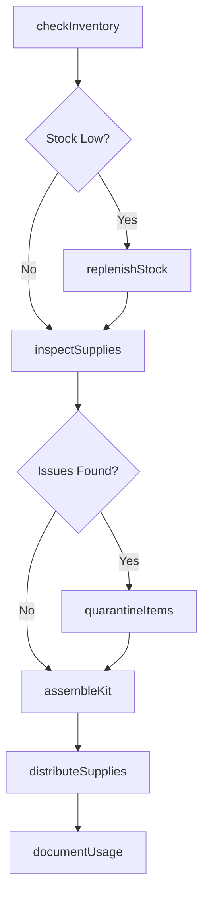
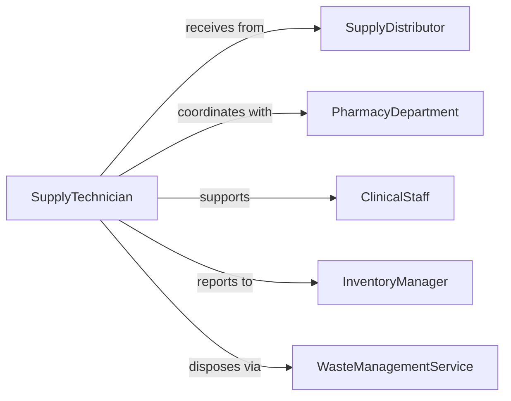

# Prepare Medical Supplies Equipment Use

> Business-as-Code definition for preparing medical supplies and equipment for clinical operations, including inventory management, readiness checks, and distribution.

## Overview

Medical supply preparation involves organizing, inspecting, and distributing consumable and durable medical supplies to support patient care delivery. This definition exposes actions for inventory verification, expiration monitoring, and just-in-time supply staging across healthcare facilities.

## Actors

| Actor | Description |
|-------|-------------|
| SupplyDistributor | Delivers medical supplies to healthcare facilities |
| PharmacyDepartment | Provides medications and pharmaceutical supplies |
| ClinicalStaff | Uses prepared supplies in patient care |
| PurchasingDepartment | Procures supplies based on demand forecasts |
| RegulatoryAgency | Enforces supply storage and handling standards |
| WasteManagementService | Handles disposal of expired or contaminated supplies |

## Roles

| Role | Description |
|------|-------------|
| SupplyTechnician | Manages supply inventory and distribution |
| ClinicalCoordinator | Plans supply needs for patient care activities |
| InventoryManager | Oversees stock levels and ordering |
| QualityAssurance | Validates supply condition and compliance |

## Entities

| Entity | Description |
|--------|-------------|
| Supply | A consumable or durable item for patient care |
| Inventory | Stock of supplies available at a location |
| SupplyKit | A pre-assembled set of supplies for specific use |
| ExpirationDate | Date after which supply should not be used |
| StockLevel | Quantity of supply available versus required |
| DistributionRecord | Documentation of supply allocation |

## Actions

| Action | Description |
|--------|-------------|
| checkInventory | Verify current stock levels of supplies |
| inspectSupplies | Examine supplies for damage or expiration |
| assembleKit | Create pre-packaged supply sets for procedures |
| replenishStock | Reorder supplies to maintain required levels |
| distributeSupplies | Deliver supplies to clinical locations |
| quarantineItems | Isolate damaged or recalled supplies |
| documentUsage | Record supply consumption for tracking |

## Events

| Event | Description |
|-------|-------------|
| inventoryChecked | Stock levels verified and recorded |
| suppliesInspected | Supply condition validated |
| kitAssembled | Pre-packaged supply set created |
| stockReplenished | Supplies reordered to maintain levels |
| suppliesDistributed | Supplies delivered to care locations |
| itemsQuarantined | Damaged or expired supplies isolated |
| usageDocumented | Supply consumption recorded |

## Searches

| Search | Description |
|--------|-------------|
| findSupplies | List supplies by category, location, or status |
| getInventory | Retrieve current stock levels by location |
| getExpirations | Find supplies approaching expiration dates |
| getDistributionRecords | Retrieve supply allocation history |


## Entity Relationships



## State Diagram



## Workflow



## Actor Relationships



## Usage

### Calling Actions

```typescript
import { prepareMedicalSuppliesEquipmentUse } from '@headlessly/prepare-medical-supplies-equipment-use'

const supplies = prepareMedicalSuppliesEquipmentUse()

// Check inventory across locations
const inventory = await supplies.checkInventory({
  location: 'floor-3-med-room',
  categories: ['iv-supplies', 'wound-care', 'ppe']
})

// Inspect supplies for expiration and damage
const inspection = await supplies.inspectSupplies({
  location: 'floor-3-med-room',
  expirationThreshold: 30 // days
})

// Quarantine expired items
if (inspection.expiredItems.length > 0) {
  await supplies.quarantineItems({
    itemIds: inspection.expiredItems,
    reason: 'expired',
    disposalMethod: 'regulated-waste'
  })
}

// Replenish low stock items
for (const item of inventory.lowStockItems) {
  await supplies.replenishStock({
    itemId: item.id,
    quantity: item.parLevel - item.currentLevel,
    urgency: item.critical ? 'stat' : 'routine'
  })
}

// Assemble procedure-specific supply kit
const kit = await supplies.assembleKit({
  kitType: 'central-line-insertion',
  items: [
    { itemId: 'chlorhexidine-swab', quantity: 3 },
    { itemId: 'sterile-drape', quantity: 2 },
    { itemId: 'lidocaine-1pct', quantity: 1 }
  ]
})

// Distribute to clinical location
await supplies.distributeSupplies({
  kitId: kit.id,
  destination: 'icu-bed-12',
  requestedBy: 'nurse-jones',
  urgency: 'stat'
})
```

### Event-Driven Automation

```typescript
// Auto-replenish when stock falls below par level
supplies.inventoryChecked(async ({ location, lowStockItems }) => {
  for (const item of lowStockItems) {
    if (item.currentLevel < item.reorderPoint) {
      await supplies.replenishStock({
        itemId: item.id,
        quantity: item.parLevel - item.currentLevel
      })
    }
  }
})

// Alert on approaching expirations
supplies.suppliesInspected(async ({ location, expiringItems }) => {
  if (expiringItems.length > 0) {
    await notify({
      to: 'supply-team',
      message: `${expiringItems.length} items expiring in ${location}`
    })
  }
})
```
