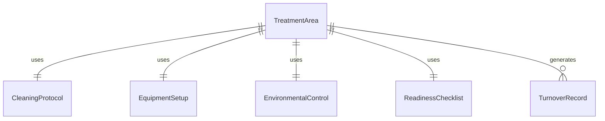
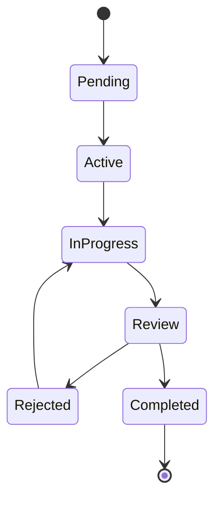
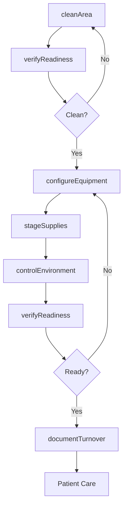
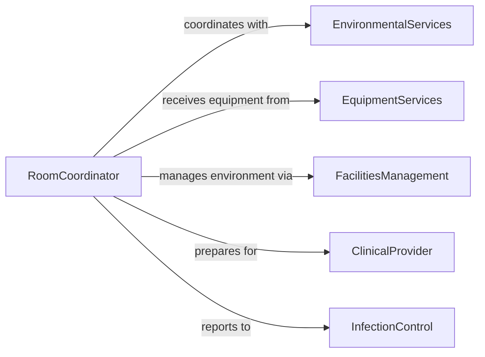

# Prepare Patient Treatment Areas Use

> Business-as-Code definition for preparing patient treatment areas including exam rooms, procedure suites, and inpatient care spaces for clinical operations.

## Overview

Treatment area preparation involves cleaning, equipment setup, supply staging, and environmental control to create safe and functional spaces for patient care. This definition exposes actions for room turnover, readiness verification, and compliance documentation across healthcare facilities.

## Actors

| Actor | Description |
|-------|-------------|
| Patient | Receives care in prepared treatment area |
| ClinicalProvider | Delivers care in prepared environment |
| EnvironmentalServices | Performs cleaning and disinfection |
| FacilitiesManagement | Maintains HVAC, lighting, and infrastructure |
| InfectionControl | Enforces environmental safety standards |
| EquipmentServices | Delivers and maintains clinical equipment |

## Roles

| Role | Description |
|------|-------------|
| RoomCoordinator | Oversees treatment area readiness |
| EnvironmentalTechnician | Cleans and disinfects patient areas |
| SetupSpecialist | Configures equipment and supplies for procedures |
| SafetyInspector | Validates area meets safety standards |

## Entities

| Entity | Description |
|--------|-------------|
| TreatmentArea | A designated space for patient care delivery |
| CleaningProtocol | Specified disinfection procedures for areas |
| EquipmentSetup | Configuration of devices for specific procedures |
| EnvironmentalControl | Temperature, humidity, and air quality settings |
| ReadinessChecklist | Verification items for area preparation |
| TurnoverRecord | Documentation of room preparation activities |

## Actions

| Action | Description |
|--------|-------------|
| cleanArea | Disinfect surfaces and remove contamination |
| configureEquipment | Set up medical devices for specific procedures |
| stageSupplies | Position supplies for immediate clinical use |
| controlEnvironment | Adjust temperature, lighting, and air quality |
| verifyReadiness | Confirm area meets preparation standards |
| documentTurnover | Record preparation completion |
| lockdownArea | Restrict access to maintain sterile environment |

## Events

| Event | Description |
|-------|-------------|
| areaCleaned | Disinfection completed and verified |
| equipmentConfigured | Devices set up and ready for use |
| suppliesStaged | Supplies positioned for procedure |
| environmentControlled | Environmental conditions set and stable |
| readinessVerified | Area confirmed ready for patient care |
| turnoverDocumented | Preparation records completed |
| areaLocked | Access restricted to maintain sterility |

## Searches

| Search | Description |
|--------|-------------|
| findTreatmentAreas | List areas by type, status, or location |
| getCleaningProtocols | Retrieve disinfection procedures by area type |
| getReadinessChecklists | Find verification requirements for procedures |
| getTurnoverRecords | Retrieve preparation history for areas |


## Entity Relationships



## State Diagram



## Workflow



## Actor Relationships



## Usage

### Calling Actions

```typescript
import { preparePatientTreatmentAreasUse } from '@headlessly/prepare-patient-treatment-areas-use'

const treatment = preparePatientTreatmentAreasUse()

// Clean operating room after procedure
const cleaning = await treatment.cleanArea({
  areaId: 'or-suite-2',
  protocol: 'high-level-disinfection',
  surfaces: ['floor', 'walls', 'ceiling', 'equipment-surfaces'],
  disinfectant: 'quaternary-ammonium',
  contactTime: 10
})

// Configure equipment for next procedure
await treatment.configureEquipment({
  areaId: 'or-suite-2',
  procedureType: 'laparoscopic-appendectomy',
  equipment: [
    { deviceId: 'laparoscopy-tower-3', settings: { co2Flow: 15 } },
    { deviceId: 'electrosurgical-unit-7', settings: { cutPower: 40 } }
  ]
})

// Stage procedure-specific supplies
await treatment.stageSupplies({
  areaId: 'or-suite-2',
  supplyKitId: 'appendectomy-kit-std',
  additionalItems: ['suture-pack-vicryl', 'mesh-10x15']
})

// Set environmental controls
await treatment.controlEnvironment({
  areaId: 'or-suite-2',
  temperature: 68,
  humidity: 45,
  airChanges: 20,
  pressure: 'positive'
})

// Verify overall readiness
const readiness = await treatment.verifyReadiness({
  areaId: 'or-suite-2',
  checklistId: 'or-setup-checklist-v3',
  procedureType: 'laparoscopic-appendectomy'
})

// Document completion
await treatment.documentTurnover({
  areaId: 'or-suite-2',
  completedBy: 'or-tech-42',
  verifiedBy: 'circulating-nurse-18',
  scheduledProcedure: 'case-8844'
})
```

### Event-Driven Automation

```typescript
// Alert on readiness verification failure
treatment.readinessVerified(async ({ areaId, passed, failedItems }) => {
  if (!passed) {
    await notify({
      to: 'or-supervisor',
      priority: 'high',
      message: `Area ${areaId} failed readiness check: ${failedItems.join(', ')}`
    })
  }
})

// Auto-schedule next cleaning
treatment.turnoverDocumented(async ({ areaId, nextScheduledUse }) => {
  const turnaroundTime = calculateTurnaround(nextScheduledUse)
  if (turnaroundTime < 60) {
    await notify({
      to: 'environmental-services',
      message: `Expedited turnover needed for ${areaId}`
    })
  }
})
```
