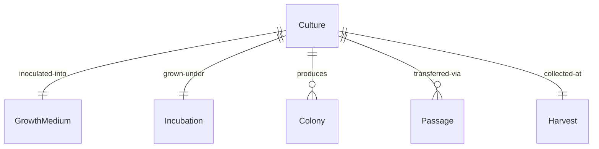
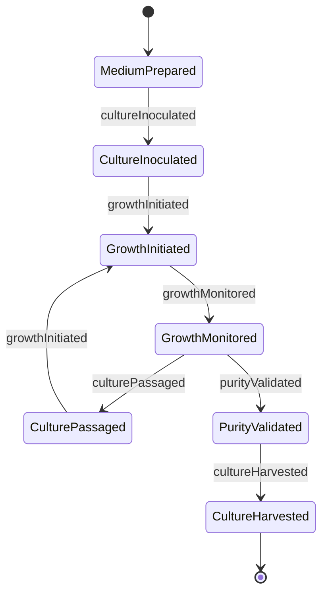
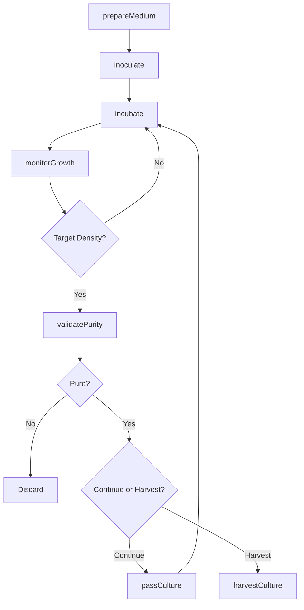
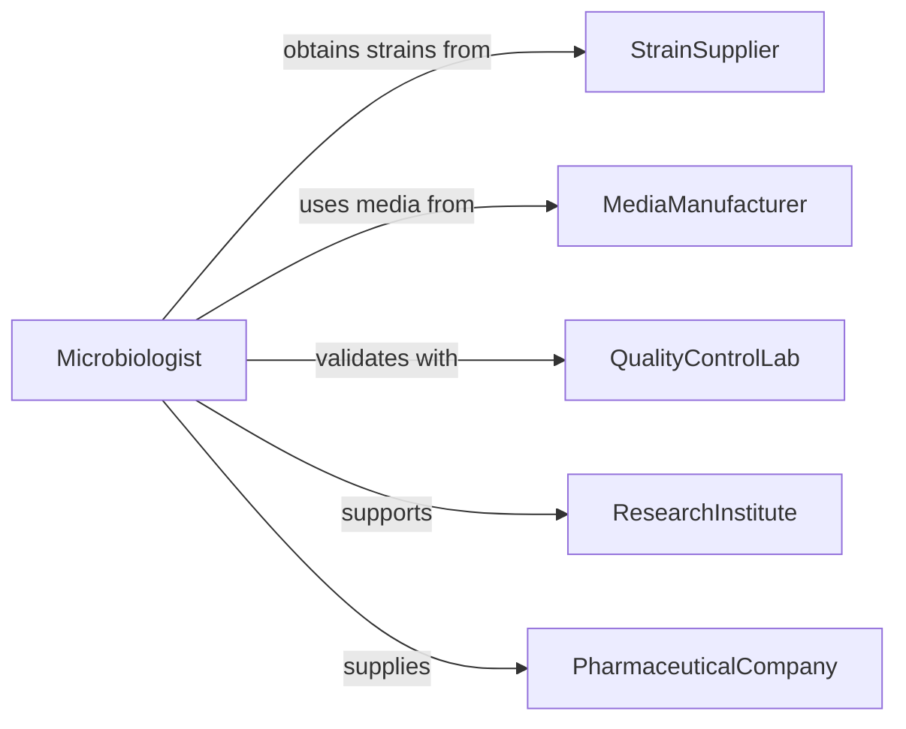

# Cultivate Micro-organisms Study Testing Medical

> Business-as-Code definition for cultivating micro-organisms for research, diagnostic testing, pharmaceutical production, and medical applications.

## Overview

Micro-organism cultivation involves growing bacteria, fungi, viruses, and other microbes under controlled conditions for study, testing, and production purposes. This definition exposes actions for culture preparation, growth monitoring, and harvest operations across laboratory and manufacturing environments.

## Actors

| Actor | Description |
|-------|-------------|
| StrainSupplier | Provides reference cultures and starting materials |
| MediaManufacturer | Supplies growth media and culture substrates |
| QualityControlLab | Validates culture purity and characteristics |
| ResearchInstitute | Uses cultures for scientific investigation |
| PharmaceuticalCompany | Produces biopharmaceuticals from cultures |
| DiagnosticLaboratory | Uses cultures for clinical testing |

## Roles

| Role | Description |
|------|-------------|
| Microbiologist | Plans and executes cultivation protocols |
| CultureTechnician | Prepares media and maintains cultures |
| QualityAnalyst | Validates culture identity and purity |
| ProductionSpecialist | Scales cultures for manufacturing |

## Entities

| Entity | Description |
|--------|-------------|
| Culture | A population of micro-organisms grown in controlled conditions |
| GrowthMedium | Nutrient substrate supporting microbial growth |
| Incubation | Controlled environment maintaining optimal growth conditions |
| Colony | A visible cluster of micro-organisms from single cell |
| Passage | Transfer of culture to fresh medium for continued growth |
| Harvest | Collection of micro-organisms or metabolic products |

## Actions

| Action | Description |
|--------|-------------|
| prepareMedium | Create nutrient substrate for cultivation |
| inoculate | Introduce micro-organisms into growth medium |
| incubate | Maintain culture under optimal growth conditions |
| monitorGrowth | Track culture density and characteristics |
| passCulture | Transfer culture to fresh medium |
| harvestCulture | Collect micro-organisms or products |
| validatePurity | Confirm culture identity and absence of contaminants |

## Events

| Event | Description |
|-------|-------------|
| mediumPrepared | Growth substrate ready for use |
| cultureInoculated | Micro-organisms introduced to medium |
| growthInitiated | Culture placed in incubation conditions |
| growthMonitored | Culture characteristics measured and recorded |
| culturePassaged | Culture transferred to fresh medium |
| cultureHarvested | Micro-organisms or products collected |
| purityValidated | Culture confirmed pure and correctly identified |

## Searches

| Search | Description |
|--------|-------------|
| findCultures | List cultures by organism, status, or location |
| getGrowthCurves | Retrieve growth rate data for cultures |
| getIncubationConditions | Find optimal conditions for organisms |
| getPassageHistory | Retrieve culture transfer lineage |


## Entity Relationships



## State Diagram



## Workflow



## Actor Relationships



## Usage

### Calling Actions

```typescript
import { cultivateMicroOrganismsStudyTestingMedical } from '@headlessly/cultivate-micro-organisms-study-testing-medical'

const cultivation = cultivateMicroOrganismsStudyTestingMedical()

// Prepare growth medium for bacterial culture
const medium = await cultivation.prepareMedium({
  mediumType: 'luria-broth',
  volume: 500,
  supplements: ['ampicillin-100', 'glucose-0.2pct'],
  sterilizationMethod: 'autoclave'
})

// Inoculate with starter culture
const culture = await cultivation.inoculate({
  mediumId: medium.id,
  organism: 'escherichia-coli-dh5alpha',
  sourceType: 'frozen-stock',
  inoculumVolume: 1.0,
  dilutionFactor: 100
})

// Incubate under optimal conditions
await cultivation.incubate({
  cultureId: culture.id,
  temperature: 37,
  shaking: 220,
  atmosphere: 'aerobic',
  duration: 16
})

// Monitor growth progression
const growth = await cultivation.monitorGrowth({
  cultureId: culture.id,
  measurements: ['optical-density', 'viable-count'],
  frequency: 2 // hours
})

// Validate purity before harvest
await cultivation.validatePurity({
  cultureId: culture.id,
  methods: ['gram-stain', 'colony-morphology', 'pcr-identification']
})

// Harvest culture at target density
const harvest = await cultivation.harvestCulture({
  cultureId: culture.id,
  method: 'centrifugation',
  washSteps: 2,
  storageCondition: 'minus-80-freezer'
})
```

### Event-Driven Automation

```typescript
// Auto-harvest at target density
cultivation.growthMonitored(async ({ cultureId, opticalDensity }) => {
  if (opticalDensity >= 0.6 && opticalDensity <= 0.8) {
    await cultivation.harvestCulture({
      cultureId,
      method: 'centrifugation'
    })
  }
})

// Alert on contamination
cultivation.purityValidated(async ({ cultureId, pure, contaminants }) => {
  if (!pure) {
    await notify({
      to: 'microbiology-supervisor',
      priority: 'high',
      message: `Culture ${cultureId} contaminated with ${contaminants.join(', ')}`
    })
  }
})
```
