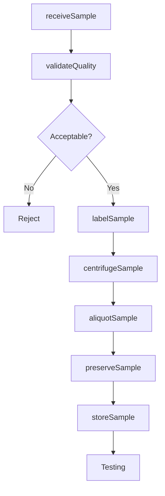
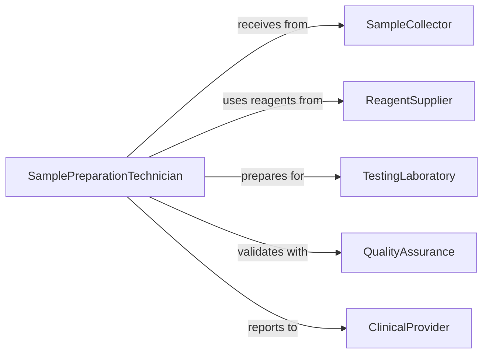

# Prepare Biological Samples Testing Analysis

> Business-as-Code definition for preparing biological samples including blood, tissue, and fluids for diagnostic testing, research analysis, and quality control.

## Overview

Biological sample preparation involves collection, processing, and aliquoting of specimens to ensure sample integrity and analytical validity. This definition exposes actions for sample handling, preservation, and preparation across clinical, research, and industrial laboratories.

## Actors

| Actor | Description |
|-------|-------------|
| SampleCollector | Obtains biological specimens from sources |
| TestingLaboratory | Analyzes prepared samples |
| ReagentSupplier | Provides chemicals and consumables for preparation |
| QualityAssurance | Validates sample handling procedures |
| ClinicalProvider | Orders testing and receives results |
| RegulatoryAuthority | Enforces sample handling standards |

## Roles

| Role | Description |
|------|-------------|
| SamplePreparationTechnician | Processes samples for testing |
| QualityControlAnalyst | Validates sample integrity |
| LaboratoryManager | Oversees sample workflow |
| PhlebotomistHistotechnician | Collects and processes specific sample types |

## Entities

| Entity | Description |
|--------|-------------|
| Sample | A biological specimen collected for testing |
| Aliquot | A portion of sample prepared for specific test |
| PreservationMethod | Technique to maintain sample stability |
| ProcessingProtocol | Specified steps for sample preparation |
| ChainOfCustody | Documentation tracking sample handling |
| QualityMetric | Measure of sample integrity and suitability |

## Actions

| Action | Description |
|--------|-------------|
| receiveSample | Accept and log incoming specimens |
| centrifugeSample | Separate sample components by density |
| aliquotSample | Divide sample into portions for testing |
| preserveSample | Apply stabilization method to maintain integrity |
| labelSample | Apply identification and tracking labels |
| storeSample | Place sample in appropriate storage conditions |
| validateQuality | Assess sample integrity and suitability |

## Events

| Event | Description |
|-------|-------------|
| sampleReceived | Specimen logged into laboratory system |
| sampleCentrifuged | Components separated successfully |
| sampleAliquoted | Portions created for testing |
| samplePreserved | Stabilization method applied |
| sampleLabeled | Identification applied correctly |
| sampleStored | Specimen placed in storage |
| qualityValidated | Sample integrity confirmed acceptable |

## Searches

| Search | Description |
|--------|-------------|
| findSamples | List samples by type, status, or date |
| getProcessingProtocols | Retrieve preparation procedures by sample type |
| getQualityMetrics | Find integrity measures for samples |
| getChainOfCustody | Retrieve handling records for samples |

## Workflow



## Actor Relationships



## Usage

### Calling Actions

```typescript
import { prepareBiologicalSamplesTestingAnalysis } from '@headlessly/prepare-biological-samples-testing-analysis'

const samplePrep = prepareBiologicalSamplesTestingAnalysis()

// Receive blood sample for testing
const sample = await samplePrep.receiveSample({
  sampleType: 'whole-blood',
  volume: 10,
  collectionTime: '2026-02-05T08:30:00Z',
  patientId: 'patient-8844',
  orderedTests: ['cbc', 'bmp', 'lipid-panel']
})

// Validate sample quality
const quality = await samplePrep.validateQuality({
  sampleId: sample.id,
  checks: ['volume-sufficient', 'no-hemolysis', 'no-clotting', 'timely-receipt']
})

// Apply identification label
await samplePrep.labelSample({
  sampleId: sample.id,
  barcodeType: 'code-128',
  labelData: {
    patientId: 'patient-8844',
    collectionDate: '2026-02-05',
    sampleType: 'serum'
  }
})

// Centrifuge to separate serum
await samplePrep.centrifugeSample({
  sampleId: sample.id,
  speed: 3000,
  duration: 10,
  temperature: 4
})

// Create aliquots for each test
const aliquots = await samplePrep.aliquotSample({
  sampleId: sample.id,
  portions: [
    { testId: 'cbc', volume: 2 },
    { testId: 'bmp', volume: 1.5 },
    { testId: 'lipid-panel', volume: 1.5 }
  ]
})

// Store at appropriate temperature
await samplePrep.storeSample({
  aliquotIds: aliquots.map(a => a.id),
  storageType: 'refrigerated',
  temperature: 4,
  maxStorageDuration: 72
})
```

### Event-Driven Automation

```typescript
// Alert on quality failure
samplePrep.qualityValidated(async ({ sampleId, passed, failures }) => {
  if (!passed) {
    await notify({
      to: 'laboratory-supervisor',
      priority: 'high',
      message: `Sample ${sampleId} failed quality checks: ${failures.join(', ')}`
    })
  }
})

// Auto-route samples after preparation
samplePrep.sampleStored(async ({ sampleId, orderedTests }) => {
  for (const test of orderedTests) {
    await workQueue.add({
      queueName: `testing-${test}`,
      sampleId
    })
  }
})
```
