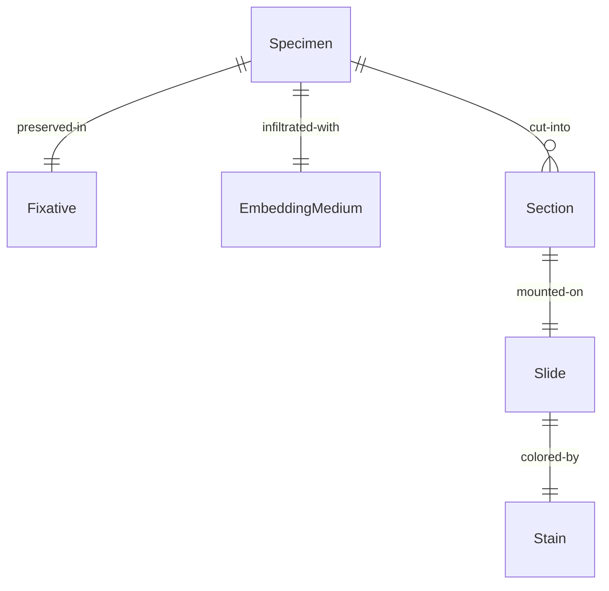
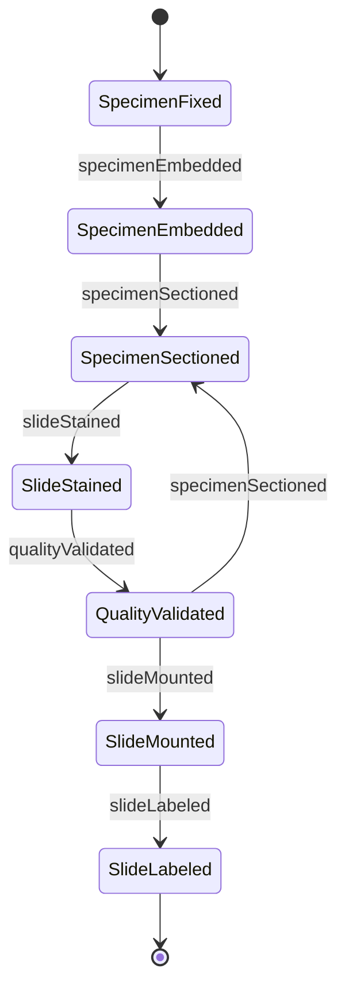
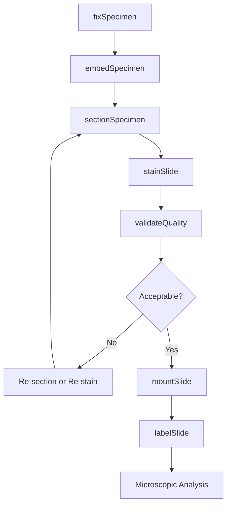
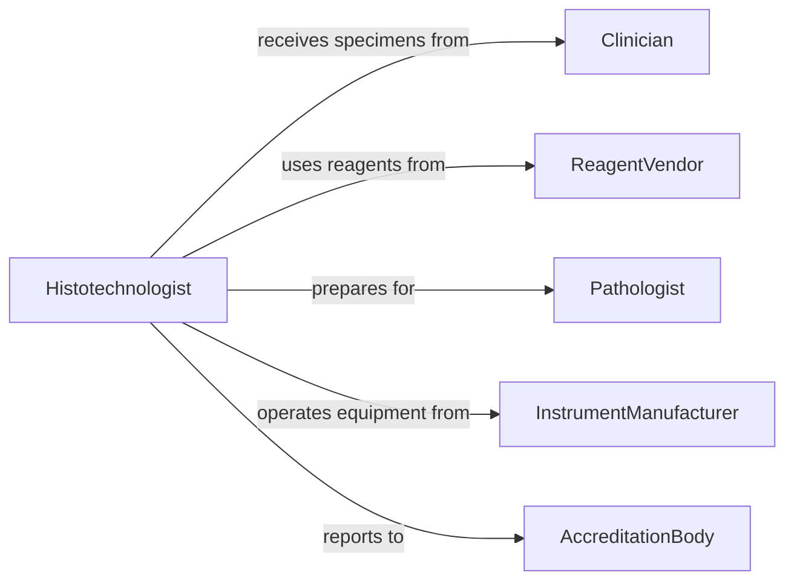

# Prepare Biological Specimens Laboratory Analysis

> Business-as-Code definition for preparing biological specimens including tissue sections, cell cultures, and microbiological samples for microscopic and molecular analysis.

## Overview

Biological specimen preparation involves fixation, sectioning, staining, and mounting techniques to enable laboratory analysis. This definition exposes actions for specimen processing, slide preparation, and quality control across histology, pathology, and microbiology laboratories.

## Actors

| Actor | Description |
|-------|-------------|
| Clinician | Submits specimens for diagnostic analysis |
| Pathologist | Interprets prepared specimens |
| ReagentVendor | Supplies stains and processing chemicals |
| InstrumentManufacturer | Provides specimen processing equipment |
| AccreditationBody | Enforces laboratory quality standards |
| ResearchInvestigator | Uses specimens for scientific studies |

## Roles

| Role | Description |
|------|-------------|
| Histotechnologist | Processes tissue specimens for analysis |
| Cytotechnologist | Prepares cellular specimens for examination |
| MicrobiologyTechnician | Prepares microbial specimens for identification |
| QualityCoordinator | Validates specimen preparation quality |

## Entities

| Entity | Description |
|--------|-------------|
| Specimen | A biological sample requiring laboratory preparation |
| Section | A thin slice of tissue prepared for microscopy |
| Slide | A mounted specimen on glass for examination |
| Stain | A colorant applied to enhance specimen features |
| Fixative | A chemical preserving specimen structure |
| EmbeddingMedium | Material supporting specimen during sectioning |

## Actions

| Action | Description |
|--------|-------------|
| fixSpecimen | Preserve specimen structure with chemical treatment |
| embedSpecimen | Infiltrate specimen with supporting medium |
| sectionSpecimen | Cut thin slices from embedded specimen |
| stainSlide | Apply colorants to enhance specimen features |
| mountSlide | Seal prepared section under coverslip |
| labelSlide | Apply identification to prepared slides |
| validateQuality | Assess preparation adequacy for analysis |

## Events

| Event | Description |
|-------|-------------|
| specimenFixed | Preservation treatment completed |
| specimenEmbedded | Supporting medium infiltration finished |
| specimenSectioned | Thin slices cut successfully |
| slideStained | Colorants applied to specimen |
| slideMounted | Section sealed under coverslip |
| slideLabeled | Identification applied to slide |
| qualityValidated | Preparation confirmed adequate for analysis |

## Searches

| Search | Description |
|--------|-------------|
| findSpecimens | List specimens by type, status, or case |
| getProcessingProtocols | Retrieve preparation procedures by specimen type |
| getStainingMethods | Find staining protocols for diagnostic purposes |
| getQualityMetrics | Retrieve quality standards for preparations |


## Entity Relationships



## State Diagram



## Workflow



## Actor Relationships



## Usage

### Calling Actions

```typescript
import { prepareBiologicalSpecimensLaboratoryAnalysis } from '@headlessly/prepare-biological-specimens-laboratory-analysis'

const specimenPrep = prepareBiologicalSpecimensLaboratoryAnalysis()

// Fix tissue specimen for preservation
const fixation = await specimenPrep.fixSpecimen({
  specimenId: 'biopsy-8844',
  specimenType: 'skin-punch-biopsy',
  fixative: 'neutral-buffered-formalin',
  duration: 24,
  temperature: 'room-temperature'
})

// Embed in paraffin wax
await specimenPrep.embedSpecimen({
  specimenId: 'biopsy-8844',
  medium: 'paraffin-wax',
  orientation: 'cross-section',
  blockId: 'block-8844-A1'
})

// Section at specified thickness
const sections = await specimenPrep.sectionSpecimen({
  blockId: 'block-8844-A1',
  thickness: 4,
  numberOfSections: 10,
  microtomeType: 'rotary'
})

// Apply hematoxylin and eosin stain
await specimenPrep.stainSlide({
  slideIds: sections.map(s => s.slideId),
  stainingProtocol: 'hematoxylin-eosin',
  automatedStainer: 'stainer-unit-3',
  duration: 45
})

// Validate staining quality
const validation = await specimenPrep.validateQuality({
  slideIds: sections.map(s => s.slideId),
  criteria: ['nuclear-detail', 'cytoplasmic-contrast', 'no-artifacts']
})

// Mount with coverslip
await specimenPrep.mountSlide({
  slideIds: validation.acceptedSlides,
  mountant: 'permount',
  coverslipThickness: 1
})

// Apply identification labels
await specimenPrep.labelSlide({
  slideIds: validation.acceptedSlides,
  patientId: 'patient-8844',
  caseNumber: 'path-2026-1234',
  stainType: 'H&E'
})
```

### Event-Driven Automation

```typescript
// Alert on quality failure requiring re-processing
specimenPrep.qualityValidated(async ({ slideIds, rejected, issues }) => {
  if (rejected.length > 0) {
    await notify({
      to: 'histology-supervisor',
      message: `${rejected.length} slides require re-processing: ${issues.join(', ')}`
    })
  }
})

// Auto-route slides to pathologist after completion
specimenPrep.slideLabeled(async ({ slideIds, caseNumber }) => {
  await workQueue.add({
    queueName: 'pathology-review',
    caseNumber,
    slideIds
  })
})
```
