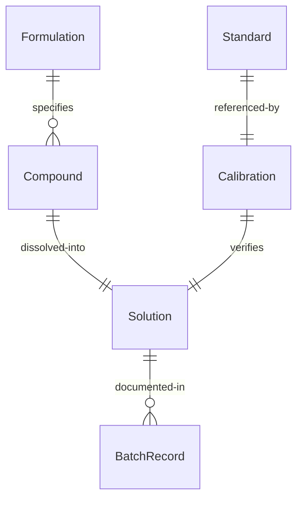
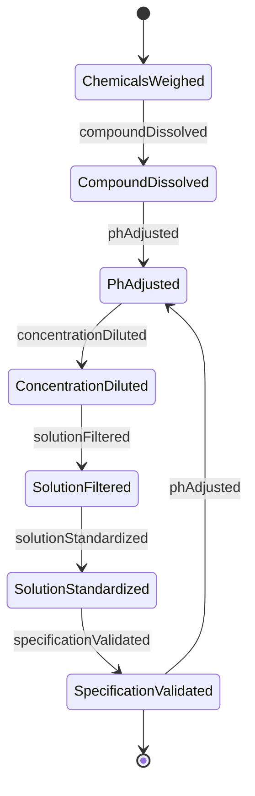
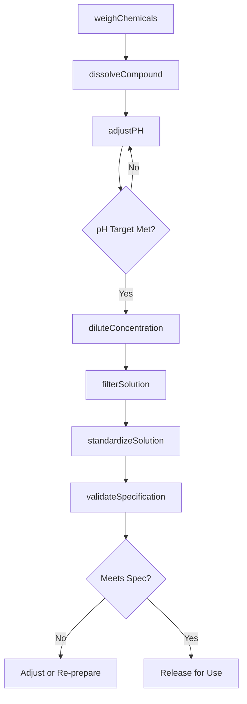
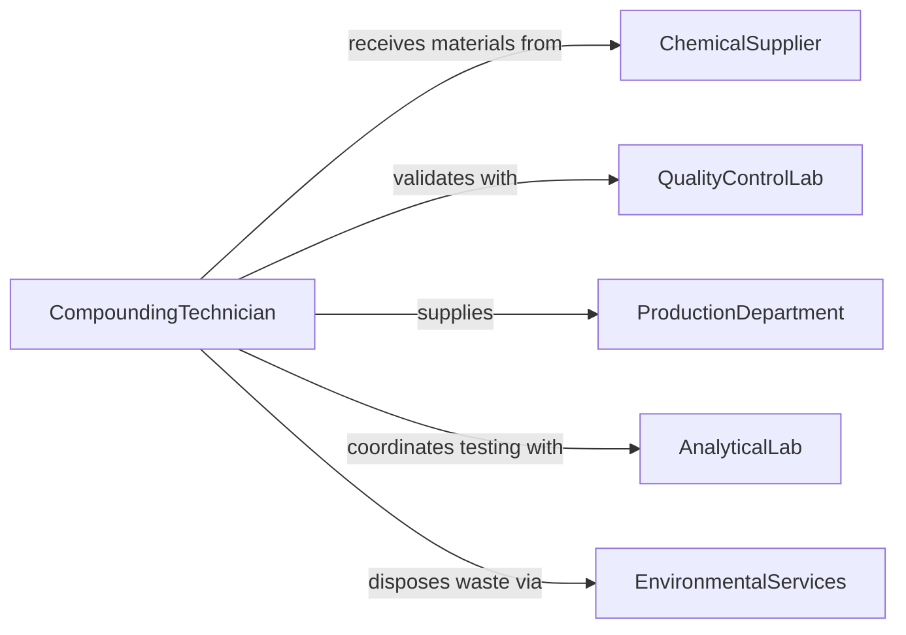

# Prepare Compounds Solutions Products Testing

> Business-as-Code definition for preparing chemical compounds and solutions for product formulation, quality testing, and analytical procedures.

## Overview

Compound and solution preparation involves accurate weighing, dissolution, dilution, and standardization of chemical substances for manufacturing and testing. This definition exposes actions for formulation, verification, and quality control across pharmaceutical, chemical, and manufacturing laboratories.

## Actors

| Actor | Description |
|-------|-------------|
| ChemicalSupplier | Provides raw materials and reagents |
| QualityControlLab | Validates compound specifications |
| ProductionDepartment | Uses prepared compounds in manufacturing |
| RegulatoryAgency | Enforces chemical handling standards |
| AnalyticalLab | Tests compound properties and purity |
| EnvironmentalServices | Manages chemical waste disposal |

## Roles

| Role | Description |
|------|-------------|
| CompoundingTechnician | Prepares solutions and formulations |
| QualityAnalyst | Validates compound specifications |
| FormulationScientist | Develops compound recipes |
| SafetyOfficer | Ensures proper handling procedures |

## Entities

| Entity | Description |
|--------|-------------|
| Compound | A pure chemical substance or mixture |
| Solution | A homogeneous mixture of dissolved substances |
| Formulation | A specific recipe for compound preparation |
| Standard | A reference compound of known purity and concentration |
| Calibration | Verification of compound concentration or properties |
| BatchRecord | Documentation of compound preparation |

## Actions

| Action | Description |
|--------|-------------|
| weighChemicals | Measure specified quantities of substances |
| dissolveCompound | Mix substance into solvent to create solution |
| adjustPH | Modify solution acidity or alkalinity |
| diluteConcentration | Reduce compound concentration to target level |
| standardizeSolution | Verify and adjust solution to precise concentration |
| filterSolution | Remove particulates from prepared compound |
| validateSpecification | Confirm compound meets requirements |

## Events

| Event | Description |
|-------|-------------|
| chemicalsWeighed | Substances measured to specification |
| compoundDissolved | Solution prepared and homogenized |
| phAdjusted | Acidity modified to target value |
| concentrationDiluted | Solution strength reduced to specification |
| solutionStandardized | Concentration verified and adjusted |
| solutionFiltered | Particulates removed from preparation |
| specificationValidated | Compound confirmed meeting requirements |

## Searches

| Search | Description |
|--------|-------------|
| findCompounds | List compounds by type, status, or batch |
| getFormulations | Retrieve preparation recipes by purpose |
| getStandards | Find reference compounds for calibration |
| getBatchRecords | Retrieve preparation documentation |


## Entity Relationships



## State Diagram



## Workflow



## Actor Relationships



## Usage

### Calling Actions

```typescript
import { prepareCompoundsSolutionsProductsTesting } from '@headlessly/prepare-compounds-solutions-products-testing'

const compounding = prepareCompoundsSolutionsProductsTesting()

// Prepare buffer solution for analytical testing
const chemicals = await compounding.weighChemicals({
  formulationId: 'phosphate-buffer-ph7.4',
  components: [
    { chemical: 'sodium-phosphate-dibasic', amount: 71.6, unit: 'gram' },
    { chemical: 'sodium-phosphate-monobasic', amount: 27.6, unit: 'gram' }
  ],
  balance: 'analytical-balance-3',
  tolerance: 0.01
})

// Dissolve in purified water
const solution = await compounding.dissolveCompound({
  batchId: chemicals.batchId,
  solvent: 'purified-water',
  finalVolume: 10000,
  temperature: 25,
  mixingMethod: 'magnetic-stirrer'
})

// Adjust pH to target
await compounding.adjustPH({
  solutionId: solution.id,
  targetPH: 7.4,
  tolerance: 0.05,
  adjustmentAgent: 'sodium-hydroxide-0.1M'
})

// Filter to remove particulates
await compounding.filterSolution({
  solutionId: solution.id,
  filterType: 'membrane',
  poreSize: 0.22,
  sterile: true
})

// Standardize concentration
const standardization = await compounding.standardizeSolution({
  solutionId: solution.id,
  method: 'titration',
  standard: 'nist-traceable-standard',
  targetConcentration: 0.1,
  tolerance: 0.001
})

// Validate final specifications
const validation = await compounding.validateSpecification({
  solutionId: solution.id,
  tests: ['ph', 'concentration', 'osmolality', 'sterility'],
  acceptanceCriteria: {
    ph: { min: 7.35, max: 7.45 },
    concentration: { min: 0.099, max: 0.101 }
  }
})
```

### Event-Driven Automation

```typescript
// Alert on specification failure
compounding.specificationValidated(async ({ solutionId, passed, failures }) => {
  if (!passed) {
    await notify({
      to: 'compounding-supervisor',
      priority: 'high',
      message: `Solution ${solutionId} failed specs: ${failures.join(', ')}`
    })
  }
})

// Auto-generate COA after validation
compounding.specificationValidated(async ({ solutionId, passed, results }) => {
  if (passed) {
    await generateDocument({
      type: 'certificate-of-analysis',
      solutionId,
      testResults: results
    })
  }
})
```
