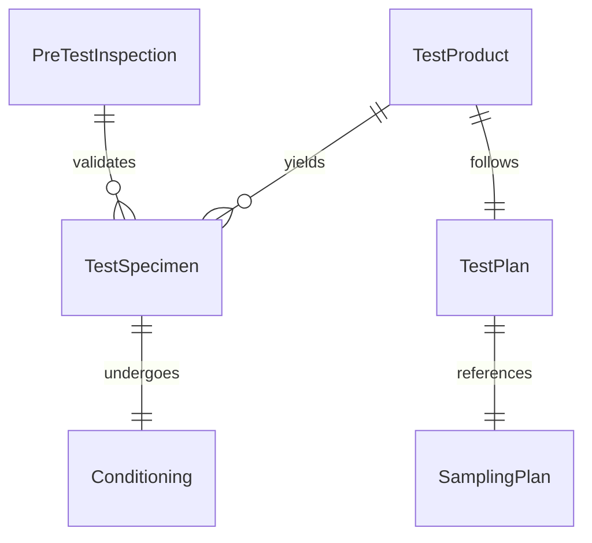
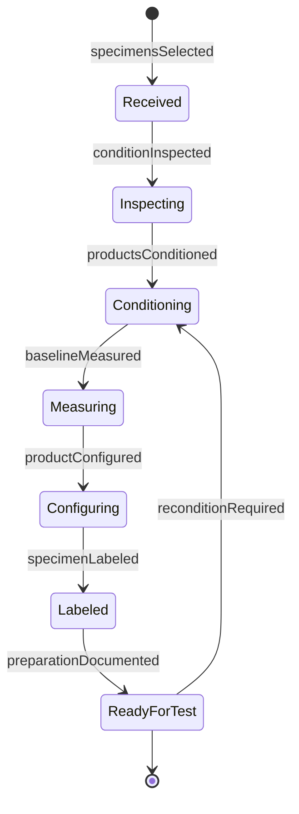
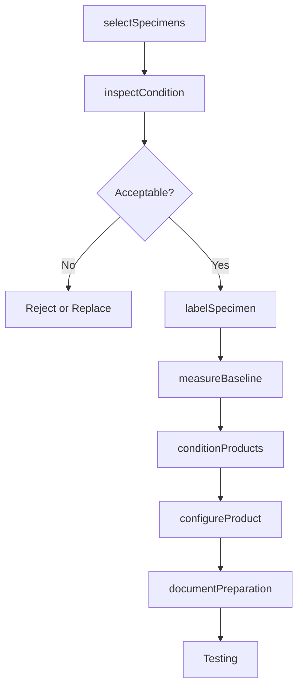
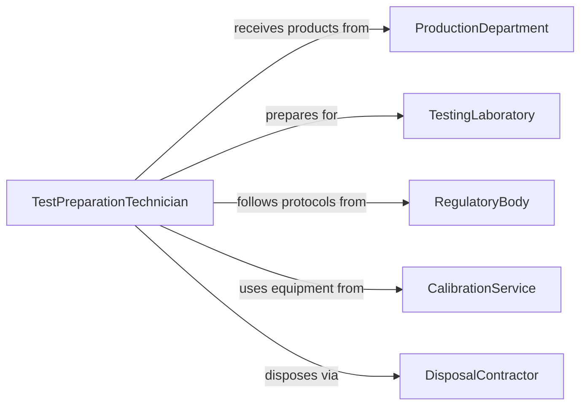

# Prepare Products Testing

> Business-as-Code definition for preparing finished products and prototypes for quality testing, regulatory compliance, and performance validation.

## Overview

Product testing preparation involves sampling, conditioning, and setup of manufactured goods for evaluation against specifications and standards. This definition exposes actions for test specimen selection, environmental conditioning, and pre-test verification across manufacturing and quality assurance operations.

## Actors

| Actor | Description |
|-------|-------------|
| ProductionDepartment | Manufactures products for testing |
| TestingLaboratory | Performs evaluation of prepared products |
| RegulatoryBody | Requires specific testing protocols |
| CustomerCompany | May request specific testing procedures |
| CalibrationService | Provides calibrated measurement equipment |
| DisposalContractor | Handles tested product waste |

## Roles

| Role | Description |
|------|-------------|
| TestPreparationTechnician | Prepares products for evaluation |
| QualityInspector | Validates product condition before testing |
| TestEngineer | Plans and executes product testing |
| SamplingCoordinator | Selects representative test specimens |

## Entities

| Entity | Description |
|--------|-------------|
| TestProduct | A manufactured item prepared for evaluation |
| TestSpecimen | A specific sample selected for testing |
| TestPlan | Documented testing procedures and acceptance criteria |
| Conditioning | Environmental preparation before testing |
| SamplingPlan | Strategy for selecting representative specimens |
| PreTestInspection | Verification of product condition before testing |

## Actions

| Action | Description |
|--------|-------------|
| selectSpecimens | Choose representative products for testing |
| conditionProducts | Expose products to specified environment |
| inspectCondition | Verify products meet pre-test requirements |
| measureBaseline | Record initial product characteristics |
| configureProduct | Set product state for specific test |
| labelSpecimen | Apply identification to test products |
| documentPreparation | Record preparation activities |

## Events

| Event | Description |
|-------|-------------|
| specimensSelected | Test samples chosen from production |
| productsConditioned | Environmental preparation completed |
| conditionInspected | Pre-test condition verified |
| baselineMeasured | Initial characteristics recorded |
| productConfigured | Product state set for testing |
| specimenLabeled | Identification applied to test items |
| preparationDocumented | Preparation records completed |

## Searches

| Search | Description |
|--------|-------------|
| findTestProducts | List products by type, batch, or test plan |
| getTestPlans | Retrieve testing procedures by product type |
| getSamplingPlans | Find specimen selection strategies |
| getConditioningRequirements | Retrieve environmental preparation specifications |


## Entity Relationships



## State Diagram



## Workflow



## Actor Relationships



## Usage

### Calling Actions

```typescript
import { prepareProductsTesting } from '@headlessly/prepare-products-testing'

const testPrep = prepareProductsTesting()

// Select specimens from production batch
const specimens = await testPrep.selectSpecimens({
  productType: 'lithium-ion-battery-pack',
  batchId: 'batch-2026-0205-A',
  samplingPlan: 'mil-std-105e-level-ii',
  quantity: 13,
  selectionMethod: 'random'
})

// Inspect initial condition
const inspection = await testPrep.inspectCondition({
  specimenIds: specimens.map(s => s.id),
  criteria: ['no-physical-damage', 'correct-markings', 'proper-packaging']
})

// Apply identification labels
await testPrep.labelSpecimen({
  specimenIds: inspection.acceptedSpecimens,
  labelType: 'serialized-barcode',
  testPlanId: 'tp-battery-performance-v2'
})

// Measure baseline characteristics
const baseline = await testPrep.measureBaseline({
  specimenIds: inspection.acceptedSpecimens,
  measurements: ['weight', 'dimensions', 'open-circuit-voltage', 'internal-resistance']
})

// Condition at test temperature
await testPrep.conditionProducts({
  specimenIds: inspection.acceptedSpecimens,
  temperature: 25,
  humidity: 50,
  duration: 24,
  chamber: 'environmental-chamber-4'
})

// Configure for discharge test
await testPrep.configureProduct({
  specimenIds: inspection.acceptedSpecimens,
  configuration: {
    chargeState: 'fully-charged',
    terminalConnection: 'test-harness'
  }
})

// Document all preparation steps
await testPrep.documentPreparation({
  specimenIds: inspection.acceptedSpecimens,
  testPlanId: 'tp-battery-performance-v2',
  preparedBy: 'test-tech-42'
})
```

### Event-Driven Automation

```typescript
// Alert on conditioning completion
testPrep.productsConditioned(async ({ specimenIds, chamber }) => {
  await notify({
    to: 'test-engineers',
    message: `${specimenIds.length} specimens ready in ${chamber}`
  })
})

// Auto-schedule testing after preparation
testPrep.preparationDocumented(async ({ specimenIds, testPlanId }) => {
  await scheduler.schedule({
    task: 'execute-test-plan',
    testPlanId,
    specimenIds,
    priority: 'normal'
  })
})
```
