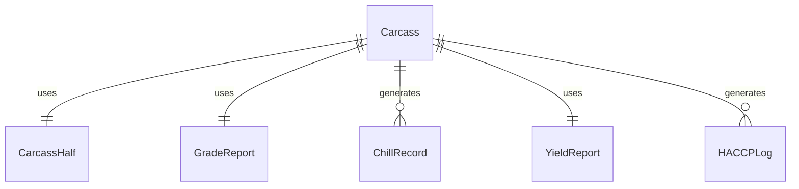
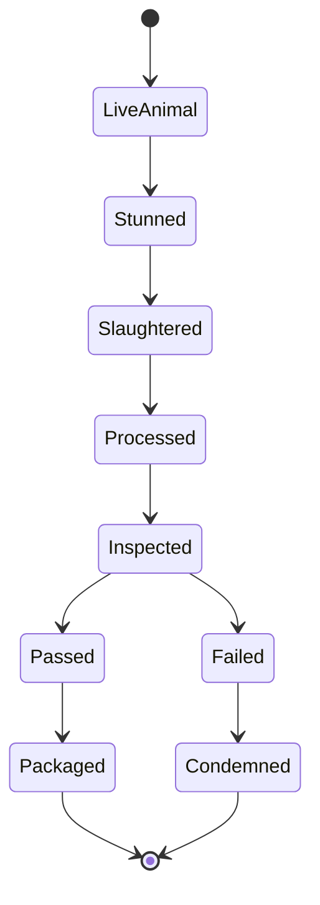
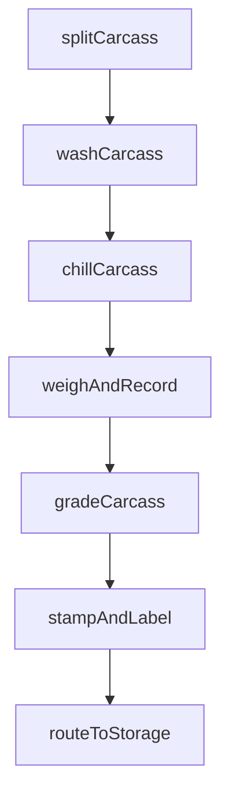
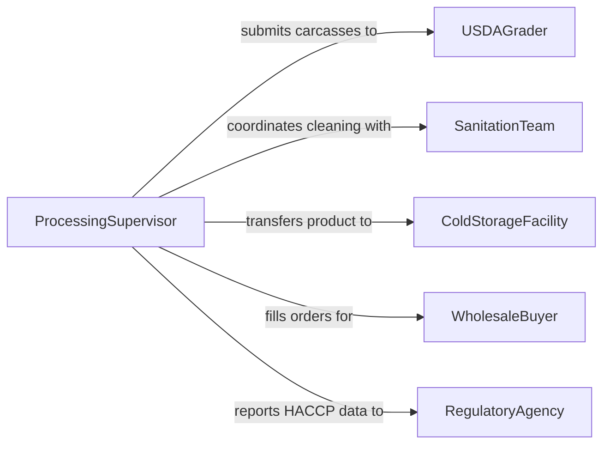

# Process Animal Carcasses

> Business-as-Code definition for animal carcass processing. Models the workflow for splitting, washing, chilling, grading, and preparing carcasses for fabrication into wholesale and retail cuts.

## Overview

Animal carcass processing encompasses the post-slaughter operations that transform dressed carcasses into graded, chilled products ready for fabrication. This includes splitting, washing, shroud application, rapid chilling, USDA grading, and weight recording. The definition provides actions for each processing step, events for production tracking and quality assurance, and searches for yield analysis and inventory management.

## Actors

| Actor | Description |
|-------|-------------|
| USDAGrader | Assigns quality and yield grades to chilled carcasses |
| ColdStorageFacility | Receives and stores chilled carcasses awaiting fabrication |
| WholesaleBuyer | Purchases graded carcasses or primal cuts |
| SanitationTeam | Maintains hygienic conditions on the processing floor |
| RegulatoryAgency | Enforces HACCP plans and processing facility standards |

## Roles

| Role | Description |
|------|-------------|
| ProcessingSupervisor | Manages carcass processing line operations and throughput |
| SplittingOperator | Operates band saws to halve carcasses along the spine |
| ChillRoomOperator | Manages rapid chilling equipment and temperature monitoring |
| QualityAssuranceTechnician | Performs microbial testing and verifies processing standards |

## Entities

| Entity | Description |
|--------|-------------|
| Carcass | A dressed animal body moving through processing stages |
| CarcassHalf | One side of a split carcass prepared for chilling |
| GradeReport | USDA quality and yield grade assigned to a carcass |
| ChillRecord | Time and temperature log during the chilling process |
| YieldReport | Weight and percentage data for usable meat versus waste |
| HACCPLog | Hazard Analysis Critical Control Point monitoring records |

## Actions

| Action | Description |
|--------|-------------|
| splitCarcass | Halve the dressed carcass along the vertebral column |
| washCarcass | Apply antimicrobial wash to reduce surface contamination |
| chillCarcass | Place carcass halves in rapid chill rooms at controlled temperatures |
| gradeCarcass | Submit chilled carcasses for USDA quality and yield grading |
| weighAndRecord | Capture hot and cold weights for yield calculations |
| stampAndLabel | Apply grade stamps and identification labels to carcass halves |
| routeToStorage | Transfer graded carcasses to cold storage or fabrication staging |

## Events

| Event | Description |
|-------|-------------|
| carcassSplit | Carcass successfully halved and ready for washing |
| carcassWashed | Antimicrobial wash applied and documented |
| carcassChilled | Carcass reached target internal temperature |
| carcassGraded | USDA grade assigned and recorded |
| weightsRecorded | Hot and cold carcass weights captured for yield analysis |
| carcassLabeled | Grade stamps and tracking labels applied |
| carcassRouted | Carcass transferred to storage or next processing stage |

## Searches

| Search | Description |
|--------|-------------|
| findCarcasses | List carcasses by species, grade, or processing status |
| getYieldData | Retrieve weight and yield percentages by lot or grade |
| getChillLogs | Look up temperature records by chill room or time period |
| findGradeDistribution | Analyze grade distribution across production runs |


## Entity Relationships



## State Diagram



## Workflow



## Actor Relationships



## Usage

### Calling Actions

```typescript
import { processAnimalCarcasses } from '@headlessly/process-animal-carcasses'

const processing = processAnimalCarcasses()

// Split a dressed carcass
const halves = await processing.splitCarcass({
  carcassId: 'carc-88210',
  species: 'cattle',
  hotWeight: 850
})

// Chill carcass halves
await processing.chillCarcass({
  carcassHalfIds: halves.map(h => h.id),
  targetTemp: 34,
  chillRoom: 'CR-2',
  method: 'blast-chill'
})

// Grade the chilled carcass
const grade = await processing.gradeCarcass({
  carcassId: 'carc-88210',
  graderId: 'usda-grader-17',
  qualityGrade: 'Choice',
  yieldGrade: 3
})
```

### Event-Driven Automation

```typescript
// Notify buyers when premium grades are available
processing.carcassGraded(async ({ carcassId, qualityGrade, yieldGrade }) => {
  if (qualityGrade === 'Prime') {
    await notify({
      to: 'premium-buyers',
      message: `Prime grade carcass ${carcassId} available, yield grade ${yieldGrade}`
    })
  }
})

// Alert if chill temperature target is not met
processing.carcassChilled(async ({ carcassId, actualTemp, targetTemp }) => {
  if (actualTemp > targetTemp + 2) {
    await alert({
      to: 'quality-assurance',
      message: `Carcass ${carcassId} chilled to ${actualTemp}F, above target ${targetTemp}F`
    })
  }
})
```
